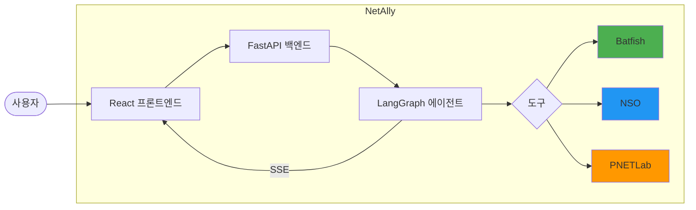

# 🌐 NetAlly: 지능형 네트워크 검증 비서

<div align="center">


**NetAlly는 LLM(대규모 언어 모델)과 결정론적 분석 엔진(Batfish)을 결합하여, 네트워크 엔지니어에게 실시간 검증 인사이트와 지능형 트러블슈팅 지원을 제공하는 차세대 네트워크 분석 플랫폼입니다.** 그래도 좋아!

[📖 문서 보기](#-documentation) | [🚀 빠른 시작](#-quick-start) | [🔧 API 레퍼런스](docs/backend_api.md)

</div>

---

## ✨ 핵심 특징

### 1. 🏥 검증 대시보드 (Verification Dashboard)

복잡한 토폴로지 "거미줄" 대신, 엔지니어가 정말 필요로 하는 정보를 제공합니다:

- **프로토콜 건강 상태**: BGP/OSPF 세션의 Up/Down 현황을 한눈에.
- **액티브 인사이트**: "PE1-Leaf2 BGP 세션 다운: AS 번호 불일치 감지됨" 같은 분석된 원인 제공.
- **스마트 장비 리스트**: 장비별 상태 아이콘(🟢/🔴)으로 즉각적인 가시성 확보.

### 2. 🤖 하이브리드 분석 엔진

- **Batfish (결정론적)**: 정확하고 빠른 설정 분석 (1초 이내). 세션 상태, MTU/Timer 불일치 등.
- **LLM (생성형 AI)**: 복잡한 질문에 대한 상세 해결책 제안, 자연어 기반 대화.

### 3. 🗺️ 온디맨드 토폴로지 (On-Demand Map)

- 전체 맵은 평소에는 숨겨져 노이즈를 줄입니다.
- 필요할 때(버튼 클릭 또는 "경로 보여줘" 명령) 팝업으로 특정 경로만 확인.

### 4. 📡 실시간 SSE 채팅

- 에이전트의 사고 과정(`planning`), 도구 호출(`tool_call`), 결과(`tool_output`)를 실시간 스트리밍.
- 검증 결과는 **Evidence Panel**에 카드 형태로 자동 수집.

---

## 📁 프로젝트 구조

```
NetAlly/
├── 📄 main.py                  # FastAPI 백엔드 (SSE Chat, Topology, Dashboard API)
├── 📄 init_batfish.py          # Batfish 스냅샷 초기화 스크립트
├── 📄 langgraph.json           # LangGraph Studio 설정
├── 📄 docker-compose.yml       # Docker Compose 배포 설정
│
├── 📂 agent/                   # LangGraph 에이전트 핵심 모듈
│   ├── graph.py                # Orchestrator-Executor 기반 에이전트 그래프
│   ├── tools.py                # Legacy LangChain 도구 (호환용)
│   ├── mcp_server.py           # MCP-lite 서버 (16 core + 6 compatibility)
│   ├── mcp_client.py           # MCP streamable-http 클라이언트
│   ├── mcp_tools.py            # LangGraph에서 사용하는 MCP 프록시 도구
│   ├── state.py                # AgentState 정의
│   ├── llm_provider.py         # 하이브리드 LLM 프로바이더 (OpenAI, Ollama, vLLM)
│   ├── skill_loader.py         # 스킬 로더
│   └── clients/                # 외부 시스템 클라이언트
│       ├── batfish.py          # Batfish 분석 클라이언트
│       ├── nso.py              # NSO RESTCONF 클라이언트
│       └── pnetlab.py          # PNETLab API 클라이언트
│
├── 📂 frontend/                # React + Vite 프론트엔드
│   └── src/
│       ├── App.tsx             # 메인 레이아웃 (Dashboard/Topology 전환)
│       ├── store.ts            # Zustand 상태 관리
│       └── components/
│           ├── DashboardPanel.tsx    # 검증 대시보드 (NEW!)
│           ├── TopologyPanel.tsx     # React Flow 기반 토폴로지 맵
│           ├── ChatPanel.tsx         # SSE 채팅 UI
│           ├── EvidencePanel.tsx     # Evidence 카드 목록
│           └── Header.tsx            # 테마 전환, 설정
│
├── 📂 docs/                    # 상세 문서
│   ├── architecture.md         # 시스템 아키텍처
│   ├── dashboard_design.md     # 대시보드 기획안
│   ├── dashboard_implementation.md  # 대시보드 구현 명세
│   ├── frontend.md             # 프론트엔드 UI/UX 가이드
│   ├── backend_api.md          # API 레퍼런스
│   └── setup_guide.md          # 설치 가이드
│
├── 📂 skills/                  # 에이전트 스킬 정의 (가이드 텍스트 전용)
│
└── 📂 eval/                    # 평가 모듈 (NetConfigQA 벤치마크)
```

---

## 🚀 Quick Start

### 사전 요구 사항

- **Python 3.12+**
- **Node.js 18+** (프론트엔드 빌드용)
- **Docker** (Batfish 컨테이너 실행)
- **Batfish Docker 이미지**: `docker pull batfish/allinone`

### 1. 클론 및 환경 설정

```bash
# 1. 저장소 클론
git clone <repository_url>
cd NetAlly

# 2. Python 가상환경 생성 (uv 권장)
uv venv --python 3.12
source .venv/bin/activate

# 3. 의존성 설치 (개발/테스트 기준)
uv sync --extra dev
# editable 설치가 필요하면: uv pip install -e .

# 4. 환경변수 설정
cp .env.example .env
# .env 파일 편집: OPENAI_API_KEY, BATFISH_HOST 등 설정
```

### 2. Batfish 서비스 시작

```bash
# Batfish 컨테이너 실행
docker run -d -p 9997:9997 -p 9996:9996 --name batfish batfish/allinone

# 스냅샷 초기화 (설정 파일 로드)
uv run python init_batfish.py
```

### 3. 백엔드 서버 실행

```bash
# FastAPI 서버 시작 (기본 포트: 8111)
uv run uvicorn main:app --reload --port 8111
```

### 4. 프론트엔드 개발 서버 실행

```bash
cd frontend
npm install
npm run dev
# 브라우저에서 http://localhost:3000 접속
```

---

## 🔌 API 엔드포인트

| 엔드포인트                | 메서드 | 설명                                 |
| ------------------------- | ------ | ------------------------------------ |
| `/api/chat`               | POST   | SSE 스트리밍 채팅 (에이전트 응답)    |
| `/api/topology`           | GET    | Batfish L3 토폴로지 (노드/엣지)      |
| `/api/dashboard/summary`  | GET    | 네트워크 건강 상태 요약 **(NEW!)**   |
| `/api/device/{device_id}` | GET    | 장비 상세 정보 (설정, 라우팅 테이블) |
| `/api/health`             | GET    | 서비스 헬스 체크                     |
| `/api/lab/refresh`        | POST   | 신규 장비 부트스트랩 (Refresh 버튼)  |
| `/api/lab/prepare`        | POST   | Batfish 준비/초기화                  |
| `/api/pnetlab/status`     | GET    | PNETLab 인증 상태                    |
| `/api/pnetlab/auth`       | POST   | PNETLab 인증 설정 (쿠키/자동로그인)  |

### Dashboard Summary 응답 예시

```json
{
  "health_score": 85,
  "protocols": {
    "bgp": { "total": 12, "up": 11, "down": 1, "status": "warning" },
    "ospf": { "total": 8, "up": 8, "down": 0, "status": "healthy" }
  },
  "issues": [
    {
      "severity": "critical",
      "type": "BGP_DOWN",
      "title": "BGP Down: PE1",
      "message": "BGP session to Leaf2 is NOT_ESTABLISHED",
      "affected_nodes": ["PE1", "Leaf2"]
    }
  ],
  "device_status": {
    "PE1": "warning",
    "PE2": "healthy",
    "Leaf1": "healthy"
  }
}
```

---

## 🛠️ 설정

### 환경변수 (`.env`)

```bash
# LLM Provider
OPENAI_API_KEY=sk-...              # OpenAI API 키
OPENAI_MODEL=gpt-4o-mini           # 사용할 모델
VLLM_BASE_URL=http://localhost:8000/v1
LANGSMITH_TRACING=false            # API 키 설정 시에만 true 권장

# Batfish
BATFISH_HOST=localhost             # Batfish 서비스 호스트
BATFISH_SNAPSHOT=default           # 기본 스냅샷 이름
BATFISH_NETWORK=default            # Alias
BATFISH_EXPORT_DIR=./snapshot      # NSO 설정 export 경로
USE_RESTCONF_EXPORT=false          # NSO CLI export 실패 시 RESTCONF fallback

# NSO (선택)
NSO_BASE_URL=http://localhost:8080 # NSO RESTCONF URL
NSO_USERNAME=admin
NSO_PASSWORD=admin
# Alias (optional)
NSO_USER=admin
NSO_PASS=admin
# Auto-discovery (optional)
PNETLAB_NSO_NODE=NSO
NSO_SCHEME=http
NSO_PORT=8080
NSO_RESTCONF_PATH=/restconf

# PNETLab (선택)
PNETLAB_URL=http://pnetlab.local
PNETLAB_COOKIES=token=...; _session=...; XSRF-TOKEN=...
PNETLAB_USERNAME=admin
PNETLAB_PASSWORD=pnetlab
PNETLAB_AUTO_LOGIN=false
PNETLAB_DEVICE_INFO=Data/Pnetlab/Research_Institute_Internal_DC/device_info.json
PNETLAB_DEVICE_INFO_AUTOGEN=true
PNETLAB_VM_IP=
PNETLAB_GATEWAY_IP=
PNETLAB_DOMAIN_NAME=lab.local
PNETLAB_ADMIN_PASSWORD=admin
PNETLAB_ENABLE_PASSWORD=
PNETLAB_OOB_INTF=
PNETLAB_DEVICE_GROUP=
NSO_AUTHGROUP=default
NSO_NED_ID=cisco-ios-cli-6.110

# Demo Automation (Optional)
AUTO_PREPARE_ON_CHAT=false         # 채팅 요청 시 Batfish 준비 자동 수행
AUTO_INIT_BATFISH=false            # 준비 실패 시 Batfish init 자동 수행

# MCP-lite
NETALLY_TOOL_BACKEND=mcp           # mcp | legacy
NETALLY_MCP_SERVER_URL=http://127.0.0.1:8811/mcp
NETALLY_MCP_ALLOW_MUTATIONS=false  # true면 변경성 도구 허용
```

### MCP-lite 호환/에러 계약

- Deprecated wrapper 6개는 1차 안정화 단계에서 유지:
  - `network_query`, `network_verify`, `lab_manage`, `scan_and_sync`, `check_logs`, `lab_bootstrap`
- I/O 계약:
  - `check_logs`는 legacy와 동일하게 문자열(`str`) 반환
  - 나머지 5개 wrapper는 JSON 객체(`Dict[str, Any]`) 반환
- mutation 차단 시 응답 계약:
  - `error`: 사람이 읽을 수 있는 차단 사유
  - `code`: `mutations_blocked`
  - `result.blocked`: `true`

### 데모 운영 모드 (Settings UI)

- Settings > API Connections에서 아래 항목을 런타임 제어 가능:
  - `Tool Backend` (`mcp` | `legacy`)
  - `MCP Server URL`
  - `Allow MCP Mutations`
- 권장 기본값:
  - `Tool Backend = mcp`
  - `Allow MCP Mutations = false`
- 변경성 작업이 필요할 때만 `Allow MCP Mutations = true`로 잠시 전환하고, 작업 직후 `false`로 복귀

---

## 🚑 데모 장애 대응

1. `/api/health` 확인 (`tool_backend`, `mcp_health.ok` 체크)
2. Settings에서 `Tool Backend=legacy`로 전환해 즉시 서비스 복구
3. `MCP Server URL`을 점검/수정 후 `Tool Backend=mcp`로 복귀
4. `/api/settings`와 read-only tool 1회 호출로 정상 동작 확인

---

## ✅ 테스트 실행

```bash
# 개발/테스트 의존성 동기화
uv sync --extra dev

# MCP-lite 안정화 회귀 테스트
uv run pytest -q tests/
```

---

## 🎯 아키텍처



### 핵심 철학: "Insight over Data"

- 단순한 데이터 나열이 아닌, **분석된 인사이트**를 제공합니다.
- Batfish의 결정론적 분석으로 **정확한 문제 원인**을 진단합니다.
- LLM은 **해결책 제안**과 **복잡한 질문 처리**에 집중합니다.

---

## 📚 Documentation

| 문서                                                            | 설명                               |
| --------------------------------------------------------------- | ---------------------------------- |
| [architecture.md](docs/architecture.md)                         | 시스템 아키텍처, 데이터 흐름       |
| [dashboard_design.md](docs/dashboard_design.md)                 | 검증 대시보드 기획 및 UI/UX        |
| [dashboard_implementation.md](docs/dashboard_implementation.md) | 대시보드 구현 명세 (API, 컴포넌트) |
| [frontend.md](docs/frontend.md)                                 | 프론트엔드 컴포넌트 가이드         |
| [backend_api.md](docs/backend_api.md)                           | REST API 레퍼런스                  |
| [setup_guide.md](docs/setup_guide.md)                           | Docker 배포 및 환경 설정           |

---

## 🧪 평가 (NetConfigQA Benchmark)

NetAlly는 NetConfigQA 벤치마크에서 네트워크 구성 QA 성능을 테스트할 수 있습니다.

```bash
# 샘플 10개로 빠른 테스트
uv run python -m eval.runner --dataset ../Data/Dataset/NetConfigQA2.csv --sample 10

# 전체 평가
uv run python -m eval.runner --dataset ../Data/Dataset/NetConfigQA2.csv
```

---

## 🤝 관련 프로젝트

- **[core-batfish](../Make_Dataset/src/core_batfish/)**: Batfish 분석 라이브러리 (L4-L7 Analyzer)
- **[NetConfigQA](../README.md)**: 네트워크 구성 QA 벤치마크 데이터셋 생성

---

## 📝 로드맵

- [x] Verification Dashboard (v2.0)
- [x] 하이브리드 분석 엔진 (Batfish + LLM)
- [x] SSE 스트리밍 채팅
- [x] PNETLab 좌표 동기화 (토폴로지 위치 가져오기)
- [x] 도달성 오버레이 (Reachability Overlay - 통신 가능 경로 색상 표시)
- [x] 장비 상세 정보 패널 (Device Detail Panel)
- [x] Multi-language Support (EN/KO)
- [ ] Multi-Snapshot 비교 분석

---

## 📜 라이선스

This project is licensed under the MIT License.

---

<div align="center">

**NetAlly - Your Intelligent Network Ally** 🚀

*복잡한 네트워크, 똑똑한 비서와 함께라면 간단해집니다.*

</div>
