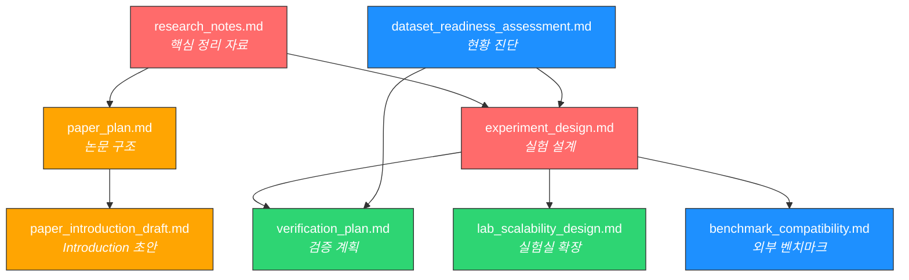

# IEEE TNMS 논문 준비 — 문서 인덱스

> **최종 업데이트**: 2026-02-14
> **프로젝트**: NetAlly + NetConfigQA2.0  
> **학회**: IEEE Transactions on Network and Service Management (TNMS)  
> **마감**: 2026-02-28

> **실행 기준 (Rebaseline, 2026-02-13)**  
> - 공개 v2 데이터셋 기준: **1,128 QA, L1~L5, 17 카테고리**  
> - L6는 코드 경로는 유지하되, 이번 TNMS 제출에서는 **명시적으로 제외**  
>   (이유: fault별 스냅샷/관측정보 관리 비용, single-LLM baseline 공정성 저하, 일정 내 재현성 리스크)  
> - ~~구현 착수 항목~~: `verify_dataset.py` 계열 ✅, `Make_Dataset/config_generator/` 계열 ✅ (Lab-B/C/D 전부 생성 완료)

---

## 📁 문서 구조도

```
NetAlly/docs/IEEE/
│
├── 📋 README.md          ← 이 문서 (전체 인덱스)
│
├── 🔬 연구 & 분석
│   ├── research_notes.md       ← 핵심 정리 자료 (Related Work, 파이프라인, 메트릭, 아키텍처)
│   └── dataset_readiness_assessment.md  ← 데이터셋 현황 진단 (v1/v2 통계, Gap 분석)
│
├── 📝 논문 구조
│   ├── paper_plan.md            ← 논문 전체 스토리라인 + 섹션 구성
│   └── paper_introduction_draft.md ← Introduction 한글 초안 + 영문 Abstract
│
├── 🧪 실험 설계
│   ├── experiment_design.md     ← 5가지 실험 상세 설계 (테이블/그래프 형식 포함)
│   ├── lab_scalability_design.md ← 실험실 확장 설계 (10→20→30→40 노드) + Config Generator
│   └── verification_plan.md     ← Ground Truth Hybrid 검증 설계 (독립 파서 + 수동 + PNETLab, 설계 단계)
│
├── ✅ 실행 관리
│   ├── project_critique_and_risk_assessment.md ← 비판적 리뷰 + 리스크 감사
│   └── TODO_execution_backlog.md  ← 실제 구현 TODO/우선순위/완료기준
│
└── 🌐 외부 벤치마크
    └── benchmark_compatibility.md ← 외부 벤치마크 5종 적합성 평가 (NIKA, NetPress, NetConfEval 등)
```

---

## 📄 문서별 요약 & 읽는 순서

### 1단계: 연구 이해 (첫 방문자 추천)

| 순서 | 문서 | 내용 | 중요도 |
|:---:|---|---|:---:|
| ① | [research_notes.md](./research_notes.md) | **가장 중요**. 연구 전체 내용: Related Work 16편 비교, 파이프라인 구조, 난이도 체계, TA-Acc 지표, NetAlly 아키텍처, 코드 리뷰, RQ/Contributions, Abstract | ⭐⭐⭐⭐⭐ |
| ② | [paper_plan.md](./paper_plan.md) | 논문 스토리라인 (9단계), 섹션별 상세 구성, 페이지 배분 | ⭐⭐⭐⭐ |
| ③ | [paper_introduction_draft.md](./paper_introduction_draft.md) | Introduction 7문단 한글 초안 + SIGCOMM Abstract (제출 기준 리베이스 반영) | ⭐⭐⭐ |

### 2단계: 실험 설계 (실험 실행 전 필독)

| 순서 | 문서 | 내용 | 중요도 |
|:---:|---|---|:---:|
| ④ | [experiment_design.md](./experiment_design.md) | 5가지 실험 상세: 검증(Exp.1), Baseline(Exp.2), NetAlly(Exp.3), 스케일러빌리티(Exp.4), 외부 벤치마크(Exp.5). Table/Figure 형식 사전 정의, Threats to Validity | ⭐⭐⭐⭐⭐ |
| ⑤ | [verification_plan.md](./verification_plan.md) | Ground Truth 검증: Hybrid(Method 1/2/3). **Method 1-2 완료** (L1-L3 실질 100%). Method 3 미착수 | ⭐⭐⭐⭐ |
| ⑥ | [lab_scalability_design.md](./lab_scalability_design.md) | Lab A~D(10~40노드) 토폴로지 설계, Config Generator(YAML+Jinja2), NetAlly 데이터셋 평가 실험, 구현 일정 | ⭐⭐⭐⭐ |

### 3단계: 평가 & 현황

| 순서 | 문서 | 내용 | 중요도 |
|:---:|---|---|:---:|
| ⑦ | [benchmark_compatibility.md](./benchmark_compatibility.md) | 외부 벤치마크 5종(NIKA★, NetPress★, NetConfEval, NETLLMBENCH, NeMoEval) 적합성 평가 + Multi-Agent 적용 방법 | ⭐⭐⭐ |
| ⑧ | [dataset_readiness_assessment.md](./dataset_readiness_assessment.md) | 데이터셋 v1/v2 통계, KICS 실험 결과 요약, Gap 분석, 15일 액션 플랜 | ⭐⭐⭐ |

---

## 🔗 문서 간 관계도



---

## 📊 논문 핵심 수치 (Quick Reference)

### 데이터셋

| 항목 | 값 |
|---|---|
| 총 QA 쌍 | 1,128 (L1-L5, v2 기준) |
| 언어 | 이중언어 (KO/EN) — 질문은 한국어/영어 선택, 정답은 영어 계약 토큰 |
| 난이도 레벨 | 5 (L1~L5) |
| 카테고리 | 17 |
| 메트릭 | 127 |
| Answer Type | 5 (text, numeric, set, map, bool) |
| 토폴로지 | SP MPLS VPN (10 nodes: 4 Leaf + 4 P + 2 PE) |

### Ground Truth 검증 결과

| Method | Scope | Sample | Raw Agreement | Effective |
|---|---|---:|---:|---:|
| (1) Independent Parser | L1-L3 전수 | 800 | 99.5% | **100%** |
| (2) Manual Cfg Trace | L1-L3 표본 | 43 | 97.7% | 97.7% |
| (3) PNETLab Emulation | L4-L5 표본 | 44 | TBD | TBD |

### KICS 실험 결과 (Best: GPT-OSS-20B)

| Level | TA-Acc | 의미 |
|:---:|:---:|---|
| L1 | 0.873 | 대부분 정확 |
| L2 | 0.873 | L1과 유사 (소규모 샘플) |
| L3 | 0.605 | 교차 비교에서 성능 하락 시작 |
| **L4** | **0.266** | 급격한 절벽 ← 시뮬레이션 필요 |
| **L5** | **0.134** | 사실상 실패 ← What-If 불가 |

### Related Work

| 분류 | 논문 수 |
|---|:---:|
| 내부 벤치마크 비교 | 3 (TeleQnA, TeleQuAD, NetBench) |
| Agent 기반 네트워크 관리 | 5 (NIKA, INTA, Cisco, NetConfEval, KubeLLM) |
| 외부 벤치마크 | 3 (NetPress, NeMoEval, NETLLMBENCH) |
| 도메인 LLM / IBN | 4 (TelecomGPT, RAG-Intent, IntAgent, NetIntent) |
| 기타 | 1 (IETF Framework) |
| **총 참고문헌** | **16+** |

---

## ⏰ 마감까지 남은 작업

| 작업 | 상태 | 문서 참조 |
|---|:---:|---|
| 이중언어 템플릿 품질 교정 (EN L4/L5 + KO 조사 + 답변 힌트 정렬) | ✅ | docs/Policies.md |
| 검증 코드 구현 (Method 1-2) + 통합 파이프라인 | ✅ | verification_plan.md |
| 검증 Method 3 가이드 생성 | ✅ | verification_plan.md (44 QA 가이드 완료) |
| Method 2 사람 검토 (43 QA, ~2-3h) | ⬜ | verification/method2_manual_check/human_reviewer_guide.md |
| Method 3 PNETLab 실행 (44 QA, ~4-6h) | ⬜ | verification/method3_pnetlab/pnetlab_verification_guide.md |
| Config Generator + Lab-B/C/D cfg 생성 | ✅ | lab_scalability_design.md (20+30+40 = 90 configs) |
| Lab-B/C/D PNETLab 배포 + 데이터셋 생성 | ⬜ | config_generator/docs/deployment_guide.md |
| v2 데이터셋 재실험 (5 Models) | ⬜ | experiment_design.md Exp.2 |
| NetAlly 데이터셋 평가 | ⬜ | experiment_design.md Exp.3 |
| NIKA 적용 실험 | ⬜ | benchmark_compatibility.md |
| 논문 본문 작성 | ⬜ | paper_plan.md |

---

## 🧭 실행 시작점

1. **검증 완료**: Method 2 사람 검토 + Method 3 PNETLab 실행 (병렬 가능, 총 6-9시간)
2. [TODO_execution_backlog.md](./TODO_execution_backlog.md)에서 P0 항목부터 실행
3. [lab_scalability_design.md](./lab_scalability_design.md)의 Lab-B 단일 성공 사례 확보

---

## ⚙️ 데이터셋 원샷 실행 (현재 권장)

아래 명령으로 정책 검증 → 데이터셋 생성 → 품질검증 → 통계요약까지 한 번에 실행합니다.

> **주의**: 이 원샷 파이프라인은 **Dataset Integrity QA(데이터 품질/스키마 무결성)** 용도이며,  
> Ground Truth 본검증(Method 1/2/3)은 `verification_plan.md`에 정의된 별도 절차로 수행합니다.

```bash
Make_Dataset/run_dataset_pipeline.sh \
  --lab-path Data/Pnetlab/Research_Institute_Internal_DC \
  --policies Make_Dataset/policies.json \
  --question-lang both
```

산출물은 `Data/Pnetlab/<LabName>/Dataset/<timestamp>/` 하위에 실행별로 분리 저장되며, bilingual 모드에서는 `..._ko.json/csv`와 `..._en.json/csv`가 함께 생성됩니다.

## 🔬 Ground Truth 검증 파이프라인

데이터셋 생성 후 Ground Truth 검증을 단일 명령으로 실행합니다 (3가지 Method 통합):

```bash
# 전체 파이프라인: Method 1 (자동) + Method 2 가이드 + Method 3 가이드
python Make_Dataset/src/verification/run_verification_pipeline.py \
  --lab-path Data/Pnetlab/Research_Institute_Internal_DC/

# 이미 Method 1을 돌린 경우
python Make_Dataset/src/verification/run_verification_pipeline.py \
  --lab-path Data/Pnetlab/<LabName>/ --skip-method1
```

산출물: `Data/Pnetlab/<LabName>/Dataset/verification/` 하위에 Method별로 분리 저장됩니다.
