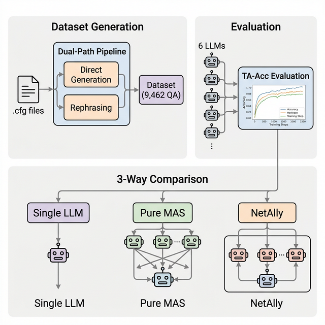
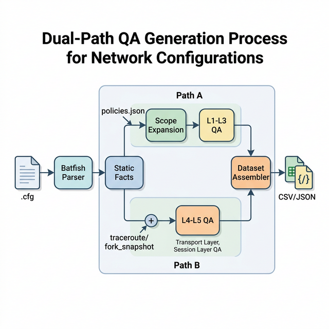
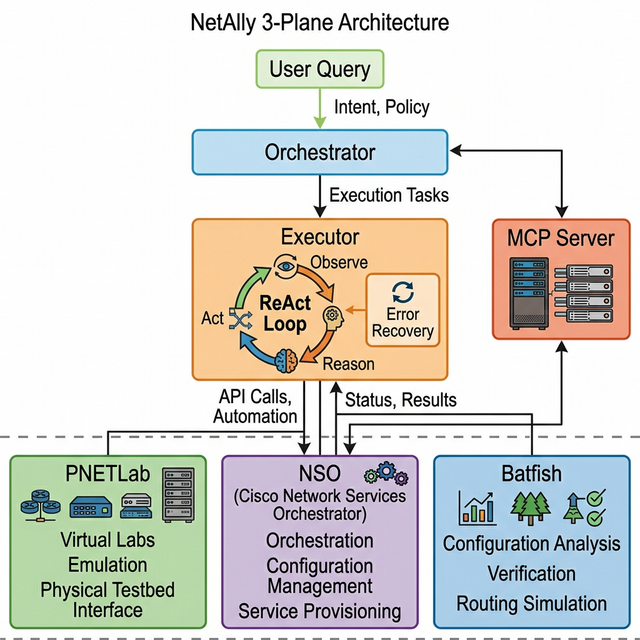
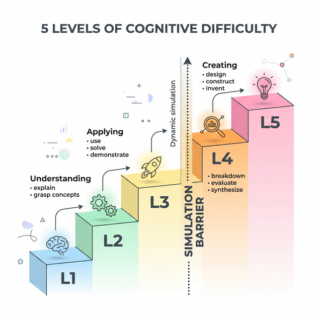

❯ 너가 생각하기에 어떤 Figure 들이 들어가야할거 같아?? 여러가지 생각해봐!

● 10페이지 2-column 제한에서 6~7개가 적절합니다. 각 Figure의 역할과 형태를 구체적으로 제안합니다. (아래의 다이어그램 이미지들은 AI 생성 개념도입니다.)

  ---
  필수 Figure (6개)

  Fig. 1: 전체 프레임워크 개요 (Overview)

  위치: Section I 또는 Section III 첫 페이지
  역할: 리뷰어가 가장 먼저 보는 그림. 논문 전체를 한 장으로 이해시켜야 함.

  

  핵심: 왼쪽(데이터셋 생성) → 오른쪽(평가) → 아래(3-way 비교)의 흐름을 한 눈에

  ---
  Fig. 2: 이중 경로 QA 생성 파이프라인

  위치: Section III.B
  역할: C1(벤치마크) 기여의 핵심 메커니즘

  

  핵심: Path A(규칙)와 Path B(시뮬레이션)의 분기가 시각적으로 명확해야 함

  ---
  Fig. 3: NetAlly 아키텍처 + 상태 전이

  위치: Section IV.B
  역할: C3(시스템) 기여. "단순 래퍼가 아님"을 시각적으로 증명

  

  핵심: ReAct 루프 + 오류 복구 경로가 보여야 함. LangGraph 상태 기계 느낌으로.

  ---
  Fig. 4: 레벨별 TA-Acc — "L4 절벽" (핵심 결과 그림)

  위치: Section V.B
  역할: RQ1의 답. 논문에서 가장 임팩트 있는 그래프.

  *(`make_figure.py`를 통해 생성된 `fig4_ta_acc_levels.pdf`를 참조하세요)*

  형태: Grouped Bar Chart. 6개 모델 × 5개 레벨. Lab-A 기준.
  포인트: L3→L4 사이에 점선 + "Simulation Barrier" 라벨

  ---
  Fig. 5: 3-Way 비교 — 구조 vs 도구 (논문의 무기)

  위치: Section V.C
  역할: RQ2의 답. 교수님이 "가장 빛나는 아이디어"라고 한 부분.

  *(`make_figure.py`를 통해 생성된 `fig5_3way_comparison.pdf`를 참조하세요)*

  형태: Grouped Bar Chart, 3그룹 × 5레벨. 화살표로 Δ(구조)와 Δ(도구) 표시.
  가장 중요한 시각적 메시지: L4/L5에서 파란 바(Single)와 주황 바(Pure MAS)가 거의 같고, 초록 바(NetAlly)만 높다.

  ---
  Fig. 6: Scalability — 노드 수 vs TA-Acc

  위치: Section V.B 또는 VI.C
  역할: 파이프라인 확장성 + 모델 성능 변화

  *(`make_figure.py`를 통해 생성된 `fig6_scalability.pdf`를 참조하세요)*

  형태: Line Chart. Best 모델 1개의 레벨별 선 5개. X축: 노드 수(Lab A→D).
  메시지: L1은 규모에 robust, L4/L5는 규모와 무관하게 낮음

  ---
  선택 Figure (시간 있으면 1개 추가)

  Fig. 7: 5단계 인지 난이도 시각화

  위치: Section III.C
  역할: 난이도 체계를 직관적으로 이해시킴

  

  형태: 화살표 + 계단식 다이어그램. "Simulation Barrier" 경계선이 핵심.

  ---
  정리

  ┌────────┬──────────────────────────┬──────────┬───────┬────────────────────┐
  │ Figure │           내용           │ Section  │ 필수? │       메시지       │
  ├────────┼──────────────────────────┼──────────┼───────┼────────────────────┤
  │   1    │ 전체 프레임워크 개요     │ I or III │  ✅   │ 논문 한눈에 이해   │
  ├────────┼──────────────────────────┼──────────┼───────┼────────────────────┤
  │   2    │ Dual-Path 파이프라인     │ III.B    │  ✅   │ C1 기여 메커니즘   │
  ├────────┼──────────────────────────┼──────────┼───────┼────────────────────┤
  │   3    │ NetAlly 아키텍처 + ReAct │ IV.B     │  ✅   │ "래퍼가 아님" 증명 │
  ├────────┼──────────────────────────┼──────────┼───────┼────────────────────┤
  │   4    │ 레벨별 TA-Acc (6모델)    │ V.B      │  ✅   │ RQ1 — L4 절벽      │
  ├────────┼──────────────────────────┼──────────┼───────┼────────────────────┤
  │   5    │ 3-Way 비교               │ V.C      │  ✅   │ RQ2 — 도구가 핵심  │
  ├────────┼──────────────────────────┼──────────┼───────┼────────────────────┤
  │   6    │ Scalability Line Chart   │ V.B      │  ✅   │ 확장성             │
  ├────────┼──────────────────────────┼──────────┼───────┼────────────────────┤
  │   7    │ 난이도 체계 시각화       │ III.C    │  🟡   │ 직관적 이해        │
  └────────┴──────────────────────────┴──────────┴───────┴────────────────────┘

  **Fig. 4와 Fig. 5가 논문의 "돈 되는 그림"**입니다. 리뷰어가 이 두 그래프만 봐도 핵심 주장을 이해할 수 있어야 합니다.