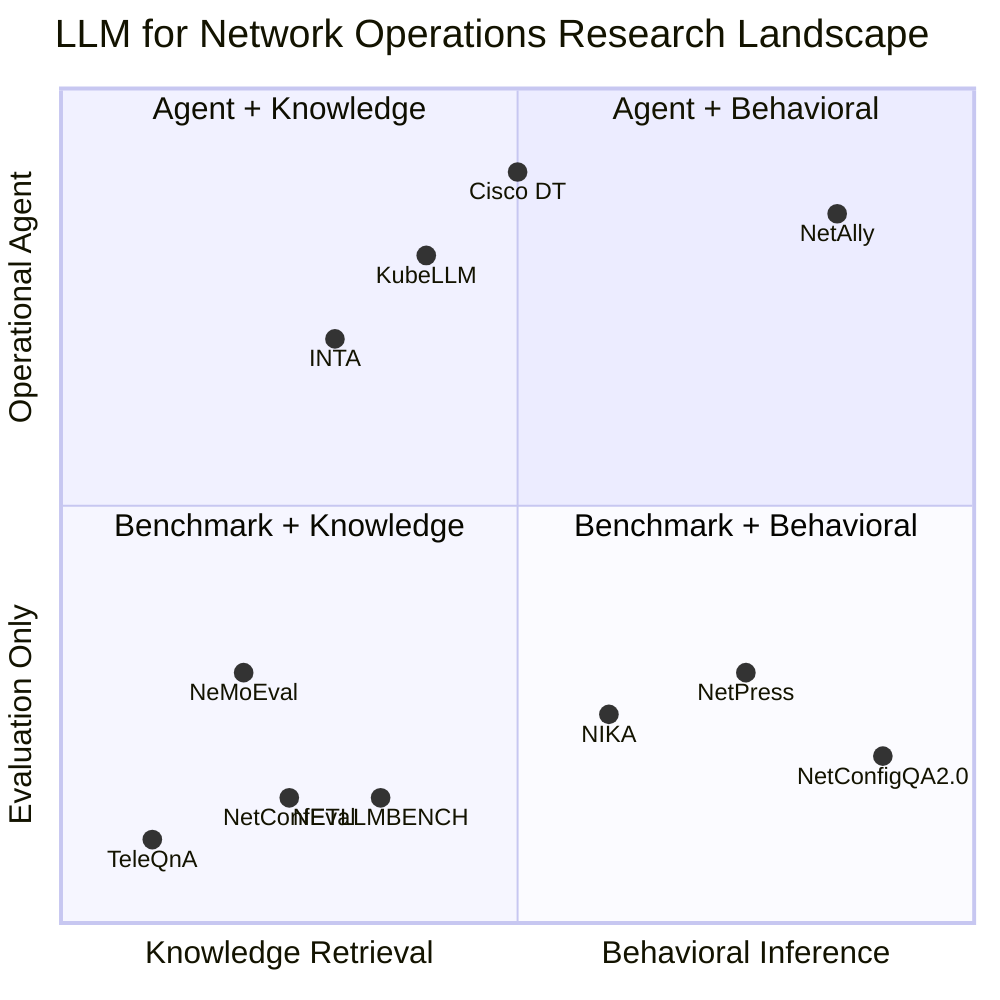
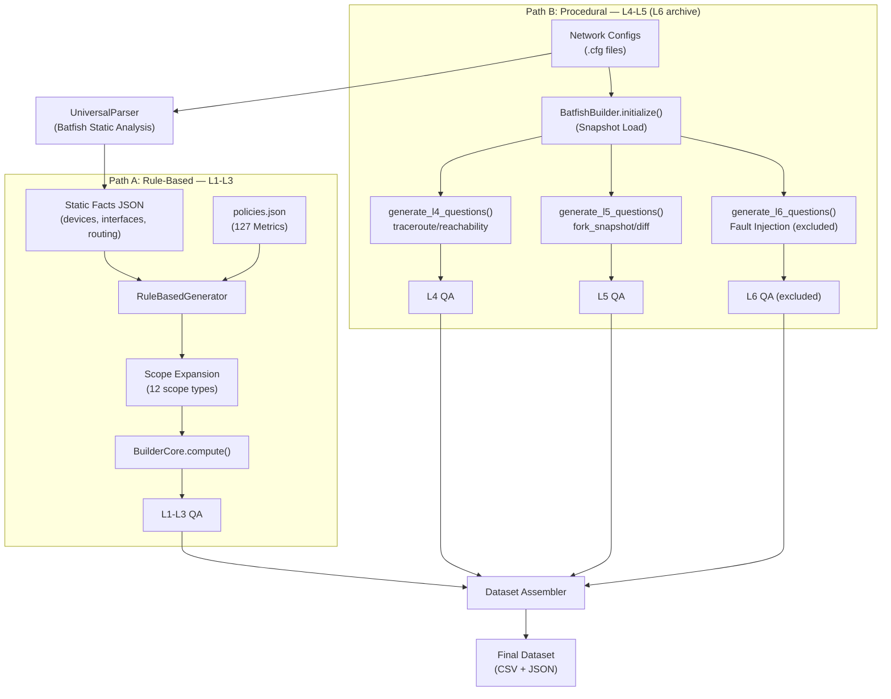
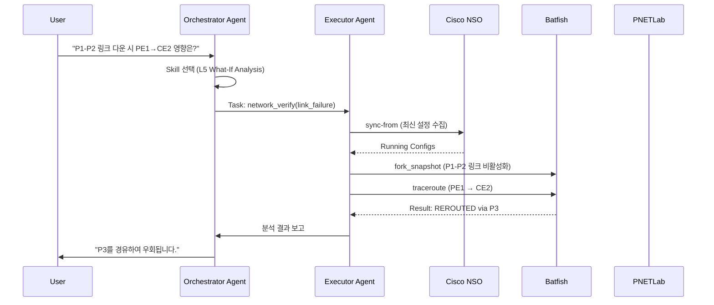

# NetConfigQA2.0 & NetAlly — IEEE 논문 작성 정리 자료

> **최종 업데이트**: 2026-02-13  
> **검증 방법**: `Make_Dataset/src/` 코드 전수 분석 (main_batfish.py, core_batfish/, policies.json)  
> **대상 독자**: 교수님, 팀원 (논문 내용 확인 및 리뷰용)  
> **작업 폴더**: `NetAlly/docs/IEEE/`
>
> **실행 기준 주의 (2026-02-13)**  
> - 제출 본문 기준: v2 공개본 **1,128 QA / L1~L5 / 17 카테고리**  
> - L6는 코드 경로를 보존하되, 이번 TNMS 제출에서는 **실험/평가에서 제외**  
>   (사유: fault별 snapshot/context 관리 부담, baseline 공정성, 재현성 리스크)
> - 아래 일부 섹션의 L6 표기는 코드 감사(archive) 맥락임

---

## 목차

1. [연구 개요](#1-연구-개요)
2. [연구 철학: Knowledge Retrieval vs. Behavioral Inference](#2-연구-철학)
3. [Related Work — 벤치마크 비교](#3-related-work--벤치마크-비교)
4. [Related Work — Agent 기반 네트워크 관리](#4-related-work--agent-기반-네트워크-관리)
5. [논문 스토리라인: NetConfigQA2.0 → NetAlly](#5-논문-스토리라인)
6. [NetConfigQA2.0 — 데이터셋 생성 파이프라인](#6-데이터셋-생성-파이프라인)
7. [NetConfigQA2.0 — 질문 구성 및 난이도 체계](#7-질문-구성-및-난이도-체계)
8. [평가 지표: Type-Aware Accuracy](#8-평가-지표-type-aware-accuracy)
9. [NetAlly — Multi-Agent System](#9-netally--multi-agent-system)
10. [코드 기반 비판적 리뷰](#10-코드-기반-비판적-리뷰)
11. [한계 및 향후 연구](#11-한계-및-향후-연구)
12. [Research Questions & Contributions](#12-research-questions--contributions)
13. [참고 문헌](#13-참고-문헌)

---

## 1. 연구 개요

NetConfigQA2.0은 LLM의 **네트워크 설정 이해 능력**을 체계적으로 평가하기 위한 벤치마크 데이터셋이다. 제출 본문 기준으로는 v2 공개본 **L1~L5, 1,128 QA, 17 카테고리**를 사용하며, L6 진단 코드는 보존하되 이번 제출 실험에서는 제외한다.

### 핵심 특징

| 특성 | 설명 |
|---|---|
| **데이터 소스** | 실제 네트워크 설정 파일(.cfg) — 표준 문서가 아님 |
| **정답 생성** | Batfish 시뮬레이션 엔진 — 인간 검증이 아닌 정형 검증 |
| **난이도 체계** | 제출 기준 5단계(L1~L5), L6 코드는 보존(이번 제출 제외) |
| **자동 확장** | 새로운 토폴로지/설정 파일 입력 시 데이터셋 자동 생성 |
| **평가 지표** | Type-Aware Accuracy (TA-Acc) |

---

## 2. 연구 철학

### 2.1 Knowledge Retrieval vs. Behavioral Inference

기존 통신/네트워크 LLM 벤치마크는 **"지식 검색(Knowledge Retrieval)"** — 표준 문서나 교과서의 사실을 정확히 답하는 능력 — 을 평가한다.

NetConfigQA2.0은 근본적으로 다른 질문을 던진다:

> **"LLM이 실제 네트워크 설정 파일(.cfg)을 읽고, 그 네트워크가 어떻게 동작할지 추론할 수 있는가?"**

이것이 **"동작 추론(Behavioral Inference)"**이다. 라우팅 프로토콜의 상호작용, Data Plane 포워딩 경로, 장애 시 우회 경로 등을 설정 텍스트로부터 시뮬레이션하는 능력을 요구한다.

> "BGP의 기본 포트는 179이다"를 아는 것 **(Knowledge)**과,  
> "이 설정에서 PE1→CE2 패킷은 어떤 경로를 따르는가?"를 추론하는 것 **(Behavioral Inference)**은  
> 본질적으로 다른 인지 수준의 문제이다.

---

## 3. Related Work — 벤치마크 비교

프로젝트 내 `Experiment/data/`에서 사용 중인 벤치마크 3종과의 비교:

| 비교 항목 | **TeleQnA** (Huawei, 2023) | **TeleQuAD** (Ericsson, 2025) | **NetBench** (NetoAI, 2025) | **NetConfigQA2.0 (Ours)** |
|---|---|---|---|---|
| **질문 수** | 10,000 | 수천 (비공개) | 5,390 | 762+ (확장 가능) |
| **질문 형식** | 객관식 | Extractive / Tabular QA | Open-ended Expert QA | **Open-ended + Typed Answer** |
| **데이터 소스** | 3GPP 표준, 논문 | 3GPP 기술 규격 | SME 큐레이션 + Digital Twin | **실제 설정 파일 (.cfg)** |
| **정답 생성** | 인간 검증 + LLM | Extractive (문서 추출) | 전문가 작성 | **Batfish 시뮬레이션** |
| **평가 능력** | 통신 **지식** | 문서 **검색/추출** | 네트워크 **전문 지식** | **동적 동작 추론** |
| **난이도 체계** | 5 카테고리 (주제별) | 2 유형 | 20 카테고리 (주제별) | **5단계 인지 난이도 (L1~L5 제출 기준)** |
| **동적 분석** | ❌ | ❌ | ❌ | ✅ Batfish 시뮬레이션 |
| **What-If** | ❌ | ❌ | ❌ | ✅ Fork Snapshot + Diff |
| **평가 지표** | Accuracy (객관식) | F1/EM | 주관식 | **Type-Aware Accuracy** |

**핵심 차별점**: 기존 벤치마크는 **"이 개념을 아는가?"**를 묻지만, NetConfigQA2.0은 **"이 설정을 주면 무슨 일이 일어나는가?"**를 묻는다. 동적 시뮬레이션 기반 Ground Truth를 사용하는 네트워크 벤치마크는 현재까지 존재하지 않는다.

---

## 4. Related Work — Agent 기반 네트워크 관리

LLM Agent를 네트워크 운영에 활용하는 연구가 2024-2025년에 급속히 확대되고 있다.

### 4.1 NIKA — 네트워크 장애 진단 Agent 벤치마크

> Wang et al., **"A Network Arena for Benchmarking AI Agents on Network Troubleshooting"**  
> ACM SIGCOMM NGNO Workshop 2025 ([arXiv:2512.16381](https://arxiv.org/abs/2512.16381))

- **규모**: 5개 네트워크 시나리오 (데이터센터 ~ ISP), **54종 장애 유형**, 수백 개 큐레이션된 인시던트
- **구조**: Plug-and-Play Orchestration (트래픽 생성, 장애 주입, 텔레메트리, 진단 도구, Agent 추론 경로 분석 자동 관리)
- **벤치마크 정의**: Incident Specification + Troubleshooting Specification 이원 구조
- **핵심 발견**: GPT-4급 모델도 장애 **탐지**(Detection)는 우수하나, **위치 특정**(Localization)과 **근본 원인 식별**(Root Cause)에서 실패

| 비교 | NIKA | 우리 연구 |
|---|---|---|
| 성격 | 평가 프레임워크 (Agent 측정) | 벤치마크 + Agent 시스템 (측정 + 해결) |
| 장애 환경 | 실제 네트워크 + 실시간 장애 주입 | 정적 스냅샷 + Batfish 시뮬레이션 |
| Agent 포함 | ❌ 미제공 (평가 틀만) | ✅ Orchestrator + Executor 완전한 시스템 |

> **시사점**: NIKA의 결과(대형 모델도 Root Cause 실패)는 NetAlly의 설계 동기를 독립적으로 검증한다. LLM 단독으로는 복잡한 트러블슈팅이 불가능하며, **도구 활용형 Agent**가 필요하다.

---

### 4.2 INTA — Intent 기반 설정 자동 변환

> Wei et al., **"INTA: Intent-Based Translation for Network Configuration with LLM Agents"**  
> IEEE ICNP 2025 ([arXiv:2501.08760](https://arxiv.org/abs/2501.08760))

- **과업**: 서로 다른 네트워크 장비 간 설정 자동 변환 (노후 장비 교체, SDN/NFV 전환)
- **파이프라인**: `Source Config → Decompose → Extract Intent → RAG Retrieve → Generate → Syntax Check → Verify Semantics → Target Config`
- **핵심**: Intent를 Intermediate Representation으로 사용
- **결과**: 구문적/View 정확도 **98.15%**, 명령어 재현율 **84.72%**

| 비교 | INTA | 우리 연구 |
|---|---|---|
| 과업 | Config **Translation** (Write) | Config **Understanding** (Read + Reason) |
| Agent 구조 | Single-Agent (LLM + RAG + Syntax Checker) | Multi-Agent (Orchestrator + Executor + 3 Tools) |
| Ground Truth | 인간 작성 참조 설정 | Batfish 엔진 자동 생성 |

> **시사점**: INTA는 설정을 "쓰는 능력", NetConfigQA2.0은 "읽는 능력"을 평가. **보완적 관계**이며 Read/Write 양 방향으로 완전한 평가 그림을 제공.

---

### 4.3 Cisco Deep Network Troubleshooting

> Cisco, **"Deep Network Troubleshooting"**, AgenticOps Initiative, Cisco Live 2025

- **아키텍처**: (1) Deep Network Model (40년 Cisco 전문 지식 + 도메인 LLM), (2) Knowledge Graph (Semantic Backbone), (3) Ingestion Pipeline, (4) Human-in-the-Loop
- **작동**: 문제 해석 → 가설 수립 및 동시 검증 → 근본 원인 + 증거 합성

| 비교 | Cisco Deep Troubleshooting | NetAlly |
|---|---|---|
| 성격 | 상용 솔루션 (Cisco 생태계) | 오픈소스 연구 프로토타입 |
| 지식 기반 | 전용 Knowledge Graph + 도메인 LLM | 범용 LLM + 도구 호출 |
| 재현 가능성 | ❌ 코드 비공개 | ✅ 코드 공개 + 재현 가능 |

> **시사점**: Cisco는 대규모 도메인 지식에 의존하지만, NetAlly는 **범용 LLM + 시뮬레이션 도구**로 동일 문제를 해결. 학술 연구로서 재현 가능성과 벤치마크 동반 제공이 강점.

---

### 4.4 NetConfEval — 설정 합성 능력 벤치마크

> Wang et al., **"NetConfEval: Can LLMs Facilitate Network Configuration?"**  
> ACM CoNEXT 2024 (Proc. ACM Netw. 2, Article 7)

- **4가지 평가 과업**: Formal Specification / API Call / Routing Algorithm / Low-level Config 생성
- **결과**: GPT-4 기반 프로토타입 2개 구현 + LLM 네트워크 설정 시스템 설계 원칙 제안

| 비교 | NetConfEval | NetConfigQA2.0 |
|---|---|---|
| 방향 | Config **Write** (NL → Config) | Config **Read** (Config → 동작 이해) |
| Ground Truth | 참조 설정 (인간 작성) | Batfish 시뮬레이션 결과 (자동) |
| 동적 분석 | ❌ 정적 | ✅ Traceroute, What-If, Reachability |

---

### 4.5 KubeLLM — Kubernetes 트러블슈팅 Multi-Agent

> UTSA, **"KubeLLM: LLM-Based Multi-Agent Framework for Kubernetes Troubleshooting"**, 2024

- **아키텍처**: Knowledge Agent (RAG + 질의 해석) + Tools Agent (kubectl 실행) + Self-Evaluation
- **발견**: Multi-Agent가 정확도 개선, Self-Evaluation이 Robustness 향상, 성능/속도/비용 Trade-off 존재

| 비교 | KubeLLM | NetAlly |
|---|---|---|
| 도메인 | 컨테이너/K8s (DevOps) | 전통 네트워크 (MPLS/BGP) |
| 도구 | Shell + kubectl | Batfish, NSO, PNETLab |
| 수정 능력 | ✅ 자동 수정 | ⚠️ 현재 Read-Only |

---

### 4.6 NetPress — 동적 벤치마크 생성 프레임워크

> Froot Systems Lab (UMD), **"NetPress: Dynamically Generated LLM Benchmarks for Network Applications"**  
> arXiv:2506.03231, 2025 ([GitHub](https://github.com/Froot-NetSys/NetPress))

- **핵심 기여**: 정적/소규모 벤치마크의 한계를 극복하는 **동적 벤치마크 생성** 프레임워크
- **메커니즘**: State-Action 통합 추상화로 런타임에 수백만 쿼리 자동 생성 → 데이터 오염 방지
- **에뮬레이터 통합**: Mininet + Kubernetes 테스트베드로 실제 환경 피드백 제공
- **3가지 대표 응용**: (1) 데이터센터 용량 계획, (2) 라우팅 오설정 진단, (3) 마이크로서비스 정책 트러블슈팅
- **평가 차원**: Correctness + Safety + Latency (정적 벤치마크는 Correctness만)
- **발견**: GPT-4o + QWen-72B 평균 Agent correctness ~**24%** → LLM Agent의 현재 수준이 매우 낮음을 입증

| 비교 | NetPress | NetConfigQA2.0 |
|---|---|---|
| 생성 방식 | 동적 (런타임) | 반자동 (파이프라인) |
| 에뮬레이터 | Mininet + K8s | PNETLab + Batfish |
| Ground Truth | 에뮬레이터 실행 결과 | **Batfish 시뮬레이션** |
| 다차원 평가 | Correctness + Safety + Latency | **TA-Acc (Type-Aware)** |
| 난이도 체계 | 복잡도 파라미터 | **5단계 인지 난이도 (L1~L5 제출 기준)** |

> **시사점**: NetPress의 24% correctness 결과는 NetConfigQA2.0의 L4/L5 실패 발견과 독립적으로 일치. **NetAlly를 NetPress 라우팅 오설정 태스크에 적용하면 도구 활용 효과를 외부 벤치마크에서도 입증 가능.

---

### 4.7 NeMoEval — LLM 코드 생성 기반 네트워크 관리 평가

> Mani et al. (Microsoft Research), **"Enhancing Network Management Using Code Generated by Large Language Models"**  
> ACM HotNets 2023 ([arXiv:2308.06261](https://arxiv.org/abs/2308.06261))

- **접근법**: NL 쿼리 → LLM이 SQL/pandas/NetworkX 코드 생성 → 코드 실행으로 네트워크 분석
- **2가지 응용**: (1) 트래픽 분석 (Communication Graph), (2) 네트워크 생명주기 관리
- **장점**: Explainability — 운영자가 생성된 코드를 검수 가능, Privacy — 네트워크 데이터를 LLM에 전송 불필요
- **3가지 코드 생성 방식 비교**: SQL vs pandas vs NetworkX

| 비교 | NeMoEval | NetConfigQA2.0 |
|---|---|---|
| 평가 대상 | **코드 생성** 능력 | **설정 이해** 능력 |
| 데이터 | 트래픽 그래프 | 장비 설정 파일 (.cfg) |
| Agent 인터페이스 | 코드 실행 | 도구 호출 (API) |

> **시사점**: NeMoEval은 **코드 생성** 패러다임이라 Multi-Agent 도구 호출과는 다른 축. Related Work에서 "LLM의 네트워크 관리 활용" 범주로 인용하되, 직접 비교 대상은 아님.

---

### 4.8 NETLLMBENCH — 네트워크 에뮬레이션 기반 LLM 벤치마크

> Geyer et al. (TU Munich), **"NETLLMBENCH: Evaluating Large Language Models for Network Management"**  
> IEEE Conference on NFV-SDN 2024, Natal, Brazil

- **핵심**: Prompt Engineering + Network Emulation을 **Closed-Loop**으로 통합한 평가 프레임워크
- **에뮬레이터**: Kathara (Docker 기반 가상 네트워크)
- **2단계 검증**: (1) **구문 검증** — JSON Schema 체크, (2) **의미 검증** — 에뮬레이션 환경에서 실행 확인
- **태스크**: IP 주소 할당, 기본 게이트웨이 설정 등 비교적 기초적인 네트워크 설정

| 비교 | NETLLMBENCH | NetConfigQA2.0 |
|---|---|---|
| 검증 방식 | Kathara 에뮬레이션 | Batfish 시뮬레이션 |
| 태스크 복잡도 | 기초 (IP 할당) | **L1~L5 (제출 기준 5단계)** |
| Closed-Loop | ✅ (생성→검증→피드백) | ⚠️ (생성만, 피드백 미구현) |
| 다차원 난이도 | ❌ | ✅ |

> **시사점**: NETLLMBENCH의 구문+의미 2단계 검증 방법론은 참고 가치가 높다. NetConfigQA2.0의 검증 파이프라인(Layer 1 재현 + Layer 2 실환경)과 철학적으로 유사.

---

### 4.9 기타 관련 연구

| 연구 | 발표 | 핵심 내용 | 우리 연구와의 관계 |
|---|---|---|---|
| **TelecomGPT** | [arXiv:2407.09424](https://arxiv.org/abs/2407.09424) | 6G 특화 도메인 LLM. 3개 새 벤치마크 제안 | 도메인 LLM vs 범용 LLM+도구 접근 비교 |
| **RAG-Intent Reasoning** | [arXiv:2505.09339](https://arxiv.org/abs/2505.09339) | MR + RAG + GenAI로 네트워크 Intent 해석 | Intent 해석 vs 설정 분석 결과 기반 추론 |
| **IntAgent** | [arXiv:2601.13114](https://arxiv.org/abs/2601.13114) | NWDAF 기반 Intent Agent, 5G/6G 특화 | 차세대 네트워크 특화; 우리는 전통 SP 망 |
| **NetIntent** | arXiv, 2025 | SDN 자동화 LLM 기반 Intent 해석 | IBN 관점에서 보완적 |
| **IETF Framework** | IETF Draft, 2025 | LLM Agent 네트워크 설정 평가 프레임워크 | 표준화 노력. 벤치마크 설계 참고 |
| **AI Telco Challenge** | GSMA/ETSI/IEEE/ITU | LLM RCA 능력 평가 산업 챌린지 (2025-26) | NetConfigQA2.0이 학술적 보완 역할 |

---

### 4.10 포지셔닝 요약



**NetAlly + NetConfigQA2.0의 5가지 독창적 기여**:

1. **벤치마크 + Agent를 함께 제공** — NIKA는 평가만, Cisco는 Agent만. 우리는 문제 정의 + 해결책을 하나의 프레임워크로 제시
2. **시뮬레이션 기반 Ground Truth** — Batfish 정형 검증 엔진으로 자동 생성 (인간 의존 ❌)
3. **도구 호출형 Agent** — RAG나 Knowledge Graph가 아닌 실제 네트워크 도구(Batfish/NSO/PNETLab)를 Skill로 통합
4. **다차원 인지 난이도** — 제출 기준 L1~L5 체계적 평가 (L6는 코드 보존/제외)
5. **스케일러빌리티 입증** — 10→30→50 노드로 파이프라인 확장 가능, 어떤 토폴로지든 설정 파일만 넣으면 자동 생성

---

## 5. 논문 스토리라인

이 연구는 하나의 질문에서 시작한다:

> **"LLM이 네트워크 설정 파일을 보고 네트워크가 어떻게 동작하는지 이해할 수 있는가?"**

이를 검증하기 위해 두 개의 연구 결과물이 함께 발표된다:

```
[문제 정의] NetConfigQA2.0: LLM의 설정 이해력을 측정하는 벤치마크
      ↓ 평가 결과: L1-L3 가능, L4-L5 사실상 불가능 (평균 0.2 이하)
[해결책 제시] NetAlly: 도구 활용형 Multi-Agent System으로 한계 극복
      ↓ LLM이 직접 추론 대신, NSO/Batfish/PNETLab을 호출하여 정답 산출
[효과 입증] NetConfigQA2.0으로 NetAlly의 성능 향상을 정량 평가
```

즉, **"문제 정의(Benchmark) → 문제 입증(Evaluation) → 해결책 제시(Agent)"**라는 흐름이다.

---

## 6. 데이터셋 생성 파이프라인

### 6.1 전체 구조 (코드 기반)

`main_batfish.py` 분석 결과, 데이터셋 생성은 **2개의 독립 경로(Dual-Path)**로 구성된다:



### 6.2 경로 A — RuleBasedGenerator (L1-L3)

- `policies.json`에 정의된 127개 메트릭 중 L1-L3에 해당하는 100개를 사용
- L4/L5는 **명시적으로 건너뜀** (`rule_based_generator.py` 140-141행: `if lvl in ["L4", "L5"]: continue`)
- **Scope Expansion**: `GLOBAL`, `DEVICE`, `DEVICE_PAIR`, `AS`, `OSPF_AREA`, `VRF`, `FLOW` 등 12가지 scope type으로 질문 인스턴스를 동적 확장

### 6.3 경로 B — BatfishBuilder (L4/L5)

- `main_batfish.py` 677-693행에서 별도 호출
- 템플릿이 아닌 **절차적 생성**: 노드 쌍 무작위 샘플링 → Batfish API 시뮬레이션 → 결과를 QA로 변환
- L6는 `--include-l6`로만 생성되며 기본 경로에서는 제외됨

---

## 7. 질문 구성 및 난이도 체계

### 7.1 카테고리 구성 (policies.json 실측)

코드 전체 기준 총 **127개 메트릭**, **18개 카테고리**  
(제출 공개본 v2 기준: L1~L5, 17 카테고리):

#### 정적 분석 (L1-L3) — 13개 카테고리

| 카테고리 | 메트릭 수 | 대표 질문 |
|---|:---:|---|
| Configuration_Check | 30 | "PE1의 hostname은?" |
| System_Inventory | 11 | "SSH 활성화된 장비 목록은?" |
| Comparison_Analysis | 10 | "PE1과 PE2의 OSPF Area 차이는?" |
| Routing_Inventory | 7 | "BGP Local AS 번호는?" |
| Services_Inventory | 7 | "DNS/NTP/SNMP 설정은?" |
| Security_Policy | 7 | "ACL 규칙 목록은?" |
| BGP_Consistency | 5 | "iBGP Full-Mesh 구성 여부?" |
| L2VPN_Consistency | 5 | "VPN RD 값 중복 여부?" |
| Hardware/Interface/Security_Inventory | 4 each | 장비·인터페이스·보안 정보 |
| VRF_Consistency | 4 | "VRF 간 RT 중복?" |
| OSPF_Consistency | 3 | "Area 0 라우터 목록?" |

#### 동적 분석 (L4-L5) — 3개 카테고리 (제출 기준)

| 카테고리 | 메트릭 수 | 대표 메트릭 |
|---|:---:|---|
| Reachability_Analysis | 9 | traceroute_path, reachability_status, acl_blocking_point |
| What_If_Analysis | 14 | link_failure_impact, blast_radius, spof_detection |
| Routing_Consistency | 1 | ospf_compatibility_check |

### 7.2 난이도별 설계 근거

| Level | 인지 능력 | 정답 생성 방식 | 메트릭 수 |
|:---:|---|---|:---:|
| **L1** | 텍스트 검색 | Config 파싱 (Regex) | 67 |
| **L2** | 정보 수집 + 카운팅 | Facts 순회/집계 | 10 |
| **L3** | 교차 비교 + 논리 판단 | BuilderCore 교차 검증 | 23 |
| **L4** | 라우팅/포워딩 시뮬레이션 | **Batfish Data Plane Simulation** | 11 |
| **L5** | 상태 변화 + 영향 분석 | **Fork Snapshot + Diff** | 14 |

### 7.3 L4 메트릭 상세 (l4_analyzer.py)

| 메트릭 | Batfish API |
|---|---|
| traceroute_path | `bf.q.traceroute()` |
| reachability_status | `bf.q.traceroute()` + disposition |
| acl_blocking_point | `bf.q.reachability()` |
| loop_detection | `bf.q.detectLoops()` |
| blackhole_detection | `bf.q.reachability()` |
| waypoint_check | `bf.q.traceroute()` |
| bounded_path_length | `bf.q.traceroute()` |
| isolation_check | `bf.q.interfaceProperties()` + `bf.q.reachability()` |
| asymmetric_path_check | Forward/Reverse traceroute 비교 |
| ospf_compatibility_check | `bf.q.ospfInterfaceConfiguration()` |
| security_policy_bypass_check | `bf.q.traceroute()` + waypoint |

### 7.4 L5 메트릭 상세 (l5_analyzer.py)

| 메트릭 | 핵심 기법 |
|---|---|
| link_failure_impact | `fork_snapshot()` + `deactivate_interfaces` |
| spof_detection | traceroute 경로 분석 |
| blast_radius_estimation | `fork_snapshot()` + `differentialReachability()` |
| root_cause_analysis | traceroute + 라우팅 테이블 분석 |
| redundancy_verification | 2개 노드 동시 비활성화 |
| triple_node_failure | 3개 노드 동시 비활성화 |
| differential_reachability | Batfish `differentialReachability` 쿼리 |
| ospf_backbone_contiguity | `bf.q.ospfAreaConfiguration()` |

### 7.5 L6 메트릭 상세 (l6_analyzer.py) — 논문 범위 외

| 메트릭 | 기능 |
|---|---|
| diagnostic_qa_link | 링크 장애 원인 역추적 |
| diagnostic_qa_node | 장비 장애 원인 역추적 |
| diagnostic_qa_bgp_mismatch | BGP 세션 불일치 진단 |
| diagnostic_qa_ospf_mismatch | OSPF 세션 불일치 진단 |
| diagnostic_qa_acl_block | ACL 차단 규칙 역추적 |

→ `main_batfish.py` 689행에서 실제 호출. 논문에서 L5까지만 다루는 것은 **의도적 범위 제한**.

---

## 8. 평가 지표: Type-Aware Accuracy

### 8.1 필요성

네트워크 데이터는 일반 텍스트와 본질적으로 다르다:
- **IP 주소**: `10.0.1.1`과 `10.0.1.10`은 BERTScore상 유사하지만 완전히 다른 주소
- **경로**: `[A→B→C]`와 `[A→C→B]`는 집합은 같지만 경로는 다름
- **집합**: `{r1, r2, r3}`와 `{r3, r1, r2}`는 순서만 다르고 내용 동일

BERTScore는 L1~L5 모두 0.9 이상 → 변별력 없음.

### 8.2 채점 방식

| answer_type | 채점 | 예시 |
|---|---|---|
| `set_str` | F1 Score (순서 무관) | BGP Neighbor 목록 |
| `path` | Ordered Exact Match | Traceroute 경로 |
| `scalar_str/int` | 정규화 후 Exact Match | IP 주소, 홉 수 |
| `bool` | 정규화 비교 | Yes/No 질문 |
| `map_str_int` | Key-Value F1 | 장비별 인터페이스 수 |

---

## 9. NetAlly — Multi-Agent System

### 9.1 설계 동기

NetConfigQA2.0 평가 결과, **L4/L5에서 모든 LLM이 실패** (평균 0.2 이하). LLM이 직접 추론하는 대신, **실제 네트워크 도구를 사용**해야 한다.

### 9.2 아키텍처



### 9.3 하이브리드 검증 파이프라인

| 도구 | 역할 | 실제 활용 |
|---|---|---|
| **Cisco NSO** | 실시간 설정 수집/변경 | `sync-from` → XML 파싱 |
| **Batfish** | What-If 시뮬레이션 | `fork_snapshot` → `differentialReachability` |
| **PNETLab** | 토폴로지 정보 | `/api/labs/{lab_id}/topology` |

---

## 10. 코드 기반 비판적 리뷰

### 10.1 문서-코드 불일치

| 항목 | 이전 문서 | 코드 실제 | 평가 |
|---|---|---|---|
| 질문 생성 | "126개 템플릿 기반" | L1-L3 템플릿 + L4/L5 **절차적 생성** | ⚠️ "하이브리드"로 표현 |
| 레벨 범위 | "L1-L5" | L6 구현은 존재하나 기본 실행/평가에서는 제외 | ✅ 제출 범위 정합 |
| 메트릭 수 | "126개" | **127개** | 사소한 오차 |
| 카테고리 수 | 문서마다 다름 | **18개** | ⚠️ 통일 필요 |
| Scope Expansion | 미기술 | 12가지 scope type — **핵심 메커니즘** | ❌ 반드시 기술 |

### 10.2 코드 품질

**양호한 점**:
- L4/L5 메트릭은 실제 Batfish API 호출 → Ground Truth 신뢰성 높음
- `AnswerResult` 데이터클래스 → 일관된 결과 반환
- VRF 환경 대응 (`_fix_start_location`으로 Loopback0 명시)

**✅ 해결 완료**:
- ~~`random.shuffle()` 재현성 문제~~ → `seed=42` 고정 적용
- ~~하드코딩된 노드 판별~~ → Batfish BGP 세션 분석 + L3 Edge Degree 기반 토폴로지 추론으로 교체 (`_infer_node_roles()`)

---

## 11. 한계 및 향후 연구

### 11.1 현재 한계

| 구분 | 한계 | 상태 |
|---|---|---|
| 데이터셋 | 단일 토폴로지 (10노드 MPLS VPN SP 망) | 미해결 |
| 데이터셋 | 단일 벤더 (Cisco IOS) | 미해결 |
| 데이터셋 | ~~재현성 문제~~ / ~~하드코딩 노드 판별~~ | ✅ 해결 |
| 평가 | Read-Only (설정 생성 능력 미평가) | 미해결 |
| 평가 | 단일 정답 (복수 유효 답 미지원) | 미해결 |

### 11.2 향후 확장

- L6 (Diagnostic Troubleshooting) 정식 포함
- 멀티 토폴로지 / 멀티 벤더 확장
- Configuration Generation 능력 평가 (Read → Write)
- NetAlly의 L4/L5 성능 향상 정량 평가

---

## 12. Research Questions & Contributions

### Research Questions

| RQ | 질문 |
|---|---|
| **RQ1** | Multi-Agent System이 단일 LLM 대비 복잡한 네트워크 관리 태스크(구성 조회, 검증, 장애 진단)에서 더 높은 정확도와 안정성을 보이는가? |
| **RQ2** | 시뮬레이션 환경(PNETLab)과 운영 도구(NSO, Batfish)를 통합한 하이브리드 아키텍처가 실제 네트워크 검증에 효과적인가? |
| **RQ3** | 체계적인 네트워크 구성 QA 벤치마크(NetConfigQA 2.0)가 LLM 기반 네트워크 관리 시스템의 평가에 적합한가? |

### Contributions

| # | Contribution |
|---|---|
| **C1** | 네트워크 관리 특화 Multi-Agent System(NetAlly) 설계/구현: Orchestrator-Executor 역할 분리 + 도구 기반 추론 |
| **C2** | PNETLab-NSO-Batfish 통합 하이브리드 검증 파이프라인: 시뮬레이션 자동 온보딩 + 정형 검증 연동 |
| **C3** | NetConfigQA 2.0 벤치마크: 제출 기준 5단계(L1~L5, 1,128 QA, 17 카테고리), 127개 메트릭, Type-Aware Accuracy 평가 체계 |

### Abstract (영문, 250 words)

**NetAlly: A Multi-Agent System for Verifiable Network Configuration Management**

Large Language Models (LLMs) have shown remarkable capabilities in natural language understanding and code generation. However, their application to network configuration management faces critical challenges: single-agent systems struggle with complex multi-device reasoning, generated configurations lack formal verification, and existing benchmarks fail to capture operational complexity.

We present **NetAlly**, a Multi-Agent System designed for verifiable network configuration management. NetAlly employs a two-agent architecture: an **Orchestrator** that analyzes natural language queries and selects appropriate skills, and an **Executor** that invokes network management tools to retrieve or verify configurations. The system integrates three key components: (1) **PNETLab** for network simulation, (2) **Cisco NSO** for configuration management, and (3) **Batfish** for formal verification and What-If analysis.

A novel **scan_and_sync** mechanism automatically reconciles simulation environments with operational tools. For dynamic fault analysis, NetAlly leverages Batfish's **fork_snapshot** capability to simulate failures without affecting the actual network.

To systematically evaluate LLM-based network management, we introduce **NetConfigQA 2.0**, using the public v2 benchmark across five difficulty levels (L1-L5) for this submission. Unlike existing benchmarks, NetConfigQA 2.0 uses **Batfish simulation results as ground truth** and employs **Type-Aware Accuracy** to handle network-specific data structures; L6 is explicitly excluded here due to fault-snapshot management overhead and fairness/reproducibility concerns.

Experimental results demonstrate that NetAlly's multi-agent approach achieves significant accuracy improvements on L4-L5 tasks compared to LLM-only baselines, validating the necessity of tool-augmented agents for network configuration understanding.

---

## 13. 참고 문헌

### 벤치마크

1. **TeleQnA** — Maatouk et al., "TeleQnA: A Benchmark Dataset to Assess Large Language Models Telecommunications Knowledge," 2023
2. **TeleQuAD** — Ericsson, "TeleQuAD: Telecom Question Answering Dataset from 3GPP Specifications," 2025
3. **NetBench** — NetoAI, "NetBench: Expert-Level Network QA Benchmark," 2025

### Agent 기반 네트워크 관리

4. **NIKA** — Wang et al., "A Network Arena for Benchmarking AI Agents on Network Troubleshooting," ACM SIGCOMM NGNO 2025 ([arXiv:2512.16381](https://arxiv.org/abs/2512.16381))
5. **INTA** — Wei et al., "INTA: Intent-Based Translation for Network Configuration with LLM Agents," IEEE ICNP 2025 ([arXiv:2501.08760](https://arxiv.org/abs/2501.08760))
6. **Cisco Deep Troubleshooting** — Cisco, "AgenticOps: Deep Network Troubleshooting," Cisco Live 2025
7. **NetConfEval** — Wang et al., "NetConfEval: Can LLMs Facilitate Network Configuration?," ACM CoNEXT 2024 (Proc. ACM Netw. 2, Article 7)
8. **KubeLLM** — UTSA, "KubeLLM: LLM-Based Multi-Agent Framework for Kubernetes Troubleshooting," 2024

### 벤치마크/평가 프레임워크 (외부)

9. **NetPress** — Froot Systems Lab (UMD), "NetPress: Dynamically Generated LLM Benchmarks for Network Applications," 2025 ([arXiv:2506.03231](https://arxiv.org/abs/2506.03231), [GitHub](https://github.com/Froot-NetSys/NetPress))
10. **NeMoEval** — Mani et al. (Microsoft Research), "Enhancing Network Management Using Code Generated by Large Language Models," ACM HotNets 2023 ([arXiv:2308.06261](https://arxiv.org/abs/2308.06261))
11. **NETLLMBENCH** — Geyer et al. (TU Munich), "NETLLMBENCH: Evaluating Large Language Models for Network Management," IEEE NFV-SDN 2024

### 도메인 특화 LLM

12. **TelecomGPT** — "TelecomGPT: A Framework to Build Telecom-Specific Large Language Models," 2024 ([arXiv:2407.09424](https://arxiv.org/abs/2407.09424))

### Intent-Based Networking

13. **RAG-Intent** — "RAG-Enabled Intent Reasoning for Application-Network Interaction," 2025 ([arXiv:2505.09339](https://arxiv.org/abs/2505.09339))
14. **IntAgent** — "IntAgent: NWDAF-Based Intent LLM Agent Towards Advanced Next Generation Networks," 2026 ([arXiv:2601.13114](https://arxiv.org/abs/2601.13114))

### Batfish 관련

15. Fogel et al., "A General Approach to Network Configuration Analysis," NSDI 2015
16. Abhashkumar et al., "ARC: Automatic Repair of Network Configurations," Batfish Foundation
