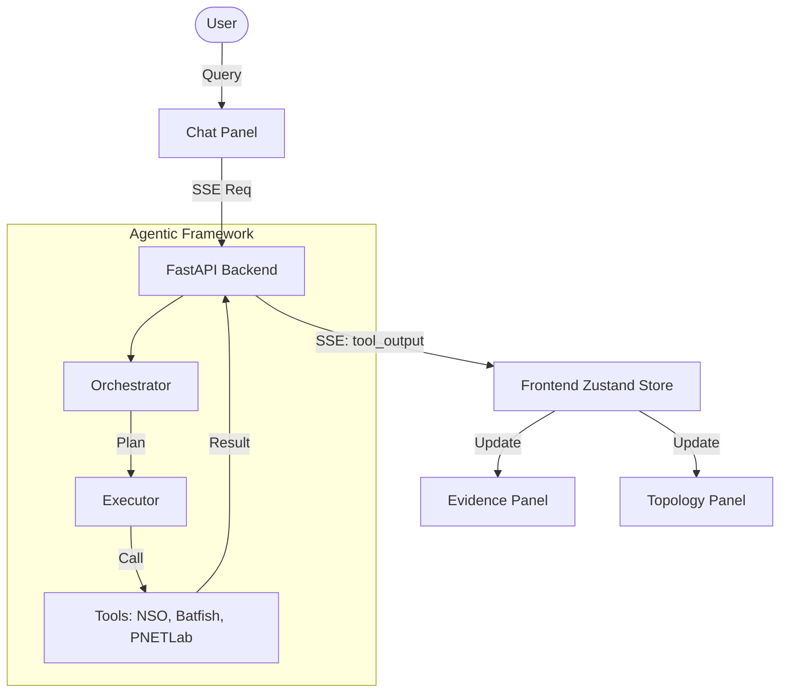

# NetAlly System Architecture

NetAlly is an advanced agentic framework for network analysis and verification, centered around an **Evidence-First Dashboard**.

---

## 1. System Overview

NetAlly integrates three core domains:
1.  **Automation (NSO)**: Acts as the Single Source of Truth (SSoT) and management layer.
2.  **Verification (Batfish)**: Provides deep configuration analysis and simulation.
3.  **Reasoning (LangGraph Agent)**: An Orchestrator-Executor system that plans and executes verification tasks.

### Core Philosophy: Evidence-First
Unlike traditional chat-focused AI tools, NetAlly prioritizes **Visual Topology** and **Evidence Packs**. The chat interface serves as a guide, while the dashboard captures tool outputs as immutable evidence cards.

---

## 2. High-Level Components

### Backend (FastAPI + LangGraph)
- **FastAPI Server**: Provides SSE (Server-Sent Events) for real-time chat streaming and REST endpoints for topology data.
- **Orchestrator Agent**: Plans the verification strategy based on user intent.
- **Executor Agent**: Calls specialized tools (NSO, Batfish, PNETLab).
- **SSE Streamer**: Emits `planning`, `tool_call`, `tool_output`, and `answer` events to the frontend.

### Frontend (React + Vite + Zustand)
- **Topology Panel**: Interactive SVG-link visualization using **React Flow**.
- **Chat Panel**: Minimalist "DevUI" chat interface with system log integration.
- **Evidence Dashboard**: A floating tray of verification results captured from the tool-execution stream.
- **Zustand Store**: Manages global state including selected nodes, evidence history, and detail views.

---

## 3. Data Flow

### Event Stream Sequence
1.  **`planning`**: Agent's reasoning and selected skills.
2.  **`tool_call`**: Notification of tool execution (e.g., `execute_reachability`).
3.  **`tool_output`**: Raw result from the tool. **(Crucial for Evidence Dashboard)**
4.  **`answer`**: Final interpretation and summary.

---

## 4. Integration Strategy

### PNETLab & NSO Sync
NetAlly performs "Reconciliation" between the laboratory design (PNETLab) and the management system (NSO).
- **Discovery**: Scans PNETLab for running nodes.
- **Auto-Onboarding**: Registers missing nodes into NSO with correct SSH/Telnet mappings.
- **State Sync**: Ensures NSO's `sync-from` is performed before Batfish analysis.

### Batfish Analysis
- **L3 Topology**: Extracted from NSO/CDP to build the Batfish model.
- **Questions**: Analyzes reachability, trace routes, and configuration compliance.

---

## 5. Deployment

NetAlly is deployed as a multi-container stack:
- **`netally`**: Python 3.12 runtime serving the FastAPI backend and bundled React frontend.
- **`batfish`**: Specialized analysis engine.
- **External NSO**: Connected via RESTCONF.

See [setup.md](setup.md) for environment configuration.
