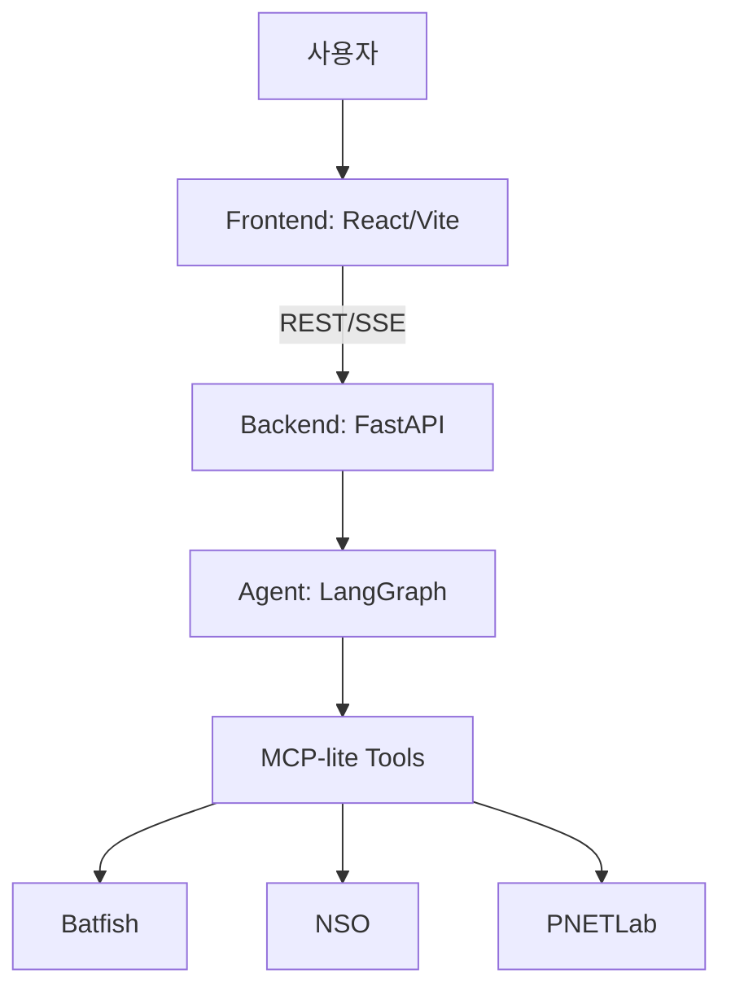

# NetAlly 웹 구조 입문 가이드 (비웹 개발자용)

이 문서는 "웹을 거의 모르는 상태"에서 NetAlly를 이해하고 다음 작업을 진행하기 위한 안내서입니다.  
목표는 아래 3가지를 빠르게 잡는 것입니다.

문서 허브: `docs/README_ko.md`  
실행/테스트 문서: `docs/testing_runbook_ko.md`

1. NetAlly가 어떤 덩어리(프론트/백엔드/에이전트)로 나뉘는지
2. 버튼 클릭/채팅 입력이 실제로 어떤 파일과 API를 타는지
3. 문제가 생겼을 때 어디부터 확인해야 하는지

---

## 1) 한 장으로 보는 구조

NetAlly는 크게 4층입니다.

1. 브라우저 UI (React)
2. 백엔드 API 서버 (FastAPI)
3. 에이전트 실행 계층 (LangGraph + MCP-lite)
4. 외부 네트워크 시스템 (Batfish, NSO, PNETLab)



핵심 포인트:
- 화면은 `frontend/`에서 렌더링
- 실제 로직/데이터는 `main.py` + `agent/`에서 처리
- 채팅은 **SSE 스트리밍**으로 계획/도구/답변이 순서대로 흘러옴

---

## 2) "웹"을 NetAlly에 맞춰 쉽게 이해하기

웹 앱을 아주 단순화하면:

1. 프론트엔드: 버튼과 화면
2. 백엔드: 데이터/로직 제공 API
3. 연결 방식: HTTP 요청(`GET/POST`) + 실시간 스트림(SSE)

NetAlly 기준으로 매핑하면:

- 버튼 클릭 (`Settings Apply`, `Refresh`, `Prepare`)  
  -> 프론트에서 `/api/...` 호출  
  -> 백엔드에서 실제 처리 후 JSON 반환

- 채팅 전송  
  -> `/api/chat` 호출  
  -> 백엔드가 `planning -> tool_call -> tool_output -> answer -> complete` 이벤트를 SSE로 순차 전송  
  -> 프론트가 이벤트를 받아 메시지/Evidence로 그림

---

## 3) 디렉토리별 역할 (처음 보는 순서)

추천 읽기 순서:

1. `frontend/src/App.tsx`  
   - 화면 큰 뼈대(헤더, 대시보드/토폴로지, 채팅 패널)
2. `frontend/src/components/Header.tsx`  
   - 상단 버튼(Refresh/Prepare/Settings)과 API 호출 연결
3. `frontend/src/components/SettingsDialog.tsx`  
   - `/api/settings` 읽기/쓰기, MCP 운영 설정 제어
4. `frontend/src/components/ChatPanel.tsx`  
   - `/api/chat` SSE 파싱
5. `main.py`  
   - 모든 API 엔드포인트 진입점
6. `agent/graph.py`, `agent/mcp_tools.py`, `agent/mcp_server.py`  
   - 에이전트 흐름/도구 실행/보호 로직

---

## 4) 실제 요청 흐름 예시 3개

### A. Settings 저장

1. 사용자: Settings에서 값 변경 후 Apply
2. 프론트: `POST /api/settings`
3. 백엔드: 환경값 반영 + MCP 클라이언트/런타임 재초기화(필요 시)
4. 프론트: saved 표시

관련 파일:
- `frontend/src/components/SettingsDialog.tsx`
- `main.py` (`GET/POST /api/settings`)

### B. 채팅 1회

1. 사용자: 질문 입력 후 전송
2. 프론트: `POST /api/chat`
3. 백엔드: SSE로 이벤트 스트리밍
4. 프론트: 계획/도구 실행 로그/최종답변 렌더

관련 파일:
- `frontend/src/components/ChatPanel.tsx`
- `main.py` (`chat_stream_generator`, `/api/chat`)

### C. 대시보드 로드

1. 프론트: `/api/dashboard/summary` 호출
2. 백엔드: Batfish 가능 시 분석 결과 반환, 아니면 fallback 계약 반환
3. 프론트: 카드(BGP/OSPF/이슈/컴플라이언스) 렌더

관련 파일:
- `frontend/src/components/DashboardPanel.tsx`
- `main.py` (`/api/dashboard/summary`)

---

## 5) 테스트는 무엇을 보장하나?

현재 테스트는 3축입니다.

1. 백엔드 회귀 (`pytest`)
   - MCP 22개 도구 노출/게이트/호환
   - `/api/settings`, `/api/health` 계약
   - 대시보드 요약 계약(`bgp/ospf` 키 보장)

2. 프론트 E2E 스모크 (Playwright)
   - Chat SSE 최소 렌더
   - Settings MCP 항목 로드/변경/저장
   - 대시보드 fallback 응답에서도 크래시 안 나는지

3. CI (GitHub Actions)
   - 위 테스트를 PR에서 자동 실행
   - 실패 시 리포트 아티팩트 업로드

쉽게 말해:
- "기능이 돌아가는지" + "데모 중 깨지는 대표 케이스"를 자동 감시하는 수준입니다.

---

## 6) 로컬에서 가장 쉬운 실행 순서

### 기본 실행

```bash
cd NetAlly
./scripts/demo_up_local.sh
```

이 스크립트가 해주는 것:

1. backend(8111), frontend(3000) 동시 실행
2. `/api/health`, `/api/settings`, `/api/lab/prepare` 자동 점검
3. PASS가 뜨면 데모 가능한 기본 상태

### 수동 점검만 하고 싶다면

```bash
cd NetAlly
./scripts/demo_precheck.sh
```

---

## 7) 장애가 나면 어디부터 보나? (실무형 체크리스트)

1. `GET /api/health` 확인
   - `tool_backend`, `mcp_health.ok`, `tool_count` 확인
2. `GET /api/settings` 확인
   - `tool_backend`, `mcp_server_url`, `mcp_allow_mutations`
3. Settings에서 임시 `legacy` 전환
   - 데모 진행 우선 복구
4. URL/환경값 수정 후 다시 `mcp` 복귀

---

## 8) 지금 단계에서 "모르면 괜찮은 것"

아래는 당장 몰라도 개발/테스트 진행 가능합니다.

- React 심화 문법(훅 최적화, 렌더 튜닝)
- LangGraph 내부 알고리즘 상세
- Batfish 내부 쿼리 DSL
- PNETLab 실장비 자동화 전체

지금 꼭 알면 좋은 최소 지식:

1. 어떤 화면이 어떤 API를 호출하는지
2. API 실패 시 화면에서 어떤 증상으로 보이는지
3. precheck와 테스트가 무엇을 보장하는지

---

## 9) 다음 작업 들어갈 때 추천 루틴

1. `./scripts/demo_up_local.sh`로 기동 + precheck PASS 확인
2. `uv run pytest -q tests` 실행
3. `cd frontend && npm run test:e2e` 실행
4. 수정한 기능의 "프론트 파일 1개 + 백엔드 API 1개 + 테스트 1개"를 세트로 확인

이 루틴만 지키면, 웹 경험이 적어도 안정적으로 작업을 이어갈 수 있습니다.
