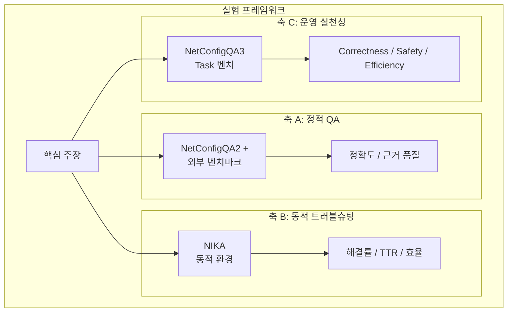
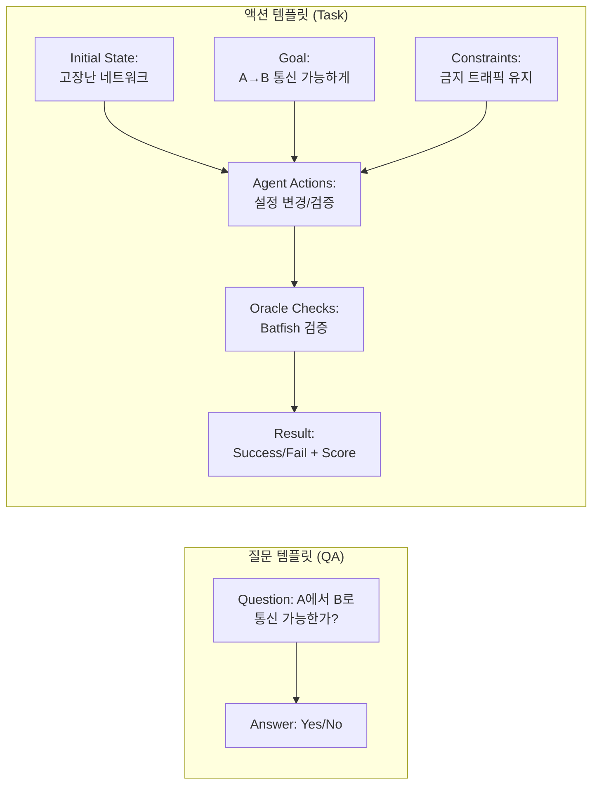
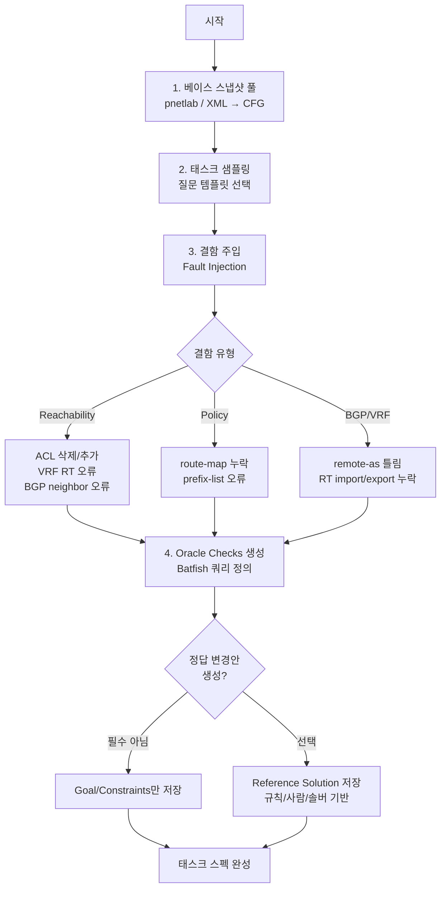
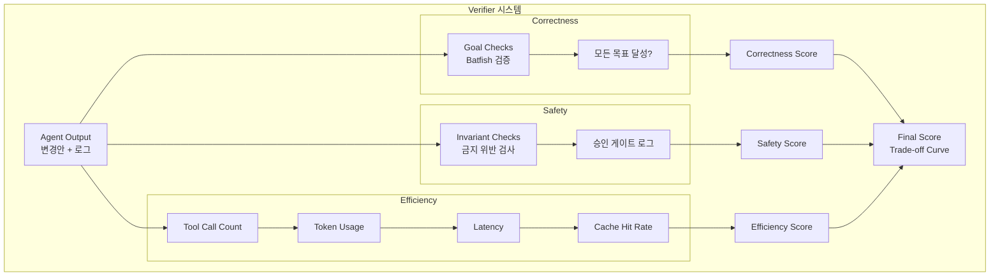
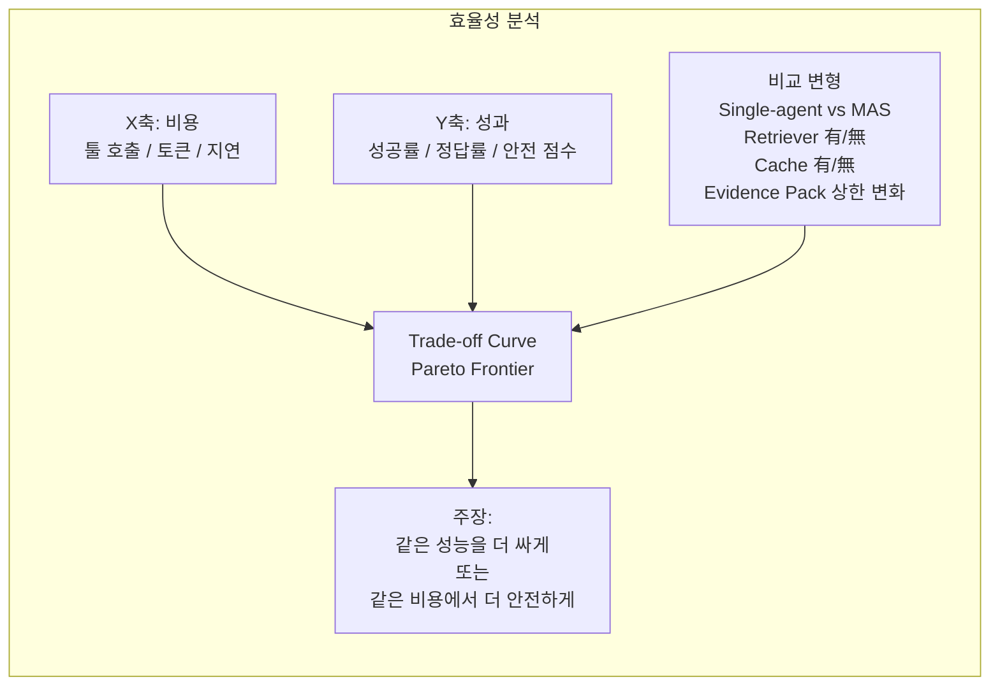
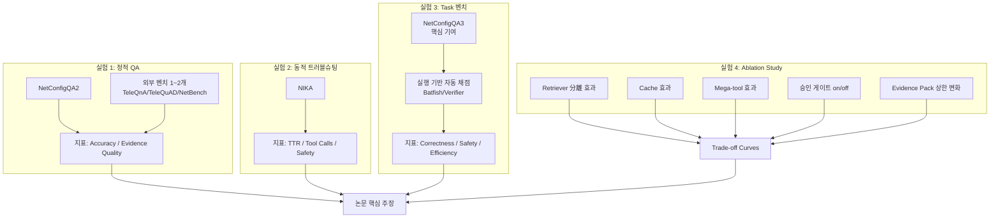
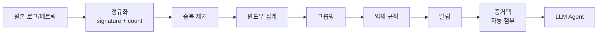

# NetConfigQA3: 실험 설계

## 개요

SIGCOMM 제출을 목표로 한 NetConfigQA3의 실험 설계를 정리합니다. 핵심은 "많이 했다"가 아니라 **"핵심 주장 하나를 아주 단단하게 증명"**하는 것입니다[[1]](#ref-1).

SIGCOMM은 네트워크의 전체 라이프사이클 (운영/트러블슈팅/검증)을 폭넓게 수용하지만, 심사자들이 원하는 것은 명확한 문제정의, 재현 가능한 평가, 설득력 있는 비교와 절단연구(ablation)입니다.

---

## 실험 구조: 3축 평가 프레임워크

NetConfigQA3의 실험은 세 가지 축으로 구성됩니다.



### 축 A: 정적 QA (텍스트 기반 질문응답)

축 A는 두 가지 실험으로 구성됩니다.

#### 실험 A-1: NetConfigQA2 (컨텍스트 전략 검증)

**목표**: 컨텍스트 전략 (지도 + Evidence Pack) + Retriever + 도구 기반 근거가 성능과 안정성을 향상시킴을 증명

**데이터셋 특성**

- NetConfigQA2는 실제 네트워크 환경 (pnetlab)의 Facts DB와 Batfish 분석을 활용
- Retriever가 Facts DB를 질의하여 필요한 정보만 선택적으로 가져옴
- Evidence Pack 구성으로 컨텍스트 효율 달성

**평가 지표**

- Accuracy (EM / F1 / Type-Aware)
- Evidence quality (근거의 정확성/완전성)
- Context efficiency (토큰 대비 정확도)
- **Ablation**: Facts DB 없음 vs 있음, Retriever 없음 vs 있음, Evidence Pack 상한 변화

#### 실험 A-2: 외부 벤치마크 (MAS 순수 성능)

**목표**: Facts DB나 도구 없이 MAS의 순수 추론 성능을 외부 벤치마크로 검증

**중요**: 외부 벤치마크들은 단순 QA 형식이므로 **컨텍스트 전략을 사용할 수 없습니다**. 이 실험은 MAS의 기본 추론 능력만을 측정합니다.

**벤치마크 선택 (2~3개)**

| 벤치마크                    | 규모 | 형식             | 특징                                                              |
| --------------------------- | ---- | ---------------- | ----------------------------------------------------------------- |
| **NetBench**[[16]](#ref-16) | 5.4k | Context + QA     | 20개 telecom 카테고리<br/>전문가 수준 네트워크 지식               |
| **TeleQnA**[[17]](#ref-17)  | 10k  | Multiple-choice  | Telecom 지식 평가<br/>5개 카테고리 (Lexicon, Research, Standards) |
| **TeleQuAD**[[18]](#ref-18) | 4.5k | Context-based QA | 3GPP 표준 기반<br/>문서 이해 능력 측정                            |

**추천 조합**: NetBench + TeleQnA (도메인 지식) 또는 NetBench + TeleQuAD (문서 이해)

**평가 지표**

- Accuracy (데이터셋별 공식 메트릭)
- **비교 대상**: Single-agent vs Multi-agent System (MAS)
- **목적**: 컨텍스트 전략 없이도 MAS가 효과적인 추론 구조를 제공하는지 검증

**실험 A-1 vs A-2 차이**

| 항목               | A-1: NetConfigQA2  | A-2: 외부 벤치마크  |
| ------------------ | ------------------ | ------------------- |
| Facts DB 사용      | O (핵심)           | X (없음)            |
| Retriever 사용     | O (핵심)           | X (없음)            |
| Evidence Pack      | O (핵심)           | X (없음)            |
| 도구 (Batfish/NSO) | O (활용 가능)      | X (없음)            |
| 평가 대상          | 컨텍스트 전략 효과 | MAS 순수 추론 성능  |
| Ablation Study     | O (중요)           | △ (Single vs MAS만) |

### 축 B: 동적 트러블슈팅 (상호작용 환경)

**목표**: 운영자처럼 효율적으로 문제를 해결함을 증명

**벤치마크**

- NIKA[[3]](#ref-3): 동적 환경에서 LLM 에이전트 트러블슈팅 평가 아레나

**평가 지표**

- 진단 성공률 (incident 해결 / 정상 상태 복귀)
- 평균 해결 시간 (TTR: Time-to-Repair)
- 커맨드/툴 호출 수 ("얼마나 덜 헤매는가")
- 위험 행동률 (승인 게이트에 걸린 시도 수)
- 관측 데이터 사용 효율 (Evidence Pack 토큰 대비 성공률)

NIKA는 실제 incident를 재현하도록 환경을 오케스트레이션하고 (장애 주입, 트래픽), AAL로 접근하는 구조입니다[[3]](#ref-3).

### 축 C: 운영 실천성 (Correctness/Safety/Efficiency)

**목표**: 실행 기반 검증 + 승인 게이트 + 롤백이 결합된 MAS가 correctness/safety/efficiency를 동시에 달성함을 증명

**벤치마크**

- NetConfigQA3 (핵심 기여): Task 중심 벤치마크
- NetConfEval[[4]](#ref-4) 또는 NetPress[[5]](#ref-5) (선택적 보완)

**평가 지표**

- Correctness: 목표 달성률
- Safety: 금지 인바리언트 위반률, 승인 게이트 차단률
- Efficiency: 툴 호출, 토큰, 지연, 캐시 히트율

NetPress는 correctness/safety/latency를 자동 평가하는 프레임워크를 강조합니다[[5]](#ref-5).

**벤치마크 선택 전략**

- 문제 범위 강조: NetConfEval + NIKA (2개)
- 운영/트러블슈팅 강조: NIKA + NetPress (2개)
- **너무 많은 벤치마크를 얕게 다루면 메시지가 흐려짐**

---

## NetConfigQA3: Task 중심 벤치마크 설계

### 질문 템플릿에서 액션 템플릿으로 전환

NetConfigQA2의 질문 템플릿 (텍스트 답변)을 **액션 템플릿** (행동 시퀀스 + 목표 달성)으로 전환합니다.

**핵심 개념**

각 태스크는 **상태(state) + 목표(goal) + 제약(constraints)**로 정의됩니다[[5]](#ref-5).



### 질문 유형 → 태스크 유형 매핑

| 질문 유형                  | 태스크 유형                                 | 우선순위               |
| -------------------------- | ------------------------------------------- | ---------------------- |
| Reachability ("A→B 되나?") | A→B가 되게 만들어라<br/>(또는 차단 유지)    | 1순위 (자동 채점 쉬움) |
| 정책 (ACL/route-map)       | 금지 트래픽 차단 + 필요 트래픽 허용         | 1순위                  |
| BGP/VRF (피어/RT)          | 피어 세션 정상화 /<br/>VRF 복구 / RT 정합성 | 2순위                  |
| 장애 영향                  | 링크 장애 시에도<br/>핵심 서비스 유지       | 2순위                  |
| 최소 변경 최적화           | Minimal change 솔루션                       | 3순위 (난이도 높음)    |

**1순위 태스크만으로도 SIGCOMM 본 실험은 충분합니다.**

### 액션 템플릿 표준 스펙

각 태스크를 JSON으로 정의합니다.

```json
{
  "task_id": "task_reachability_001",
  "initial_snapshot_id": "S0_broken",
  "target_goal": {
    "reachability": [
      { "src": "10.1.1.1", "dst": "10.2.2.2", "expected": true }
    ],
    "forbidden_flows": [
      { "src": "internet", "dst": "mgmt_net", "expected": false }
    ]
  },
  "hard_constraints": [
    "기존 금지 트래픽 유지",
    "VRF 격리 유지",
    "any-any permit 금지"
  ],
  "allowed_actions": [
    "facts.query",
    "batfish.query",
    "nso.get",
    "nso.txn(dryrun)",
    "nso.txn(commit)"
  ],
  "forbidden_actions": [
    "any-any permit",
    "default route 무단 추가",
    "전체 BGP clear"
  ],
  "oracle_checks": [
    {
      "type": "batfish_reachability",
      "params": { "src": "10.1.1.1", "dst": "10.2.2.2" },
      "expected": true
    }
  ],
  "budget": {
    "max_tool_calls": 20,
    "max_time_seconds": 300,
    "max_tokens": 10000
  }
}
```

---

## 자동 데이터셋 생성 파이프라인



### 결함 주입 (Fault Injection) 예시

Reachability 복구 태스크의 경우, 다음 중 하나를 랜덤하게 망가뜨립니다:

- ACL 한 줄 추가/삭제
- VRF RT import/export 한 쪽만 틀리게
- BGP neighbor remote-as 틀리게
- Static route 누락
- Interface shutdown

NIKA도 동일한 접근으로 실제 incident를 재현합니다[[3]](#ref-3).

### Oracle Checks 자동 생성

Batfish는 reachability뿐 아니라 blackhole/loop 같은 속성도 확인 가능합니다[[6]](#ref-6).

```python
oracle_checks = [
    {
        "type": "batfish_reachability",
        "src": "10.1.1.1",
        "dst": "10.2.2.2",
        "expected": True
    },
    {
        "type": "batfish_blackhole",
        "expected": False
    },
    {
        "type": "batfish_loop",
        "expected": False
    }
]
```

### 정답 변경안 (Reference Solution)

**정의**: 태스크를 정상 상태로 만들기 위한 모범 답안 (golden fix, ground-truth patch)[[7]](#ref-7)

**필요성**

- 결과만 맞으면 OK → 위험한 변경 (any-any permit)도 성공 판정
- 정답 변경안 有 → 최소 변경, 정책 준수, 효율 비교 가능

**생성 방법** (난이도 순)

| 방법      | 설명                       | 장점             | 단점           |
| --------- | -------------------------- | ---------------- | -------------- |
| 규칙 기반 | 태스크 유형별 패턴 정의    | 자동 생성 쉬움   | 커버리지 제한  |
| 사람 검증 | 대표 케이스에 골든 답 저장 | 품질 높음        | 비용 발생      |
| 솔버 기반 | Batfish/NSO 루프로 탐색    | 최적화 연구 강함 | 구현 난도 높음 |

**권장 로드맵**

- 초기 (빠른 논문화): Goal/Constraints + 결정적 Verifier
- 확장 (후속 연구): 대표 태스크에 정답 변경안 추가

NeMoEval도 Golden Answer Selector 컴포넌트로 검증된 골든 답을 저장하여 평가에 사용합니다[[7]](#ref-7).

---

## 채점 시스템 설계

### 핵심 원칙

**LLM-as-a-judge는 사용하지 않습니다.** 대신 **결정적 Verifier (deterministic program)**를 사용합니다.

이유: 재현성과 공정성. LLM 채점은 "불안정하고 재현성 떨어진다"는 비판에 취약합니다.

### 3축 채점 프레임워크

NetPress 스타일의 3축 평가를 적용합니다[[5]](#ref-5).



### Correctness 점수

**태스크마다 goal을 체크리스트로 분해**

```json
{
  "goal_checks": [
    { "check": "Reachability(A→B)", "expected": true },
    { "check": "Traceroute path length ≤ 5", "expected": true },
    { "check": "No blackhole", "expected": true },
    { "check": "No loop", "expected": true }
  ]
}
```

**정답 판정**

- 모든 goal_checks 통과 → success = 1.0
- 일부만 통과 → partial credit (예: 0.5)

Batfish는 네트워크 스냅샷 기반으로 속성을 검증합니다[[6]](#ref-6).

### Safety 점수

**금지 인바리언트로 정의**

```json
{
  "safety_invariants": [
    "기존 금지 트래픽(internet→mgmt) 차단 유지",
    "특정 VRF는 다른 VRF와 격리 유지",
    "default route 무단 추가 금지",
    "any-any permit 금지",
    "BGP 전체 리셋/clear 금지"
  ]
}
```

**점수 계산**

```
Safety Score = 1 − (violations_weighted_sum)
```

또는 치명적 위반 시 즉시 fail 처리

Rela (SIGCOMM'24)는 정밀한 스펙으로 수동 감사를 제거하는 방향을 제시합니다[[8]](#ref-8).

### Efficiency 점수

**기록할 원시 로그**

- `tool_calls_total`, `tool_calls_by_tool`
- `tokens_in`, `tokens_out` (모델별)
- `wall_clock_time`
- `cache_hit_rate` (Batfish/NSO 쿼리 캐시)

**점수 계산**

```
Efficiency = exp(−α · tool_calls − β · time − γ · tokens)
```

또는 "budget 내 성공률" (예: calls ≤ N일 때 success rate)

### 사람 평가 (보조 실험)

SIGCOMM 스케일에서 사람 평가는 보조적입니다.

**사용 사례**

- UI/설명 품질/신뢰감 같은 주관적 요소
- 소규모 (20~50개 케이스)

**핵심 성능/정답은 자동 채점이 중심**

NeMoEval도 기능적 정답 (Functional Correctness)을 중요 축으로 둡니다[[7]](#ref-7).

---

## 효율성 지표: Trade-off Curve

단순 나열이 아닌 **Trade-off curve**로 시각화합니다.



**비교 대상**

- Single-agent vs Multi-Agent System (MAS)
- Retriever 없음 vs 있음
- Cache 없음 vs 있음
- Evidence Pack 상한 변화 (제한 없음 / 중간 / 엄격)

**핵심 메시지
**

- "성능이 더 좋다" (X)
- "같은 성능을 더 싸게" (O)
- "같은 비용에서 더 안전하게" (O)

---

## SIGCOMM 제출용 최종 실험 구성



**구성 이유**

이 구성이 "벤치마크 여러 개 점수"보다 강한 이유:

- 핵심 메시지 (컨텍스트 폭발 해결 + 툴 기반 운영 + 안전/효율)를 일관되게 증명
- SIGCOMM이 명시한 라이프사이클 주제와 정확히 부합[[1]](#ref-1)

---

## 추가 설계 요소 (연구 완성도)

### 1. 안전/권한 모델 설계

**승인 매트릭스 (Approval Matrix)**

| 작업 유형            | 위험도   | 승인 필요 | 조건         |
| -------------------- | -------- | --------- | ------------ |
| NSO commit           | High     | 필수      | 항상         |
| NSO rollback         | High     | 필수      | 항상         |
| NSO sync-to/push     | High     | 필수      | 항상         |
| 대량 변경 (N대 이상) | High     | 필수      | N ≥ 5        |
| any-any permit       | Critical | 거부      | 절대 불허    |
| default route 추가   | Critical | 거부      | 절대 불허    |
| 전체 BGP reset       | Critical | 거부      | 절대 불허    |
| Batfish 쿼리         | Low      | 자동      | Rate-limit만 |
| Facts 읽기           | Low      | 자동      | Rate-limit만 |

ITIL Change Control는 위험도와 영향 범위에 따른 승인 권한을 강조합니다[[9]](#ref-9).

### 2. Rollback 실험 지표

**측정 항목**

- Rollback 성공률
- 평균 복구 시간
- Rollback 파일 생성/적용 정확도

NSO는 commit 시 rollback 파일을 생성하고, 여러 장비 병렬 적용 시 일부 실패 시 자동 rollback을 수행합니다[[10]](#ref-10).

### 3. 동적 데이터 파이프라인 MVP

**최소 기능**: 알림 이상 감지 → 증거팩 자동 구성



Prometheus Alertmanager 원칙 (dedup/group/inhibit/silence/routing) 적용[[11]](#ref-11).

### 4. Runbook 상태 머신

**10단계 체크포인트**

각 단계마다 입력/출력 (증거팩, 가설, 변경안, 검증 결과, 승인 상태)이 고정되어야 합니다[[12]](#ref-12).

체크포인트 지점:

- Phase 1 완료: 범위 조정
- Phase 2 완료: 추가 분석 요청
- Phase 3 Dry-run: 변경 내용 미리보기 (가장 중요)
- Phase 4 승인 게이트: 최종 결정

### 5. 핵심 주장 압축

**주장 A**: Task 벤치 (NetConfigQA3)에서, 실행 기반 검증(Verifier) + 승인 게이트 + 롤백이 결합된 MAS가 correctness/safety/efficiency를 동시에 달성

**주장 B**: 동적 관측 (이벤트/집계)을 Evidence Pack으로 통제하면, 같은 성공률을 더 적은 툴 호출/토큰/시간으로 달성

**Ablation Study**: 사서 분리 / 캐시 / 온디맨드 설명 / 승인 게이트 on-off로 "왜 이 구조가 필요한지" 증명

### 6. 재현성 아티팩트

**패키징 구성**

1. 스냅샷/태스크 스펙 (입력)
2. 검증기 (채점 코드)
3. 실행 로그 스키마 (툴 호출/토큰/지연)
4. 결과 재현 스크립트 (원클릭)

SIGCOMM 커뮤니티는 재현성을 매우 중요하게 봅니다[[12]](#ref-12).

---

## 핵심 요약

NetConfigQA3의 실험 설계는 다음과 같이 구성됩니다:

**3축 프레임워크**

- 축 A: 정적 QA (NetConfigQA2 + 외부 1~2개)
- 축 B: 동적 트러블슈팅 (NIKA)
- 축 C: 운영 실천성 (NetConfigQA3 Task 벤치)

**Task 벤치마크 핵심**

- 질문 템플릿 → 액션 템플릿 전환
- State + Goal + Constraints 구조
- 결함 주입으로 자동 생성
- Batfish Verifier로 결정적 채점

**채점 3축**

- Correctness: Goal checks로 목표 달성 판정
- Safety: Invariant checks로 금지 위반 감지
- Efficiency: Trade-off curve로 비용-성과 관계 시각화

**완성도 요소**

- 승인 매트릭스, Rollback 지표, 동적 파이프라인 MVP
- Runbook 상태 머신, 핵심 주장 압축, 재현성 아티팩트

이 구조는 SIGCOMM이 요구하는 명확한 문제정의, 재현 가능한 평가, 설득력 있는 비교를 모두 충족합니다.

---

## References

<a id="ref-1"></a>[1] [SIGCOMM '26 Call For Papers](https://conferences.sigcomm.org/sigcomm/2026/cfp/)

<a id="ref-2"></a>[2] TeleQnA Dataset (참고 문헌 추가 필요)

<a id="ref-3"></a>[3] [A Network Arena for Benchmarking AI Agents (NIKA)](https://arxiv.org/abs/2512.16381)

<a id="ref-4"></a>[4] [NetConfEval: Can LLMs Facilitate Network Configuration?](https://dl.acm.org/doi/10.1145/3656296)

<a id="ref-5"></a>[5] [NetPress: Dynamically Generated LLM Benchmarks for Network Applications](https://huggingface.co/papers/2506.03231)

<a id="ref-6"></a>[6] [A General Approach to Network Configuration Analysis (Batfish)](https://www.usenix.org/system/files/conference/nsdi15/nsdi15-paper-fogel.pdf)

<a id="ref-7"></a>[7] [Enhancing Network Management Using Code Generated by LLMs (NeMoEval)](https://conferences.sigcomm.org/hotnets/2023/papers/hotnets23_mani_zhou.pdf)

<a id="ref-8"></a>[8] [Relational Network Verification (Rela, SIGCOMM'24)](https://www.cs.princeton.edu/~dpw/papers/rela-sigcomm24.pdf)

<a id="ref-9"></a>[9] [ITIL Change Management Best Practices for 2026](https://monday.com/blog/service/itil-change-management-best-practices/)

<a id="ref-10"></a>[10] [Rollbacks - Network Services Orchestrator (NSO) v6.3](https://developer.cisco.com/docs/nso/guides/rollbacks/)

<a id="ref-11"></a>[11] [Prometheus Alertmanager](https://prometheus.io/docs/alerting/latest/alertmanager/)

<a id="ref-12"></a>[12] [Thoughts and recommendations from the ACM SIGCOMM 2017 reproducibility workshop](https://www.researchgate.net/publication/324846825_Thoughts_and_recommendations_from_the_ACM_SIGCOMM_2017_reproducibility_workshop)

<a id="ref-13"></a>[13] [Automated patch assessment for program repair at scale](https://link.springer.com/article/10.1007/s10664-020-09920-w)

<a id="ref-14"></a>[14] [Froot-NetSys/NetPress (GitHub)](https://github.com/Froot-NetSys/NetPress)

<a id="ref-15"></a>[15] [Submission Instructions - ACM SIGCOMM 2025](https://conferences.sigcomm.org/sigcomm/2025/submission/)

<a id="ref-16"></a>[16] [NetBench Dataset](https://netoai.ai/) - NetBench: Expert-level QA dataset covering 20 telecommunications categories. Curated with NetoAI DigiTwin platform, 5,390 instances

<a id="ref-17"></a>[17] [TeleQnA: A Benchmark Dataset to Assess Large Language Models Telecommunications Knowledge](https://arxiv.org/abs/2310.15051) - 10,000 multiple-choice questions across 5 telecom categories (Lexicon, Research Overview, Research Publications, Standards Overview, Standards Specifications)

<a id="ref-18"></a>[18] TeleQuAD: Telecom Question Answering Dataset - 4,485 questions based on 3GPP Specifications and telecom documentation, context-based QA format
