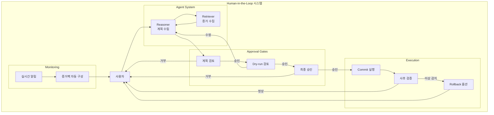
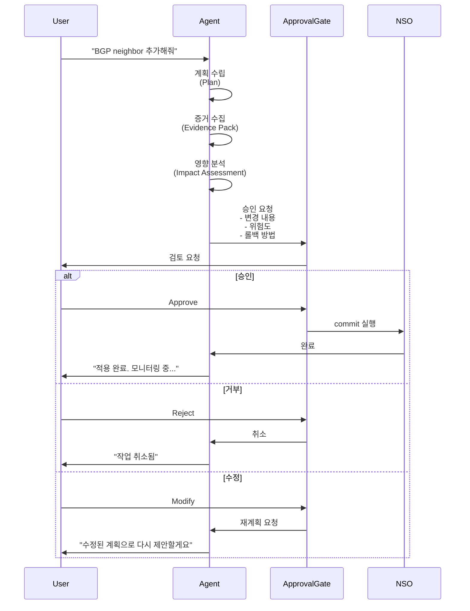
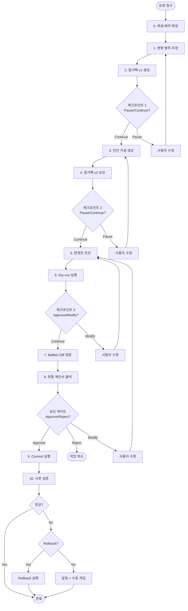
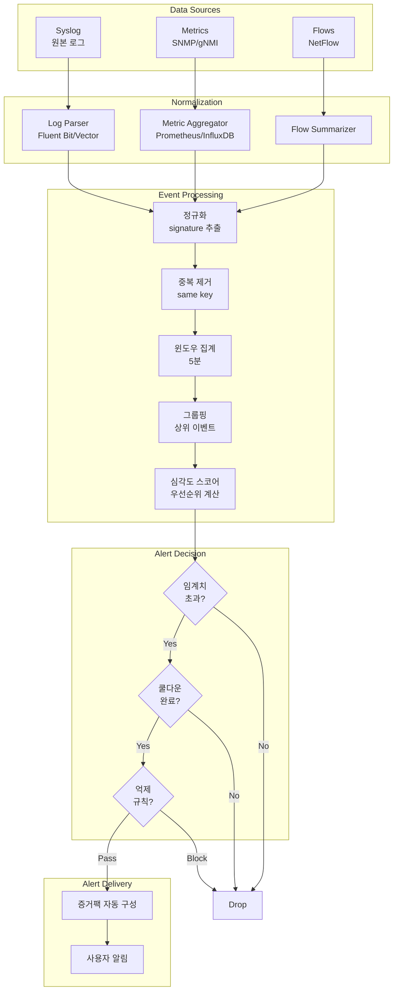
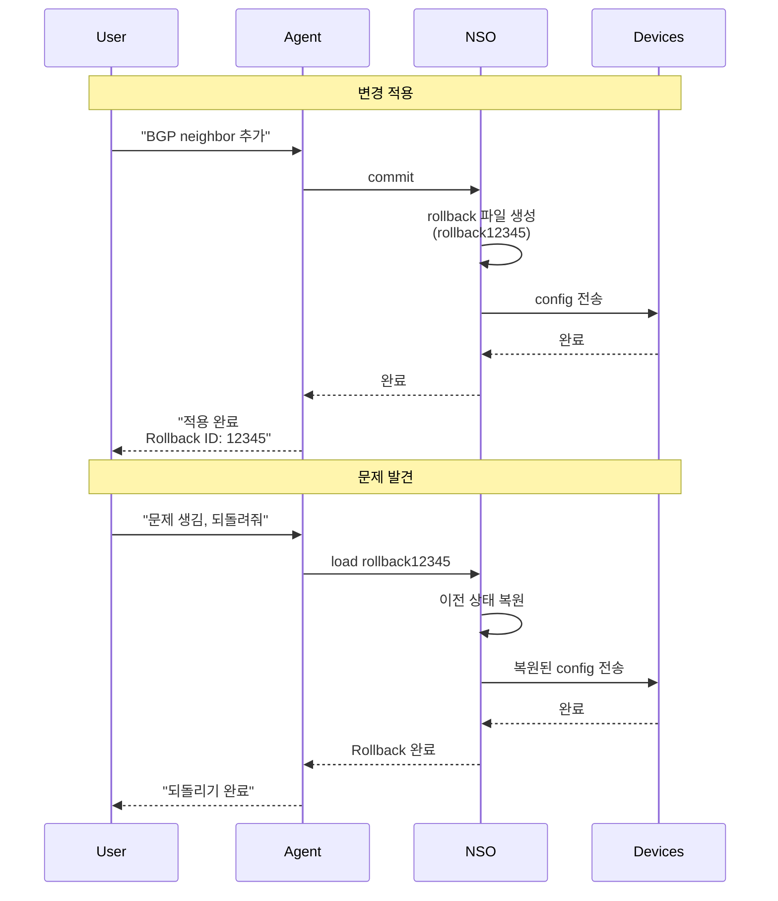
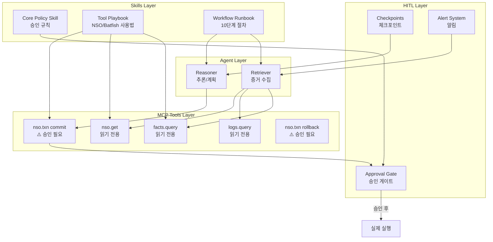

# NetConfigQA3: Human-in-the-Loop 검증 시스템

## 개요

NetConfigQA3는 네트워크 변경 작업에서 **사람의 승인과 개입**을 핵심 안전장치로 설계합니다. 이는 연구용 데모를 넘어 **운영 가능한 시스템**으로의 전환을 의미합니다.

Human-in-the-Loop(HITL)는 LLM이 틀릴 가능성을 전제로 안전하게 운영하며, ITIL 변화관리 프레임워크와 ChatOps 패턴을 따릅니다.



---

## 핵심 구성 요소

### 1. 승인 게이트: 파괴적 행동 차단

**목적**: 네트워크 상태를 변경하는 모든 작업은 사람의 명시적 승인 없이 실행되지 않습니다.

**작동 방식**



**승인 필요 작업 (High-Risk)**

**NSO 작업**

- Commit (running config 변경)
- Rollback 적용 (되돌리기도 변경)
- Sync-to / Push (장비로 강제 적용)
- 대량 변경 (다수 장비/서비스 동시)

**Batfish 작업**

- 대부분 분석/계산이므로 승인 불필요
- 대신 쿼리 예산과 캐시 강제로 제한

**Telemetry 작업**

- 대부분 읽기이므로 승인 불필요
- PCAP 다운로드, 민감 로그 조회는 추가 확인 필요

**승인 요청 포맷**

```json
{
  "plan": {
    "goal": "pe1에 BGP neighbor 10.0.1.2 추가",
    "changes": [
      {
        "device": "pe1",
        "type": "bgp_neighbor_add",
        "details": "neighbor 10.0.1.2 remote-as 65001"
      }
    ]
  },
  "evidence": {
    "current_state": "pe1 BGP neighbors: [10.0.1.1, 10.0.1.3]",
    "expected_state": "pe1 BGP neighbors: [10.0.1.1, 10.0.1.2, 10.0.1.3]"
  },
  "impact": {
    "risk_level": "Medium",
    "affected_devices": ["pe1"],
    "affected_services": ["VRF_AI"],
    "reachability_change": "No impact (verified by Batfish)"
  },
  "rollback": {
    "method": "NSO rollback file #12345",
    "estimated_time": "< 30 seconds"
  }
}
```

---

### 2. 단계별 Runbook: 중간 개입 지원

**목적**: 작업을 체크포인트 단위로 쪼개 Pause/Modify/Abort를 안전하게 지원합니다.

**10단계 표준 Runbook**



**각 단계 설명**

**Phase 0: 시작**

- 요청 접수 & 목표/제약 확정
- "무엇을 달성, 무엇을 절대 건드리면 안 됨" 명문화

**Phase 1: 정보 수집**

- 영향 범위 추정 (장비/서비스/VRF)
- 증거팩 v1 생성 (정적 Facts + 최근 이벤트)
- 체크포인트: 사용자가 범위 수정 가능

**Phase 2: 분석**

- 진단 가설 생성 (원인 후보 top-k)
- 증거팩 v2 보강 (추가 질의 제한적)
- 체크포인트: 사용자가 "이 장비도 봐" 같은 개입

**Phase 3: 계획**

- 변경안 초안 생성 (아직 적용 안 함)
- Dry-run 실행 (장비 반영 없이 확인)
- 체크포인트: Dry-run 결과 검토

**Phase 4: 검증 & 승인**

- Batfish diff 검증 (base vs candidate)
- 최종 제안서 + 승인 게이트
- 승인/거부/수정 선택

**Phase 5: 실행 & 사후관리**

- Commit 실행 (승인 후)
- 사후 검증 (텔레메트리 재확인)
- 이상 시 즉시 Rollback 옵션

**중간 개입 지점**

가장 효과적인 체크포인트:

- Phase 1 완료 후: 범위 조정
- Phase 2 완료 후: 추가 분석 요청
- Phase 3 Dry-run 후: 변경 내용 미리보기 (가장 중요)
- Phase 4 승인 게이트: 최종 결정

---

### 3. 실시간 알림: 이상 감지 & 노이즈 제거

**목적**: 동적 데이터 파이프라인으로 네트워크 이상을 감지하되, "알림 폭탄"을 방지합니다.

**알림 시스템 아키텍처**



**알림 폭탄 방지 규칙**

**1. 이벤트 정규화**

원본 로그를 signature 중심으로 묶습니다.

```json
{
  "ts": "2026-01-06T17:00:00Z",
  "device": "pe1",
  "component": "BGP",
  "severity": "critical",
  "signature": "BGP_SESSION_DOWN",
  "count": 1,
  "sample_message": "BGP peer 10.0.1.2 state changed to Idle",
  "tags": ["vrf_ai", "peer_failure"]
}
```

**Signature 예시**:

- `BGP_SESSION_DOWN`
- `OSPF_ADJ_DOWN`
- `IFACE_FLAP`
- `ACL_DENY_SPIKE`
- `CPU_SPIKE`

**2. 중복 제거 (Deduplication)**

Dedup key: `(signature, device, component, vrf, neighbor)`

같은 키는 5분 동안 하나로 합쳐 count만 증가합니다.

**3. 윈도우 집계**

1~5분 윈도우로만 모델에 제공:

- avg / p95 / max / delta 요약만 제공
- "지속 조건": N개 윈도우 연속일 때만 알림 (플래핑 방지)

**4. 억제와 그룹핑**

예: 코어 링크 다운 시 그 아래 장비들의 "세션 다운" 알림 억제
→ 코어 장애 알림 하나만 전송

**5. 심각도 스코어**

```
Score = w_s × Severity + w_i × Impact + w_n × Novelty - w_r × Redundancy

- Severity: critical=3, major=2, minor=1
- Impact: 영향 장비 수, VRF 수, reachability 실패 비율
- Novelty: 24h 내 동일 signature 빈도 낮을수록 가산
- Redundancy: 상위 원인 이벤트 활성화 시 감점
```

알림은 Score > 임계치일 때만, 쿨다운으로 같은 키 재알림 제한

**6. 증거팩 자동 첨부**

알림 시 원본 로그가 아닌 LNM 판단용 증거팩 제공:

- 관련 이벤트 top-3
- 관련 메트릭 변화 top-3
- 관련 장비/VRF
- Batfish로 정적 취약점 연결 (필요 시)

**측정 지표**

연구 논문에 포함할 운영 지표:

- 알림 정밀도 (Precision) / 재현율 (Recall)
- 평균 탐지 지연 (Time-to-Detect)
- 평균 복구 지연 (Time-to-Mitigate)
- 사람 거부율/수정율 (승인 게이트 통계)

---

### 4. Rollback: 안전한 되돌리기

**목적**: 적용된 변경을 안전하게 되돌립니다.

**NSO Rollback 메커니즘**

NSO는 모든 commit 시 rollback 파일을 자동 생성합니다.



**Rollback 워크플로우**

**변경 제안 단계**

```json
{
  "plan": { ... },
  "rollback": {
    "method": "NSO rollback file",
    "estimated_id": "auto-generated",
    "estimated_time": "< 30초"
  }
}
```

**Commit 후**

```json
{
  "result": "success",
  "rollback_id": "12345",
  "message": "변경 완료. 문제 시 'rollback 12345'로 되돌릴 수 있습니다."
}
```

**Rollback 실행**

```json
{
  "command": "rollback",
  "rollback_id": "12345",
  "reason": "BGP session 불안정",
  "verification": {
    "before_rollback": "sessions: 2/3 up",
    "after_rollback": "sessions: 3/3 up"
  }
}
```

**NSO vs Git 역할 구분**

**Git**: 설계/코드 버전 관리

- 의도한 변경안
- 서비스 모델/템플릿
- 스냅샷 아티팩트
- 감사/재현성

**NSO Rollback**: 운영 상태 복구

- 실제 네트워크 상태 되돌리기
- 트랜잭션 단위 rollback
- 즉시 적용 가능
- 운영 안전성

**장점**

- Git은 설계와 감사에 강함
- NSO는 실시간 복구에 강함
- 둘을 함께 사용하면 "연구 재현성 + 운영 안전성" 동시 달성

---

## UI/UX 설계 원칙

**연구 시스템에서 중요한 것**: "예쁘다"보다 "사람이 위험을 빨리 이해한다"

**우선순위 4가지**

**1. 현재 단계 표시**

```
[Planning] → [Dry-run] → [Verification] → [Approval] → [Execution]
         ^현재 위치
```

**2. 변경 Diff**

```diff
- BGP neighbors: [10.0.1.1, 10.0.1.3]
+ BGP neighbors: [10.0.1.1, 10.0.1.2, 10.0.1.3]
```

**3. 위험 레벨과 근거**

```
Risk: Medium
- 영향 장비: 1대 (pe1)
- 영향 서비스: VRF_AI
- Reachability: 변화 없음 (Batfish 검증)
```

**4. 행동 버튼**

```
[✓ Approve]  [✗ Reject]  [⟲ Modify]  [? Alternative]
```

**채팅 인터페이스 요구사항**

- 각 Runbook 단계가 채팅 메시지로 표시
- 체크포인트마다 사용자 입력 대기
- 승인 게이트는 구조화된 카드 형태
- Rollback ID와 방법은 항상 함께 표시
- 알림은 증거팩과 함께 컨텍스트 제공

---

## 시스템 통합

**HITL이 NetConfigQA3 설계와 결합되는 방식**



**핵심 원칙**

- **Skills**: 운영 규칙과 워크플로우로 에이전트 훈육
- **MCP Tools**: 질의/실행 인터페이스 제공
- **HITL**: 파괴적 행동에 승인 게이트 설치

**도구 분류**

읽기 전용 (자동 실행):

- `facts.query()`
- `logs.query()`
- `metrics.query()`
- `batfish.query()`
- `nso.get()`

변경 작업 (승인 필요):

- `nso.txn(commit)`
- `nso.txn(rollback)`
- `nso.txn(sync-to)`

---

## 핵심 요약

NetConfigQA3의 Human-in-the-Loop 시스템은 4가지 핵심 구성 요소로 이루어집니다:

**1. 승인 게이트**
파괴적 행동 (NSO commit/rollback)은 사람의 명시적 승인 없이 실행되지 않습니다. 계획-증거-영향-롤백 방법을 함께 제시합니다.

**2. 단계별 Runbook**
10단계 워크플로우로 작업을 쪼개 체크포인트마다 Pause/Modify/Abort를 지원합니다. Dry-run 후 검토가 가장 중요한 지점입니다.

**3. 실시간 알림**
이벤트 정규화-중복제거-윈도우집계-그룹핑-스코어링으로 "알림 폭탄"을 방지합니다. 알림 시 증거팩을 자동 첨부합니다.

**4. Rollback**
NSO는 모든 commit 시 rollback 파일을 생성합니다[[1]](#ref-1). Git(설계 버전관리)과 NSO Rollback(운영 복구)을 함께 사용해 안전성과 재현성을 동시에 확보합니다.

이 시스템은 연구용 데모가 아닌 **실제 운영 가능한 네트워크 자동화 플랫폼**을 목표로 합니다.

---

## References

<a id="ref-1"></a>[1] [Rollbacks - Network Services Orchestrator (NSO) v6.3](https://developer.cisco.com/docs/nso/guides/rollbacks/)

<a id="ref-2"></a>[2] [IT Change Management: ITIL Framework & Best Practices](https://www.atlassian.com/itsm/change-management)

<a id="ref-3"></a>[3] [Human-in-the-Loop with AG-UI](https://learn.microsoft.com/en-us/agent-framework/integrations/ag-ui/human-in-the-loop)

<a id="ref-4"></a>[4] [The Guide to Secure ChatOps](https://mattermost.com/resources/the-guide-to-secure-chatops/)

<a id="ref-5"></a>[5] [Ultimate Guide to ChatOps](https://botpress.com/blog/chatops)

<a id="ref-6"></a>[6] [Model Context Protocol - Tools](https://modelcontextprotocol.io/specification/2025-06-18/server/tools)

<a id="ref-7"></a>[7] [Prometheus Alertmanager](https://prometheus.io/docs/alerting/latest/alertmanager/)

<a id="ref-8"></a>[8] [ITIL Change Management Best Practices for 2026](https://monday.com/blog/service/itil-change-management-best-practices/)
