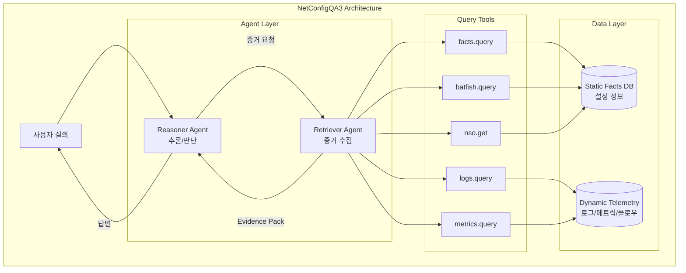
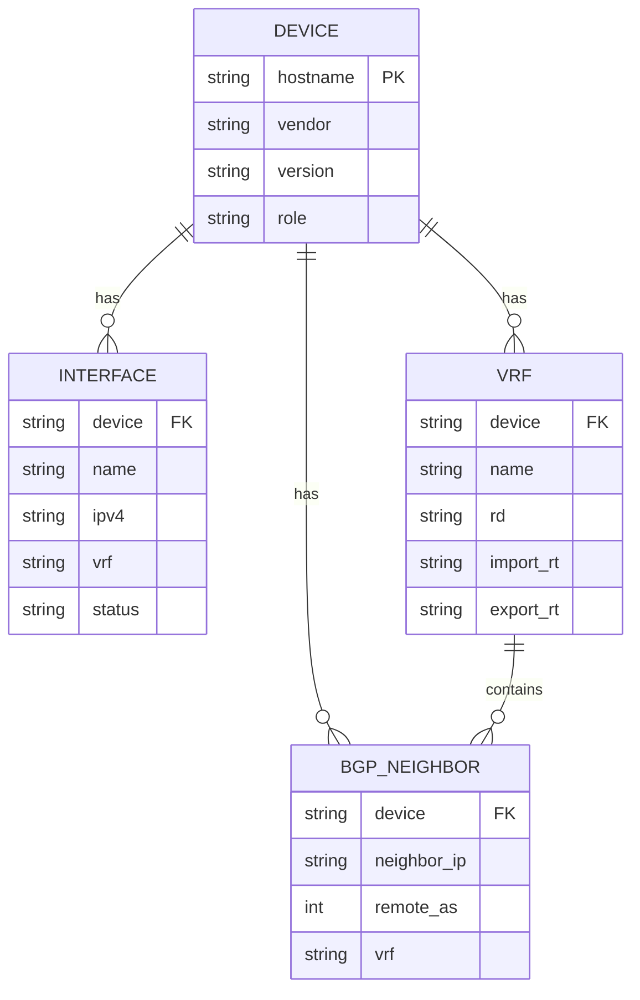
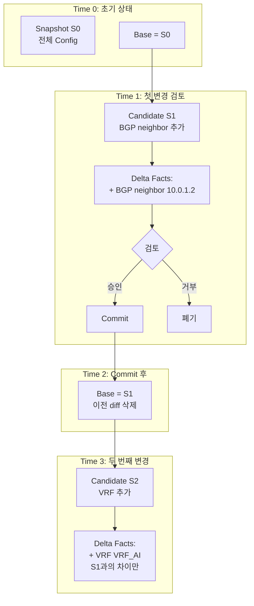
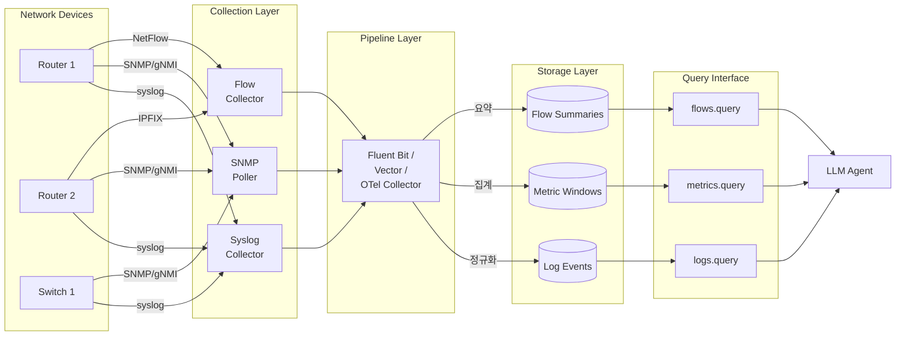
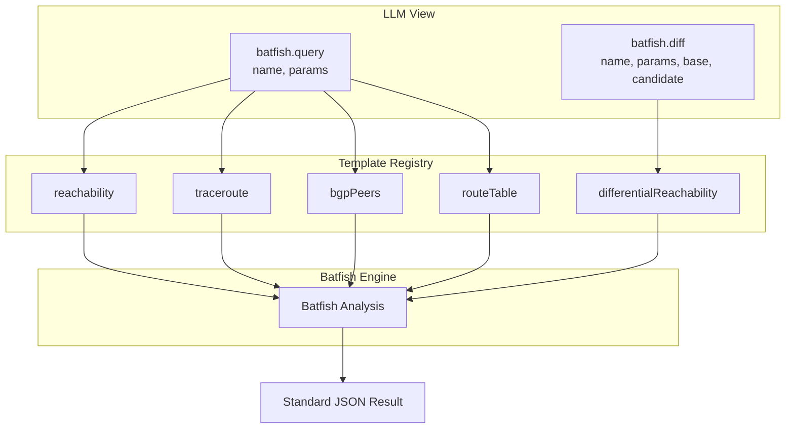
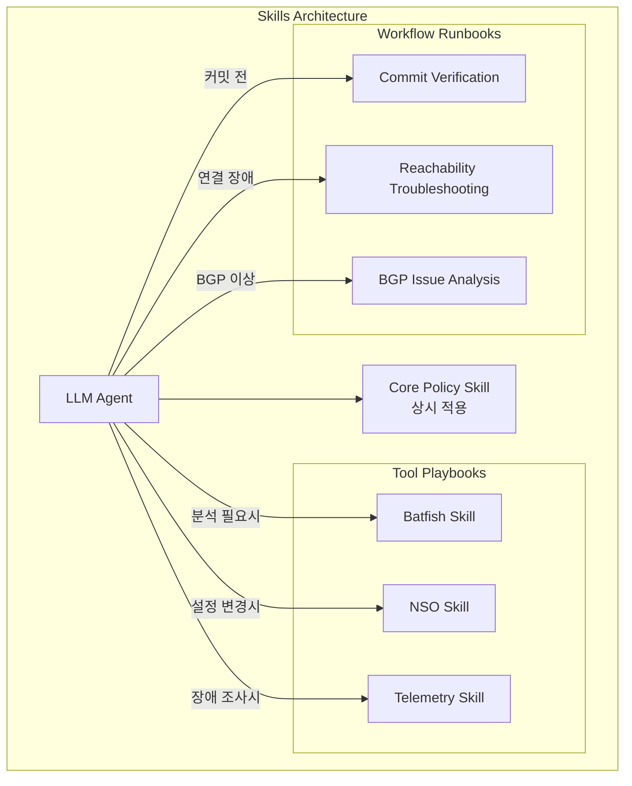
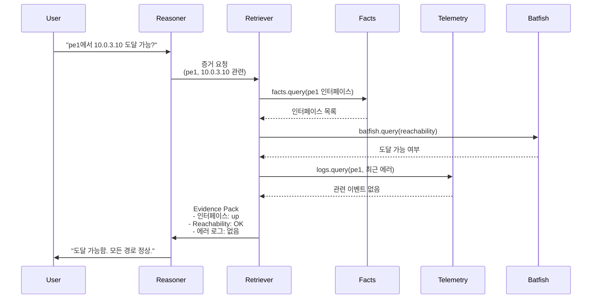

# NetConfigQA3: LLM Context 효율화 전략

## 개요

NetConfigQA2는 네트워크 설정 분석을 위한 LLM 기반 시스템입니다. 하지만 장비가 100대 규모로 늘어나면서 **컨텍스트 폭발** 문제에 직면했습니다. NetConfigQA3에서는 멀티에이전트 구조를 도입하고, **Facts를 프롬프트에서 질의 가능한 메모리로 전환**하여 이 문제를 해결합니다.

이 문서는 효율적인 컨텍스트 관리를 위한 핵심 전략을 다룹니다.



---

## 핵심 원칙

NetConfigQA3의 컨텍스트 관리는 세 가지 핵심 원칙을 따릅니다.

### 원칙 1: 지도 기반 탐색

LLM에게 전체 네트워크 상태를 한 번에 주지 않습니다. 대신 **계층적 정보 제공**을 통해 필요한 것만 질의하게 만듭니다.

**Level 1 - 네트워크 지도** (수십 줄)

- 장비 수와 역할 (PE/P/Leaf/Spine 등)
- VRF 목록과 AS 번호
- 중요 서비스 목록 (L2VPN, 특정 VRF 용도 등)
- 사용 가능한 질의 도구 카탈로그

**Level 2 - Evidence Pack** (수백~천 토큰)

- 질문에 직접 관련된 정보만 포함
- 예: "pe1의 VRF_AI RT가 뭐야?" → pe1의 VRF_AI 정보만 추출

LLM은 평소 "지도"만 들고 있다가, 질문이 오면 Level 2 정보를 선택적으로 가져옵니다.

### 원칙 2: 데이터 저장소 분리

정적 설정과 동적 관측 데이터는 성격이 다릅니다. 따라서 저장소를 분리합니다.

**Static Facts Database**

- CFG에서 추출한 구조적 사실
- VRF, BGP neighbor, ACL, 인터페이스 주소 등
- 스냅샷 기반, 변경 시점이 명확함

**Dynamic Telemetry Store**

- 시간축 데이터 (로그/메트릭/플로우/이벤트)
- 계속 변하는 활성 데이터
- 시간 조건이 필수

저장소는 분리하되, **Evidence Pack으로 합쳐서** LLM에 제공합니다. 즉 "저장소는 분리, 컨텍스트 출력 포맷은 통일"입니다.

### 원칙 3: 도구 표면적 최소화

도구가 많을수록 컨텍스트가 커지고 선택 오류가 늘어납니다. 내부적으로 함수가 많아도, **LLM에게 노출하는 도구는 5~8개로 제한**합니다.

```
facts.query(query, filters, fields, limit)
nso.get(device, path, source)
nso.txn(action, payload)
batfish.query(name, params)
batfish.diff(name, params, base, candidate)
logs.query / metrics.query / flows.query
```

---

## Static Facts: 설정 정보 관리

### 현재 문제점

NetConfigQA2는 모든 장비 정보를 JSON 파일에 나열합니다.

```json
{
  "devices": [
    {"hostname": "leaf1", "vendor": "cisco", ...},
    {"hostname": "leaf2", "vendor": "cisco", ...},
    ...
  ]
}
```

이 방식은 장비가 100대를 넘어가면:

- 컨텍스트를 과도하게 차지
- LLM이 모든 정보를 기억한다는 보장 없음
- Config 수정 시 전체 파일을 다시 로드하는 낭비 발생

### 해결 방법: 정규화된 DB + 질의 인터페이스

Facts를 JSON 파일에서 **스키마 기반 데이터베이스**로 전환합니다.

**테이블 구조**



**질의 통합**

LLM에게는 `facts.query()` 하나만 노출하고, 내부에서 적절한 테이블을 조회합니다.

```python
# LLM이 호출하는 방식
facts.query(
    query="SELECT * FROM vrf WHERE device='pe1' AND name='VRF_AI'",
    limit=10
)
```

### Delta Facts: Git과 같은 변경 관리

**흔한 오해**: "변경할 때마다 diff를 계속 쌓아가는 방식"

**실제 방식**: Git처럼 "현재 베이스"와 "작업 중인 후보" 사이의 차이만 계산합니다.



**핵심 원칙**

1. **베이스 스냅샷 교체**

   - 초기: Base = S0 (전체 config)
   - 변경 검토: Candidate = S1, Delta = S1 - S0
   - Commit 후: Base = S1 (S0 삭제), Delta 삭제
   - 다음 변경: Candidate = S2, Delta = S2 - S1

2. **Delta는 누적되지 않음**

   - 항상 "현재 Base"와 "현재 Candidate" 사이의 차이만 계산
   - Commit하면 Candidate가 새로운 Base가 되고, 이전 Delta는 버림

3. **LLM이 보는 컨텍스트**
   - 변경 전 질문: Base Facts만
   - 변경 검토 중 질문: Base Facts + Delta Facts
   - Commit 후: New Base Facts (Delta가 통합됨)

**구현 예시**

```python
# === Time 0: 초기 상태 ===
base_snapshot = "S0_initial"
facts_db.load_snapshot("S0_initial")

# LLM 질의
answer = facts_db.query("SELECT * FROM bgp_neighbor WHERE device='pe1'")
# 결과: [10.0.1.1, 10.0.1.3]

# === Time 1: 변경 계획 ===
candidate_snapshot = "S1_add_neighbor"
batfish.init_snapshot("S1_add_neighbor", overwrite=True)

# Delta 계산 (한 번만)
delta = compute_delta(base="S0_initial", candidate="S1_add_neighbor")
# delta = {
#   "added": [{"device": "pe1", "neighbor": "10.0.1.2"}],
#   "removed": [],
#   "modified": []
# }

# LLM 질의: "이 변경 후 BGP neighbor는?"
answer = merge_view(
    base=facts_db.query("SELECT * FROM bgp_neighbor WHERE device='pe1'"),
    delta=delta
)
# 결과: [10.0.1.1, 10.0.1.2, 10.0.1.3]  ← Delta 반영

# === Time 2: Commit 승인 ===
if user_approved:
    # Candidate를 새로운 Base로 교체
    facts_db.replace_snapshot("S1_add_neighbor")
    base_snapshot = "S1_add_neighbor"

    # Delta 삭제
    delta = None

    # S0 삭제 (히스토리 유지하려면 보관 가능)
    batfish.delete_snapshot("S0_initial")

# === Time 3: 다음 변경 ===
candidate_snapshot = "S2_add_vrf"
delta = compute_delta(base="S1_add_neighbor", candidate="S2_add_vrf")
# 이전 Delta (S0 -> S1)는 이미 삭제됨
# 새 Delta (S1 -> S2)만 존재
```

**Config 재로드 시점**

네트워크에 실제 변경이 발생했을 때만 재로드합니다:

- Commit 직후: Candidate를 새 Base로 교체
- 외부 변경 감지: NSO에서 config sync 이벤트 받았을 때
- 스케줄된 동기화: 예: 매일 자정 전체 재스캔

재로드하지 않는 경우:

- 단순 질의/분석만 할 때
- What-if 시뮬레이션만 돌릴 때
- Dry-run 검증만 할 때

**장점**

메모리 효율:

- 전체 재로드 방식: 질의마다 전체 Facts (100대 × 평균 50KB) = 5MB
- Delta 방식: Base는 DB에 저장, LLM Context = 질의 결과 + Delta만 (수 KB)

명확한 변경 추적:

- "이 변경을 적용하면 어떻게 되나요?" → Delta를 Base에 merge한 view 제공
- 변경 전/후 비교가 명확함

**Git과의 유사성**

```bash
git checkout main           # Base = main branch
git checkout -b feature     # Candidate = feature branch
git diff main..feature      # Delta = 두 브랜치 차이

git merge feature           # Commit: feature를 main에 병합
# 이제 main이 새로운 Base, feature와의 diff는 0

git checkout -b feature2    # 새 Candidate
git diff main..feature2     # 새 Delta (이전 Delta와 무관)
```

---

## Dynamic Telemetry: 동적 정보 관리

### 현재 문제점

네트워크 장비는 실시간으로 로그, 메트릭, 플로우 데이터를 생성합니다. 하지만:

- 수십~수백 줄의 원본 로그를 LLM에 직접 주면 컨텍스트 폭발
- 구조화되지 않은 로그는 LLM이 잘못 판단할 수 있음
- NSO API 함수가 32개인데 이를 그대로 노출하면 도구 선택 혼란

### 해결 방법: 관측 파이프라인

LLM은 **원본 데이터를 직접 보지 않고**, 구조화되고 요약된 결과만 받습니다.



### pnetlab 환경에서 동적 데이터 수집

pnetlab은 장비 에뮬레이션만 제공하므로, 실제 장비처럼 데이터를 외부로 전송하도록 설정해야 합니다.

**설정 방법**

- syslog → UDP/TCP 514로 로그 수집기에 전송
- SNMP → SNMP poller가 주기적으로 수집
- NetFlow/IPFIX/sFlow → flow collector로 전송
- 가능하면 gNMI/NETCONF 기반 streaming telemetry 활용

### 파이프라인 구축 우선순위

**1단계: Syslog (최우선)**

"언제 뭐가 터졌는지"가 트러블슈팅의 시작입니다.

- 장비 → syslog 서버로 포워딩
- Fluent Bit / Vector / OTel Collector로 JSON 이벤트로 변환
- LLM은 `logs.query(...)` 결과만 받음

**2단계: Metrics**

인터페이스 bps, drop, CPU/RAM 같은 원인 후보를 좁히는 데 유용합니다.

- SNMP / streaming telemetry로 수집
- Prometheus / InfluxDB 같은 TSDB에 저장
- 윈도우 집계 (평균, p95, max 등)만 LLM에 제공

**3단계: Flow**

패킷(pcap)이 아닌 플로우 요약으로 접근합니다.

- NetFlow / IPFIX / sFlow 수집
- 세션별로 집계하여 topK 플로우만 추출

### 정규화 스키마

LLM이 다룰 수 있게 "항상 같은 필드"를 보장해야 합니다.

**Log Event**

```json
{
  "ts": "2026-01-06T16:00:00Z",
  "device": "pe1",
  "severity": "warning",
  "component": "BGP",
  "signature": "NEIGHBOR_DOWN",
  "message_sample": "BGP peer 10.0.1.2 state changed to Idle",
  "count": 1,
  "tags": ["vrf_ai", "peer_failure"]
}
```

**Metric Window**

```json
{
  "window_start": "2026-01-06T16:00:00Z",
  "window_end": "2026-01-06T16:05:00Z",
  "device": "pe1",
  "interface": "GigabitEthernet0/0",
  "metric_name": "rx_bps",
  "avg": 45000000,
  "p95": 52000000,
  "max": 58000000,
  "delta": "+12%",
  "anomaly_flag": false
}
```

**Flow Summary**

```json
{
  "window": "2026-01-06T16:00:00Z",
  "src": "10.1.1.5",
  "dst": "10.2.3.10",
  "proto": "tcp",
  "sport": 54321,
  "dport": 443,
  "bytes": 15000000,
  "pkts": 12000,
  "topk_rank": 3,
  "drop_hint": null
}
```

### 추천 도구

**Syslog 수집/파싱**

- Fluent Bit: 경량, syslog input 지원
- Vector: VRL(Vector Remap Language)로 강력한 변환

**통합 파이프라인**

- OpenTelemetry Collector: 로그/메트릭/트레이스 통합

이 도구들을 사용하면 파이썬으로 파서를 하드코딩하는 양이 크게 줄어듭니다.

---

## Batfish: 분석 엔진 효율화

### 현재 문제점

Batfish는 다양한 분석 기능을 제공합니다 (reachability, traceroute, BGP session check 등). 하지만 각각을 별도 도구로 노출하면:

- 도구 정의가 커져서 컨텍스트 폭발
- 에이전트가 도구 선택을 헷갈림
- 새 분석 추가 시마다 도구 재정의 필요

### 해결 방법: 템플릿 레지스트리

**핵심 아이디어**: LLM에게는 도구 1~2개만 보여주고, 내부에서 템플릿으로 확장합니다.



### 사용 예시

**LLM이 호출하는 방식**

```python
batfish.query("reachability", {
    "src": "pe1",
    "dstIp": "10.0.3.10",
    "proto": "tcp",
    "dport": 443,
    "vrf": "VRF_AI"
})
```

**서버 내부 동작**

1. `"reachability"` 템플릿을 레지스트리에서 찾음
2. 파라미터를 검증하고 Batfish 질문 생성
3. 결과를 표준 JSON으로 변환하여 반환

**Diff 분석**

커밋 전/후 비교가 필요할 때:

```python
batfish.diff("differentialReachability", {
    "src": "pe1",
    "dstIp": "10.0.3.10",
    "base": "S0",      # before snapshot
    "candidate": "S1"  # after snapshot
})
```

### 장점

- 도구는 1~2개지만 기능은 무한 확장 가능
- YAML/JSON으로 템플릿 관리 → 코드 수정 불필요
- MCP의 `tools/list`로 동적 발견 → 필요할 때만 스키마 로드

---

## Skills: 에이전트 행동 규칙

### 현재 문제점

하나의 거대한 `Skills.md`로 모든 규칙을 관리하면:

- 길어질수록 모델이 중요한 규칙을 놓침
- 수정 시 전체가 영향받음
- 지침 간 충돌 발생 가능

### 해결 방법: 모듈화된 스킬 구조

Claude의 Agent Skills는 "필요할 때 꺼내 쓰는 모듈"입니다. 큰 매뉴얼 하나보다 작은 플레이북 여러 개가 관리하기 쉽습니다.



### 스킬 구성

**Core Policy Skill** (짧게, 상시 적용)

- 전체 Facts를 통째로 요청하지 말 것
- Evidence Pack 상한 규칙 (이벤트 30개, 메트릭 20개, facts 레코드 40개)
- 캐시 우선 정책
- 추가 질의 1회 제한

**Tool Playbook Skills** (도구별 분리)

- Batfish 사용 규칙: 언제 어떤 템플릿을 사용할지
- NSO 사용 규칙: running vs operational state 구분
- Telemetry 사용 규칙: 시간 범위 설정, 집계 수준

**Workflow Runbook Skills** (시나리오별 분리)

- Commit 전 검증 루틴: dry-run → diff 분석 → 승인
- Reachability 장애 분석: logs → metrics → traceroute 순서
- BGP 피어링 이상: session state → route count → event timeline

### 스킬 작성 원칙

Skills에는 **"호출 규칙 + 예시 + 실패 시 대처"**만 포함하고, 도구 정의 전체를 넣지 않습니다.

MCP는 `tools/list`로 도구를 동적 발견하므로, 필요할 때만 스키마를 가져오면 컨텍스트를 아낄 수 있습니다.

---

## 멀티에이전트 구조

### 역할 분리

Debate 방식의 멀티에이전트가 각자 도구를 호출하면 호출이 폭발합니다. 따라서 **역할을 분리**합니다.

**Retriever Agent (사서)**

- 증거팩을 구성하는 역할
- 질의 + 캐시 담당
- Evidence Pack 상한 준수

**Reasoner/Verifier Agent (추론자)**

- 증거팩만 보고 판단/검증
- 추론 담당
- 추가 질의 없이 주어진 증거로만 결론



### Retriever 규칙

Retriever가 지켜야 하는 규칙을 Core Policy Skill에 명시:

- 질문당 Evidence Pack 상한 준수
- 캐시 우선 (같은 스냅샷 + 파라미터면 재질의 금지)
- 추가 질의는 1회씩만 (무한 탐색 방지)

---

## 실전 적용 로드맵

NetConfigQA3로 발전하기 위한 단계별 실행 계획입니다.

### Phase 1: 정적 데이터 정규화

**목표**: Facts를 JSON에서 DB로 전환

- SQLite로 시작 (가볍고 재현성 좋음)
- 핵심 테이블 구현: device, interface, vrf, bgp_neighbor
- `facts.query()` 통합 인터페이스 개발
- Delta Facts 메커니즘 구현

### Phase 2: 동적 파이프라인 구축

**목표**: Syslog 이벤트화

- pnetlab 장비에서 syslog 전송 설정
- Fluent Bit 또는 Vector 설치 및 파싱 규칙 작성
- Log Event 스키마로 정규화
- `logs.query()` 인터페이스 개발

### Phase 3: Batfish 템플릿화

**목표**: 도구 표면적 축소

- 자주 쓰는 분석 3가지 템플릿화 (reachability, traceroute, differentialReachability)
- YAML 레지스트리 구조 설계
- `batfish.query()` 통합 인터페이스 개발
- MCP `tools/list` 연동

### Phase 4: Skills 모듈화

**목표**: 에이전트 행동 규칙 체계화

- Core Policy Skill 작성 (Evidence Pack 상한, 캐시 규칙)
- Tool Playbook 3개 작성 (Batfish, NSO, Telemetry)
- Workflow Runbook 3개 작성 (Commit 검증, Reachability 분석, BGP 이슈)

### Phase 5: 멀티에이전트 통합

**목표**: Retriever/Reasoner 역할 분리

- Retriever Agent 개발 (질의 + 캐싱)
- Reasoner Agent 개발 (추론 전용)
- Evidence Pack 포맷 표준화
- 통합 테스트

---

## 핵심 요약

NetConfigQA3로 가는 네 가지 보강 포인트:

**1. Skills 모듈화**
큰 문서 하나가 아닌 Core + Tool Playbook + Workflow Runbook으로 분리. 필요한 순간에 관련 스킬만 참고.

**2. Batfish 템플릿 레지스트리**
`query/diff`로 표면적 축소하되 기능은 무한 확장. YAML로 템플릿 관리, MCP로 동적 발견.

**3. 데이터 저장 분리**
Static Facts vs Dynamic Telemetry Store. 저장소는 분리, 출력 포맷은 Evidence Pack으로 통일.

**4. 파이프라인 우선순위**
Syslog 이벤트화부터 시작 (가장 값이 큼)[[1]](#ref-1). 그 다음 메트릭, 마지막 플로우. Fluent Bit[[2]](#ref-2) / Vector[[3]](#ref-3) / OTel Collector[[4]](#ref-4)로 하드코딩 줄이기.

---

## References

<a id="ref-1"></a>[1] [Syslog | Fluent Bit: Official Manual](https://docs.fluentbit.io/manual/data-pipeline/inputs/syslog)

<a id="ref-2"></a>[2] [Fluent Bit Documentation](https://docs.fluentbit.io/)

<a id="ref-3"></a>[3] [Vector Remap Language (VRL)](https://vector.dev/docs/reference/vrl/)

<a id="ref-4"></a>[4] [Collecting Syslogs via OpenTelemetry Collector](https://signoz.io/docs/userguide/collecting_syslogs/)

<a id="ref-5"></a>[5] [Model Context Protocol - Tools](https://modelcontextprotocol.io/docs/concepts/tools/)

<a id="ref-6"></a>[6] [Agent Skills - Claude Docs](https://platform.claude.com/docs/en/agents-and-tools/agent-skills/overview)

<a id="ref-7"></a>[7] [Telemetry in Action: NETCONF and gNMI with a Custom-built Collector](https://blogs.cisco.com/datacenter/telemetry-in-action-netconf-and-gnmi-with-a-custom-built-collector)

<a id="ref-8"></a>[8] [Network Streaming Telemetry: SNMP vs NetFlow vs Streaming Telemetry](https://blog.paessler.com/network-streaming-telemetry-monitoring-in-real-time)

<a id="ref-9"></a>[9] [PNETLab - Export and Import startup Configuration](https://www.pnetlab.com/pages/documentation?slug=export-and-import-startup-configuration)
