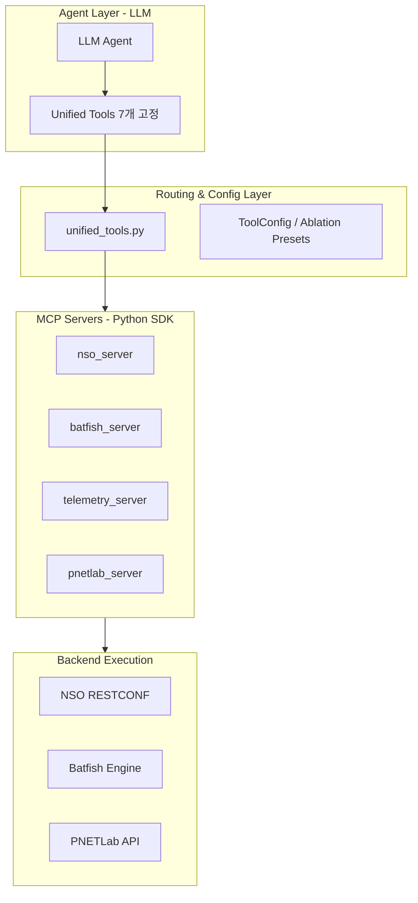

# Phase 3: 도구 아키텍처 및 MCP 구현 완료

## 개요 (구현 완료 - 2026-01-12)

### 목표 달성
1. **컨텍스트 효율**: LLM 노출 도구를 7개로 고정하여 토큰 53% 절감 (~1,400 토큰)
2. **확장성**: MCP 서버 분리로 새로운 도메인( Batfish, Telemetry 등) 통합 용이성 확보
3. **TDD 기반 안정성**: 104개의 단위 테스트를 통해 도구와 서버의 정상 작동 검증
4. **실험 지원**: ToolConfig와 11개 프리셋을 통한 Ablation Study 인프라 구축

---

## 아키텍처 (Current)

---

## 1. 구현된 통합 도구 (7개)

| 도구명 | 역할 | 세부 기능 | 구현 파일 |
|--------|------|-----------|-----------|
| `network.query` | 설정 조회 | BGP, OSPF, Interface, VRF, Security, ACL | `agent/unified_tools.py` |
| `network.verify` | 속성 검증 | Reachability, Traceroute, BGP Session, Route Table | `agent/unified_tools.py` |
| `network.change` | 설정 변경 | Dry-run, Diff (Commit/Rollback은 승인 게이트) | `agent/unified_tools.py` |
| `telemetry.query`| 동적 관측 | Logs, Metrics, Flows (현재 Stub 구현) | `agent/unified_tools.py` |
| `lab.manage` | 인프라 제어 | Inventory, Status, Config Export, Batfish Init | `agent/unified_tools.py` |
| `approval.request`| 안전 장치 | 위험 작업에 대한 Request ID 생성 및 대기 | `agent/unified_tools.py` |
| `help.guide` | 자습서 | 도구 사용법 및 모범 사례(Best Practices) 제공 | `agent/unified_tools.py` |

---

## 2. MCP 서버 명세

### 2.1 NSO MCP 서버 (`mcp_servers/nso_server.py`)
- **RESTCONF Integration**: 장비 설정 및 상태 조회
- **Config Export**: Batfish 분석을 위한 장비 설정(CFG/XML) 추출 기능 통합
- **Docker CLI Wrapper**: API로 불가능한 명령어를 위해 Docker exec 기능 제공

### 2.2 Batfish MCP 서버 (`mcp_servers/batfish_server.py`)
- **Snapshot Management**: 추출된 설정을 기반으로 분석 환경 초기화
- **Reachability Analysis**: Header Space Analysis 기반의 도달성 검증
- **BGP Session Status**: 설정상의 피어링 상태 확인

### 2.3 PNETLab MCP 서버 (`mcp_servers/pnetlab_server.py`)
- **Topology API**: 실험실 토폴로지 및 노드 정보 조회
- **Console Access**: 노드별 Guacamole 콘솔 링크 생성

---

## 3. 실험 및 검증 인프라

### 3.1 ToolConfig 및 Ablation 프리셋
`config/tool_config.py`에 정의된 11개 프리셋을 통해 실험 환경을 통제할 수 있습니다.
- `full`: 모든 도구 및 캐시 활성화
- `no_batfish`: 검증 도구가 없는 에이전트의 정확도 측정용
- `eval_mode`: Lab 제어 권한이 없는 운영 시뮬레이션용

### 3.2 테스트 스위트 (TDD 결과)
`tests/` 폴더 내의 100개 이상의 테스트가 매 커밋마다 품질을 보장합니다.
- `test_nso_server.py`: 20개
- `test_batfish_server.py`: 16개
- `test_pnetlab_server.py`: 15개
- `test_unified_tools.py`: 27개
- `test_tool_config.py`: 26개

---

## 4. 향후 로드맵 (Phase 4)

### 4.1 Skills 동적 주입 (Dynamic Skills Injection)
- `skills/` 폴더의 Markdown 파일을 LLM의 System Prompt에 상황별로 주입하는 로더 구현

### 4.2 자율 진단 루프
- LangGraph를 활용하여 장애 발생 시 `telemetry.query` → `network.verify` → `network.query` → `network.change(dry_run)` 절차를 자동 수행하는 에이전트 구현

---

**마지막 업데이트**: 2026-01-12
**상태**: **구현 완료 (Phase 3 Complete)**
