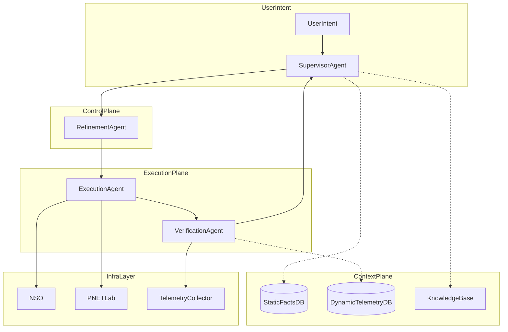

```mermaid
graph TB
  subgraph UserIntent
    User[UserIntent] --> Supervisor
  end

  subgraph ControlPlane
    Supervisor[SupervisorAgent]
    Refiner[RefinementAgent]
  end

  subgraph ExecutionPlane
    Exec[ExecutionAgent]
    Verify[VerificationAgent]
  end

  subgraph ContextPlane
    StaticDB[(StaticFactsDB)]
    DynamicDB[(DynamicTelemetryDB)]
    Knowledge[KnowledgeBase]
  end

  subgraph InfraLayer
    NSO[NSO]
    PNET[PNETLab]
    Monitor[TelemetryCollector]
  end

  Supervisor --> Refiner
  Refiner --> Exec
  Exec --> NSO
  Exec --> PNET

  Exec --> Verify
  Verify --> Monitor
  Verify --> Supervisor

  Supervisor -.-> StaticDB
  Supervisor -.-> Knowledge
  Verify -.-> DynamicDB

```