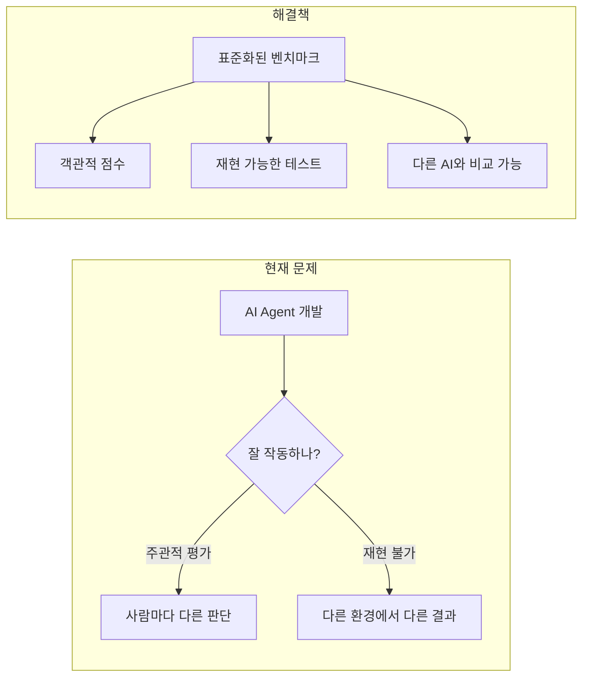
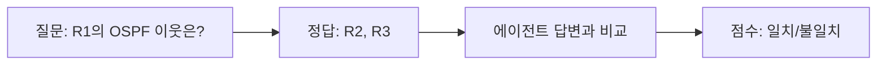
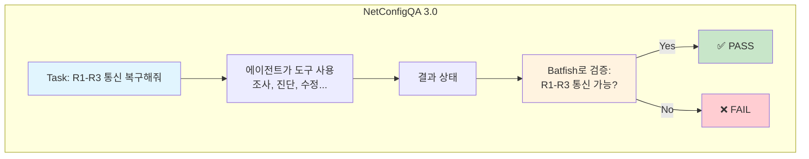
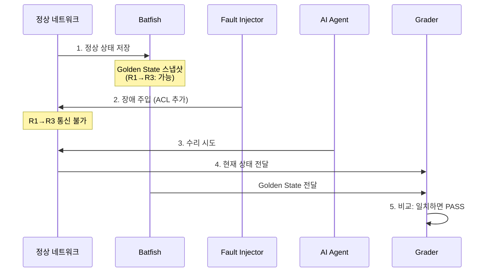
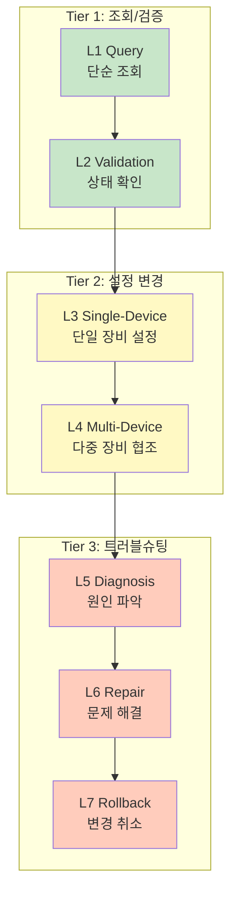
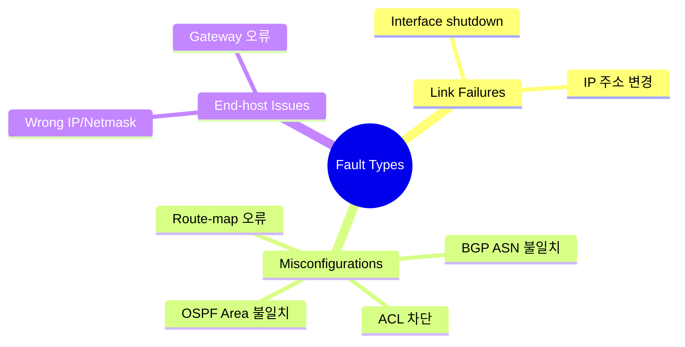
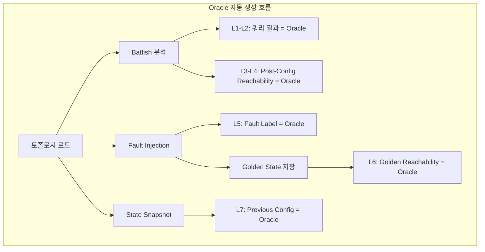
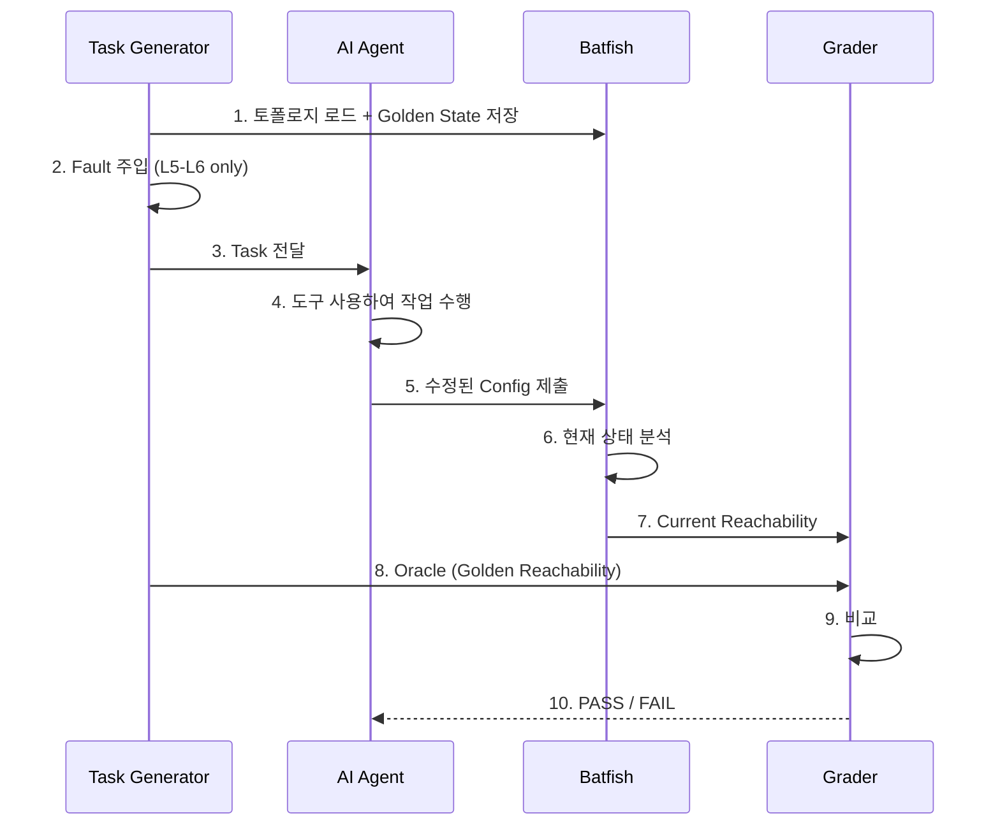
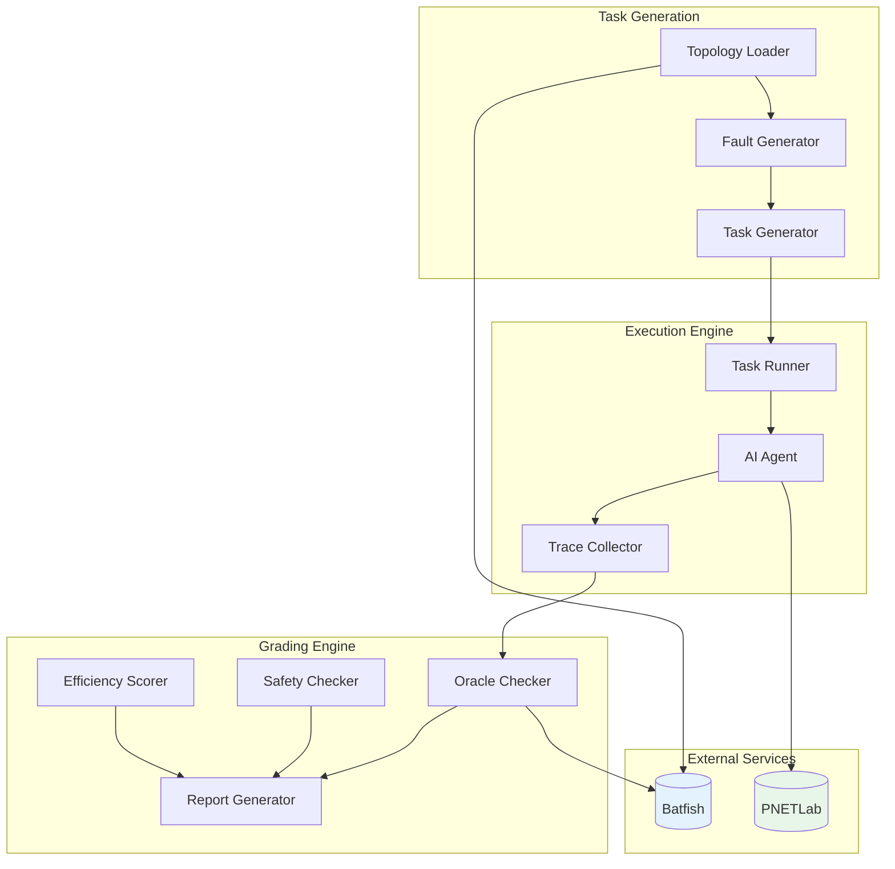
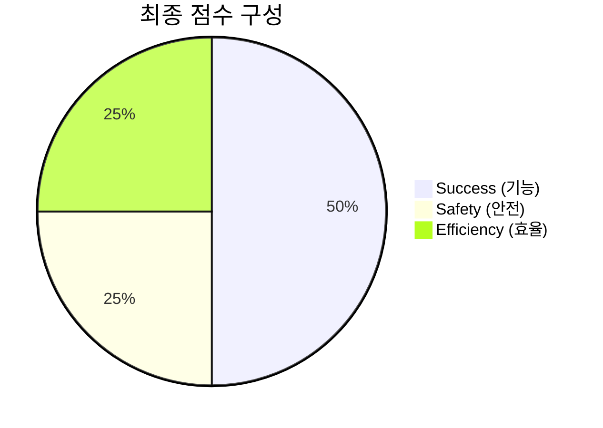

# 🎯 NetConfigQA3 벤치마크 시스템 설계서

> **문서 버전**: v3.0 (2026-01-17)  
> **목적**: AI 네트워크 에이전트의 성능을 **자동으로 측정하고 채점**하는 벤치마크 시스템 설계  
> **대상 독자**: 연구원, 개발자, 네트워크 엔지니어 (비전문가도 이해 가능하도록 작성)

---

## 1. 배경: 왜 벤치마크가 필요한가?

### 1.1 문제 상황

AI 에이전트가 네트워크를 관리하는 시대가 오고 있습니다. 하지만 중요한 질문이 있습니다:

> **"이 AI 에이전트가 정말 잘 하는 건가요? 어떻게 증명하죠?"**

자율주행차를 평가할 때 "몇 km를 사고 없이 달렸는가"를 측정하듯, AI 네트워크 에이전트도 **객관적인 시험**이 필요합니다. 이것이 바로 **벤치마크(Benchmark)**입니다.



### 1.2 기존 벤치마크들의 한계

| 벤치마크 | 장점 | 한계 |
|:---------|:-----|:-----|
| **NetConfEval** | 설정 생성 평가 | 정적 평가만 (실시간 트러블슈팅 불가) |
| **NIKA (SIGCOMM '25)** | 실시간 장애 진단 평가 | 진단만 평가 (수리/해결 평가 불가) |
| **SWE-Bench** | 코드 수정 평가 | 네트워크 도메인 아님 |

우리에게 필요한 것:
- ✅ 실시간 네트워크 환경
- ✅ 장애 **진단 + 해결**까지 평가
- ✅ 정답이 여러 개일 때도 자동 채점

---

## 2. NetConfigQA 2.0에서 3.0으로의 진화

### 2.1 NetConfigQA 2.0 (기존)

NetConfigQA 2.0은 **질문-답변(QA) 형식**의 벤치마크였습니다.



**특징**:
- 단순 조회/검증 작업에 적합
- 정답이 하나로 명확함
- 80개 이상의 메트릭(policies.json)으로 자동 생성

**한계**:
- "설정을 바꿔라", "문제를 해결해라" 같은 **행동(Action)** 평가 불가
- 에이전트의 **도구 사용 능력** 측정 불가
- 정답이 여러 개인 상황 처리 불가

### 2.2 NetConfigQA 3.0 (신규)

NetConfigQA 3.0은 **작업(Task) 기반 에피소드 형식**으로 진화합니다.



**핵심 변화**:

| 항목 | 2.0 (QA) | 3.0 (Task) |
|:-----|:---------|:-----------|
| **평가 대상** | 답변 텍스트 | 행동 결과 |
| **정답 형태** | 고정된 텍스트 | **테스트 통과 여부** |
| **정답 생성** | 사람이 작성 | **자동 생성 (Batfish)** |
| **다중 정답** | 처리 불가 | **결과만 맞으면 OK** |

---

## 3. 핵심 개념 이해하기

### 3.1 Task (작업)이란?

**Task**는 에이전트에게 주어지는 **미션**입니다. 마치 시험 문제와 같습니다.

```
┌─────────────────────────────────────────────────────────────────┐
│ 📋 Task 예시                                                     │
├─────────────────────────────────────────────────────────────────┤
│ Goal (목표): "R1에서 R3으로 핑이 가능하도록 해주세요"             │
│ Context (상황): 현재 R1→R3 핑이 실패하고 있음                    │
│ Constraints (제약): 라우팅 프로토콜 변경 금지                    │
│ Tools (도구): network_query, network_change, verification        │
└─────────────────────────────────────────────────────────────────┘
```

### 3.2 Oracle (정답 기준)이란?

**Oracle**은 "정답인지 아닌지 판별해주는 심판"입니다.

전통적인 시험에서는 채점표가 Oracle입니다. 하지만 네트워크 문제는 정답이 여러 개일 수 있습니다:

```
문제: "R1→R3 통신 복구해줘"

해결책 A: ACL에서 Permit 규칙 추가  ← 정답 ✅
해결책 B: ACL 전체 삭제             ← 작동함 ✅ (하지만 위험)
해결책 C: R1→R2→R4→R3 우회 경로 추가 ← 작동함 ✅ (비효율적)
```

모든 정답을 미리 적어둘 수 없습니다. 그래서 우리는 **"방법"이 아닌 "결과"**를 검증합니다:

```mermaid
graph LRㅇ
    subgraph "전통적 채점 (불가능)"
        Q1[에이전트 답안] --> C1{정답 리스트에 있나?}
        C1 -->|Yes| P1[Pass]
        C1 -->|No| F1[Fail]
    end
    
    subgraph "Test-Driven 채점 (우리 방식)"
        Q2[에이전트가 수정한 네트워크] --> T[Batfish 테스트:<br/>R1→R3 도달 가능?]
        T -->|Yes| P2[Pass]
        T -->|No| F2[Fail]
    end
    
    style T fill:#fff3e0
```

### 3.3 Golden State (황금 상태)란?

**Golden State**는 "문제가 없던 정상 상태"의 스냅샷입니다.



---

## 4. Task 레벨 체계

작업의 복잡도에 따라 7개 레벨로 구분합니다. 마치 게임의 난이도와 같습니다.



### 4.1 레벨별 상세 설명

#### L1. Query (조회)
> **예시**: "R1의 OSPF 이웃 목록을 알려줘"

에이전트가 `show ip ospf neighbor` 명령 결과를 해석하여 답변합니다.
- **채점**: Batfish 쿼리 결과와 비교 (텍스트 매칭)
- **난이도**: ⭐ (가장 쉬움)

#### L2. Validation (검증)
> **예시**: "모든 라우터에 SSH가 활성화되어 있나요?"

에이전트가 여러 장비를 확인하고 True/False로 답변합니다.
- **채점**: Batfish 검증 결과와 Boolean 비교
- **난이도**: ⭐⭐

#### L3. Single-Device Config (단일 장비 설정)
> **예시**: "R1에 OSPF Area 1을 추가해줘"

에이전트가 한 장비의 설정을 변경합니다.
- **채점**: 변경 후 Batfish 검증 (OSPF가 올바르게 동작하는가?)
- **난이도**: ⭐⭐⭐

#### L4. Multi-Device Config (다중 장비 설정)
> **예시**: "R1-R2-R3 간 iBGP Full Mesh를 구성해줘"

여러 장비의 설정을 조율하여 변경합니다.
- **채점**: 변경 후 Batfish 검증 (BGP 세션이 모두 Established인가?)
- **난이도**: ⭐⭐⭐⭐

#### L5. Diagnosis (진단)
> **예시**: "R1에서 R3으로 핑이 안 되는 원인을 찾아줘"

에이전트가 조사하여 원인을 지목합니다. (예: "R2의 ACL에서 차단됨")
- **채점**: 주입된 Fault Label과 에이전트 답변 비교
- **난이도**: ⭐⭐⭐⭐

#### L6. Repair (수리) ⭐ 핵심 혁신
> **예시**: "R1에서 R3으로 통신이 가능하도록 고쳐줘"

에이전트가 문제를 해결합니다. **방법은 자유!**
- **채점**: 수리 후 Reachability가 Golden State와 일치하는가?
- **난이도**: ⭐⭐⭐⭐⭐ (가장 어려움)

#### L7. Rollback (롤백)
> **예시**: "방금 적용한 ACL 변경을 취소해줘"

에이전트가 이전 상태로 복구합니다.
- **채점**: 롤백 후 Config가 이전 Snapshot과 일치하는가?
- **난이도**: ⭐⭐⭐

---

## 5. Fault Injection (장애 주입) 시스템

### 5.1 왜 장애를 주입하나요?

실제 네트워크 문제 해결 능력을 테스트하려면, **인위적으로 문제를 만들어야** 합니다.
마치 소방훈련에서 가짜 화재를 일으키는 것과 같습니다.

### 5.2 지원하는 장애 유형 (NIKA 참고)

NIKA 논문에서 정의한 54개 장애 유형 중, Cisco IOS 환경에서 재현 가능한 것들:



### 5.3 Fault Template 예시

```python
# 장애 템플릿 정의
FAULT_TEMPLATES = {
    "acl_block_icmp": {
        "description": "ACL에서 ICMP 트래픽 차단",
        "device_type": "router",
        "inject_command": "ip access-list extended BLOCK\n deny icmp any any",
        "symptoms": ["Ping fails", "Traceroute shows !H"],
        "label": "acl_icmp_block"
    },
    "bgp_asn_mismatch": {
        "description": "BGP Neighbor의 AS 번호 불일치",
        "device_type": "router",
        "inject_command": "router bgp 100\n neighbor {ip} remote-as 999",
        "symptoms": ["BGP session Idle", "No routes learned"],
        "label": "bgp_asn_mismatch"
    }
}
```

---

## 6. Test-Driven Grading (테스트 기반 채점)

### 6.1 핵심 원칙

> **"정답 텍스트를 미리 쓰지 않는다. 대신 테스트 통과 여부로 판단한다."**

이 방식의 장점:
1. **다중 정답 문제 해결**: 방법이 달라도 결과만 맞으면 OK
2. **자동 생성 가능**: 토폴로지가 바뀌어도 Batfish가 정답 생성
3. **전문가 불필요**: 사람이 정답을 미리 작성할 필요 없음

### 6.2 레벨별 Oracle 생성 방식



### 6.3 채점 파이프라인



---

## 7. 시스템 아키텍처

### 7.1 전체 구조



### 7.2 모듈 설명

| 모듈 | 역할 |
|:-----|:-----|
| **Topology Loader** | PNETLab에서 네트워크 토폴로지 로드 |
| **Fault Generator** | NIKA 기반 장애 템플릿으로 문제 주입 |
| **Task Generator** | 레벨별 Task 자동 생성 |
| **Task Runner** | 에이전트 실행 및 환경 관리 |
| **Trace Collector** | 에이전트의 모든 행동 기록 |
| **Oracle Checker** | Batfish 기반 결과 검증 |
| **Safety Checker** | 위험한 설정 탐지 (permit any any 등) |
| **Efficiency Scorer** | 토큰 사용량, 턴 수 등 효율성 측정 |

---

## 8. 채점 지표

### 8.1 3축 평가 체계



### 8.2 상세 지표

| 축 | 지표 | 측정 방법 |
|:---|:-----|:----------|
| **Success** | Task 완료율 | Oracle 테스트 통과 여부 |
| | 부분 점수 | N개 Reachability 중 M개 복구 → M/N |
| **Safety** | 위험 패턴 | `permit any any`, `no access-list` 탐지 |
| | 승인 준수 | 위험 명령 전 approval_request 호출 여부 |
| **Efficiency** | Token 사용량 | 총 입력+출력 토큰 수 |
| | 도구 호출 수 | 불필요한 반복 호출 탐지 |
| | 해결 시간 | Task 시작~완료 시간 |

---

## 9. 구현 로드맵

### Phase 1: 쉬운 것부터 (L1-L4)
- [ ] 기존 policies.json 활용
- [ ] Batfish 쿼리 기반 Oracle 구현
- [ ] Oracle Checker 프로토타입

### Phase 2: 핵심 혁신 (L5-L6)
- [ ] Fault Injection 스크립트 (NIKA 참고)
- [ ] Golden State 저장 로직
- [ ] Test-Driven Grading 구현

### Phase 3: 품질 향상
- [ ] Safety Checker 규칙 정의
- [ ] Efficiency Scorer 구현
- [ ] Report Generator

### Phase 4: 고도화
- [ ] LLM-as-a-Judge (추론 품질 평가)
- [ ] 벤치마크 결과 시각화 대시보드

---

## 10. 요약

NetConfigQA3은 **"정답 텍스트 매칭"에서 "테스트 통과 여부"**로 패러다임을 전환합니다.

```
┌────────────────────────────────────────────────────────────────┐
│                     NetConfigQA3 핵심 혁신                      │
├────────────────────────────────────────────────────────────────┤
│ 1. 정답을 미리 쓰지 않는다 → Batfish가 자동 생성              │
│ 2. 방법이 아닌 결과를 본다 → 다중 정답 문제 해결              │
│ 3. 전문가 없이도 채점 가능 → Fault Template만 정의하면 됨     │
└────────────────────────────────────────────────────────────────┘
```

이를 통해:
- 🔄 토폴로지가 바뀌어도 자동 채점 가능
- 📈 수백~수천 개 Task 자동 생성 가능
- 🤖 AI 에이전트 간 객관적 비교 가능
