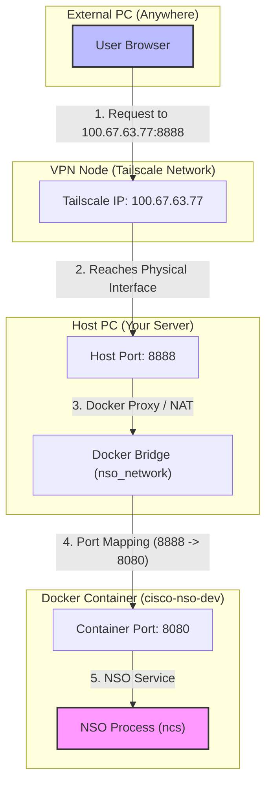
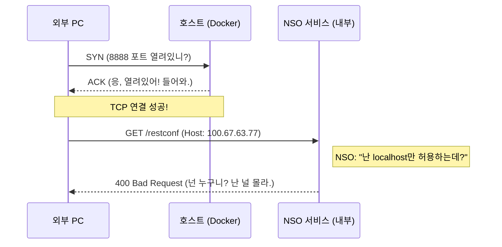

# 🌐 Docker & Tailscale 네트워크 시각화 가이드

이 문서는 외부 PC에서 Tailscale을 통해 Docker 컨테이너 내부 서비스(NSO)에 어떻게 도달하는지, 그리고 포트 매핑의 원리를 시각적으로 설명합니다.

## 1. 네트워크 전체 흐름도 (External to Container)

외부 PC 사용자가 브라우저에 `http://100.67.63.77:8888`을 입력했을 때의 여정입니다.



---

## 2. 포트 매핑 (Port Mapping)의 원리

`docker-compose.yml`에서 설정한 `8888:8080`의 의미는 다음과 같습니다.

### 포트 매핑 구조
```text
  [ 외부(Host) 포트 ] : [ 내부(Container) 포트 ]
          8888        :          8080
```

- **외부(Host) 포트 (8888)**: 밖에서 보는 포트입니다. Tailscale이나 로컬 호스트에서 접속할 때 이 번호를 사용합니다.
- **내부(Container) 포트 (8080)**: 컨테이너 내부의 실제 서비스(NSO)가 리스닝하고 있는 포트입니다.

### 왜 우리는 8888:8080을 썼나요?
1. **내부(8080)**: NSO 개발자가 설계한 기본 포트입니다. 컨테이너 안에서는 건드리지 않는 것이 가장 안정적입니다.
2. **외부(8888)**: 이전에 8080 포트가 `traefik` 등 다른 서비스와 충돌이 있었기 때문에, 외부에서 접근할 때는 8888로 들어오도록 "문 번호"를 바꿔준 것입니다.

---

## 3. "Host Header"의 비밀 (400 Bad Request가 왜 났을까?)

네트워크 연결은 성공했는데 NSO가 에러를 낸 이유는 **"애플리케이션 계층"**의 보안 때문입니다.



### 해결책: `match-host-name: false`
우리는 `ncs.conf`를 수정하여 **"어떤 IP나 이름으로 들어오든(Alias: *) 거부하지 마"**라고 설정을 변경했습니다. 이제 NSO는 비로소 외부 IP를 통한 접속을 허용합니다.

---

## 4. 요약

| 단계 | 주체 | 식별자 | 설명 |
|:---|:---|:---|:---|
| **입구** | Tailscale | `100.67.63.77` | 전 세계 어디서든 이 IP로 호스트에 접속 가능 |
| **통로** | Docker | `8888 -> 8080` | 호스트의 8888번 문을 열면 컨테이너의 8080번 방으로 연결 |
| **최종** | NSO | `ncs.conf` | 들어온 사람의 이름(Host Header)을 따지지 않고 수락 |

이제 이 원리를 이해하면, 나중에 다른 포트(예: 8889)를 추가할 때도 동일한 논리로 설정할 수 있습니다!
