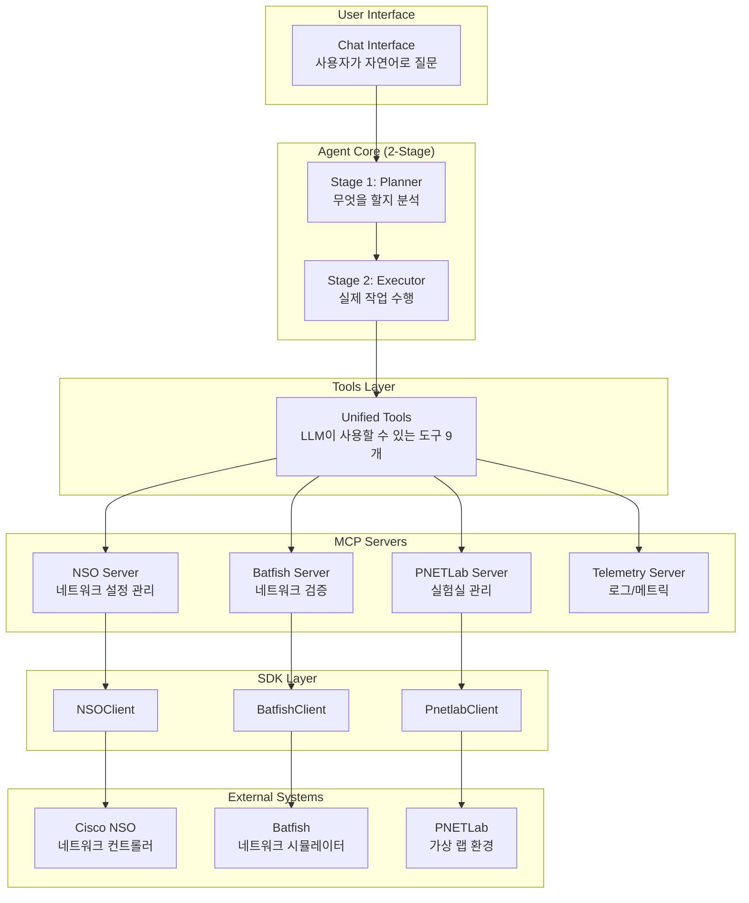
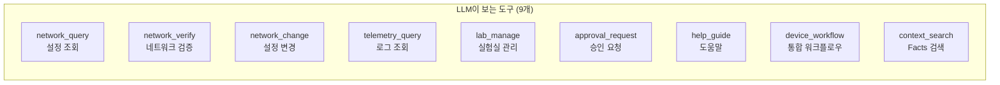
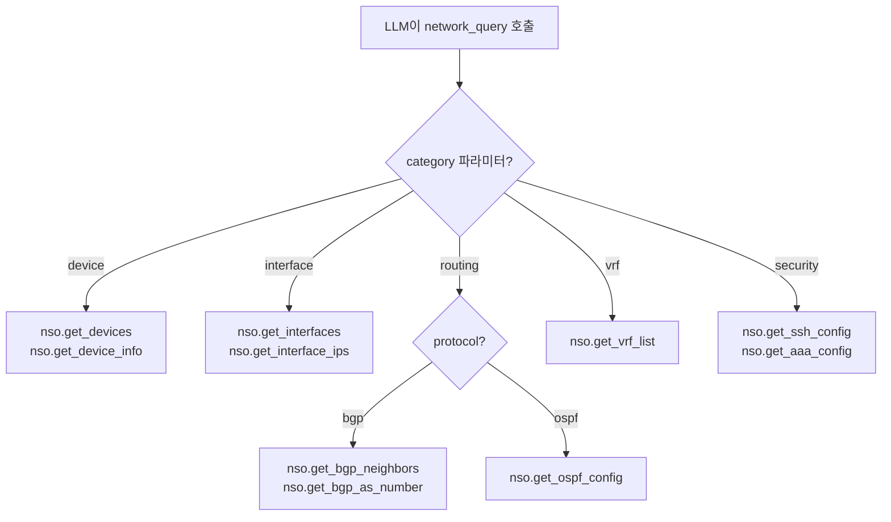
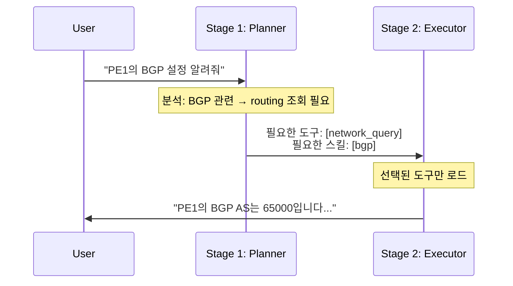
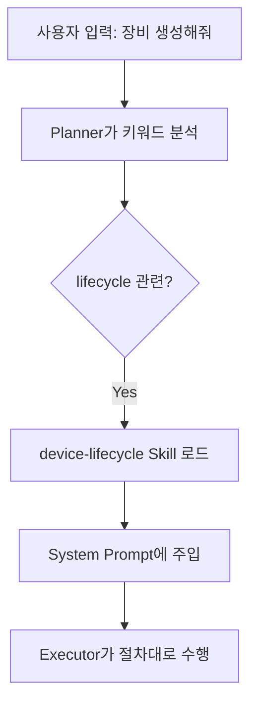
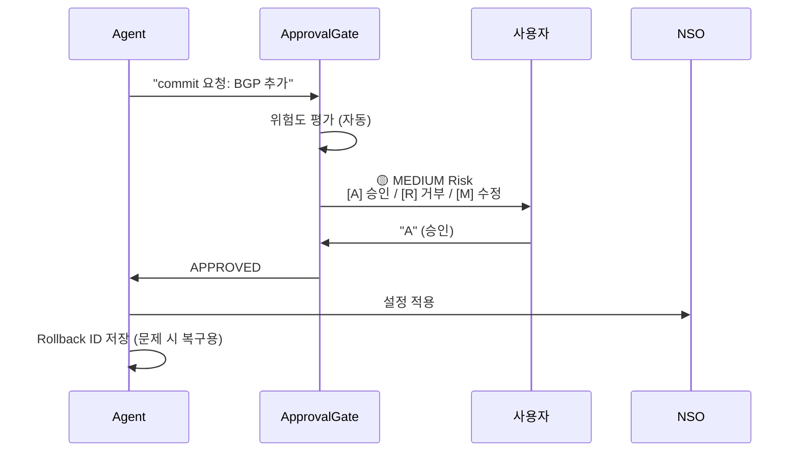

# 현재 시스템 현황 보고서
> NetConfigQA3 - LLM 기반 네트워크 자동화 에이전트

---

## 🎯 프로젝트 목표

### 무엇을 만드는가?
**네트워크 엔지니어의 업무를 자연어로 처리할 수 있는 AI 에이전트**를 만들고 있습니다.

예를 들어:
- ❌ 기존: 여러 CLI 명령어를 직접 입력 (`show ip bgp neighbors`, `show running-config` 등)
- ✅ 목표: "PE1의 BGP 설정 알려줘" 라고 말하면 에이전트가 알아서 처리

### 왜 만드는가?
1. **복잡한 네트워크 운영**: 대규모 네트워크 관리는 수십 개의 장비를 다뤄야 함
2. **LLM의 한계**: GPT 같은 LLM은 네트워크 장비에 직접 접근할 수 없음
3. **안전성 필요**: 잘못된 설정 변경은 네트워크 장애로 이어짐

**→ 따라서, LLM이 안전하게 네트워크를 조회하고 변경할 수 있는 중간 계층이 필요했습니다.**

---

## 📊 시스템 아키텍처 개요



### 왜 이런 구조인가?

**문제**: LLM은 외부 시스템(NSO, PNETLab, Batfish)에 직접 접근할 수 없습니다.

**해결**: 
1. **SDK Layer** - 각 외부 시스템과 통신하는 Python 클라이언트를 만들었습니다
2. **MCP Servers** - SDK를 감싸서 LLM이 이해할 수 있는 형태로 변환합니다
3. **Unified Tools** - LLM에게 노출되는 최종 도구입니다 (LLM은 이것만 봅니다)

---

## 1. SDK 구현 (외부 시스템과의 통신)

### 1.1 PNETLab SDK

**왜 필요한가?**  
PNETLab은 네트워크 장비를 가상으로 실행하는 실험실 환경입니다. 라우터, 스위치 같은 장비를 실제 하드웨어 없이 소프트웨어로 돌릴 수 있습니다. 우리는 이 가상 장비들을 코드로 제어해야 했습니다.

**어떻게 구현했는가?**

| 구현 내용 | 설명 |
|-----------|------|
| **파일** | `clients/pnetlab.py` (801줄, **19개** 메서드) |
| **통신 방식** | REST API (HTTP 요청) |
| **인증 방식** | 브라우저 쿠키 재사용 |

**왜 쿠키 인증인가?**  
PNETLab은 외부 인증 서버(authen.pnetlab.com)를 사용해서 일반적인 ID/PW 로그인이 안 됩니다. 그래서 브라우저에서 로그인한 후 쿠키를 복사해서 사용하는 방식을 채택했습니다.

```python
# 브라우저 개발자도구에서 쿠키 복사 후 .env 파일에 저장
PNETLAB_JWT_TOKEN=eyJhbGciOiJIUzI1NiIs...
PNETLAB_SESSION=abc123...
PNETLAB_XSRF_TOKEN=%3D%3D...
```

**전체 메서드 목록 (19개):**
| 카테고리 | 메서드 | 설명 |
|----------|--------|------|
| **인증** | `set_jwt_token()` | JWT 토큰 설정 |
| | `set_session_from_browser()` | 브라우저 쿠키로 세션 설정 |
| | `is_authenticated()` | 인증 상태 확인 |
| **토폴로지 조회** | `get_session_topology()` | 현재 Lab 토폴로지 조회 |
| | `get_nodes_from_topology()` | 토폴로지에서 노드 목록 추출 |
| | `get_nodes_status()` | 모든 노드 상태 조회 |
| | `get_inventory()` | Lab 인벤토리 조회 |
| **장비 관리** | `add_node()` | 새 장비(노드) 생성 |
| | `delete_node()` | 장비 삭제 |
| | `start_node()` | 장비 시작 |
| | `stop_node()` | 장비 중지 |
| | `get_node_id_by_name()` | 이름으로 노드 ID 조회 |
| **네트워크 관리** | `add_network()` | 새 네트워크(Cloud) 생성 |
| | `delete_network()` | 네트워크 삭제 |
| | `get_node_interfaces()` | 노드 인터페이스 목록 |
| | `connect_node_interface()` | 인터페이스를 네트워크에 연결 |
| **콘솔 접근** | `get_console_link()` | Guacamole 콘솔 링크 |
| | `get_console_url_by_name()` | 이름으로 콘솔 URL 조회 |
| | `extract_telnet_port_from_guacamole()` | Guacamole에서 Telnet 포트 추출 |

---

### 1.2 NSO SDK

**왜 필요한가?**  
Cisco NSO(Network Services Orchestrator)는 수백 대의 네트워크 장비를 한 곳에서 관리하는 중앙 컨트롤러입니다. 장비에 일일이 접속하지 않고 NSO를 통해 설정을 조회하고 변경할 수 있습니다.

**어떻게 구현했는가?**

| 구현 내용 | 설명 |
|-----------|------|
| **파일** | `clients/nso.py` (949줄, **25개** 메서드) |
| **통신 방식** | RESTCONF API (표준 네트워크 관리 프로토콜) |
| **인증 방식** | Basic Auth (ID/PW) |

**전체 메서드 목록 (25개):**
| 카테고리 | 메서드 | 설명 |
|----------|--------|------|
| **장비 등록** | `register_device()` | 새 장비를 NSO에 등록 |
| | `delete_device()` | 장비 삭제 |
| | `create_authgroup()` | 인증 그룹 생성 |
| | `fetch_host_keys()` | SSH 호스트 키 가져오기 |
| | `sync_from()` | 장비 → NSO 설정 동기화 |
| | `check_sync()` | 동기화 상태 확인 |
| | `onboard_devices()` | 여러 장비 일괄 등록 |
| | `check_device_connectivity()` | 장비 연결성 확인 |
| **장비 조회** | `get_devices()` | 등록된 장비 목록 |
| | `get_device_info()` | 장비 상세 정보 |
| **설정 조회** | `get_native_config()` | CLI 형식 설정 추출 |
| | `get_interfaces()` | 인터페이스 목록 |
| | `get_interface_ips()` | 인터페이스별 IP 매핑 |
| **라우팅** | `get_bgp_neighbors()` | BGP 네이버 목록 |
| | `get_bgp_as_number()` | BGP AS 번호 |
| | `get_ospf_config()` | OSPF 설정 |
| | `get_vrf_list()` | VRF 목록 |
| **보안** | `get_ssh_config()` | SSH 설정 |
| | `get_aaa_config()` | AAA 설정 |
| **네트워크 검증** | `ping()` | Ping 테스트 |
| | `traceroute()` | 경로 추적 |
| | `compare_devices()` | 두 장비 비교 |
| | `find_devices_with()` | 조건 검색 |
| | `check_ip_conflicts()` | IP 충돌 검사 |
| **Batfish 연동** | `export_batfish_configs()` | Batfish용 설정 추출 |

---

### 1.3 Batfish SDK

**왜 필요한가?**  
Batfish는 네트워크 설정을 분석해서 "A에서 B까지 트래픽이 도달할 수 있는가?" 같은 질문에 답해주는 시뮬레이터입니다. 실제로 트래픽을 보내지 않고도 네트워크 동작을 예측할 수 있습니다.

**어떻게 구현했는가?**

| 구현 내용 | 설명 |
|-----------|------|
| **파일** | `clients/batfish.py` (247줄, **6개** 메서드) |
| **통신 방식** | PyBatfish 라이브러리 |

**전체 메서드 목록 (6개):**
| 메서드 | 설명 |
|--------|------|
| `is_available()` | Batfish 사용 가능 여부 확인 |
| `init_snapshot()` | 설정 파일로 스냅샷 초기화 |
| `check_reachability()` | A→B 도달 가능 여부 검증 |
| `traceroute()` | 패킷 경로 추적 |
| `get_bgp_sessions()` | BGP 세션 상태 조회 |
| `get_route_table()` | 라우팅 테이블 조회 |

---

## 2. MCP 서버 (SDK를 LLM 친화적으로 포장)

### 왜 MCP가 필요한가?

**문제**: SDK 함수들이 너무 많습니다 (25개 + 19개 + 6개 = **50개**). LLM에게 50개 함수를 모두 알려주면:
- 토큰 낭비 (비용 증가)
- 선택 혼란 (잘못된 함수 호출)
- 복잡한 파라미터

**해결**: MCP 서버가 SDK 함수들을 묶어서 단순한 인터페이스로 제공합니다.

```
[50개 SDK 함수] → [MCP 서버가 분류/정리] → [9개 통합 도구]
```

### LLM에게 노출되는 9개 도구



| 도구 | 용도 | 내부적으로 호출되는 것 |
|------|------|----------------------|
| `network_query` | 장비/인터페이스/라우팅 정보 조회 | NSO SDK의 여러 조회 함수 |
| `network_verify` | 도달성/경로 검증 | Batfish SDK |
| `network_change` | 설정 변경, dry-run | NSO SDK의 변경 함수 |
| `lab_manage` | 장비 생성/삭제/시작 | PNETLab SDK |
| `approval_request` | 위험 작업 승인 요청 | (내부 로직) |
| `context_search` | 사전 파싱된 Facts 검색 | 로컬 JSON 파일 |

### 🔑 핵심: 9개 도구가 50개 함수를 어떻게 선택하는가?

**파라미터 기반 라우팅 (Parameter-based Dispatching)** 방식을 사용합니다.



**예시 - `network_query` 1개 도구 → 11개 SDK 함수 라우팅:**

```python
# unified_tools.py 내부 구조 (간략화)

@tool
def network_query(category, device=None, params=None):
    nso = get_nso_server()
    
    if category == "device":
        if device:
            return nso.client.get_device_info(device)    # SDK 함수 1
        else:
            return nso.client.get_devices()              # SDK 함수 2
    
    elif category == "interface":
        return nso.client.get_interfaces(device)         # SDK 함수 3
    
    elif category == "routing":
        protocol = params.get("protocol", "bgp")
        if protocol == "bgp":
            return nso.client.get_bgp_neighbors(device)  # SDK 함수 4
        elif protocol == "ospf":
            return nso.client.get_ospf_config(device)    # SDK 함수 5
    
    elif category == "vrf":
        return nso.client.get_vrf_list(device)           # SDK 함수 6
    
    elif category == "security":
        return {
            "ssh": nso.client.get_ssh_config(device),    # SDK 함수 7
            "aaa": nso.client.get_aaa_config(device)     # SDK 함수 8
        }
    # ... acl 등 추가 카테고리
```

### 도구별 라우팅 범위

| 통합 도구 | 카테고리/액션 수 | 라우팅되는 SDK 함수 수 |
|----------|----------------|----------------------|
| `network_query` | 6개 카테고리 | NSO 11개 함수 |
| `network_change` | 8개 액션 | NSO 8개 함수 |
| `lab_manage` | 12개 액션 | PNETLab 14개 함수 |
| `network_verify` | 5개 테스트 | Batfish 5개 함수 |
| `telemetry_query` | 3개 소스 | Telemetry 3개 함수 |
| `device_workflow` | 4개 워크플로우 | 복합 (NSO + PNETLab) |
| 기타 | - | 내부 로직 |
| **합계** | **9개 도구** | **~50개 SDK 함수** |

### 장점

1. **LLM 부담 감소**: 50개 함수 대신 9개만 기억
2. **일관된 인터페이스**: 모든 조회는 `network_query`, 모든 변경은 `network_change`
3. **유연한 확장**: 새 SDK 함수 추가해도 LLM 인터페이스 변경 불필요

**예시 - 복잡한 작업이 얼마나 단순해지는가:**

```python
# Before (SDK 직접 사용 - 3단계)
nso = NSOClient(url, user, password)
devices = nso.get_devices()
for device in devices:
    bgp = nso.get_bgp_neighbors(device)
    print(bgp)

# After (통합 도구 - 1단계)
network_query("routing", device="PE1", params={"protocol": "bgp"})
```

---

## 3. 2단계 에이전트 아키텍처 (토큰 절약)

### 왜 2단계인가?

**문제**: LLM에게 모든 정보를 한 번에 주면 토큰이 낭비됩니다.

**예시**:
- 사용자 질문: "PE1의 BGP 설정 알려줘"
- 불필요한 정보: ACL 도구, PNETLab 도구, Telemetry 도구...

**해결**: 2단계로 나눠서 필요한 것만 로드합니다.



### 토큰 절약 효과

| 방식 | System Prompt 크기 | 비용 |
|------|-------------------|------|
| Before (모든 도구 로드) | ~5,000 토큰 | 높음 |
| After (선택적 로드) | ~2,200 토큰 | **46% 절감** |

---

## 4. SKILL 시스템 (도메인 지식 모듈화)

### 왜 필요한가?

**문제**: LLM은 네트워크 운영 노하우를 모릅니다.
- "BGP 세션이 Down이면 어떻게 진단하지?"
- "장비 생성 후 NSO 등록 순서는?"

**해결**: 네트워크 엔지니어의 지식을 Markdown 파일로 작성하고, 필요할 때 LLM에게 주입합니다.

### 작성된 Skills

| Skill 폴더 | 내용 | 언제 로드되나 |
|-----------|------|-------------|
| `core-policy` | 금지 행동, 기본 정책 | 항상 |
| `nso-management` | NSO 장비 등록 절차 | "등록" 키워드 감지 시 |
| `device-lifecycle` | 장비 생성/삭제 절차 | "생성", "삭제" 감지 시 |
| `batfish-verification` | 네트워크 검증 가이드 | "검증", "확인" 감지 시 |

### 작동 방식



**Skill 예시 (device-lifecycle):**
```markdown
---
name: device_lifecycle
tags: [lifecycle, creation, deletion]
---

# 장비 생성 절차

1. lab_manage("add_node", {name: "R1", template: "vios"})
2. lab_manage("start_node", {name: "R1"})
3. 부팅 대기 (30초)
4. network_change("register_device", device_info={...})
5. network_change("sync_from", device="R1")
```

→ LLM이 이 절차를 보고 순서대로 실행합니다.

---

## 5. Human-in-the-Loop (안전 장치)

### 왜 필요한가?

**문제**: LLM이 잘못된 설정 변경을 할 수 있습니다.
- 예: 모든 트래픽을 허용하는 ACL 추가 (`permit ip any any`)
- 예: 라우팅 테이블 초기화

**해결**: 위험한 작업은 사람의 승인을 받도록 했습니다.

### 작동 방식



### 위험도 자동 평가

| Risk Level | 조건 | 예시 |
|------------|------|------|
| 🔴 CRITICAL | 금지 패턴 감지 | `permit ip any any` |
| 🟠 HIGH | 5대 이상 동시 변경 | 대규모 변경 |
| 🟡 MEDIUM | 1~4대 변경 | 일반적인 설정 |
| 🟢 LOW | 조회만 | dry-run, 상태 확인 |

### Rollback (되돌리기)

모든 commit 후 Rollback ID가 저장됩니다. 문제 발생 시:
```
"rollback 12345" → 변경 전 상태로 복구
```

---

## 6. Context Pipeline (효율적인 정보 관리)

### 왜 필요한가?

**문제**: 매번 NSO에서 정보를 조회하면 느리고 비용이 큽니다.

**해결**: 자주 쓰는 정보를 미리 파싱해서 JSON 파일로 저장합니다.

### 3-Level Context 전략

```
┌─────────────────────────────────────────────────────────────┐
│ Level 1: Summary (항상 로드)                                  │
│ - 장비 10대, 역할(P/PE/Leaf), 관리 IP, 프로토콜               │
│ - 크기: ~500 토큰                                            │
└─────────────────────────────────────────────────────────────┘
                              ↓ 필요할 때만
┌─────────────────────────────────────────────────────────────┐
│ Level 2: Facts (필요 시 검색)                                 │
│ - 인터페이스, BGP neighbors, OSPF, VRF 상세 정보              │
│ - context_search("PE1", "routing.bgp")로 검색                │
└─────────────────────────────────────────────────────────────┘
                              ↓ 중요한 작업 시
┌─────────────────────────────────────────────────────────────┐
│ Level 3: NSO Live (실시간)                                    │
│ - 설정 변경 전 dry-run                                        │
│ - 최신 상태 확인 필요 시                                       │
└─────────────────────────────────────────────────────────────┘
```

---

## 7. 파일 구조 요약

```
NetConfigQA3/
├── agent/                      # 에이전트 핵심 로직
│   ├── core.py                 # 2-Stage 에이전트 메인
│   ├── planner.py              # Stage 1: 무엇을 할지 분석
│   ├── unified_tools.py        # LLM에게 노출되는 9개 도구
│   ├── skill_loader.py         # Skill 동적 로딩
│   ├── approval_gate.py        # 승인 게이트 (HitL)
│   └── rollback_tracker.py     # 되돌리기 ID 관리
│
├── clients/                    # 외부 시스템 SDK
│   ├── pnetlab.py              # PNETLab과 통신 (19개 메서드)
│   ├── nso.py                  # NSO와 통신 (25개 메서드)
│   └── batfish.py              # Batfish와 통신 (6개 메서드)
│
├── mcp_servers/                # SDK를 LLM 친화적으로 포장
│   ├── nso_server.py
│   ├── batfish_server.py
│   ├── pnetlab_server.py
│   └── telemetry_server.py
│
├── skills/                     # 도메인 지식 (Markdown)
│   ├── core-policy/            # 기본 정책
│   ├── nso-management/         # NSO 사용법
│   └── device-lifecycle/       # 장비 생명주기
│
├── scripts/                    # 자동화 스크립트
│   ├── generate_context.py     # Level 1,2 Context 생성
│   └── nso_commit_hook.py      # 설정 변경 시 자동 갱신
│
└── config/
    ├── .env                    # 환경변수 (ID, PW, URL)
    └── context/
        ├── device_summary.json # Level 1 (항상 로드)
        └── device_facts.json   # Level 2 (필요 시 검색)
```

---

## 8. 핵심 성과 요약

| 구현 항목 | 상태 | 설명 |
|----------|------|------|
| ✅ 3개 SDK | 완료 | PNETLab(19) + NSO(25) + Batfish(6) = **50개 메서드** |
| ✅ 9개 통합 도구 | 완료 | 50개 함수 → 9개로 단순화 |
| ✅ 2-Stage Agent | 완료 | 토큰 46% 절감 |
| ✅ Skill 시스템 | 완료 | 6개 도메인 지식 모듈 |
| ✅ Human-in-the-Loop | 완료 | 위험 작업 승인 + 롤백 |
| ✅ Context Pipeline | 완료 | 3-Level 정보 관리 |
| ⏳ 벤치마크 | 설계 완료 | 구현 예정 |

---

**작성일**: 2026-01-16  
**시스템 버전**: NetConfigQA3 v0.9
