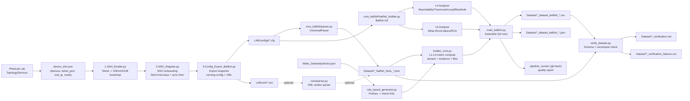

```mermaid

flowchart LR
  A["PNetLab Lab\nTopology/Devices"] --> B["device_info.json\n(devices, telnet_port, oob_ip, creds)"]
  B --> C["1-SSH_Enable.py\nTelnet -> SSHv2/OOB bootstrap"]
  C --> D["2-NSO_Register.py\nNSO onboarding\nfetch-host-keys + sync-from"]
  D --> E["3-Config_Export_Batfish.py\nExport snapshot\nrunning-config + XML"]
  E --> F["LAB/configs/*.cfg"]
  E --> G["LAB/xml/*.xml"]

  F --> H["core_batfish/parser.py\nUniversalParser"]
  H --> I["Dataset/*_batfish_facts_*.json"]

  G -. "optional" .-> H2["core/parser.py\nXML vendor parser"]
  H2 -. "optional" .-> I

  P["Make_Dataset/policies.json"] --> J["rule_based_generator.py\nPolicies -> Intent DSL"]

  I --> K["builder_core.py\nL1-L3 metric compute\nanswer + evidence + files"]
  J --> K

  F --> L["core_batfish/batfish_builder.py\nBatfish init"]
  L --> M["L4 Analyzer\nReachability/Traceroute/Loop/Blackhole"]
  L --> N["L5 Analyzer\nWhat-if/Link-failure/RCA"]

  K --> O["main_batfish.py\nAssemble QA rows"]
  M --> O
  N --> O
  O --> Q["Dataset/*_dataset_batfish_*.csv"]
  O --> R["Dataset/*_dataset_batfish_*.json"]
  O --> S["pipeline_version (git hash)\nquality report"]

  Q --> V["verify_dataset.py\nSchema + recompute check"]
  I --> V
  V --> W["Dataset/*_verification.md"]
  V --> X["Dataset/*_verification_failures.csv"]

```

