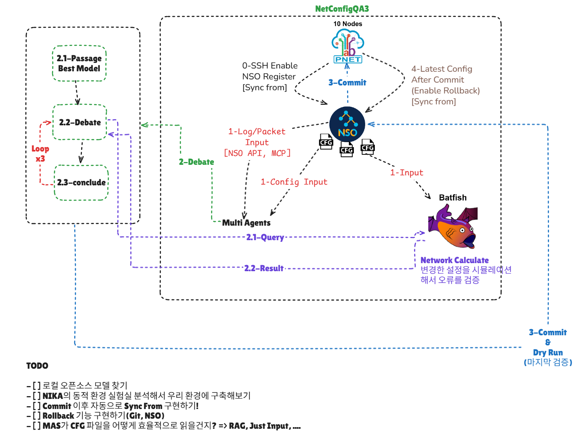

# NetConfigQA3 Core Architecture: Context & Skills Strategy



NetConfigQA2에서 NetConfigQA3로의 진화 핵심은 **"효율적인 Context 관리"**와 **"구조화된 Tool/Skills 전략"**입니다.
이 문서는 "Map + Evidence Pack", "Facts as Memory", "Modular Skills" 세 가지 기둥을 중심으로 설계되었습니다.

---

## 1. Data Strategy: Static & Dynamic Separation

데이터는 성격에 따라 **Static Facts(설정)**와 **Dynamic Telemetry(관측)**로 분리하여 저장하되, LLM에게는 **Evidence Pack**이라는 통일된 형태로 제공합니다.

### 1-1. Static Facts (Configuration)

- **성격**: CFG에서 추출된 구조적 사실 (Snapshot 개념)
- **저장 원칙**: 모든 정보를 프롬프트에 넣지 않고, **질의 가능한 DB/Index**로 변환합니다.
- **계층 구조**:
  - **Level 1 (Map)**: 네트워크 글로벌 요약 (항시 유지).
    - 장비 수/역할, 주요 VRF/AS 목록, 중요 링크, 가용 도구 카탈로그.
  - **Level 2 (Detail)**: 질문에 필요한 구체적 정보.
    - "질의"에 의해 검색된 레코드(Interface 상세, ACL 규칙 등)만 **Evidence Pack**에 포함.
- **구조화 대상**: `Device`, `Interface`, `VRF`, `BGP_Neighbor`, `Policy_Meta` 테이블로 정규화 및 인덱싱.

### 1-2. Dynamic Data Pipeline (Telemetry)

- **성격**: 시간 축에 따라 변화하는 로그, 메트릭, 트래픽 정보.
- **파이프라인 구축**: **Collector(수집) → Storage(저장) → Query(질의) → Evidence Pack(제공)**
- **3-Tier Approach**:
  1.  **Logs (Syslog)**: _가장 중요_. 트러블슈팅의 시작점("언제, 무슨 일이?").
      - 도구: Fluent Bit / Vector (Syslog → JSON Event 구조화).
      - 스키마: `timestamp`, `device`, `severity`, `component`, `signature`, `message`.
  2.  **Metrics (SNMP/Streaming)**: 원인 후보 좁히기 (CPU, Drop, Interface Load).
      - 도구: Prometheus / InfluxDB.
      - 제공 방식: Raw data가 아닌 **Window Aggregation**(평균, 피크, 급증 여부) 제공.
  3.  **Flows (NetFlow/IPFIX)**: 트래픽 경로 분석.
      - 도구: NetFlow Collector.
      - 원칙: Raw Packet(pcap) 대신 Flow Summary 사용 권장.

---

## 2. Tooling Strategy: Mega-Tool & Registry

LLM에게 노출되는 도구 표면적(Surface Area)을 최소화하여 혼란을 줄이고 Context를 아낍니다.

### 2-1. Batfish as a Mega-Tool

수십 개의 Batfish 함수를 개별 도구로 노출하지 않고, **단일 인터페이스 + 템플릿 레지스트리** 패턴을 사용합니다.

- **LLM Interface**:
  ```python
  # 1. 조회
  batfish.query(name="reachability", params={"src": "pe1", "dst": "10.1.1.1", ...})
  # 2. 비교 (변경 전후)
  batfish.diff(name="differentialReachability", params={...}, base="snp1", candidate="snp2")
  ```
- **Template Registry (Server-Side)**:
  - 서버 내부에 `reachability`, `bgpPeers`, `routeTable` 등 자주 쓰는 쿼리를 YAML/Code 템플릿으로 미리 정의.
  - **On-demand Description**: LLM이 스키마를 모를 때만 `batfish.describe_query(name)` 또는 `tools/list`를 통해 스키마를 조회하도록 유도.

### 2-2. Other Tools

- `facts.query(...)`: SQL 기반 정적 정보 질의.
- `logs.query(...)`: 시간 범위 및 키워드 기반 로그 검색.
- `metrics.query(...)`: 특정 구간의 메트릭 통계 조회.

---

## 3. Skills Strategy: Modular Playbooks

하나의 거대한 `Skills.md`는 유지보수가 어렵고 충돌 가능성이 높습니다. 목적에 따라 **모듈화된 작은 플레이북**들을 조합하여 사용합니다.

### 3-1. Core Policy Skill (헌법)

- **적용**: 상시 적용 (가장 높은 우선순위).
- **내용**: 운영 1원칙.
  - "전체 Facts를 절대 통째로 요청하지 말 것."
  - "Evidence Pack은 질문당 항목 수 제한(예: 30개) 준수."
  - "캐시 우선 사용 (중복 질의 방지)."
  - "추가 질의는 최대 1회로 제한 (무한 루프 방지)."

### 3-2. Tool Playbook Skills (도구별 지침)

- **적용**: 해당 도구를 사용할 때 참조.
- **내용**: 도구 사용 패턴 및 에러 핸들링.
  - **Batfish Playbook**: "Traceroute 시에는 반드시 Flow 헤더(src/dst/proto/port)를 명시할 것."
  - **Logs Playbook**: "로그 검색 시 시간 범위를 먼저 좁히고 검색할 것."

### 3-3. Workflow Runbook Skills (시나리오별 루틴)

- **적용**: 특정 작업(Task) 수행 시 호출.
- **내용**: 문제 해결을 위한 표준 절차(SOP).
  - **Reachability Troubleshooting**: 증상 확인(Log) → 경로 추적(Batfish) → 상태 확인(Metric) 순서.
  - **Pre-commit Check**: 문법 검사 → 영향도 분석(Diff) → 승인 요청 절차.
  - **BGP Issue Analysis**: Neighbor 상태 확인 → Route Table 확인 → 정책(Map/Prefix-list) 검증.

---

## 4. Summary: The "Brain" Structure

- **Memory**: Static DB + Telemetry Store (분리 저장) → **Evidence Pack** (통일 출력).
- **Hands**: Batfish/Facts/Logs Mega-Tools (표면적 압축).
- **Knowledge**: Modular Skills (Core / Tool / Workflow)로 상황에 맞게 꺼내 쓰는 지침.

이 구조를 통해 장비 100대 규모에서도 Context 폭발 없이 정밀한 추론이 가능한 NetConfigQA3를 구축합니다.
