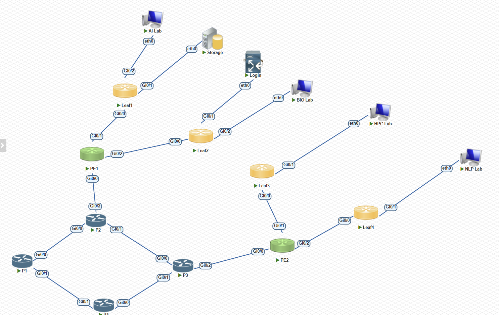
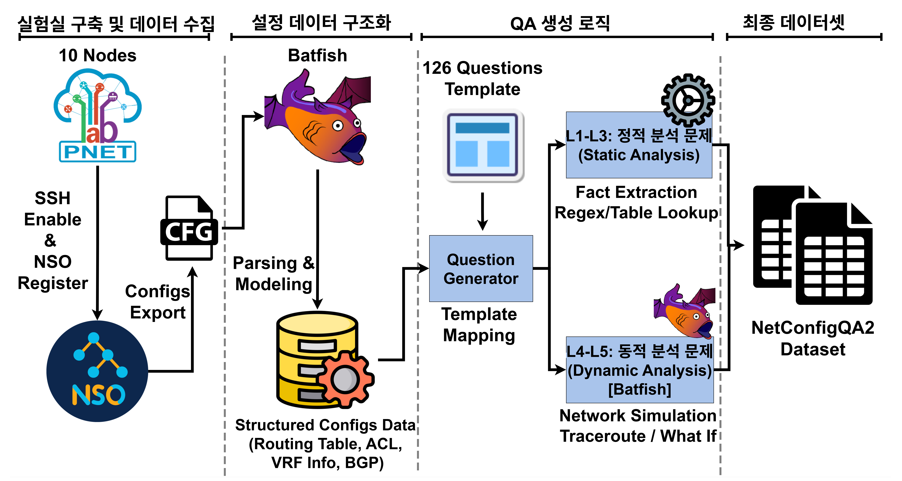

# NetConfigQA2.0 발표 PPT
## 네트워크 설정 해석 능력 평가를 위한 질의응답 벤치마크

> **학회**: KICS 2026  
> **발표 시간**: 15-20분 (약 30 슬라이드)  
> **작성일**: 2026-01-30

---

## Slide 1: 표지 (Title)

# NetConfigQA2.0
### 네트워크 설정 해석 능력 평가를 위한 질의응답 벤치마크

**A Question-Answering Benchmark for Network Configuration Interpretation**

---

**저자**
- 박유진¹, 이현정¹, 김기현², 박찬진², 박진영³, 김태훈¹, 박천음¹*

**소속**
- ¹국립한밭대학교
- ²한국과학기술정보연구원 (KISTI)
- ³성균관대학교

**사사**: 대전 RISE센터 (2025-RISE-06-002)

---

## Slide 2: 목차 (Agenda)

### 📋 발표 순서

1. **연구 배경 및 동기**
2. **기존 연구의 한계**
3. **NetConfigQA2.0 개요**
4. **실험 네트워크 환경**
5. **데이터셋 자동 생성 파이프라인**
6. **5단계 난이도 체계 (L1-L5)**
7. **데이터셋 통계**
8. **Type-Aware Accuracy (TA-Acc)**
9. **실험 방법**
10. **실험 결과 분석**
11. **결론 및 향후 연구**
12. **Q&A**

---

## Slide 3: 연구 배경 (1) - LLM의 네트워크 분야 응용

### 🌐 현황: LLM 기반 네트워크 관리 자동화 연구 활발

| 연구 방향 | 설명 | 연구 현황 |
|-----------|------|-----------|
| **의도 해석** | 자연어 → 네트워크 명령어 변환 | ✅ 활발 |
| **설정 생성** | 요구사항 → Config 자동 생성 | ✅ 활발 |
| **설정 검증** | 생성된 설정의 정확성 확인 | ⚠️ 미비 |
| **운영 해석** | 현재 토폴로지 상태 분석 | ❌ 부족 |

### 💡 문제 제기
> "LLM이 네트워크 설정을 **읽고 이해**하는 능력은 어떻게 평가할 것인가?"

---

## Slide 4: 연구 배경 (2) - 기존 벤치마크 현황

### 📊 통신 도메인 벤치마크 비교

| 벤치마크 | 유형 | 평가 방식 | 데이터 소스 |
|----------|------|-----------|-------------|
| **TeleQnA** | 객관식 QA | Accuracy | 통신 표준 문서 |
| **TeleQuAD** | 추출형 QA | BERTScore | 연구 논문 |
| **NetBench** | 서술형 QA | BERTScore | 네트워크 문서 |
| **NetConfigQA (v1)** | 구조화 QA | EM, F1 | PnetLab XML 로그 |

### ⚠️ 공통 한계점
- 실제 네트워크 **설정 파일 분석 불가**
- **동적 추론** (패킷 도달성, 장애 분석) 평가 불가능

---

## Slide 5: 기존 연구의 한계 - NetConfigQA v1

### 📌 NetConfigQA v1 (선행 연구)

**장점**:
- PnetLab 환경에서 수집한 XML 로그 기반 평가
- 구조화된 답변 형식 도입

**한계점**:
| 한계 | 설명 |
|------|------|
| **정적 분석 한정** | 설정 값 조회만 가능 |
| **동적 추론 불가** | 패킷 경로, 도달성 분석 불가 |
| **장애 시나리오 미지원** | What-If 분석 불가능 |
| **환경 종속성** | 특정 PnetLab 설정에 의존 |

### 🎯 개선 목표
> **Batfish 기반 동적 분석**으로 추론형 질문 생성

---

## Slide 6: NetConfigQA2.0 개요

### 🚀 주요 특징

| 특징 | 설명 |
|------|------|
| 🔧 **자동 생성** | Config 파일만으로 데이터셋 자동 구축 |
| 📊 **5단계 난이도** | L1(단순 조회) → L5(장애 분석) |
| 📐 **TA-Acc** | 네트워크 데이터 특화 평가 지표 |
| 🔬 **동적 분석** | Batfish 시뮬레이션으로 정답 생성 |
| ➖ **Negative Testing** | 미설정 상태(NOT_CONFIGURED) 명시적 평가 |

### 📈 핵심 숫자
- **762개** 질문
- **5단계** 난이도
- **17개** 카테고리
- **5종** 답변 타입

---

## Slide 7: 연구 기여점

### 💡 NetConfigQA2.0의 주요 기여

1. **🔧 자동 생성 파이프라인**
   - 특정 환경에 종속되지 않음
   - Config 파일만 있으면 다양한 토폴로지에 적용 가능

2. **📊 5단계 난이도 체계**
   - 단순 조회(L1) → 장애 추론(L5)까지 단계별 평가

3. **📐 Type-Aware Accuracy**
   - IP/JSON 등 구조화된 데이터에 적합한 평가 방법

4. **🔬 Batfish 기반 정답 생성**
   - 도달성, 경로 분석 결과를 Ground Truth로 활용

5. **💡 LLM 한계 규명**
   - 모델 간 최대 0.73 성능 차이로 변별력 입증

---

## Slide 8: 실험 네트워크 토폴로지

### 🖧 PnetLab MPLS VPN 환경



### 네트워크 구성
- **총 10대 노드**: 4 Leaf + 2 PE + 4 P 라우터
- **VRF 구성**: VRF_AI, VRF_BIO, VRF_HPC (3개 가상 네트워크)
- **프로토콜**: OSPF, MP-BGP, LDP 기반 표준 MPLS L3VPN

---

## Slide 9: 네트워크 구성 상세

### 🔧 장비별 역할

| 장비 유형 | 노드명 | 역할 | 특징 |
|-----------|--------|------|------|
| **PE Router** | pe1, pe2 | VRF 경계 | MP-BGP 피어링, 3개 VRF 정의 |
| **P Router** | p1, p2, p3, p4 | MPLS Core | OSPF Area 0, LDP 활성화 |
| **Leaf Switch** | leaf1-leaf4 | Edge 연결 | 고객 네트워크 접점 |

### 주요 설정 사항
- **iBGP Full-Mesh**: pe1 ↔ pe2
- **OSPF Area 0**: p1, p2, p3, p4, pe1, pe2 (6개 장비)
- **VRF Route Distinguisher**: 65000:1 (AI), 65000:2 (BIO), 65000:3 (HPC)

---

## Slide 10: 기술 스택

### 🛠️ 사용 도구 및 기술

| 구성요소 | 도구/기술 | 역할 |
|----------|-----------|------|
| **네트워크 시뮬레이션** | PnetLab | 가상 네트워크 환경 구축 |
| **설정 수집** | Cisco NSO (RESTCONF) | Config 파일 중앙 수집 |
| **네트워크 분석** | Batfish | 정적/동적 네트워크 분석 |
| **데이터 생성** | Python | 템플릿 기반 QA 자동 생성 |
| **정책 정의** | policies.json | 126개 메트릭 템플릿 관리 |

---

## Slide 11: 데이터셋 자동 생성 파이프라인 개요

### 📋 파이프라인 흐름도



### 핵심 특징
- **환경 독립적**: 특정 토폴로지에 종속되지 않음
- **자동화된 정답 생성**: Batfish 시뮬레이션 결과 활용
- **확장 가능**: JSON 템플릿 수정만으로 새 메트릭 추가

---

## Slide 12: 파이프라인 상세 (단계별)

### 🔄 4단계 데이터 생성 프로세스

```
┌─────────────┐    ┌─────────────┐    ┌─────────────┐    ┌─────────────┐
│ 1. Config   │ → │ 2. Batfish  │ → │ 3. 템플릿   │ → │ 4. QA 생성  │
│    수집     │    │    분석     │    │    적용     │    │             │
└─────────────┘    └─────────────┘    └─────────────┘    └─────────────┘
      ↓                  ↓                  ↓                  ↓
  NSO RESTCONF     인터페이스/라우팅    126개 템플릿      762개 QA 쌍
  10개 장비        VRF/BGP/OSPF        질문 패턴화       5단계 난이도
```

### 정답 생성 방식
| 레벨 | 정답 소스 |
|------|-----------|
| L1-L3 | 추출된 네트워크 구조 정보 |
| L4-L5 | Batfish 시뮬레이션 결과 (Traceroute, Reachability) |

---

## Slide 13: 템플릿 기반 질문 생성 (policies.json)

### 📝 Data-Driven 아키텍처

```json
{
  "system_hostname_text": {
    "level": "L1",
    "category": "System_Inventory",
    "answer_type": "text",
    "template": "{host} 장비의 호스트네임은 무엇입니까?",
    "description": "네트워크 장비의 고유 이름 조회",
    "verification": "검증 방법: Config에서 'hostname' 키워드 확인"
  }
}
```

### 장점
| 장점 | 설명 |
|------|------|
| **코드 수정 불필요** | JSON만 수정하면 새 문제 유형 추가 |
| **일관성** | 템플릿 기반으로 질문 형식 표준화 |
| **확장성** | 126개 → 무한 확장 가능 |

---

## Slide 14: 5단계 난이도 체계 (L1-L5) 개요

### 📊 난이도별 문항 분포

| Level | 설명 | 문항 수 | 비율 |
|-------|------|---------|------|
| **L1** | 단일 장비 설정 조회 | 364개 | 47.8% |
| **L2** | 복수 장비 설정 집계 | 21개 | 2.8% |
| **L3** | 장비 간 정합성 검증 | 127개 | 16.7% |
| **L4** | 동적 도달성 분석 | 149개 | 19.6% |
| **L5** | 장애 시나리오 추론 | 101개 | 13.3% |
| **Total** | | **762개** | **100%** |

### 난이도 증가 원리
> L1 (단순 조회) → L5 (다단계 추론)으로 **복잡도 상승**

---

## Slide 15: L1 - 단일 장비 설정 조회 (Single Device Query)

### 📌 Level 1: 기본 설정 값 조회

**특징**:
- 단일 장비에서 특정 설정 값을 추출
- 가장 기본적인 네트워크 지식 평가

**예시 질문**:
| 질문 | 정답 |
|------|------|
| "pe1 장비의 호스트네임은?" | `"pe1"` |
| "p2 장비의 Loopback IP는?" | `"10.0.0.1/32"` |
| "pe2 장비의 BGP Local-AS는?" | `65000` |
| "leaf1의 SSH 버전은?" | `2` |

**문항 수**: 364개 (47.8%)

---

## Slide 16: L2 - 복수 장비 설정 집계 (Multi-Device Aggregation)

### 📌 Level 2: 다중 장비 정보 집계

**특징**:
- 여러 장비에서 공통 설정 조회 및 집계
- 필터링, 카운팅, 목록화 능력 평가

**예시 질문**:
| 질문 | 정답 |
|------|------|
| "SSH 활성화 장비 목록은?" | `["leaf1", "leaf2", ..., "pe2"]` |
| "OSPF Area 0 멤버 장비는?" | `["p1", "p2", "p3", "p4", "pe1", "pe2"]` |
| "AAA 미설정 장비 수는?" | `0` |
| "VRF_AI 사용 장비 목록?" | `["pe1", "pe2"]` |

**문항 수**: 21개 (2.8%)

---

## Slide 17: L3 - 장비 간 정합성 검증 (Cross-Device Consistency)

### 📌 Level 3: 설정 일관성 검사

**특징**:
- 여러 장비 간 설정의 정합성/일관성 검증
- 네트워크 설계 의도 파악 능력 평가

**예시 질문**:
| 질문 | 정답 |
|------|------|
| "AS 65000의 iBGP Full-Mesh 상태?" | `"OK"` 또는 `"Missing: A↔B"` |
| "L2VPN 양방향 설정 검증?" | `"OK"` 또는 `"Unidirectional"` |
| "pe1과 pe2의 VRF 일치 여부?" | `"MATCH"` |
| "OSPF 인접성 불일치 탐지?" | `["p1↔p2"]` |

**문항 수**: 127개 (16.7%)

---

## Slide 18: L4 - 동적 도달성 분석 (Reachability Analysis)

### 📌 Level 4: Batfish 기반 패킷 경로 분석

**특징**:
- Batfish `traceroute()` API 활용
- 실제 패킷 경로 시뮬레이션

**예시 질문**:
| 질문 | 정답 |
|------|------|
| "pe1에서 10.0.1.1까지 경로?" | `"pe1 → p2 → p3 → pe2"` |
| "leaf1에서 leaf4까지 홉 수?" | `3` |
| "pe2에서 172.16.3.2 도달 가능?" | `"REACHABLE"` |
| "p1을 경유하는 경로 존재?" | `true` |

**문항 수**: 149개 (19.6%)

---

## Slide 19: L5 - 장애 시나리오 추론 (What-If Analysis)

### 📌 Level 5: 장애 상황 기반 추론

**특징**:
- Batfish `Fork Snapshot`으로 장애 시뮬레이션
- 설정 변경/링크 장애 시 영향 분석

**예시 질문**:
| 질문 | 정답 |
|------|------|
| "pe1↔p1 링크 다운 시 영향?" | `"REROUTED"` / `"DISCONNECTED"` |
| "p2 장애 시 대체 경로?" | `"pe1 → p1 → p3 → pe2"` |
| "VRF_AI 트래픽 영향 범위?" | `["leaf1", "leaf2"]` |
| "OSPF Cost 변경 시 경로?" | `"pe1 → p3 → pe2"` |

**문항 수**: 101개 (13.3%)

### 핵심 차별점
> 기존 벤치마크: 정적 "**설정 읽기**"만 평가  
> NetConfigQA2.0: 동적 "**상황 추론**"까지 평가

---

## Slide 20: 데이터셋 통계 (1) - 전체 개요

### 📊 데이터셋 요약 (762개 QA)

| 항목 | 값 |
|------|-----|
| **총 질문 수** | 762개 |
| **난이도 레벨** | 5단계 (L1-L5) |
| **카테고리** | 17개 |
| **답변 타입** | 5종 |
| **Positive Testing (OK)** | 577개 (75.7%) |
| **Negative Testing (NOT_CONFIGURED)** | 185개 (24.3%) |

### Positive vs Negative Testing
```
┌────────────────────────────────────────────────────────┐
│████████████████████████████████████████████████ 75.7% │ OK
│████████████████████ 24.3%                             │ NOT_CONFIGURED
└────────────────────────────────────────────────────────┘
```

---

## Slide 21: 데이터셋 통계 (2) - 카테고리별 분포

### 📂 17개 카테고리 분포

| 카테고리 | 문항 수 | 비율 |
|----------|---------|------|
| System_Inventory | 110 | 14.4% |
| Reachability_Analysis | 127 | 16.7% |
| Comparison_Analysis | 106 | 13.9% |
| What_If_Analysis | 101 | 13.3% |
| Routing_Inventory | 70 | 9.2% |
| Services_Inventory | 70 | 9.2% |
| Interface_Inventory | 40 | 5.2% |
| Security_Inventory | 40 | 5.2% |
| Configuration_Check | 30 | 3.9% |
| 기타 (8개 카테고리) | 68 | 8.9% |

---

## Slide 22: 데이터셋 통계 (3) - 답변 타입 분포

### 🏷️ 5종 답변 타입

| 답변 타입 | 문항 수 | 비율 | 예시 |
|-----------|---------|------|------|
| **text** | 392 | 51.4% | `"pe1"`, `"pe1 → p2 → pe2"` |
| **set** | 162 | 21.3% | `["leaf1", "leaf2"]` |
| **numeric** | 101 | 13.3% | `3`, `65000` |
| **number** | 67 | 8.8% | `15`, `2` |
| **map** | 40 | 5.2% | `{"Gi0/0": "10.0.0.1"}` |

### 타입별 분포 시각화
```
text     ████████████████████████████████████████████████████ 51.4%
set      ████████████████████████ 21.3%
numeric  ███████████████ 13.3%
number   ██████████ 8.8%
map      ██████ 5.2%
```

---

## Slide 23: 데이터셋 통계 (4) - 레벨 × 답변 타입

### 📊 Level별 답변 타입 분포

| Level | map | number | numeric | set | text | Total |
|-------|-----|--------|---------|-----|------|-------|
| L1 | 40 | 10 | 85 | 128 | 101 | 364 |
| L2 | - | 1 | 11 | 9 | - | 21 |
| L3 | - | - | 5 | 15 | 107 | 127 |
| L4 | - | 45 | - | 7 | 97 | 149 |
| L5 | - | 11 | - | 3 | 87 | 101 |

### 특징
- **L1**: 모든 타입 골고루 사용 (가장 다양)
- **L3-L5**: `text` 타입 위주 (경로, 상태 설명)
- **L4**: `number` 타입 증가 (홉 수 등 수치 분석)

---

## Slide 24: 데이터셋 검증 결과

### ✅ Batfish 기반 자동 검증

| 검증 결과 | 문항 수 | 비율 |
|-----------|---------|------|
| ✅ PASS | 220 | 28.9% |
| ❌ FAIL | 48 | 6.3% |
| ⏭️ SKIP | 494 | 64.8% |
| **Total** | **762** | **100%** |

### 레벨별 검증 결과
| Level | PASS | FAIL | SKIP | Total |
|-------|------|------|------|-------|
| L1 | 170 | 2 | 192 | 364 |
| L2 | 0 | 0 | 21 | 21 |
| L3 | 0 | 0 | 127 | 127 |
| L4 | 50 | 45 | 54 | 149 |
| L5 | 0 | 1 | 100 | 101 |

> **주요 실패 원인**: 경로 분석(bounded_path_length, traceroute_path) 불일치

---

## Slide 25: 기존 평가 지표의 한계

### ⚠️ 네트워크 데이터에 부적합한 기존 지표

| 지표 | 문제점 | 예시 |
|------|--------|------|
| **Exact Match** | 순서 다르면 오답 | `["a","b"]` vs `["b","a"]` |
| **F1 (Token)** | 한 글자 차이도 높은 점수 | `10.0.0.1` vs `10.0.0.2` |
| **BERTScore** | 의미 유사도 ≠ 정확성 | "경로 없음" vs "도달 불가" |

### 💡 핵심 문제
> 네트워크 데이터는 **"거의 비슷함"이 의미 없음**
> - IP 주소 한 자리 차이 = 완전히 다른 장비
> - 집합 순서는 의미 없음 but EM은 오답 처리

---

## Slide 26: Type-Aware Accuracy (TA-Acc) 제안

### 📐 타입별 맞춤 평가 지표

**수식**:
$$TA\text{-}Acc = \frac{1}{N} \sum_{i=1}^{N} s(p_i, g_i | t_i)$$

**타입별 채점 함수**:
$$s(\cdot) = \begin{cases} F1_{set/map} & (t_i \in \text{Struct: set, map}) \\ EM_{norm} & (\text{otherwise: text, boolean, numeric}) \end{cases}$$

### 핵심 아이디어
- **Structured 타입** (set, map): 순서 무관 F1 Score
- **Primitive 타입** (text, number): 정규화 후 Exact Match

---

## Slide 27: 답변 타입별 채점 로직

### 🎯 5종 타입별 평가 방식

| 타입 | 채점 방식 | 예시 |
|------|----------|------|
| **boolean** | 의미 정규화 후 비교 | "yes", "True", "1" → `True` |
| **numeric** | 숫자 추출 후 비교 | "15개", "15", "fifteen" → `15` |
| **text** | 정규화 후 Exact Match | "pe1", "PE1" → 동일 취급 |
| **set** | F1 Score (순서 무관) | `["a","b"]` vs `["b","c"]` → F1=0.5 |
| **map** | 키-값 구조 비교 | `{"k1":"v1"}` vs `{"k1":"v2"}` → 키 일치, 값 불일치 |

### Negative Testing 지원
| Status | 의미 | 정답 예시 |
|--------|------|-----------|
| `OK` | 정상 설정됨 | `"pe1"`, `["10.0.0.1"]` |
| `NOT_CONFIGURED` | 설정 없음 | `null`, `[]` |

---

## Slide 28: 실험 설정

### 🔬 평가 대상 모델

| 모델 | 파라미터 크기 | 특징 |
|------|-------------|------|
| GPT-4o-mini | 비공개 | OpenAI 경량 모델 |
| Llama-3.1-8B | 8B | Meta 오픈소스 |
| Mistral3-8B | 8B | Mistral AI 오픈소스 |
| Qwen3-8B | 8B | Alibaba 오픈소스 |
| GPT-OSS-20B | 20B | OpenAI 대형 모델 |

### 비교 벤치마크
- **TeleQnA**: 객관식 (Accuracy)
- **TeleQuAD**: 추출형 (BERTScore)
- **NetBench**: 서술형 (BERTScore)

---

## Slide 29: 실험 결과 (1) - 기존 벤치마크 성능

### 📊 통신 도메인 벤치마크 비교

| Model | TeleQnA (Acc) | TeleQuAD (BERT) | NetBench (BERT) | Avg |
|-------|--------------|-----------------|-----------------|-----|
| GPT-4o-mini | 0.743 | 0.824 | 0.720 | 0.762 |
| Llama3.1-8B | 0.664 | 0.851 | 0.798 | 0.771 |
| Mistral3-8B | 0.706 | 0.866 | 0.790 | 0.787 |
| Qwen3-8B | 0.733 | 0.867 | 0.799 | 0.800 |
| **GPT-OSS-20B** | **0.757** | **0.876** | **0.808** | **0.814** |

### 관찰
> 모델 간 성능 차이가 **0.05 이내**로 크지 않음
> → 기존 벤치마크의 **변별력 부족**

---

## Slide 30: 실험 결과 (2) - NetConfigQA2.0 성능

### 📊 다양한 지표 비교

| Model | Rouge-L | BERTScore | EM | F1 | **TA-Acc** |
|-------|---------|-----------|----|----|----------|
| GPT-4o-mini | 0.155 | 0.942 | 0.398 | 0.539 | **0.515** |
| Llama-3.1-8B | 0.314 | 0.897 | 0.176 | 0.302 | **0.291** |
| Mistral3-8B | 0.279 | 0.875 | 0.201 | 0.304 | **0.416** |
| Qwen3-8B | 0.414 | 0.932 | 0.339 | 0.472 | **0.465** |
| GPT-OSS-20B | 0.439 | 0.942 | 0.437 | 0.529 | **0.612** |

### 핵심 발견
- **성능 편차 최대 0.73** (GPT-OSS vs Llama) → 뚜렷한 변별력
- BERTScore는 모두 0.87+ 유사 → 네트워크 데이터에 **부적합**
- **TA-Acc가 모델 간 차이를 가장 명확히 구분**

---

## Slide 31: 실험 결과 (3) - 난이도별 성능

### 📊 Level별 TA-Acc 성능

| Model | L1 | L2 | L3 | L4 | L5 |
|-------|-----|-----|-----|-----|-----|
| GPT-4o-mini | 0.765 | 0.541 | 0.369 | 0.267 | 0.159 |
| Llama-3.1-8B | 0.368 | 0.371 | 0.305 | 0.184 | 0.138 |
| Mistral3-8B | 0.572 | 0.143 | 0.500 | 0.158 | 0.183 |
| Qwen3-8B | 0.639 | 0.294 | 0.431 | 0.256 | 0.225 |
| **GPT-OSS-20B** | **0.873** | **0.873** | **0.605** | 0.266 | 0.134 |

### 핵심 발견
- **L1-L2**: 대형 모델 최대 **0.873** 달성
- **L4-L5**: 모든 모델 **0.3 이하**로 급락
- **시사점**: 개별 설정 이해 ✅ / 전체 상태 추론 ❌

---

## Slide 32: 결과 분석 - 성능 급락 원인

### ⚠️ L4-L5 저성능 원인 분석

| 원인 | 설명 |
|------|------|
| **추론 체인 부족** | L1: 단순 조회 vs L5: 다단계 추론 필요 |
| **도메인 지식 부재** | OSPF Cost 계산, BGP 경로 선택 로직 미이해 |
| **시뮬레이션 능력 부재** | 장애 상황에서의 네트워크 동작 예측 불가 |

### 난이도별 추론 복잡도
```
L1: "pe1의 IP?" 
    → 단순 조회 (1-step)

L5: "링크 다운 시 대체 경로?"
    → 장애 감지 → 토폴로지 재계산 → 새 경로 탐색 (N-step)
```

### 결론
> NetConfigQA2.0이 LLM의 **네트워크 추론 능력의 명확한 한계**를 규명

---

## Slide 33: 연구 기여 요약

### 💡 NetConfigQA2.0의 핵심 기여

| 기여 | 설명 |
|------|------|
| 🔧 **자동 생성 파이프라인** | Config 파일만으로 벤치마크 자동 구축 |
| 📊 **5단계 난이도 체계** | 단순 조회(L1) → 장애 추론(L5) 단계별 평가 |
| 📐 **TA-Acc 지표** | 네트워크 데이터 특화 평가 방법 제안 |
| 🔬 **변별력 입증** | 모델 간 최대 0.73 성능 차이 확인 |
| 💡 **한계 발견** | LLM의 동적 추론 능력 부족 규명 |
| 🌐 **환경 독립적** | 다양한 토폴로지에 적용 가능 |

---

## Slide 34: 한계점 및 향후 연구

### ⚠️ 현재 한계

| 한계 | 설명 |
|------|------|
| **단일 토폴로지** | 10 노드에서만 검증 |
| **단일 벤더** | Cisco IOS 기반 설정에 한정 |
| **제한된 시나리오** | 특정 MPLS VPN 환경만 테스트 |

### 🚀 향후 연구 계획

1. **Fine-tuning**: 네트워크 도메인 특화 학습
2. **Multi-Agent System**: 
   - Batfish + NSO + LLM 결합
   - LLM이 실제 PnetLab 장비 직접 제어
3. **확장**:
   - 더 복잡한 토폴로지 (50+ 노드)
   - 다양한 벤더 지원 (Juniper, Arista)
4. **태스크 중심 벤치마크**: 설정 해석 → 실제 운영 태스크 수행 평가

---

## Slide 35: 결론

### 📌 핵심 메시지

> **NetConfigQA2.0은 LLM의 네트워크 설정 해석 능력을 체계적으로 평가하는 최초의 동적 분석 기반 벤치마크이다.**

### 주요 성과

- ✅ 정적 분석을 넘어 **동적 시뮬레이션(Batfish)** 기반 평가
- ✅ **타입별 맞춤 평가(TA-Acc)**로 구조화된 데이터 정확히 평가
- ✅ **762개 QA**, **5단계 난이도**, **17개 카테고리** 데이터셋 구축
- ⚠️ 현재 LLM은 개별 설정 이해 ✅ but **전체적 추론에는 한계** ❌
- 🔮 Multi-Agent 시스템으로 실제 네트워크 제어까지 확장 예정

---

## Slide 36: 감사합니다 / Q&A

# 감사합니다

## Questions?

---

**연락처**
- 📧 parkce@hanbat.ac.kr

**사사**
- 대전 RISE센터 (2025-RISE-06-002)

**코드/데이터셋**
- GitHub: (공개 예정)

---

## Appendix A: 데이터셋 예시

### 📋 실제 QA 샘플

```csv
ID,Level,Question,Answer_Status,Answer

SYSTEM_HOSTNAME_TEXT,L1,
"p2 장비의 호스트네임은?",OK,"p2"

SSH_ENABLED_DEVICES,L2,
"SSH 활성화 장비 목록?",OK,["leaf1","leaf2","leaf3","leaf4","p1","p2","p3","p4","pe1","pe2"]

IBGP_FULLMESH_OK,L3,
"AS 65000 iBGP 상태?",OK,"OK"

TRACEROUTE_PATH,L4,
"pe1에서 10.0.1.1까지 경로?",OK,"pe1 → p2 → p3 → pe2"

LINK_FAILURE_IMPACT,L5,
"pe1↔p1 링크 다운 시?",OK,"REROUTED"
```

---

## Appendix B: 주요 메트릭 목록

### 📂 126개 템플릿 중 주요 항목

| 카테고리 | 메트릭 예시 |
|----------|------------|
| **System** | hostname, version, timezone, user_list |
| **Interface** | ip_map, status_map, vrf_bind |
| **Routing** | bgp_local_as, ospf_areas, neighbor_list |
| **Security** | ssh_version, aaa_method, vty_transport |
| **L4 (Reachability)** | traceroute_path, bounded_path_length |
| **L5 (What-If)** | link_failure_impact, differential_reachability |

---

## Appendix C: policies.json 상세 예시

### 📝 L1 메트릭 정의

```json
{
  "system_hostname_text": {
    "level": "L1",
    "category": "System_Inventory",
    "answer_type": "text",
    "template": "{host} 장비의 호스트네임은 무엇입니까? [답변 형식: 정확한 값만]",
    "description": "네트워크 장비의 고유 이름(Hostname) 조회",
    "verification": "Config에서 'hostname' 키워드 확인",
    "logic_ref": "facts.devices[host].system.hostname"
  }
}
```

### 📝 L4 메트릭 정의

```json
{
  "traceroute_path": {
    "level": "L4",
    "category": "Reachability_Analysis",
    "answer_type": "text",
    "template": "{src}에서 {dst_ip}까지의 경로를 나열해주세요.",
    "description": "Batfish traceroute 시뮬레이션 기반 경로 분석",
    "logic_ref": "batfish.traceroute(src, dst_ip)"
  }
}
```

---

## Appendix D: Batfish 활용 상세

### 🔧 L4/L5 정답 생성 방법

**L4: Traceroute 분석**
```python
# Batfish API 호출
result = bf.q.traceroute(
    startLocation="pe1",
    headers=HeaderConstraints(dstIps="10.0.1.1")
).answer()

# 결과: pe1 → p2 → p3 → pe2
```

**L5: What-If 분석**
```python
# Fork Snapshot으로 장애 시뮬레이션
bf.fork_snapshot(
    base_name="baseline",
    new_name="link_failure",
    deactivate_interfaces=[("pe1", "GigabitEthernet0/1")]
)

# 장애 후 경로 비교
diff = bf.q.differentialReachability(...)
```

---

## Appendix E: 참고 문헌

1. C. Wang et al., "Netconfeval: Can llms facilitate network configuration?," *Proc. ACM Netw.*, June 2024.
2. S. K. Mani et al., "Enhancing network management using code generated by large language models," *ACM Workshop on Hot Topics in Networks (HotNets)*, November 2023.
3. Boateng et al., "A survey on large language models for communication, network, and service management," *IEEE Communications Surveys & Tutorials*, 2025.
4. Y. Park et al., "Netconfigqa: A question-answering dataset for network configuration interpretation," *Proceedings of the 37th Annual Conference on Human and Language Technology*, 2025.
5. A. Maatouk et al., "Teleqna: A benchmark dataset to assess large language models telecommunications knowledge," 2023.
6. F. Gebre et al., "Telequad: A suite of question answering datasets for the telecom domain," 2025.
7. [NetoAi], "Netbench dataset," 2025.
