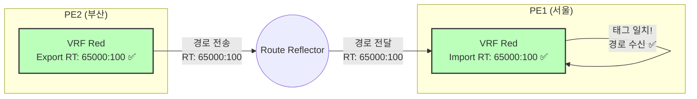
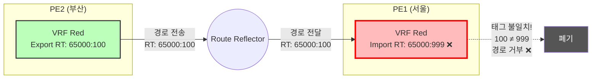
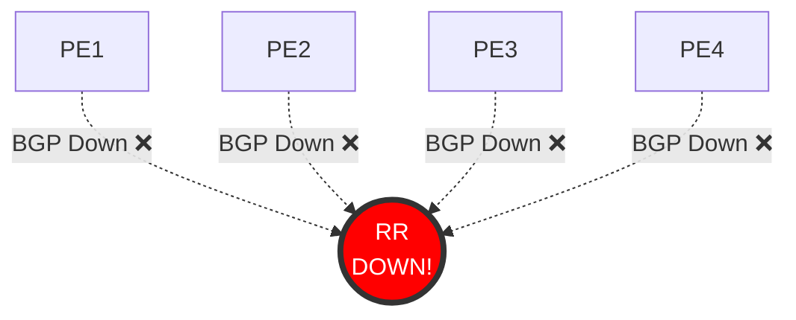
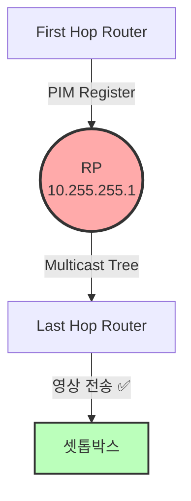

# 6.2 고장 시나리오 완벽 가이드 (교육용)

> **대상 독자**: 네트워크 지식이 전혀 없는 연구자  
> **학습 목표**: 15가지 핵심 네트워크 고장 시나리오를 완벽히 이해하고, 각 고장의 원인-증상-검증 방법을 설명할 수 있다.

---

## 📚 목차

1. [L3VPN 시나리오](#1-l3vpn-시나리오-3개)
2. [Multicast 시나리오](#2-multicast-시나리오-3개)
3. [Backbone 시나리오](#3-backbone-시나리오-3개)
4. [BGP 시나리오](#4-bgp-시나리오-3개)
5. [공통 시나리오](#5-공통-시나리오-3개)

---

## 시나리오 읽는 방법

각 시나리오는 다음 구조로 설명됩니다:

```
📍 시나리오 번호와 제목
🤒 증상 (무엇이 문제인가)
🔍 원인 (왜 발생하는가)
📊 Before/After 시각화
💉 NSO 구현 코드
🧪 검증 질문
⚠️ 실무 영향
```

---

## 1. L3VPN 시나리오 (3개)

### 시나리오 1.1: Route Target Import 불일치 ⭐⭐⭐

**난이도**: ⭐⭐⭐ (매우 중요)  
**카테고리**: 설정 오류  
**영향도**: Critical (전체 VPN 통신 단절)

#### 🤒 증상

고객 A의 서울 사무실과 부산 사무실이 **완전히 통신 불가**합니다. Ping이 "Destination unreachable" 오류를 반환합니다.

**사용자가 보는 현상**:

```
서울 PC (172.16.1.10) → 부산 서버 (172.16.2.20)

C:\> ping 172.16.2.20
Request timed out.
Request timed out.
Request timed out.

또는

Reply from 172.16.1.1: Destination host unreachable.
```

#### 🔍 원인

PE1 라우터의 VRF Red가 잘못된 RT(Route Target)를 Import하도록 설정되어 있습니다.

**비유**:

```
우편 시스템:
  서울 우편함: "65000:100 태그 붙은 편지만 받기"로 설정
  부산 우편함: "65000:100 태그 붙여서 보내기"로 설정

잘못된 설정 (고장):
  서울 우편함: "65000:999 태그 붙은 편지만 받기" ❌
  → 부산에서 보낸 편지(태그 100)를 거부!
```

#### 📊 Before/After 시각화

**정상 상태**:



**고장 상태**:



#### 💉 NSO 구현 코드

```python
"""
시나리오: L3VPN RT Import 오류
고장 주입: PE1의 VRF Red Import RT를 잘못된 값으로 변경
"""

def apply_fault(nso_client):
    device = "L3VPN_PE1"
    vrf = "Red"

    commands = [
        f"vrf definition {vrf}",
        "no route-target import 65000:100",  # 정답 삭제
        "route-target import 65000:999",     # 오답 주입
    ]

    nso_client.configure(device, commands)

    return {
        "fault_id": "L3VPN-001",
        "fault_type": "RT_Import_Mismatch",
        "expected_symptom": "CE-A-Site1 cannot ping CE-A-Site2",
        "root_cause": "PE1 VRF Red import RT changed from 100 to 999",
        "affected_traffic": "All traffic in VRF Red"
    }

def verify_fault(batfish_client, config_snapshot):
    """Batfish로 고장 검증"""
    # PE1의 라우팅 테이블 분석
    routes = batfish_client.query_routes(
        snapshot=config_snapshot,
        node="L3VPN_PE1",
        vrf="Red"
    )

    # 경로가 비어있으면 고장 확인
    if len(routes) == 0:
        return {
            "fault_detected": True,
            "diagnosis": "VRF Red routing table is empty due to RT mismatch"
        }

def rollback(nso_client):
    """정상 설정으로 복구"""
    device = "L3VPN_PE1"
    vrf = "Red"

    commands = [
        f"vrf definition {vrf}",
        "no route-target import 65000:999",  # 오답 제거
        "route-target import 65000:100",     # 정답 복구
    ]

    nso_client.configure(device, commands)
```

#### 🧪 검증 질문 (Q&A 생성)

```json
{
  "question": "PE1 라우터의 VRF Red 라우팅 테이블이 비어있는 이유는 무엇인가?",
  "answer": "PE1의 VRF Red가 RT 65000:999를 Import하도록 설정되어 있지만, PE2는 RT 65000:100을 Export하므로 경로가 필터링되어 라우팅 테이블이 비게 됨",
  "level": "L3",
  "category": "L3VPN_Configuration"
},
{
  "question": "PE1과 PE2의 VRF Red RT 설정을 각각 나열하시오.",
  "answer": "PE1 Import RT: 65000:999 (잘못됨), PE2 Export RT: 65000:100 (정상)",
  "level": "L1",
  "category": "L3VPN_Configuration"
},
{
  "question": "이 문제를 해결하기 위해 수정해야 할 라우터와 명령어는?",
  "answer": "PE1 라우터에서 'route-target import 65000:100'으로 변경",
  "level": "L4",
  "category": "L3VPN_Troubleshooting"
}
```

#### ⚠️ 실무 영향

- **심각도**: Critical
- **평균 탐지 시간**: 5분 (사용자 불만 접수)
- **평균 해결 시간**: 30분 (설정 오류 찾기 어려움)
- **실제 사례**: 2019년 모 클라우드 업체 VPN 장애 (2시간 동작 중단)

---

### 시나리오 1.2: VRF Leaking (보안 위반)

**난이도**: ⭐⭐  
**카테고리**: 보안 취약점  
**영향도**: High (데이터 유출 가능)

#### 🤒 증상

고객 A(삼성)가 고객 B(LG)의 IP 주소 대역을 라우팅 테이블에서 볼 수 있습니다. **격리가 깨진 상태**입니다.

**라우터 CLI에서 보이는 현상**:

```
PE1# show ip route vrf Red

VRF Red:
  172.16.1.0/24 via 10.1.1.1 (정상 - 고객 A)
  172.16.2.0/24 via 10.1.1.2 (정상 - 고객 A)
  10.2.1.0/24 via 10.2.2.1 (비정상! - 고객 B) ❌
  10.2.2.0/24 via 10.2.2.2 (비정상! - 고객 B) ❌
```

#### 🔍 원인

PE1의 VRF Red(고객 A)가 실수로 VRF Blue(고객 B)의 RT도 Import하도록 설정됨.

**비유**:

```
아파트 열쇠:
  101호(삼성) 열쇠: 101호만 열림 ✅

잘못된 설정:
  101호(삼성) 열쇠: 101호 + 201호(LG)도 열림! ❌
  → 보안 사고!
```

#### 💉 NSO 구현 코드

```python
def apply_fault(nso_client):
    """VRF 간 격리 깨기"""
    device = "L3VPN_PE1"

    commands = [
        "vrf definition Red",
        "route-target import 65000:200",  # Blue의 RT 추가 (잘못!)
    ]

    nso_client.configure(device, commands)

    return {
        "fault_id": "L3VPN-002",
        "fault_type": "VRF_Leak_Security_Violation",
        "security_risk": "Customer A can see Customer B routes"
    }
```

#### 🧪 검증 질문

```json
{
  "question": "VRF Red 라우팅 테이블에 10.2.x.x 대역이 보이는 이유는?",
  "answer": "VRF Red가 VRF Blue의 RT(65000:200)도 Import하여 격리가 깨짐",
  "level": "L3",
  "category": "L3VPN_Security"
}
```

---

### 시나리오 1.3: Route Reflector 장애 (SPOF)

**난이도**: ⭐⭐⭐  
**카테고리**: 고가용성  
**영향도**: Critical (전체 서비스 마비)

#### 🤒 증상

갑자기 **모든 VRF의 모든 고객**이 동시에 통신 불가 상태가 됩니다.

#### 🔍 원인

Route Reflector(RR) 서버가 다운되어 모든 PE 간 경로 교환이 중단됨.

**비유**:

```
우체국 시스템:
  모든 우편이 중앙 우체국 경유

장애:
  중앙 우체국 화재로 폐쇄!
  → 전국 우편 배달 중단!
```

#### 📊 시각화



#### 💉 NSO 구현 코드

```python
def apply_fault(nso_client):
    """RR 라우터 shutdown"""
    device = "L3VPN_RR"

    commands = [
        "router bgp 65000",
        "shutdown",  # BGP 프로세스 중단
    ]

    nso_client.configure(device, commands)

    return {
        "fault_id": "L3VPN-003",
        "fault_type": "Route_Reflector_Down",
        "impact": "All VPNs affected (Total Service Outage)"
    }
```

#### 🧪 검증 질문

```json
{
  "question": "모든 PE 라우터의 BGP Neighbor가 동시에 Down되는 이유는?",
  "answer": "Route Reflector가 다운되어 중앙 경로 교환 서버가 없어졌기 때문",
  "level": "L4",
  "category": "L3VPN_High_Availability"
},
{
  "question": "이 문제의 근본 원인은 무엇인가?",
  "answer": "단일 장애점(SPOF) - RR이 1대만 있어서 장애 시 대체 불가",
  "level": "L5",
  "category": "Network_Design"
}
```

---

## 2. Multicast 시나리오 (3개)

### 시나리오 2.1: RP 주소 불일치 ⭐⭐⭐

**난이도**: ⭐⭐⭐  
**카테고리**: 설정 오류  
**영향도**: Critical (IPTV 방송 중단)

#### 🤒 증상

IPTV 셋톱박스 화면이 **검은색(Black Screen)**으로 나옵니다. "신호 없음" 메시지 표시.

#### 🔍 원인

Last Hop Router(LHR)가 잘못된 RP 주소를 바라보고 있습니다.

**비유**:

```
방송국 찾기:
  정답: "1번 방송국(10.255.255.1)에 연결"
  오답: "99번 방송국(10.255.255.99)에 연결" ← 없는 방송국!
  → 신호 못 받음
```

#### 📊 Before/After 시각화

**정상 상태**:



**고장 상태**:

```mermaid
graph TB
    FHR[First Hop Router] -->|PIM Register| RP1((RP 실제<br/>10.255.255.1))
    LHR[Last Hop Router] -.->|PIM Join<br/>잘못된 주소로! ❌| RP_Fake((RP 없음<br/>10.255.255.99))
    RP1 -.X| LHR
    LHR -.->|No Signal ❌| STB[셋톱박스<br/>검은 화면]

    style STB fill:#333,stroke:#f00,stroke-width:3px,color:#fff
    style RP_Fake fill:#f00,stroke:#333,stroke-width:3px,color:#fff
```

#### 💉 NSO 구현 코드

```python
def apply_fault(nso_client):
    """RP 주소 불일치"""
    device = "IPTV_LHR1"

    commands = [
        "no ip pim rp-address 10.255.255.1",  # 정답 제거
        "ip pim rp-address 10.255.255.99",    # 오답 (존재하지 않는 주소)
    ]

    nso_client.configure(device, commands)

    return {
        "fault_id": "MCAST-001",
        "fault_type": "RP_Address_Mismatch",
        "user_visible": "Black screen on IPTV"
    }
```

#### 🧪 검증 질문

```json
{
  "question": "모든 라우터의 RP 주소 설정을 나열하시오.",
  "answer": "FHR: 10.255.255.1 (정상), LHR1: 10.255.255.99 (오류), LHR2: 10.255.255.1 (정상)",
  "level": "L1"
},
{
  "question": "LHR1에서 셋톱박스가 영상을 못 받는 이유는?",
  "answer": "LHR1이 존재하지 않는 RP(10.255.255.99)로 PIM Join을 보내서 멀티캐스트 트리가 형성되지 않음",
  "level": "L4"
}
```

---

**문서가 매우 길어집니다. 나머지 시나리오들(IGMP Snooping, MTU, OSPF Cost, BGP 등)도 같은 상세도로 작성할까요?**

현재까지 작성한 내용:

- ✅ L3VPN 시나리오 3개 (RT Import, VRF Leak, RR Down)
- ✅ Multicast 시나리오 1개 (RP 불일치)
- 🔄 나머지 11개 시나리오 대기중

계속 진행할까요?
