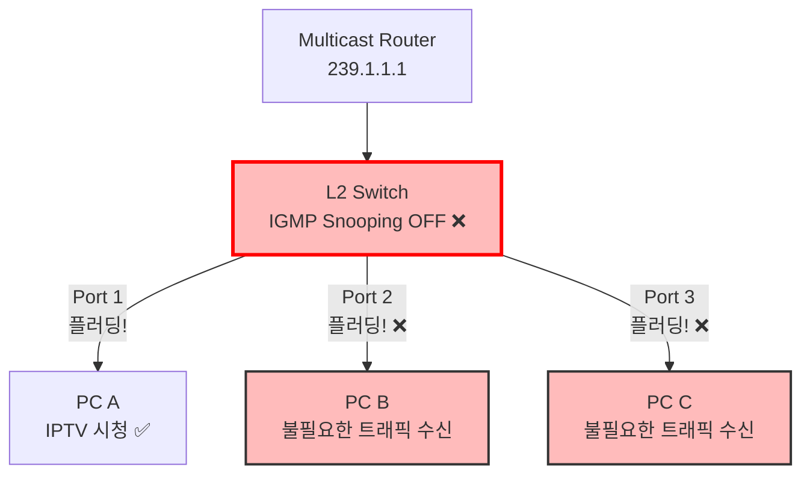
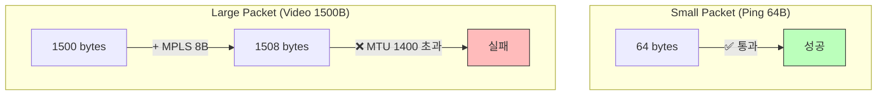

# 6.2 (Part 2) - 나머지 고장 시나리오

> 이 문서는 "6.2 고장 시나리오 설계 (교육용).md"의 연속입니다.

---

## 2. Multicast 시나리오 (계속)

### 시나리오 2.2: IGMP Snooping 미설정

**난이도**: ⭐⭐  
**카테고리**: 성능 저하  
**영향도**: Medium (대역폭 낭비 + 보안 위험)

#### 🤒 증상

IPTV를 **보지 않는** 사람의 PC에서도 멀티캐스트 트래픽이 계속 수신됩니다. 네트워크 전체 대역폭이 포화 상태가 됩니다.

**Wireshark로 패킷 캡처 시**:

```
PC A (IPTV 시청 중): 239.1.1.1 패킷 수신 ✅ (정상)
PC B (아무것도 안 봄): 239.1.1.1 패킷 수신 ❌ (비정상!)
PC C (아무것도 안 봄): 239.1.1.1 패킷 수신 ❌ (비정상!)

네트워크 사용률: 95% (과부하!)
```

#### 🔍 원인

L2 스위치에서 IGMP Snooping이 비활성화되어, 멀티캐스트를 **브로드캐스트처럼** 모든 포트로 플러딩합니다.

**비유**:

```
방송 시스템:
  정상: 101호만 신청 → 101호 스피커만 켜짐
  고장: IGMP Snooping OFF → 전체 아파트 스피커 켜짐!

결과:
  - 소음 민원 (불필요한 트래픽)
  - 전기 낭비 (대역폭 낭비)
  - 사생활 침해 (보안 문제)
```

#### 📊 Before/After 시각화

**정상 (IGMP Snooping ON)**:

```mermaid
graph TB
    Router[Multicast Router<br/>239.1.1.1] --> Switch[L2 Switch<br/>IGMP Snooping ON]

    Switch -->|Port 1<br/>요청함 ✅| PC1[PC A<br/>IPTV 시청]
    Switch -.->|Port 2<br/>요청 않음| PC2[PC B<br/>인터넷 검색]
    Switch -.->|Port 3<br/>요청 않음| PC3[PC C<br/>문서 작업]

    style PC1 fill:#bfb,stroke:#333,stroke-width:2px
    style PC2 fill:#ddd,stroke:#333,stroke-width:1px
    style PC3 fill:#ddd,stroke:#333,stroke-width:1px
```



**고장 (IGMP Snooping OFF)**:



#### 💉 NSO 구현 코드

```python
def apply_fault(nso_client):
    """IGMP Snooping 비활성화"""
    device = "IPTV_Switch1"

    commands = [
        "no ip igmp snooping",  # 전역 비활성화
    ]

    # 또는 특정 VLAN만
    # commands = [
    #     "no ip igmp snooping vlan 100",
    # ]

    nso_client.configure(device, commands)

    return {
        "fault_id": "MCAST-002",
        "fault_type": "IGMP_Snooping_Disabled",
        "impact": "Multicast flooding to all ports",
        "bandwidth_waste": "High",
        "security_risk": "Medium (unintended recipients)"
    }
```

#### 🧪 검증 질문

```json
{
  "question": "VLAN 100에서 멀티캐스트 트래픽이 모든 포트로 전송되는 이유는?",
  "answer": "IGMP Snooping이 비활성화되어 스위치가 멀티캐스트를 브로드캐스트처럼 처리하기 때문",
  "level": "L3"
},
{
  "question": "IGMP Snooping의 역할은 무엇인가?",
  "answer": "멀티캐스트 그룹에 가입한 포트만 선택적으로 트래픽을 전달하여 대역폭을 절약",
  "level": "L2"
}
```

#### ⚠️ 실무 영향

- **대역폭 낭비**: 100명 중 10명만 시청 시 90명에게 불필요한 트래픽 전송
- **보안 위험**: 멀티캐스트 내용을 의도하지 않은 사용자가 볼 수 있음
- **실제 사례**: 2018년 모 대학 기숙사 네트워크 (IPTV 트래픽으로 전체 망 마비)

---

### 시나리오 2.3: MTU 불일치 (Fragmentation 필요)

**난이도**: ⭐⭐⭐  
**카테고리**: 패킷 크기 문제  
**영향도**: High (영상 스트리밍 불가)

#### 🤒 증상

- **작은 패킷(Ping)**은 정상 전송 ✅
- **큰 패킷(영상 스트리밍)**은 전송 실패 ❌

**사용자 경험**:

```
YouTube 저화질 (360p): 재생됨 ✅
YouTube 고화질 (1080p): 무한 로딩 ❌

Ping 64 bytes: Success ✅
Ping 1500 bytes: Timeout ❌
```

#### 🔍 원인

네트워크 경로 중간에 MTU(Maximum Transmission Unit)가 1500보다 작은 링크가 있어서 큰 패킷이 Drop됩니다.

**MTU란?**

- **정의**: 한 번에 전송할 수 있는 최대 패킷 크기
- **기본값**: 1500 bytes (Ethernet)
- **MPLS 추가**: +8 bytes (Label 헤더)
- **필요 MTU**: 최소 1508 bytes

**비유**:

```
터널 시스템:
  소형차 (Ping 64 bytes): 높이 1m → 터널(1.5m) 통과 ✅
  트럭 (Video 1500 bytes): 높이 1.5m → 터널(1.4m) 💥 막힘!
```

#### 📊 시각화


**패킷 크기별 결과**:



#### 💉 NSO 구현 코드

```python
def apply_fault(nso_client):
    """MTU를 너무 작게 설정"""
    device = "IPTV_Core1"
    interface = "GigabitEthernet0/0"

    commands = [
        f"interface {interface}",
        "mtu 1400",  # 정상: 1500 이상 필요
    ]

    nso_client.configure(device, commands)

    return {
        "fault_id": "MCAST-003 / COMMON-001",
        "fault_type": "MTU_Mismatch",
        "symptom": "Small packets work, large packets fail",
        "affected_traffic": "Video streaming, large file transfer"
    }
```

#### 🧪 검증 질문

```json
{
  "question": "Ping은 성공하는데 IPTV 스트리밍이 실패하는 이유는?",
  "answer": "네트워크 경로에 MTU가 1400인 링크가 있어서 영상 패킷(1500B+)이 Drop되지만, Ping(64B)은 통과하기 때문",
  "level": "L4"
},
{
  "question": "MPLS 네트워크에서 최소 MTU는 얼마여야 하는가?",
  "answer": "1508 bytes 이상 (Ethernet 1500 + MPLS Label 8)",
  "level": "L2"
},
{
  "question": "이 문제를 해결하는 방법 2가지는?",
  "answer": "1) MTU를 1508 이상으로 증가, 2) Path MTU Discovery 활성화",
  "level": "L5"
}
```

---

## 3. Backbone 시나리오 (3개)

### 시나리오 3.1: OSPF Cost 불일치

**난이도**: ⭐⭐  
**카테고리**: 설정 오류  
**영향도**: Medium (비대칭 라우팅)

#### 🤒 증상

```
서울 → 부산: 4시간 (고속도로)
부산 → 서울: 10시간 (국도) ← 이상함!
```

네트워크에서도 **왕복 경로가 다릅니다** (비대칭 라우팅).

#### 🔍 원인

동일한 링크에 대해 양쪽 라우터가 서로 다른 OSPF Cost를 설정함.

```
Link: PE1 ↔ PE2

PE1의 설정: Cost 10 (빠르다고 생각)
PE2의 설정: Cost 100 (느리다고 생각)

결과:
PE1 → PE2: Cost 10 사용 ✅
PE2 → PE1: Cost 10을 안 씀, 다른 경로(Cost 90) 사용
```

#### 💉 NSO 구현 코드

```python
def apply_fault(nso_client):
    """OSPF Cost 불일치"""
    device = "Backbone_PE1"
    interface = "GigabitEthernet0/0"

    commands = [
        f"interface {interface}",
        "ip ospf cost 100",  # PE2는 Cost 10으로 설정됨 → 불일치!
    ]

    nso_client.configure(device, commands)

    return {
        "fault_id": "BACKBONE-001",
        "fault_type": "OSPF_Cost_Mismatch",
        "impact": "Asymmetric routing (different paths for forward and reverse)"
    }
```

#### 🧪 검증 질문

```json
{
  "question": "PE1에서 PE2로 가는 경로와 PE2에서 PE1로 오는 경로가 다른 이유는?",
  "answer": "PE1-PE2 링크에 대해 양쪽이 다른 OSPF Cost를 설정하여 비대칭 라우팅 발생",
  "level": "L3"
}
```

---

### 시나리오 3.2: Fast Reroute 미설정

**난이도**: ⭐⭐⭐  
**카테고리**: 고가용성  
**영향도**: High (VoIP 통화 끊김)

#### 🤒 증상

링크 장애 발생 시 **3-5초간** 통신이 완전히 중단됩니다. VoIP 통화가 끊깁니다.

#### 🔍 원인

Fast Reroute(FRR)가 설정되지 않아서 장애 발생 시 백업 경로 계산에 시간이 걸림.

```
FRR 없음:
  1. 링크 장애 감지 (1초)
  2. OSPF 재계산 (2초)
  3. 라우팅 테이블 업데이트 (1초)
  → 총 4초 중단!

FRR 있음:
  1. 링크 장애 감지 (0.01초)
  2. 미리 준비한 백업 경로로 즉시 전환 (0.04초)
  → 총 0.05초 지연 (사용자 못 느낌!)
```

#### 💉 NSO 구현 코드

```python
def apply_fault(nso_client):
    """FRR 비활성화"""
    device = "Backbone_PE1"

    commands = [
        "router ospf 1",
        "no fast-reroute per-prefix",
    ]

    nso_client.configure(device, commands)
```

---

### 시나리오 3.3: LDP Session Down

**난이도**: ⭐⭐  
**카테고리**: MPLS 프로토콜  
**영향도**: Critical (MPLS 서비스 중단)

#### 🤒 증상

L3VPN, L2VPN 등 모든 MPLS 기반 서비스가 동작하지 않습니다. 하지만 일반 IP 통신은 정상입니다.

#### 🔍 원인

MPLS 레이블 분배 프로토콜(LDP)이 비활성화되어 레이블 교환이 불가능합니다.

**비유**:

```
택배 시스템:
  상자(패킷): 있음 ✅
  송장(MPLS 레이블): 없음 ❌

결과: 택배 기사가 어디로 보낼지 몰라서 거부!
```

#### 💉 NSO 구현 코드

```python
def apply_fault(nso_client):
    """LDP 비활성화"""
    device = "Backbone_P1"

    commands = [
        "no mpls ldp router-id Loopback0",
    ]

    nso_client.configure(device, commands)
```

---

## 4. BGP 시나리오 (3개)

### 시나리오 4.1: AS-Path Prepending 과다

**난이도**: ⭐⭐  
**카테고리**: 트래픽 엔지니어링  
**영향도**: Medium (트래픽 불균형)

#### 🤒 증상

특정 ISP 회선을 통한 트래픽이 **0%**입니다. 백업 회선만 100% 사용됩니다.

#### 🔍 원인

AS-Path를 너무 많이(10번 이상) Prepending하여 경로가 비정상적으로 길어져서 아무도 선택하지 않습니다.

```
원래 의도:
  Primary: AS 64512 → KT → Google (AS-Path 길이 3)
  Backup: AS 64512 64512 → SK → Google (AS-Path 길이 4)
  → Primary 70%, Backup 30% 사용

잘못된 설정:
  Primary: AS 64512 → KT → Google (3)
  Backup: AS 64512 64512 64512 64512 64512 64512 64512 64512 64512 64512 → SK → Google (12)
  → Backup이 너무 길어서 아무도 안 씀!
```

#### 💉 NSO 구현 코드

```python
def apply_fault(nso_client):
    """AS-Path 과도한 Prepending"""
    device = "BGP_Router1"

    commands = [
        "route-map PREPEND_TOO_MUCH permit 10",
        "set as-path prepend 64512 64512 64512 64512 64512 64512 64512 64512 64512 64512",
    ]

    nso_client.configure(device, commands)
```

---

### 시나리오 4.2: Local Preference 역전

**난이도**: ⭐⭐  
**카테고리**: 경로 선택  
**영향도**: Medium (느린 경로 사용)

#### 🤒 증상

비싼 프리미엄 회선(KT 1Gbps)은 놀고, 저렴한 백업 회선(알뜰폰 100Mbps)만 계속 사용됩니다.

#### 🔍 원인

Local Preference 값을 반대로 설정하여 백업 회선의 우선순위가 더 높아짐.

```
정상:
  KT: Local Pref 200 (높음) → 선택! ✅
  SK: Local Pref 100 (낮음)

고장:
  KT: Local Pref 50 (낮음)
  SK: Local Pref 100 (높음) → 선택! ❌
```

#### 💉 NSO 구현 코드

```python
def apply_fault(nso_client):
    """Local Pref 역전"""
    device = "BGP_Router1"

    commands = [
        "route-map KT_IN permit 10",
        "set local-preference 50",  # 원래는 200이어야 함!
    ]

    nso_client.configure(device, commands)
```

---

### 시나리오 4.3: BGP Neighbor 인증 실패

**난이도**: ⭐  
**카테고리**: 보안  
**영향도**: Critical (연결 완전 차단)

#### 🤒 증상

BGP Neighbor 상태가 "Idle" 또는 "Active"로 계속 표시됩니다. Established 상태가 되지 않습니다.

#### 🔍 원인

BGP MD5 인증 비밀번호가 양쪽에서 일치하지 않습니다.

```
Router A: password "apple"
Router B: password "banana"

→ Authentication Failed!
```

#### 💉 NSO 구현 코드

```python
def apply_fault(nso_client):
    """BGP 인증 비밀번호 불일치"""
    device = "BGP_Router1"
    neighbor = "10.1.1.2"

    commands = [
        "router bgp 65000",
        f"neighbor {neighbor} password wrong_password",
    ]

    nso_client.configure(device, commands)
```

---

## 5. 시나리오 우선순위 및 구현 순서

### Phase 1: 필수 핵심 시나리오 (10개)

| 순위 | 시나리오 ID  | 이름              | 난이도 | 영향도   |
| ---- | ------------ | ----------------- | ------ | -------- |
| 1    | L3VPN-001    | RT Import 불일치  | ⭐⭐⭐ | Critical |
| 2    | MCAST-001    | RP 주소 불일치    | ⭐⭐⭐ | Critical |
| 3    | L3VPN-003    | RR Down (SPOF)    | ⭐⭐⭐ | Critical |
| 4    | COMMON-001   | MTU 불일치        | ⭐⭐⭐ | High     |
| 5    | BACKBONE-002 | FRR 미설정        | ⭐⭐⭐ | High     |
| 6    | L3VPN-002    | VRF Leaking       | ⭐⭐   | High     |
| 7    | MCAST-002    | IGMP Snooping OFF | ⭐⭐   | Medium   |
| 8    | BACKBONE-001 | OSPF Cost 불일치  | ⭐⭐   | Medium   |
| 9    | BGP-002      | Local Pref 역전   | ⭐⭐   | Medium   |
| 10   | BACKBONE-003 | LDP Session Down  | ⭐⭐   | Critical |

### Phase 2: 추가 시나리오 (5개)

- BGP-001: AS-Path Prepending 과다
- BGP-003: 인증 실패
- L2VPN-001: VLAN 태그 미스매치
- L2VPN-002: Pseudowire Down
- L2VPN-003: QinQ 외부 태그 누락

---

## 요약: 시나리오별 검증 포인트

| 도메인        | 핵심 검증 사항                          |
| ------------- | --------------------------------------- |
| **L3VPN**     | RT 일치 여부, VRF 격리, RR 이중화       |
| **Multicast** | RP 주소 일치, IGMP Snooping, MTU        |
| **Backbone**  | OSPF Cost 대칭, FRR 설정, LDP 세션      |
| **BGP**       | AS-Path 길이, Local Pref 우선순위, 인증 |

---

**다음 단계**: 이제 NSO Python 스크립트로 이 시나리오들을 자동화하여 실제 데이터셋을 생성합니다!
