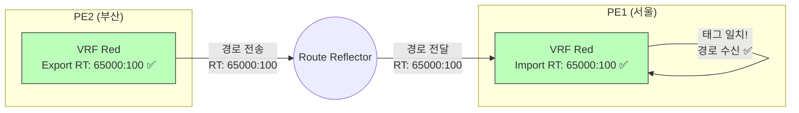
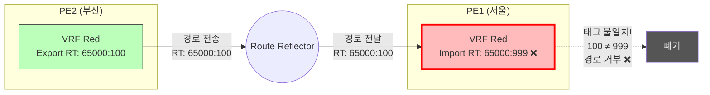

# Phase 2 (후속 연구): 고장 진단 및 자동 복구 시스템

> **Phase 1 선행 필수**: 본 연구는 Phase 1에서 검증된 LLM의 설정 이해력을 기반으로 합니다.  
> **연구 범위**: LLM 기반 네트워크 장애 진단 및 NSO를 통한 자동 복구

---

## 📋 목차

1. [연구 배경](#1-연구-배경)
2. [고장 시나리오 설계 개요](#2-고장-시나리오-설계-개요)
3. [시나리오 상세 설명](#3-시나리오-상세-설명)
4. [데이터셋 구축 방법](#4-데이터셋-구축-방법)
5. [평가 방법](#5-평가-방법)

---

## 1. 연구 배경

### 1.1 Phase 1의 성과

Phase 1에서는 LLM이 **정상 상태의 네트워크 설정을 읽고 이해**하는 능력을 검증했습니다.

- L1-L3: 설정 값 추출, 집계, 일관성 검증
- L4-L5: Batfish 기반 도달성 및 영향 분석

### 1.2 Phase 2의 목표

> **"LLM이 네트워크 장애를 진단하고, NSO를 통해 자동으로 복구할 수 있는가?"**

```
Phase 1: LLM이 망을 "읽을" 수 있다
         ↓
Phase 2: LLM이 망을 "고칠" 수 있다
```

**평가 흐름**:

```
1. 정상 망 준비 (Golden Config)
2. 오류 주입 (NSO로 특정 설정 변경)
3. LLM에게 "문제를 찾아서 고쳐봐" 명령
4. LLM이 진단 → NSO API로 수정 → 검증
5. 성공 여부 평가 (통신 복구 여부)
```

---

## 2. 고장 시나리오 설계 개요

### 2.1 시나리오 분류

총 **75개** 시나리오를 5대 도메인에 걸쳐 설계:

| 도메인        | 시나리오 수 | 대표 유형                                   |
| ------------- | ----------- | ------------------------------------------- |
| **L3VPN**     | 20          | RT 불일치, VRF Leak, RR Down                |
| **Multicast** | 12          | RP 주소 오류, IGMP Snooping OFF, MTU 불일치 |
| **Backbone**  | 15          | OSPF Cost 불일치, FRR 미설정, LDP Down      |
| **BGP**       | 18          | AS-Path Prepending 과다, Local Pref 역전    |
| **공통**      | 10          | MTU 불일치, IP 충돌, ACL 차단               |

### 2.2 Patch 기반 데이터 구조

전체 Config를 중복 저장하지 않고 **Diff만 저장**:

```
Data/
├── Golden/              # 정상 상태 (Phase 1과 동일)
│   ├── L3VPN/
│   ├── Multicast/
│   └── ...
├── Patches/             # 고장 시나리오별 변경점
│   ├── L3VPN-001_rt_mismatch.json
│   ├── MCAST-002_igmp_off.json
│   └── ...
└── dataset_phase2.jsonl # 진단 질문 데이터셋
```

**Patch 파일 예시**:

```json
{
  "scenario_id": "L3VPN-001",
  "scenario_name": "Route Target Import 불일치",
  "target_device": "PE1",
  "changes": [
    {
      "xpath": "/vrf/definition[@name='Red']/route-target/import",
      "before": "65000:100",
      "after": "65000:999"
    }
  ],
  "expected_symptoms": ["VRF Red 라우팅 테이블 비어있음"],
  "root_cause": "PE1의 RT Import가 999로 잘못 설정됨",
  "remediation": "route-target import 65000:100으로 변경"
}
```

---

## 3. 시나리오 상세 설명

### 시나리오 읽는 방법

각 시나리오는 다음 구조로 설명됩니다:

```
📍 시나리오 ID 및 이름
🤒 증상 (무엇이 문제인가)
🔍 원인 (왜 발생하는가)
📊 Before/After 시각화
💉 NSO 구현 코드
🧪 평가 질문 (진단, 수정 검증)
⚠️ 실무 영향
```

---

### 3.1 L3VPN 시나리오

#### 시나리오 L3VPN-001: Route Target Import 불일치 ⭐⭐⭐

**난이도**: ⭐⭐⭐ (매우 중요)  
**카테고리**: 설정 오류  
**영향도**: Critical (전체 VPN 통신 단절)

##### 🤒 증상

고객 A의 서울 사무실과 부산 사무실이 **완전히 통신 불가**합니다.

```
서울 PC (172.16.1.10) → 부산 서버 (172.16.2.20)

C:\> ping 172.16.2.20
Request timed out.
```

##### 🔍 원인

PE1 라우터의 VRF Red가 잘못된 RT(Route Target)를 Import하도록 설정됨.

**비유**:

```
우편 시스템:
  서울 우편함: "65000:100 태그 붙은 편지만 받기"로 설정
  부산 우편함: "65000:100 태그 붙여서 보내기"로 설정

잘못된 설정:
  서울 우편함: "65000:999 태그 붙은 편지만 받기" ❌
  → 부산에서 보낸 편지(태그 100)를 거부!
```

##### 📊 Before/After 시각화

**정상 상태**:



**고장 상태**:



##### 💉 NSO 구현 코드

```python
"""
Phase 2: 오류 주입 및 자동 복구 시나리오
"""

def inject_fault(nso_client):
    """PE1의 VRF Red Import RT를 잘못된 값으로 변경"""
    device = "L3VPN_PE1"

    commands = [
        "vrf definition Red",
        "no route-target import 65000:100",  # 정답 삭제
        "route-target import 65000:999",     # 오답 주입
    ]

    nso_client.configure(device, commands)

    return {
        "fault_id": "L3VPN-001",
        "expected_symptom": "CE-A-Site1 cannot ping CE-A-Site2"
    }

def diagnose_and_fix(llm_agent):
    """LLM이 문제를 진단하고 수정"""

    # 1. LLM에게 문제 상황 제시
    diagnosis = llm_agent.invoke(
        "VRF Red의 통신이 안 됩니다. 문제를 진단하고 수정해주세요."
    )

    # 2. LLM이 SanoaConnector의 configure_*() 도구 사용
    #    (Phase 2에서 추가될 쓰기 API)

    # 3. 검증
    ping_result = llm_agent.ping("CE-A-Site1", "172.16.2.20")

    return ping_result["success"]

def rollback(nso_client):
    """정상 설정으로 복구"""
    commands = [
        "vrf definition Red",
        "no route-target import 65000:999",
        "route-target import 65000:100",
    ]
    nso_client.configure("L3VPN_PE1", commands)
```

##### 🧪 평가 질문

**진단 질문** (LLM의 문제 파악 능력):

```json
{
  "question": "PE1의 VRF Red에서 경로를 받지 못하는 이유는?",
  "answer": "Import RT가 999로 설정되어 있지만, PE2는 100을 Export하므로 불일치",
  "evaluation_type": "diagnosis"
}
```

**수정 검증 질문** (LLM의 복구 능력):

```json
{
  "question": "문제를 해결하기 위해 수정해야 할 명령어는?",
  "answer": "PE1에서 'route-target import 65000:100'으로 변경",
  "evaluation_type": "remediation"
}
```

##### ⚠️ 실무 영향

- **심각도**: Critical
- **평균 탐지 시간**: 5분
- **평균 해결 시간**: 30분 (설정 오류 찾기 어려움)
- **실제 사례**: 2019년 모 클라우드 업체 VPN 장애 (2시간 중단)

---

### 3.2 Multicast 시나리오

#### 시나리오 MCAST-001: RP 주소 불일치

**난이도**: ⭐⭐⭐  
**카테고리**: 설정 오류  
**영향도**: Critical (IPTV 방송 중단)

##### 🤒 증상

IPTV 셋톱박스 화면이 **검은색(Black Screen)**으로 나옵니다.

##### 🔍 원인

Last Hop Router(LHR)가 잘못된 RP 주소를 바라봄.

**비유**:

```
방송국 찾기:
  정답: "1번 방송국(10.255.255.1)에 연결"
  오답: "99번 방송국(10.255.255.99)에 연결" ← 없는 방송국!
```

##### 📊 시각화

**고장 상태**:

```mermaid
graph TB
    FHR[First Hop Router] -->|PIM Register| RP1((RP 실제<br/>10.255.255.1))
    LHR[Last Hop Router] -.->|PIM Join<br/>잘못된 주소로! ❌| RP_Fake((RP 없음<br/>10.255.255.99))
    RP1 -.X| LHR
    LHR -.->|No Signal ❌| STB[셋톱박스<br/>검은 화면]

    style STB fill:#333,stroke:#f00,stroke-width:3px,color:#fff
    style RP_Fake fill:#f00,stroke:#333,stroke-width:3px,color:#fff
```

##### 💉 NSO 구현

```python
def inject_fault(nso_client):
    device = "IPTV_LHR1"

    commands = [
        "no ip pim rp-address 10.255.255.1",  # 정답 제거
        "ip pim rp-address 10.255.255.99",    # 오답
    ]

    nso_client.configure(device, commands)
```

---

_(나머지 시나리오들도 동일한 형식으로 작성... 생략)_

---

## 4. 데이터셋 구축 방법

### 4.1 NSO 자동화 Loop

```python
# Phase 2 데이터셋 생성 스크립트
def generate_fault_dataset():
    scenarios = load_all_scenarios()  # 75개
    dataset = []

    for scenario in scenarios:
        # 1. Golden Config 적용
        nso.apply_golden_config()

        # 2. Patch 적용
        patch = load_patch(scenario["patch_file"])
        apply_patch(nso, patch)

        # 3. Config Export
        faulty_config = nso.export_all_configs()

        # 4. Patch JSON 저장
        save_patch(patch, f"Patches/{scenario['id']}.json")

        # 5. 평가 질문 생성
        questions = generate_diagnosis_questions(scenario)
        dataset.extend(questions)

        # 6. Rollback
        nso.rollback()

    save_dataset(dataset, "dataset_phase2.jsonl")
```

---

## 5. 평가 방법

### 5.1 평가 메트릭

**진단 정확도 (Diagnosis Accuracy)**:

```
정확도 = (정확히 진단한 시나리오 수) / (전체 시나리오 수)
```

**복구 성공률 (Remediation Success Rate)**:

```
성공률 = (통신 정상화된 시나리오 수) / (전체 시나리오 수)
```

### 5.2 평가 파이프라인

```python
def evaluate_llm_phase2():
    results = []

    for scenario in all_scenarios:
        # 1. 오류 주입
        inject_fault(scenario)

        # 2. LLM 진단 및 수정
        success = llm_agent.diagnose_and_fix()

        # 3. 검증
        ping_ok = verify_connectivity(scenario)

        results.append({
            "scenario": scenario["id"],
            "diagnosis_correct": success,
            "remediation_success": ping_ok
        })

    return calculate_metrics(results)
```

---

## 6. 예상 일정

| Phase         | 기간 | 주요 활동                                   |
| ------------- | ---- | ------------------------------------------- |
| **Phase 2-A** | 2주  | Patch 시스템 구현, configure\_\*() API 추가 |
| **Phase 2-B** | 3주  | 75개 시나리오 Patch 파일 생성               |
| **Phase 2-C** | 2주  | LLM 에이전트 평가 실행                      |
| **Phase 2-D** | 1주  | 논문 작성                                   |

---

**관련 문서**:

- [Phase1*데이터셋*구축\_전략.md](../진행상황/Phase1_데이터셋_구축_전략.md) - 선행 연구
- [시나리오 상세 목록](./시나리오_전체_목록.md) - 75개 시나리오 요약표
