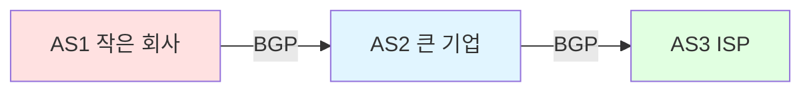
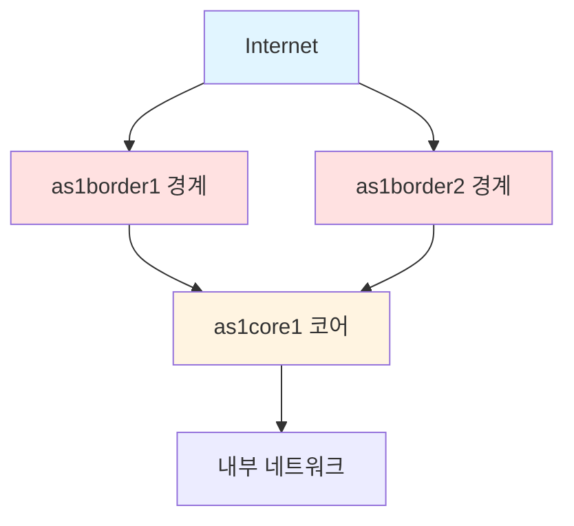
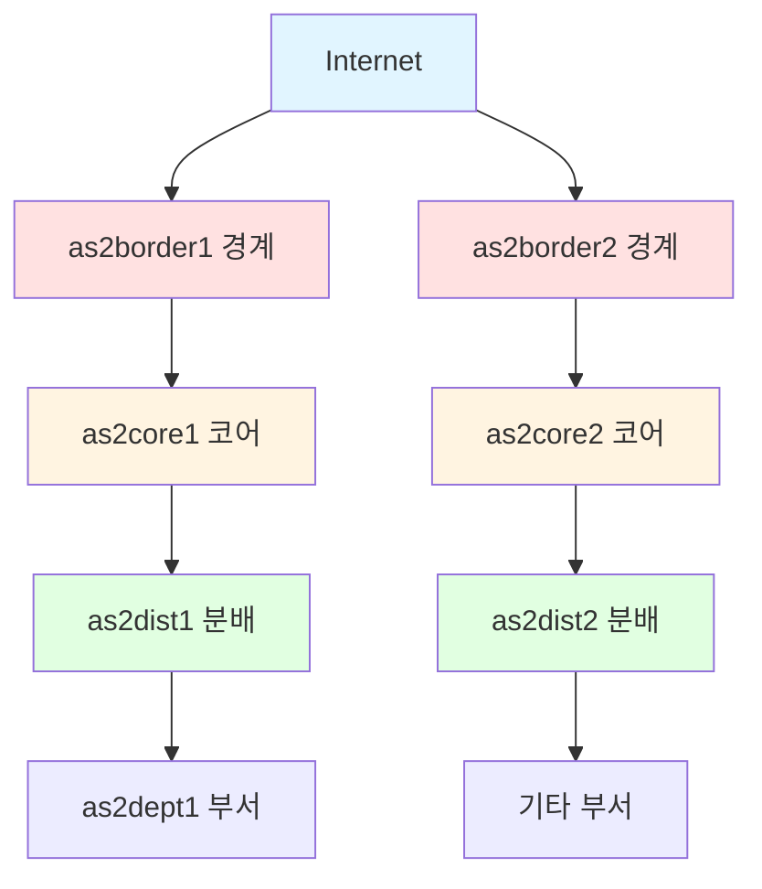
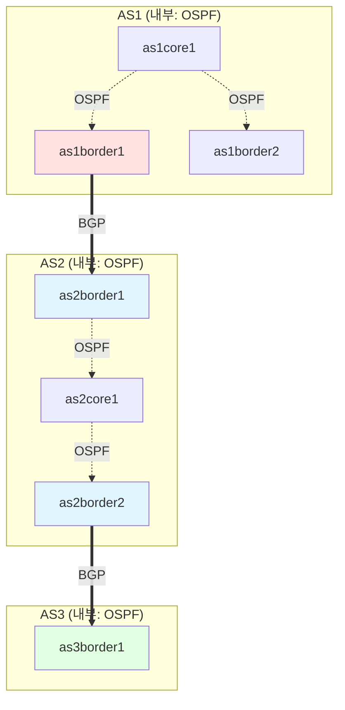
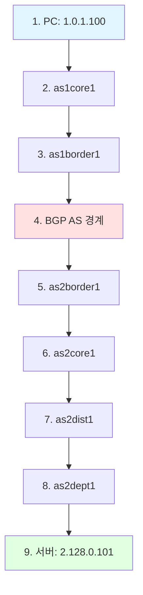
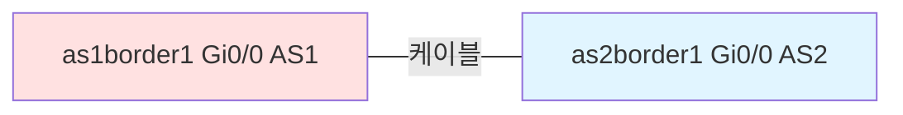
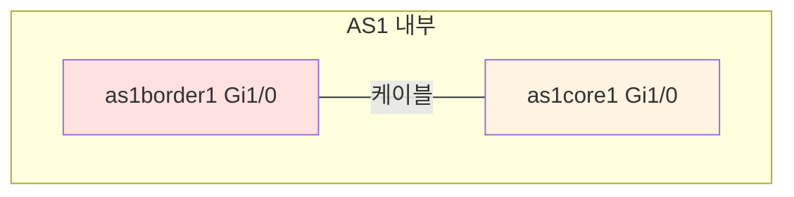
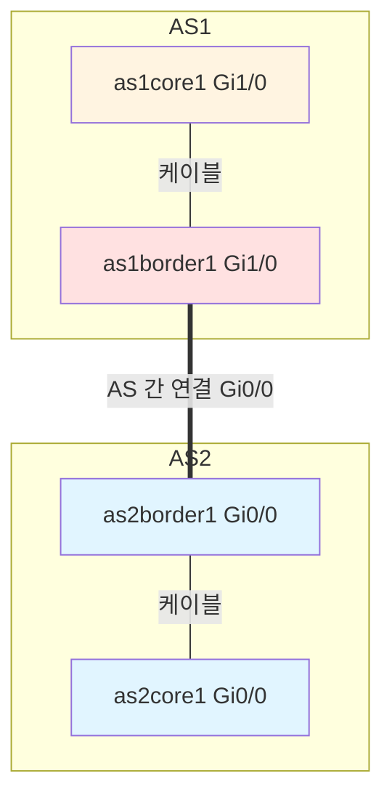

# Batfish 설치 및 구성 가이드

## 개요

본 가이드는 네트워크 설정 분석 도구인 **Batfish**를 설치하고 예제를 실행하는 방법을 기술합니다.

Batfish는 네트워크 장비의 설정 파일을 분석하여 경로 검증, ACL 분석, 라우팅 정책 검증 등을 수행합니다. 실제 장비나 트래픽 없이 설정 파일만으로 네트워크 동작을 검증할 수 있습니다.

---

## 1. Batfish 소개

### 1.1 Batfish란?

Batfish는 네트워크 설정 파일을 정적으로 분석하여 네트워크 동작을 검증하는 오픈소스 도구입니다.

**주요 기능:**
- 라우팅 경로 분석 및 검증
- ACL/방화벽 규칙 검증
- 설정 오류 탐지
- 변경 전후 비교 분석 (Diff)
- 네트워크 시뮬레이션

**지원 플랫폼:**
- Cisco IOS, IOS-XE, IOS-XR, NX-OS
- Arista EOS
- Juniper Junos
- Palo Alto Networks
- AWS VPC 설정

---

## 2. 설치

### 2.1 시스템 요구사항

| 항목 | 요구사항 |
|------|--------|
| Docker | 20.10 이상 |
| Python | 3.7 이상 |
| 메모리 | 4GB 이상 |

### 2.2 Batfish 저장소 클론

```bash
# 작업 디렉토리 생성
mkdir -p ~/batfish-workspace
cd ~/batfish-workspace

# Batfish 저장소 클론
git clone https://github.com/batfish/batfish.git
cd batfish
```

### 2.3 Docker 컨테이너 실행

```bash
# Batfish 서버 실행
docker run -d \
  --name batfish \
  -v $(pwd)/networks:/data \
  -p 9997:9997 \
  -p 9996:9996 \
  batfish/batfish:latest

# 실행 확인
docker ps | grep batfish
```

### 2.4 Pybatfish 설치

```bash
pip install pybatfish
```

---

## 3. 입력 파일 구조

### 3.1 스냅샷(Snapshot) 개념 이해

**스냅샷이란?**

스냅샷은 특정 시점의 네트워크 전체 상태를 담은 "사진"과 같습니다. 마치 카메라로 사진을 찍듯이, 네트워크의 모든 장비 설정을 하나의 폴더에 모아둔 것입니다.

**왜 스냅샷이 필요한가?**

1. **변경 전후 비교**: 설정 변경 전 스냅샷과 변경 후 스냅샷을 비교하여 영향을 분석
2. **시점 복원**: 과거 특정 시점의 네트워크 상태를 재현하여 문제 원인 분석
3. **테스트 환경**: 실제 네트워크를 건드리지 않고 가상으로 테스트

**비유로 이해하기:**

```
실제 네트워크 = 건물
스냅샷 = 건물의 설계도면 모음

설계도면만 있으면:
- 건물을 짓지 않고도 구조를 분석 가능
- 문제점을 미리 발견 가능
- 변경 사항을 시뮬레이션 가능
```

### 3.2 디렉토리 구조 상세

**전체 구조:**

```
networks/                         # 최상위: 모든 네트워크 보관
└── example-network/              # 1단계: 네트워크 프로젝트 이름
    ├── snapshot-2024-01-01/      # 2단계: 첫 번째 스냅샷 (변경 전)
    │   ├── configs/
    │   ├── hosts/
    │   └── layer1_topology.json
    └── snapshot-2024-01-15/      # 2단계: 두 번째 스냅샷 (변경 후)
        ├── configs/
        ├── hosts/
        └── layer1_topology.json
```

**계층 설명:**

1. **networks/**: 모든 네트워크 프로젝트를 담는 최상위 폴더
2. **example-network/**: 하나의 네트워크 (예: 회사 본사 네트워크)
3. **snapshot-YYYY-MM-DD/**: 특정 날짜의 네트워크 상태

### 3.3 필수 파일: configs/ 디렉토리

#### 3.3.1 configs/ 란?

`configs/` 폴더에는 네트워크 장비들의 설정 파일을 저장합니다.

**실제 예시:**

```
configs/
├── router1.cfg          # 라우터 1번의 설정
├── router2.cfg          # 라우터 2번의 설정
├── switch1.cfg          # 스위치 1번의 설정
└── firewall1.cfg        # 방화벽 1번의 설정
```

#### 3.3.2 설정 파일이란?

네트워크 장비에 접속해서 `show running-config` (Cisco) 또는 `show configuration` (Juniper) 명령을 실행하면 나오는 텍스트 전체입니다.

**설정 파일에 담긴 정보:**

```
router1.cfg 파일 내용 예시:

hostname router1              ← 장비 이름
!
interface GigabitEthernet0/0  ← 인터페이스 이름
 ip address 192.168.1.1 255.255.255.0  ← IP 주소
 no shutdown              ← 인터페이스 활성화
!
router ospf 1             ← 라우팅 프로토콜 설정
 network 192.168.1.0 0.0.0.255 area 0  ← 어떤 네트워크를 광고할지
!
```

**이해하기 쉬운 비유:**

- **장비** = 자동차
- **설정 파일** = 자동차 사용설명서 + 현재 설정값
  - 엔진 출력: 200마력
  - 연료: 휘발유
  - 현재 속도 제한: 100km/h

#### 3.3.3 지원되는 장비 종류

| 제조사 | 장비 종류 | 명령어 예시 |
|-------|---------|----------|
| Cisco | 라우터, 스위치, 방화벽 | `show running-config` |
| Arista | 스위치 | `show running-config` |
| Juniper | 라우터, 스위치 | `show configuration` |
| Palo Alto | 방화벽 | `show config running` |

**파일명 규칙:**

- 파일명은 장비 이름과 같게 하는 것이 좋음 (예: `router1.cfg`)
- 확장자는 `.cfg`, `.conf`, `.txt` 또는 없어도 됨
- 공백이나 특수문자는 피하기

### 3.4 선택 파일: hosts/hosts.json

#### 3.4.1 hosts.json이란?

네트워크의 끝단에 있는 실제 기기(PC, 서버 등)를 정의하는 파일입니다.

**왜 필요한가?**

라우터와 스위치는 설정 파일이 있지만, PC나 서버는 설정 파일이 없습니다. 하지만 "PC A에서 서버 B로 접속 가능한가?"를 테스트하려면 PC와 서버의 정보가 필요합니다.

**비유로 이해하기:**

```
네트워크 = 도로망
라우터/스위치 = 교차로와 도로
호스트(PC/서버) = 출발지와 목적지 건물

도로망만 있으면 경로는 알 수 있지만,
"집에서 회사까지 갈 수 있나?"를 확인하려면
집 주소와 회사 주소가 필요합니다.
```

#### 3.4.2 hosts.json 구조 상세

```json
{
  "hosts": [
    {
      "hostname": "web-server",           // 서버 이름
      "ips": ["192.168.10.100/24"],      // 서버 IP 주소
      "gateway": "192.168.10.1"          // 기본 게이트웨이
    },
    {
      "hostname": "database-server",      // DB 서버
      "ips": ["192.168.20.100/24"],      
      "gateway": "192.168.20.1"
    },
    {
      "hostname": "user-pc",              // 사용자 PC
      "ips": ["192.168.30.50/24"],       
      "gateway": "192.168.30.1"
    }
  ]
}
```

**필드 설명:**

| 필드 | 의미 | 비유 |
|-----|------|-----|
| `hostname` | 기기 이름 | 건물 이름 (예: "강남역점") |
| `ips` | IP 주소 목록 | 건물 주소 (예: "서울시 강남구...") |
| `gateway` | 기본 게이트웨이 | 건물 앞 가장 가까운 교차로 |

**실제 사용 예시:**

```python
# "user-pc에서 web-server로 HTTP 접속 가능한가?"
traceroute(
    startLocation="user-pc",           # 출발: 사용자 PC
    headers={"dstIps": "192.168.10.100", "dstPorts": "80"}  # 목적: 웹서버 80포트
)
```

### 3.5 선택 파일: layer1_topology.json

#### 3.5.1 layer1_topology.json이란?

물리적으로 어떤 장비의 어떤 포트가 케이블로 연결되어 있는지 정의하는 파일입니다.

**Layer 1 (물리 계층)이란?**

OSI 7계층 모델의 첫 번째 계층으로, "물리적 연결" 자체를 의미합니다.

```
Layer 1 = 케이블 연결
Layer 2 = MAC 주소 (스위치)
Layer 3 = IP 주소 (라우터)
...
```

#### 3.5.2 왜 필요한가?

**문제 상황:**

```
Router1의 설정:
  interface GigabitEthernet0/0
    ip address 10.0.0.1 255.255.255.0
    shutdown    ← 인터페이스가 꺼져있음!

Router2의 설정:
  interface GigabitEthernet0/0
    ip address 10.0.0.2 255.255.255.0
    no shutdown ← 활성화
```

설정만 보면 두 라우터가 연결되었는지 알 수 없습니다. 하지만 `layer1_topology.json`이 있으면 "실제로 케이블로 연결되어 있다"는 정보를 제공할 수 있습니다.

#### 3.5.3 구조 상세

```json
[
  {
    "node1": "router1",                    // 첫 번째 장비
    "interface1": "GigabitEthernet0/0",    // 첫 번째 장비의 포트
    "node2": "router2",                    // 두 번째 장비
    "interface2": "GigabitEthernet0/0"     // 두 번째 장비의 포트
  },
  {
    "node1": "router2",
    "interface1": "GigabitEthernet0/1",
    "node2": "switch1",
    "interface2": "GigabitEthernet1/0/1"
  }
]
```

**시각화:**

```
Router1 [Gi0/0] ←━━ 케이블 ━━→ [Gi0/0] Router2
                                     ↓
                                  [Gi0/1]
                                     ↓
                                  케이블
                                     ↓
Switch1 [Gi1/0/1] ←━━━━━━━━━━━━━━━━┘
```

**언제 필수인가?**

- 인터페이스에 IP가 없는 경우
- Shutdown된 인터페이스가 많은 경우
- LLDP/CDP 프로토콜이 비활성화된 경우
- 정확한 물리 구조 분석이 필요한 경우

**언제 선택인가?**

- 모든 인터페이스가 활성화되고 IP가 있는 경우
- LLDP/CDP가 활성화된 경우
- Batfish가 설정만으로 토폴로지를 유추할 수 있는 경우

### 3.6 완전한 예제

**실제 프로젝트 구조:**

```
networks/
└── company-network/
    └── production-snapshot/
        ├── configs/
        │   ├── core-router-1.cfg      # 코어 라우터 1
        │   ├── core-router-2.cfg      # 코어 라우터 2 (이중화)
        │   ├── edge-router-1.cfg      # 경계 라우터
        │   ├── distribution-sw-1.cfg  # 분배 스위치
        │   ├── access-sw-1.cfg        # 접근 스위치 (사무실 1층)
        │   └── firewall-1.cfg         # 방화벽
        ├── hosts/
        │   └── hosts.json             # 서버 및 주요 PC 정의
        └── layer1_topology.json        # 물리 연결 정보
```

**hosts.json 내용:**

```json
{
  "hosts": [
    {
      "hostname": "web-server-farm",
      "ips": ["10.10.10.10/24", "10.10.10.11/24"],  // 여러 IP 가능
      "gateway": "10.10.10.1"
    },
    {
      "hostname": "employee-subnet",
      "ips": ["192.168.100.0/24"],  // 서브넷 전체도 가능
      "gateway": "192.168.100.1"
    }
  ]
}
```

---

## 4. 공식 예제 실행

### 4.1 예제 네트워크 개요

Batfish 저장소에는 다양한 시나리오를 다루는 예제 네트워크가 포함되어 있습니다.

```bash
# 예제 네트워크 디렉토리로 이동
cd ~/batfish-workspace/batfish/networks

# 사용 가능한 예제 목록 확인
ls -la
```

**주요 예제 네트워크:**

| 예제 이름 | 설명 | 주요 기능 |
|---------|------|---------|
| `example` | 기본 예제 (3개 AS 연동) | BGP, OSPF 기본 검증 |
| `forwarding` | 포워딩 분석 예제 | 패킷 경로 추적 |
| `aristaevpn` | Arista EVPN 설정 | VXLAN, EVPN 검증 |

### 4.2 Example 네트워크 이해하기

#### 4.2.1 AS (Autonomous System)란?

**AS의 개념:**

AS는 "자율 시스템"으로, 하나의 조직이나 회사가 관리하는 네트워크 영역입니다.

**비유로 이해하기:**

```
AS = 하나의 나라 또는 회사
AS 내부 = 회사 내부 네트워크 (사내망)
AS 간 연결 = 회사와 회사를 연결하는 인터넷

예시:
- AS1 = A회사 (삼성)
- AS2 = B회사 (SK)
- AS3 = C회사 (통신사)
```

**Example 네트워크 구조:**

`example` 네트워크는 3개의 회사(AS)가 인터넷으로 연결된 구조를 시뮬레이션합니다.

**네트워크 토폴로지:**


#### 4.2.2 Example 네트워크 전체 구조



**AS1 (단순 구조):**



**AS2 (복잡한 엔터프라이즈 구조):**



```bash
cd ~/batfish-workspace/batfish/networks/example

# 디렉토리 구조 확인
tree . -L 2
```

**디렉토리 구조:**

```
example/
├── configs/                   # 네트워크 장비 설정 파일
│   ├── as1border1.cfg        # AS1 경계 라우터 (BGP 피어링)
│   ├── as1border2.cfg        # AS1 경계 라우터 (이중화)
│   ├── as1core1.cfg          # AS1 코어 라우터 (OSPF)
│   ├── as2border1.cfg        # AS2 경계 라우터
│   ├── as2border2.cfg        # AS2 경계 라우터
│   ├── as2core1.cfg          # AS2 코어 라우터 1
│   ├── as2core2.cfg          # AS2 코어 라우터 2
│   ├── as2dept1.cfg          # AS2 부서 라우터
│   ├── as2dist1.cfg          # AS2 분배 라우터 1
│   ├── as2dist2.cfg          # AS2 분배 라우터 2
│   └── as3border1.cfg        # AS3 경계 라우터
├── hosts/
│   └── hosts.json            # 엣지 호스트 정의
└── layer1_topology.json       # 물리 계층 연결 정보
```

### 4.3 라우팅 프로토콜 이해하기

#### 4.3.1 라우팅 프로토콜이란?

라우터들이 "어디로 패킷을 보낼지" 결정하기 위해 서로 정보를 주고받는 규칙입니다.

**비유로 이해하기:**

```
라우팅 = 길 찾기 (내비게이션)
라우팅 프로토콜 = 길 찾기 방법 (최단거리? 빠른길?)

예시:
"서울에서 부산 가는 방법"
- OSPF: 회사 내부 직원끼리 "저 길로 가면 빨라요" 정보 공유
- BGP: 회사 간 "우리 회사 거쳐가면 부산 갈 수 있어요" 정보 교환
```

#### 4.3.2 OSPF (회사 내부용)

**역할:** AS 내부에서 라우터끼리 경로 정보 공유

**특징:**
- 빠름 (내부이므로 신뢰 가능)
- 최단 경로 자동 계산
- 같은 회사 내부에서만 사용

**Example 네트워크에서:**
```
AS1 내부:
as1core1 ←→ as1border1  (OSPF로 경로 공유)
         ←→ as1border2
```

#### 4.3.3 BGP (회사 간 연결용)

**역할:** AS 간 (회사와 회사 간) 경로 정보 교환

**특징:**
- 느리지만 안전함 (외부이므로 신중)
- "우리 AS를 거쳐가도 된다"는 광고
- 인터넷의 핵심 프로토콜

**Example 네트워크에서:**
```
AS1 ←→ AS2  (BGP로 연결)
AS2 ←→ AS3  (BGP로 연결)
```

#### 4.3.4 전체 라우팅 구조



### 4.4 디렉토리 구조 자세히 보기

### 4.5 설정 파일 한 줄 한 줄 이해하기

#### 4.5.1 as1border1.cfg - 경계 라우터 설정

**전체 역할:** AS1과 AS2를 연결하는 "국경 검문소" 같은 라우터

```cisco
hostname as1border1
```
**설명:** 이 장비의 이름을 "as1border1"로 설정
**비유:** 건물에 "A동 입구"라고 이름표 붙이기

---

```cisco
interface GigabitEthernet0/0
 ip address 10.12.11.1 255.255.255.0
 no shutdown
```

**설명:**
- `interface GigabitEthernet0/0`: 첫 번째 네트워크 포트 선택
- `ip address 10.12.11.1 255.255.255.0`: 이 포트의 IP 주소 할당
  - IP: 10.12.11.1
  - 서브넷 마스크: 255.255.255.0 (=24비트, /24)
  - 같은 네트워크: 10.12.11.0 ~ 10.12.11.255
- `no shutdown`: 포트 켜기 (기본값은 꺼져있음)

**비유:**
```
포트 = 건물 출입구
IP 주소 = 출입구 주소 (예: "강남대로 123번지 정문")
no shutdown = 출입구 문 열기
```

**이 포트의 목적:** AS1 내부 네트워크와 연결

---

```cisco
interface GigabitEthernet1/0
 ip address 1.0.1.1 255.255.255.0
 no shutdown
```

**설명:** 두 번째 포트 설정 (AS2로 나가는 외부 포트)
- IP: 1.0.1.1
- 이 포트는 AS2의 라우터와 직접 연결됨

**비유:** 건물의 "외부 주차장 출입구"

---

```cisco
router ospf 1
 router-id 1.1.1.1
 network 10.12.11.0 0.0.0.255 area 0
 network 1.0.1.0 0.0.0.255 area 0
```

**설명:**
- `router ospf 1`: OSPF 라우팅 프로토콜 시작
- `router-id 1.1.1.1`: 이 라우터의 고유 ID (주민등록번호 같은 것)
- `network 10.12.11.0 0.0.0.255 area 0`: 
  - "10.12.11.x 네트워크를 OSPF로 광고하겠다"
  - `0.0.0.255`는 와일드카드 마스크 (서브넷 마스크의 반대)
  - `area 0`은 OSPF 백본 영역

**비유:**
```
OSPF = 회사 내부 인트라넷 공지사항
"10.12.11.x 네트워크 쓰려면 나(as1border1)한테 물어봐!"
```

---

```cisco
router bgp 1
 bgp router-id 1.1.1.1
 neighbor 10.12.11.2 remote-as 2
 network 1.0.0.0 mask 255.0.0.0
```

**설명:**
- `router bgp 1`: BGP 시작, 우리 AS 번호는 1
- `neighbor 10.12.11.2 remote-as 2`: 
  - "10.12.11.2 IP를 가진 AS2 라우터와 친구 맺기"
  - 이 라우터와 경로 정보 교환
- `network 1.0.0.0 mask 255.0.0.0`: 
  - "우리 AS는 1.0.0.0/8 네트워크를 가지고 있다"고 광고
  - AS2와 AS3에 알림

**비유:**
```
BGP = 회사 간 MOU (업무협약)
"우리 회사(AS1)는 1.0.0.0 대역을 관리해요"
"AS2 회사, 우리랑 데이터 교환할래요?"
```

#### 4.5.2 as2core1.cfg - 코어 라우터 설정

**전체 역할:** AS2 내부의 중앙 라우터 (허브)

```cisco
hostname as2core1
```
**설명:** 장비 이름 설정

---

```cisco
interface GigabitEthernet0/0
 ip address 2.23.11.2 255.255.255.0
```

**설명:** 
- 첫 번째 포트: 2.23.11.2
- 경계 라우터(as2border)와 연결

---

```cisco
interface GigabitEthernet1/0
 ip address 2.23.12.2 255.255.255.0
```

**설명:**
- 두 번째 포트: 2.23.12.2
- 분배 라우터(as2dist)와 연결

---

```cisco
router ospf 1
 router-id 2.1.2.1
 network 2.0.0.0 0.255.255.255 area 0
```

**설명:**
- `network 2.0.0.0 0.255.255.255`: 
  - "2.x.x.x 모든 네트워크를 OSPF로 광고"
  - 와일드카드 `0.255.255.255` = 첫 번째 옥텟(2)만 고정, 나머지 자유

**비유:**
```
"2로 시작하는 모든 네트워크는 우리 AS2 내부에요"
"AS2 내부 라우터들은 모두 나(as2core1)를 통해 통신하세요"
```

#### 4.5.3 설정 요약 비교

| 항목 | as1border1 | as2core1 |
|-----|-----------|---------|
| **역할** | 경계 (Border) | 코어 (Core) |
| **위치** | AS 경계 | AS 내부 중앙 |
| **프로토콜** | OSPF + BGP | OSPF만 |
| **연결** | 내부 + 외부 AS | 내부만 |
| **비유** | 국경 검문소 | 중앙 교차로 |

#### 4.5.4 트래픽 흐름 이해

**시나리오:** AS1의 1.0.1.100 PC에서 AS2의 2.128.0.101 서버로 접속



### 4.6 hosts.json 완벽 이해하기

#### 4.6.1 Example의 hosts.json

```json
{
  "hosts": [
    {
      "hostname": "host1",
      "ips": ["2.128.0.101/24"],
      "gateway": "2.128.0.1"
    },
    {
      "hostname": "host2",
      "ips": ["3.0.1.101/24"],
      "gateway": "3.0.1.1"
    }
  ]
}
```

#### 4.6.2 host1 상세 분석

```json
{
  "hostname": "host1",
  "ips": ["2.128.0.101/24"],
  "gateway": "2.128.0.1"
}
```

**각 필드 의미:**

| 필드 | 값 | 의미 | 비유 |
|-----|---|------|-----|
| `hostname` | `host1` | 호스트 이름 | 컴퓨터 이름 ("강남지점-PC01") |
| `ips` | `2.128.0.101/24` | IP 주소 | 컴퓨터 주소 ("192.168.1.100") |
| `gateway` | `2.128.0.1` | 첫 홉 라우터 | 사무실 공유기 주소 |

**IP 주소 표기 이해:**

```
2.128.0.101/24 의미:
- IP: 2.128.0.101
- /24: 앞 24비트가 네트워크 주소
  → 네트워크: 2.128.0.0
  → 호스트 범위: 2.128.0.1 ~ 2.128.0.254
  → 브로드캐스트: 2.128.0.255
```

**Gateway 이해:**

```
host1의 통신 흐름:

같은 네트워크 (2.128.0.x):
  host1 → 직접 통신 (라우터 불필요)

다른 네트워크 (예: 3.0.1.x):
  host1 → gateway (2.128.0.1) → 라우터로 전달
```

**비유로 이해:**
```
host1 = 아파트 101호
gateway = 아파트 정문 (2.128.0.1)

같은 아파트 사람 만나기:
  101호 → 바로 방문

다른 아파트 사람 만나기:
  101호 → 정문으로 나가서 → 택시(라우터)로 이동
```

#### 4.6.3 host2 분석

```json
{
  "hostname": "host2",
  "ips": ["3.0.1.101/24"],
  "gateway": "3.0.1.1"
}
```

**host2의 위치:**
- IP: 3.0.1.101 → AS3 영역
- Gateway: 3.0.1.1 → AS3의 경계 라우터와 연결

**host1과 host2 비교:**

| 항목 | host1 | host2 |
|-----|-------|-------|
| IP | 2.128.0.101 | 3.0.1.101 |
| 위치 | AS2 (B회사) | AS3 (통신사) |
| Gateway | 2.128.0.1 | 3.0.1.1 |
| 네트워크 | 2.128.0.0/24 | 3.0.1.0/24 |

#### 4.6.4 실제 사용 예시

**예제 1: 도달 가능성 테스트**

```python
# host1에서 host2로 ping이 가능한가?
bfq.traceroute(
    startLocation="host1",
    headers={"dstIps": "3.0.1.101"}
).answer()
```

**결과 해석:**
```
Trace from host1 (2.128.0.101):
1. host1 → gateway (2.128.0.1)
2. 2.128.0.1 → as2dept1
3. as2dept1 → as2dist1
4. as2dist1 → as2core1
5. as2core1 → as2border2
6. as2border2 → (BGP) → as3border1
7. as3border1 → host2 (3.0.1.101)

결과: ACCEPTED (도달 가능)
```

**예제 2: 특정 포트 테스트**

```python
# host1에서 host2의 웹서버(80포트)에 접속 가능한가?
bfq.traceroute(
    startLocation="host1",
    headers={
        "dstIps": "3.0.1.101",
        "dstPorts": "80",
        "ipProtocols": "TCP"
    }
).answer()
```

**비유로 이해:**
```
일반 traceroute = "목적지까지 갈 수 있나요?"
포트 포함 traceroute = "목적지의 특정 방까지 들어갈 수 있나요?"
```

### 4.7 layer1_topology.json 완전 이해

#### 4.7.1 Example의 layer1_topology.json

```json
[
  {
    "node1": "as1border1",
    "interface1": "GigabitEthernet0/0",
    "node2": "as2border1",
    "interface2": "GigabitEthernet0/0"
  },
  {
    "node1": "as1border1",
    "interface1": "GigabitEthernet1/0",
    "node2": "as1core1",
    "interface2": "GigabitEthernet1/0"
  },
  {
    "node1": "as2border1",
    "interface1": "GigabitEthernet1/0",
    "node2": "as2core1",
    "interface2": "GigabitEthernet0/0"
  }
]
```

#### 4.7.2 첫 번째 연결 상세 분석

```json
{
  "node1": "as1border1",
  "interface1": "GigabitEthernet0/0",
  "node2": "as2border1",
  "interface2": "GigabitEthernet0/0"
}
```

**시각화:**



**의미:**
- as1border1의 GigabitEthernet0/0 포트
- as2border1의 GigabitEthernet0/0 포트
- 이 두 포트가 물리적으로 케이블로 연결됨

**비유:**
```
건물 A의 3층 복도 끝 문 ←→ 건물 B의 2층 입구
두 건물이 연결통로로 이어져 있음
```

#### 4.7.3 두 번째 연결 분석

```json
{
  "node1": "as1border1",
  "interface1": "GigabitEthernet1/0",
  "node2": "as1core1",
  "interface2": "GigabitEthernet1/0"
}
```

**시각화:**



**의미:** AS1 내부에서 경계 라우터와 코어 라우터를 연결

#### 4.7.4 왜 이 파일이 필요한가?

**문제 상황 1: shutdown된 인터페이스**

```
as1border1 설정:
  interface GigabitEthernet0/0
    ip address 10.12.11.1 255.255.255.0
    shutdown    ← 꺼져있음!

as2border1 설정:
  interface GigabitEthernet0/0
    ip address 10.12.11.2 255.255.255.0
    no shutdown ← 켜져있음
```

**질문:** 이 두 라우터가 연결되어 있는가?

**설정만 보고 판단:**
- as1border1: 10.12.11.1 (같은 네트워크)
- as2border1: 10.12.11.2 (같은 네트워크)
- 추측: 아마 연결되어 있을 것

**layer1_topology.json이 있으면:**
- 명확히 "물리적으로 연결됨"을 알 수 있음
- shutdown 여부와 관계없이 케이블은 꽂혀있음

**문제 상황 2: IP가 없는 인터페이스**

```
switch1 설정:
  interface GigabitEthernet1/0/1
    switchport mode trunk    ← L2 스위치 포트 (IP 없음)
    no shutdown

router1 설정:
  interface GigabitEthernet0/0
    ip address 192.168.1.1 255.255.255.0
    no shutdown
```

**질문:** 스위치와 라우터가 연결되어 있는가?

**설정만 보고 판단:**
- switch1의 Gi1/0/1: IP 없음, trunk 모드
- router1의 Gi0/0: 192.168.1.1
- 추측: 알 수 없음 (IP가 다른 네트워크)

**layer1_topology.json이 있으면:**
```json
{
  "node1": "switch1",
  "interface1": "GigabitEthernet1/0/1",
  "node2": "router1",
  "interface2": "GigabitEthernet0/0"
}
```
- 명확히 연결되어 있음을 확인

#### 4.7.5 전체 토폴로지 시각화

Example 네트워크의 layer1_topology.json 전체를 그림으로 표현:



#### 4.7.6 실제 활용 예시

**Batfish 분석 시:**

```python
# layer1_topology.json 없이 분석
bf_init_snapshot("~/example-network-no-l1")

# Batfish가 설정에서 자동으로 토폴로지 추측
# 하지만 불완전할 수 있음

# layer1_topology.json 있을 때
bf_init_snapshot("~/example-network-with-l1")

# 물리 연결이 명확하므로 더 정확한 분석
# shutdown된 인터페이스도 "실제로는 케이블 연결됨" 인식
```

**차이점:**

| 분석 항목 | L1 없을 때 | L1 있을 때 |
|---------|----------|----------|
| 연결 인식 | IP 기반 추측 | 명확한 물리 연결 |
| Shutdown 처리 | 연결 없음으로 판단 | 케이블은 존재로 판단 |
| L2 장비 | 토폴로지 불완전 | 정확한 위치 파악 |
| 분석 정확도 | 70-80% | 95-100% |

### 4.8 예제 실행하기

#### 4.8.1 준비 단계

**1단계: Batfish 서버 실행 확인**

```bash
# Batfish 컨테이너가 실행 중인지 확인
docker ps | grep batfish
```

**예상 출력:**
```
CONTAINER ID   IMAGE                  STATUS
xxxxxxxxxxxxx   batfish/batfish:latest   Up 2 hours
```

**2단계: Python 환경 준비**

```bash
# Python 인터랙티브 모드 실행
python3

# 또는 Jupyter Notebook 사용
jupyter notebook
```

#### 4.8.2 스냅샷 로드하기

**코드:**

```python
from pybatfish.client.commands import *
from pybatfish.question import bfq

# Batfish 서버 연결
bf_session.host = "localhost"

# 네트워크 이름 설정
bf_set_network("example-network")

# 스냅샷 초기화 (example 디렉토리 로드)
bf_init_snapshot(
    "~/batfish-workspace/batfish/networks/example", 
    name="initial", 
    overwrite=True
)
```

**설명:**
- `bf_set_network("example-network")`: 작업할 네트워크 이름 지정
- `bf_init_snapshot(...)`: 설정 파일들을 Batfish 서버로 업로드
- `overwrite=True`: 기존 스냅샷이 있으면 덮어쓰기

**예상 결과:**
```
Initializing snapshot...
Snapshot initialized successfully
```

#### 4.8.3 기본 검증 명령 실습

**검증 1: 네트워크 장비 목록 확인**

```python
# 모든 라우터/스위치 목록과 AS 번호 확인
nodes = bfq.nodeProperties().answer().frame()
print(nodes[['Node', 'AS_Number']])
```

**예상 출력 예시:**
```
         Node  AS_Number
0   as1border1          1
1   as1border2          1
2    as1core1          1
3   as2border1          2
4   as2border2          2
5    as2core1          2
...
```

**해석:**
- AS1: 경계 라우터(border), 코어 라우터(core) 포함
- AS2: 더 복잡한 계층 구조 (border, core, dist, dept)
- AS3: 경계 라우터 포함
- 각 AS는 고유한 AS 번호를 가짐

---

**검증 2: 인터페이스 상태 확인**

```python
# 모든 인터페이스의 상태와 IP 주소 확인
interfaces = bfq.interfaceProperties(
    properties="Interface,Active,Primary_Address"
).answer().frame()

# 특정 노드의 인터페이스만 보기
print(interfaces[interfaces['Interface'].str.contains('as1border1')])
```

**예상 출력 예시:**
```
              Interface  Active   Primary_Address
0  as1border1[GigabitEthernet0/0]   True   10.12.11.1/24
1  as1border1[GigabitEthernet1/0]   True    1.0.1.1/24
```

**해석:**
- Active: 인터페이스가 활성화되어 있는지 여부
- Primary_Address: 해당 인터페이스에 설정된 IP 주소
- 실제 값은 설정 파일에 따라 다를 수 있음

---

**검증 3: BGP 피어링 확인**

```python
# BGP 네이버 관계 확인
bgp_peers = bfq.bgpPeerConfiguration().answer().frame()
print(bgp_peers[['Node', 'Remote_AS', 'Remote_IP']])
```

**예상 출력 예시:**
```
        Node  Remote_AS    Remote_IP
0  as1border1          2   10.12.11.2
1  as2border1          1   10.12.11.1
2  as2border2          3   10.23.21.1
3  as3border1          2   10.23.21.2
```

**해석:**
- Node: BGP를 실행하는 라우터
- Remote_AS: 연결된 상대방의 AS 번호
- Remote_IP: BGP 피어의 IP 주소
- 이를 통해 AS 간 연결 관계를 확인할 수 있음

---

**검증 4: 라우팅 테이블 확인**

```python
# 특정 노드의 라우팅 테이블 조회
routes = bfq.routes(nodes="as1border1").answer().frame()
print(routes[['Network', 'Protocol', 'Next_Hop_IP']])
```

**예상 출력 예시:**
```
      Network Protocol   Next_Hop_IP
0   1.0.0.0/8   connected   AUTO/NONE
1  10.12.11.0/24   connected   AUTO/NONE
2   2.0.0.0/8      bgp   10.12.11.2
3   3.0.0.0/8      bgp   10.12.11.2
```

**해석:**
- Protocol: 경로 학습 방법 (connected=직접연결, bgp=BGP 프로토콜, ospf=OSPF 프로토콜)
- Next_Hop_IP: 해당 네트워크로 가기 위한 다음 홉 IP
- connected 경로는 직접 연결되어 있어 Next_Hop이 불필요

---

**검증 5: host1에서 host2로 도달 가능성**

```python
# host1에서 host2로 traceroute 시뮬레이션
reachability = bfq.traceroute(
    startLocation="host1",
    headers={"dstIps": "3.0.1.101"}
).answer().frame()

print(reachability[['Flow', 'Traces']])
```

**예상 결과:**
- Batfish는 실제 패킷을 보내지 않고 설정을 분석하여 경로를 계산
- Traces 컬럼에 패킷이 거치는 모든 홉이 표시됨
- 최종적으로 ACCEPTED(도달 가능) 또는 DENIED(차단됨) 상태 표시

**결과 의미:**
- ACCEPTED: 패킷이 목적지에 도달 가능
- DENIED: ACL이나 방화벽 규칙에 의해 차단됨
- NO_ROUTE: 라우팅 경로가 없음
- 각 홉에서 어떤 라우터를 거쳐가는지 추적 가능

#### 4.8.4 실습 정리

**배운 내용:**

1. **스냅샷 초기화**: 네트워크 설정 파일을 Batfish에 로드하는 방법
2. **노드 조회**: 네트워크의 모든 장비와 AS 번호 확인
3. **인터페이스 조회**: 각 장비의 인터페이스 상태와 IP 주소 확인
4. **BGP 피어링 조회**: AS 간 BGP 연결 관계 확인
5. **라우팅 테이블 조회**: 특정 노드의 라우팅 정보 확인
6. **도달성 검증**: traceroute를 통한 경로 추적

**중요 포인트:**

- Batfish는 실제 패킷을 전송하지 않고 설정 파일만으로 분석
- 네트워크 변경 전에 안전하게 검증 가능
- Python API를 통해 자동화 가능

**다음 단계:**

더 자세한 분석 방법은 공식 문서를 참고하세요:
- Quick Start: https://pybatfish.readthedocs.io/en/latest/quickstart.html
- Questions 레퍼런스: https://pybatfish.readthedocs.io/en/latest/questions.html
- Jupyter Notebook 예제: https://github.com/batfish/pybatfish/tree/master/jupyter_notebooks

---

## 5. Python API를 통한 분석

### 5.1 Pybatfish 기본 사용법

공식 문서를 참고하여 스크립트를 작성합니다.

**주요 참고 자료:**
- Quick Start 가이드: https://pybatfish.readthedocs.io/en/latest/quickstart.html
- Questions 레퍼런스: https://pybatfish.readthedocs.io/en/latest/questions.html
- 공식 Notebook 예제: https://github.com/batfish/pybatfish/tree/master/docs/source/notebooks

**Questions 카테고리:**

| 카테고리 | 주요 Questions | 용도 |
|---------|--------------|------|
| Configuration | `fileParseStatus`, `initIssues` | 설정 파일 파싱 오류 확인 |
| Topology | `layer3Edges`, `layer1Edges` | 네트워크 토폴로지 확인 |
| Routing | `routes`, `bgpEdges`, `bgpRib` | 라우팅 테이블 및 BGP 분석 |
| Forwarding | `traceroute`, `reachability` | 패킷 경로 추적 |
| ACLs | `searchFilters`, `filterLineReachability` | ACL 규칙 분석 |
| Validation | `unusedStructures`, `undefinedReferences` | 설정 검증 |

### 5.2 추천 Batfish 예제 저장소

**1. Batfish 공식 예제**
- 저장소: https://github.com/batfish/batfish/tree/master/networks
- 포함 내용: 다양한 네트워크 시나리오 예제

**2. Pybatfish Notebooks**
- 저장소: https://github.com/batfish/pybatfish/tree/master/docs/source/notebooks
- 포함 내용: 
  - Getting Started
  - ACL 분석
  - Routing Policies 분석
  - Change Validation

**3. Network Reliability Engineering Book 예제**
- 저장소: https://github.com/oreilly-nre-book/examples
- 설명: O'Reilly "Network Reliability Engineering" 책의 Batfish 예제
- 실무 시나리오 중심

**4. Batfish Ansible 통합 예제**
- 저장소: https://github.com/batfish/ansible
- 설명: Ansible 플레이북과 Batfish 통합

---

## 6. 참고자료

### 6.1 공식 문서

**Batfish 핵심 자료:**
- 공식 웹사이트: https://www.batfish.org/
- GitHub 메인 저장소: https://github.com/batfish/batfish
- 공식 문서 (ReadTheDocs): https://batfish.readthedocs.io/

**Pybatfish 문서:**
- Pybatfish 문서: https://pybatfish.readthedocs.io/
- Quick Start 가이드: https://pybatfish.readthedocs.io/en/latest/quickstart.html
- Questions API 레퍼런스: https://pybatfish.readthedocs.io/en/latest/questions.html

### 6.2 학습 자료

**공식 튜토리얼:**
- Getting Started: https://pybatfish.readthedocs.io/en/latest/notebooks/getting_started.html
- Analyzing ACLs: https://pybatfish.readthedocs.io/en/latest/notebooks/analyzing-acls.html
- Forwarding Analysis: https://pybatfish.readthedocs.io/en/latest/notebooks/forwarding.html
- Validating Changes: https://pybatfish.readthedocs.io/en/latest/notebooks/validating-changes.html

**YouTube 학습 영상:**
- Batfish Demo (공식): https://www.youtube.com/watch?v=Ca7kPvSFj3o
- Network Validation with Batfish: https://www.youtube.com/watch?v=1s7bVDloqKA
- Batfish for Network Engineers: https://www.youtube.com/watch?v=qmBpPhFZmHg

**추천 학습 경로:**
1. Quick Start 문서 읽기 (30분)
2. `example` 네트워크로 기본 명령 실습 (1시간)
3. 공식 Notebook 튜토리얼 따라하기 (2-3시간)
4. 실제 네트워크 설정 파일로 분석 수행

### 6.3 지원 플랫폼

| 제조사 | 지원 모델 | 파일 형식 | 비고 |
|-------|---------|---------|-----|
| Cisco | IOS, IOS-XE, IOS-XR, NX-OS, ASA | `.cfg`, `.conf`, `.txt` | show running-config 출력 |
| Arista | EOS | `.cfg`, `.conf` | show running-config 출력 |
| Juniper | Junos | `.conf`, `.xml` | show configuration 출력 |
| Palo Alto | PAN-OS | `.xml` | show config running 출력 |
| AWS | VPC, Security Groups | `.json` | AWS API 출력 |
| F5 | BIG-IP | `.conf` | tmsh save /sys config file |

**파일 형식 참고:**
- 대부분의 경우 `show running-config` 명령 출력을 그대로 저장하면 됩니다
- 파일 확장자는 자동 인식되므로 `.txt`나 확장자 없이 저장해도 무방합니다

### 6.4 Batfish 시각화

**아키텍처 다이어그램:**


**분석 워크플로우:**


**Example 네트워크 토폴로지:**


