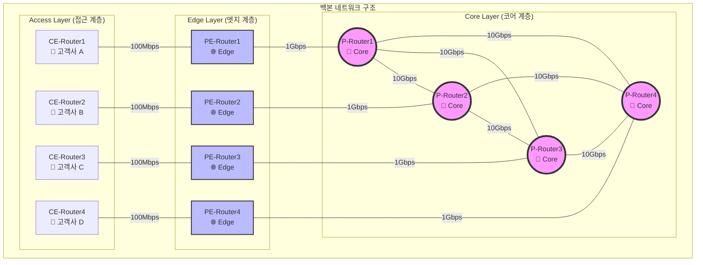
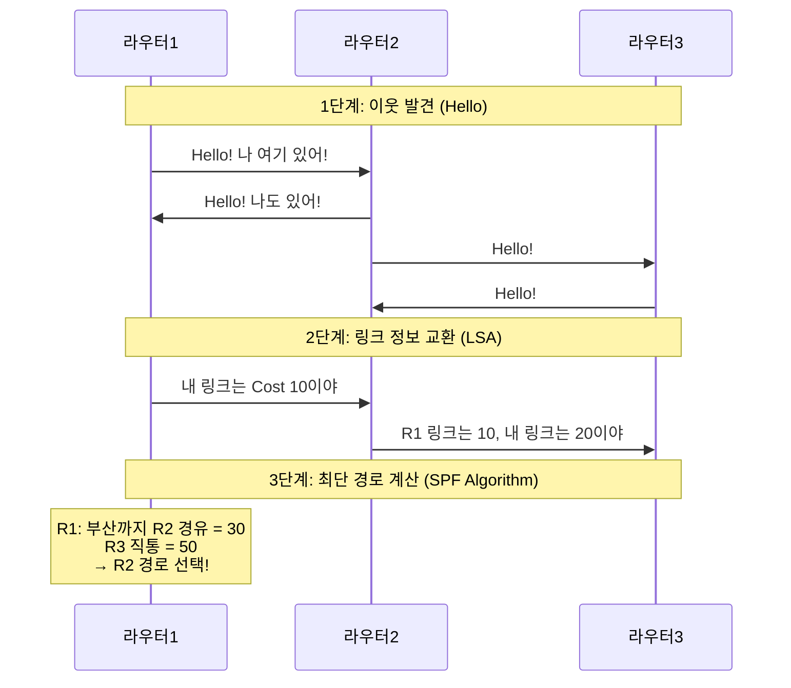
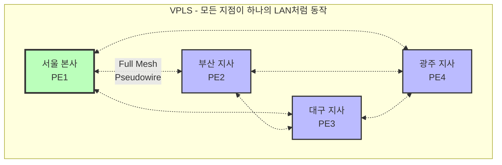
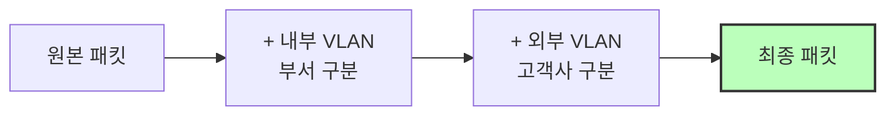
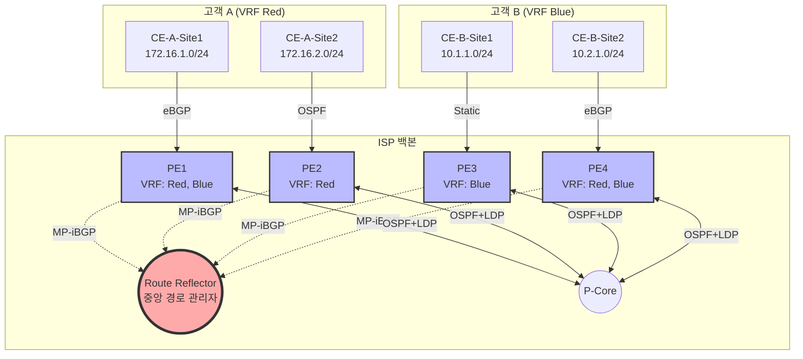

# 6.1 5대 네트워크 도메인 완벽 가이드 (교육용)

> **대상 독자**: 네트워크 지식이 전혀 없는 연구자  
> **학습 목표**: 프로젝트의 5대 네트워크 도메인을 완벽히 이해하고, 각 도메인의 토폴로지와 동작 원리를 설명할 수 있다.

---

## 📚 목차

1. [Backbone 네트워크: 인터넷의 고속도로](#1-backbone-네트워크-인터넷의-고속도로)
2. [Metro/L2VPN: 기업의 전용 터널](#2-metrol2vpn-기업의-전용-터널)
3. [ISP/L3VPN: 클라우드의 아파트](#3-ispl3vpn-클라우드의-아파트)
4. [Internet/BGP: 국가 간 외교](#4-internetbgp-국가-간-외교)
5. [Multicast: TV 방송국](#5-multicast-tv-방송국)

---

## 1. Backbone 네트워크: 인터넷의 고속도로

### 1.1 왜 필요한가?

상상해보세요. 서울에서 부산까지 급히 가야 합니다. 국도로 갈까요, 고속도로로 갈까요? 당연히 고속도로입니다!

네트워크도 마찬가지입니다. **백본(Backbone)**은 데이터가 **빠르고 안정적으로** 장거리를 이동하는 "인터넷 고속도로"입니다.

**실생활 예시**:

- 카카오톡 통화가 "뚝뚝" 끊기지 않으려면?
- 주식 거래가 1초 지연 없이 체결되려면?
- YouTube 4K 영상이 버퍼링 없이 재생되려면?

→ 모두 **백본의 성능**에 달려있습니다!

### 1.2 토폴로지 설계도



**토폴로지 설명**:

- **Core Layer (코어)**: 4개의 P-Router가 **Full-Mesh**로 연결 (모든 라우터가 서로 직접 연결)
- **Edge Layer (엣지)**: 4개의 PE-Router가 각각 하나의 Core에 연결
- **Access Layer (접근)**: 고객사 라우터(CE)가 PE에 연결

**왜 Full-Mesh인가?**

```
시나리오: P1과 P2 사이 링크 고장!

Full-Mesh 없음:
P1 → P2 (X 고장!) → 통신 불가

Full-Mesh 있음:
P1 → P3 → P2 (우회 성공!) → 통신 유지
```

### 1.3 핵심 프로토콜: OSPF (최단 경로 찾기)

#### OSPF란?

**Open Shortest Path First** = "가장 짧은 길을 먼저 찾아라!"

네비게이션이 자동으로 최단 경로를 찾듯이, OSPF는 라우터들이 자동으로 최적 경로를 찾게 해줍니다.

#### OSPF 동작 과정 시각화



#### OSPF Cost 계산 예시

```
네트워크:
서울(R1) ─(Cost 10)─ 대전(R2) ─(Cost 20)─ 부산(R3)
         └──(Cost 50)─────────────────────┘

OSPF 계산:
경로 1: 서울 → 대전 → 부산 = 10 + 20 = 30 ✅ (선택!)
경로 2: 서울 → 부산 (직통) = 50 ❌ (느림)

결론: OSPF는 자동으로 경로 1을 선택합니다.
```

### 1.4 핵심 기능: Fast Reroute (빠른 우회)

#### 문제 상황

```
정상 상태:
서울 ─────→ 대전 ─────→ 부산
     10ms        10ms

장애 발생:
서울 ──X(사고!)──

일반 라우터의 반응:
1. 사고 감지 (1초)
2. 새 경로 계산 (2초)
3. 경로 변경 (1초)
→ 총 4초 지연! (전화 통화 끊김!)
```

#### FRR 솔루션

```mermaid
graph LR
    Seoul[서울]
    Daejeon[대전]
    Gwangju[광주]
    Busan[부산]

    Seoul ---|주 경로<br/>Cost 10| Daejeon
    Daejeon ---|주 경로<br/>Cost 10| Busan
    Seoul -.->|백업 경로<br/>(미리 준비)| Gwangju
    Gwangju -.->|백업 경로| Busan

    style Daejeon fill:#fbb,stroke:#f00,stroke-width:3px
    style Gwangju fill:#bfb,stroke:#0f0,stroke-width:3px
```

**FRR 동작**:

```
0.00초: 대전 링크 고장 감지
0.05초: 광주 백업 경로로 즉시 전환! (미리 준비했음)
→ 사용자는 전혀 못 느낌!
```

### 1.5 실습 예제: VoIP 전화 시나리오

**시나리오**: 서울 사무실에서 부산 사무실로 인터넷 전화(VoIP) 통화

```
요구사항:
- 지연(Latency): 150ms 이하
- 패킷 손실: 1% 이하
- 백본 복구 시간: 50ms 이하 (FRR)

백본 경로:
서울 → [OSPF 최적 경로 선택] → 부산

장애 시:
서울 → [FRR 자동 우회] → 부산 (0.05초 안에!)
```

---

## 2. Metro/L2VPN: 기업의 전용 터널

### 2.1 왜 필요한가?

은행의 본점과 지점이 통신할 때, 일반 인터넷을 쓸까요? **절대 안 됩니다!**

**이유**:

1. **보안**: 일반 인터넷은 누가 엿들을지 모릅니다.
2. **성능**: 인터넷은 혼잡할 수 있습니다.
3. **투명성**: 본점과 지점이 마치 같은 건물에 있는 것처럼 보여야 합니다.

→ **L2VPN(Layer 2 Virtual Private Network)**이 필요합니다!

### 2.2 L2 vs L3 개념 이해

**OSI 7 Layer 모델의 Layer 2와 Layer 3**:

```
┌─────────────────────────────────┐
│  Layer 7: Application (앱)      │
│  Layer 6: Presentation          │
│  Layer 5: Session               │
│  Layer 4: Transport             │
├─────────────────────────────────┤
│  Layer 3: Network (IP 주소) ←─┐ │
│  192.168.1.1 같은 주소 사용    │ │
├────────────────────────────────┼─┤
│  Layer 2: Data Link (MAC) ←───┼─┤ ← 우리가 다룰 계층!
│  AA:BB:CC:DD:EE:FF 같은 주소   │ │
├────────────────────────────────┴─┤
│  Layer 1: Physical (물리)        │
└──────────────────────────────────┘
```

**비유**:

- **L3 (IP 주소)**: 우편 주소 (서울시 강남구 테헤란로 123)
- **L2 (MAC 주소)**: 건물 안 호수 (101호, 102호)

**L2VPN의 핵심**:

- 서울 본사 101호와 부산 지사 101호를 **같은 건물처럼** 연결!
- MAC 주소가 그대로 전달 (마치 옆방에 있는 것처럼)

### 2.3 토폴로지 설계도: VPWS (1:1 전용선)

```mermaid
graph LR
    subgraph "서울 본사"
        Server1[서버<br/>MAC: AA:BB:CC:DD:EE:01]
        CE1[CE1<br/>Customer Edge]
    end

    subgraph "ISP 망 (L2VPN)"
        PE1[PE1<br/>Provider Edge]
        Core((Core<br/>Network))
        PE2[PE2<br/>Provider Edge]
    end

    subgraph "부산 지사"
        CE2[CE2<br/>Customer Edge]
        Server2[클라이언트<br/>MAC: AA:BB:CC:DD:EE:02]
    end

    Server1 -->|Ethernet| CE1
    CE1 -->|VLAN 100| PE1
    PE1 -.->|Pseudowire<br/>(가상 전선)| Core
    Core -.->|Pseudowire| PE2
    PE2 -->|VLAN 100| CE2
    CE2 -->|Ethernet| Server2

    style PE1 fill:#bbf,stroke:#333,stroke-width:2px
    style PE2 fill:#bbf,stroke:#333,stroke-width:2px
    style Core fill:#ddd,stroke:#333,stroke-width:2px
```

**동작 과정**:

```
1. 서울 서버가 프레임 전송:
   [MAC Src: AA:01] [MAC Dst: AA:02] [Data: "Hello"]

2. CE1이 VLAN 태그 추가:
   [VLAN: 100] [MAC Src: AA:01] [MAC Dst: AA:02] [Data]

3. PE1이 Pseudowire로 캡슐화:
   [MPLS Label] [VLAN: 100] [MAC Src: AA:01] [MAC Dst: AA:02]

4. Core 네트워크를 통해 전달 (ISP 내부)

5. PE2가 캡슐화 제거:
   [VLAN: 100] [MAC Src: AA:01] [MAC Dst: AA:02] [Data]

6. CE2가 VLAN 제거 후 전달:
   [MAC Src: AA:01] [MAC Dst: AA:02] [Data: "Hello"]

결과: 부산 서버는 서울 서버가 바로 옆에 있는 것처럼 인식!
```

### 2.4 토폴로지 설계도: VPLS (다:다 네트워크)



**VPWS vs VPLS 비교**:

| 특징        | VPWS (Wire Service) | VPLS (LAN Service)      |
| ----------- | ------------------- | ----------------------- |
| 연결 형태   | 점대점 (1:1)        | 다중점 (다:다)          |
| 비유        | 전용 전화선         | 사무실 LAN              |
| 사용 사례   | 본사↔지사 전용선    | 전국 지사 통합 네트워크 |
| 설정 복잡도 | 낮음                | 높음 (Full Mesh 필요)   |

### 2.5 QinQ: 태그 안의 태그

**문제 상황**: ISP가 수백 개 기업에게 L2VPN 서비스를 제공한다면?

```
VLAN 태그는 4096개(0-4095)만 가능
→ 고객사 100개 × 부서 50개 = 5,000개 필요!
→ 부족함!
```

**해결책: QinQ (Q-in-Q, 이중 태그)**



**예시**:

```
삼성전자 (외부 VLAN 100):
  ├─ 영업부 (내부 VLAN 10) → 태그: [100, 10]
  ├─ 개발부 (내부 VLAN 20) → 태그: [100, 20]
  └─ 총무부 (내부 VLAN 30) → 태그: [100, 30]

LG전자 (외부 VLAN 200):
  ├─ 영업부 (내부 VLAN 10) → 태그: [200, 10]
  ├─ 개발부 (내부 VLAN 20) → 태그: [200, 20]
  └─ 총무부 (내부 VLAN 30) → 태그: [200, 30]

→ 같은 내부 VLAN이어도 외부 VLAN이 다르면 완전히 구분됨!
```

---

## 3. ISP/L3VPN: 클라우드의 아파트

### 3.1 왜 필요한가?

**시나리오**: AWS를 사용하는 삼성, LG, 현대가 모두 같은 물리 서버를 씁니다.

**질문**: 삼성의 데이터가 LG로 새면 어떻게 될까요?  
**답**: 초대형 보안 사고! 회사 망함!

→ **L3VPN**으로 **완벽한 격리(Isolation)**가 필요합니다!

### 3.2 핵심 개념: VRF (가상 라우팅 테이블)

**일반 라우터**:

```
라우터 안에 라우팅 테이블 1개:
┌──────────────────┐
│ 라우팅 테이블    │
│ 10.1.1.0/24 → A  │
│ 10.2.1.0/24 → B  │
└──────────────────┘
```

**VRF 라우터**:

```
라우터 안에 VRF별로 독립된 라우팅 테이블:
┌────────────────────────────────┐
│ VRF Red (삼성 전용)             │
│ 10.1.1.0/24 → 삼성 서버         │
│ 192.168.1.0/24 → 삼성 사무실    │
├────────────────────────────────┤
│ VRF Blue (LG 전용)              │
│ 10.1.1.0/24 → LG 서버 (같은 IP!)│
│ 192.168.1.0/24 → LG 사무실      │
└────────────────────────────────┘
```

**핵심**: 같은 IP 주소를 써도 VRF가 다르면 완전히 다른 곳으로 갑니다!

### 3.3 토폴로지 설계도: Route Reflector 구조



계속 작성하겠습니다...
