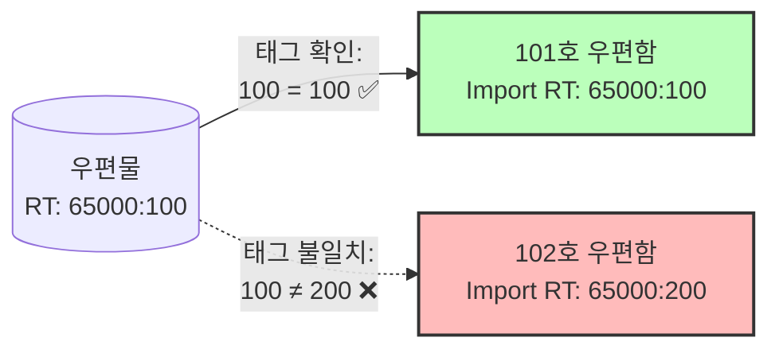
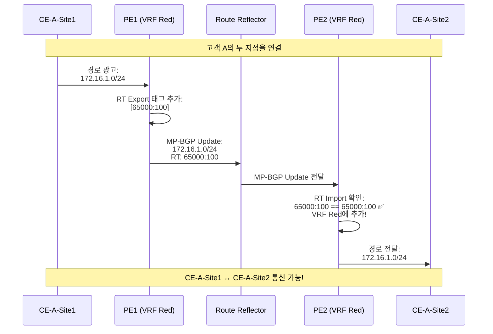
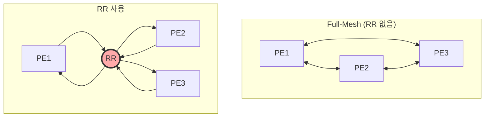
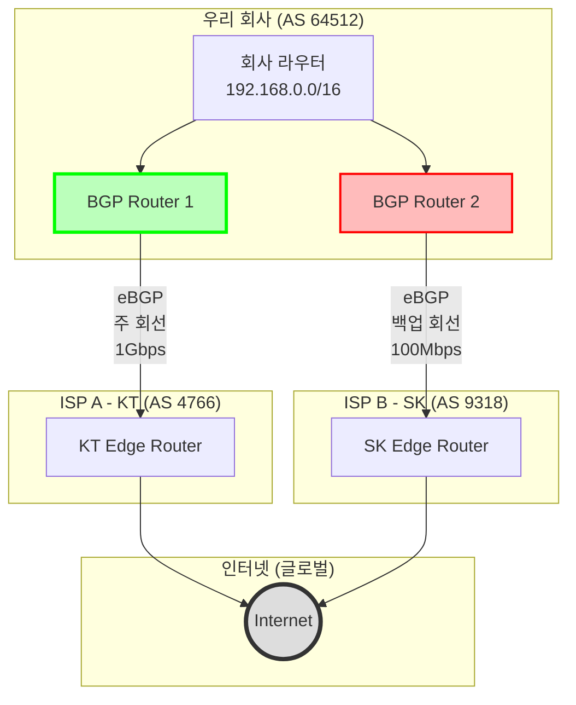
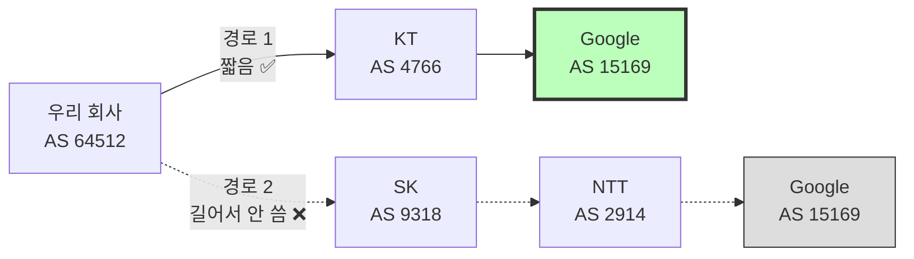
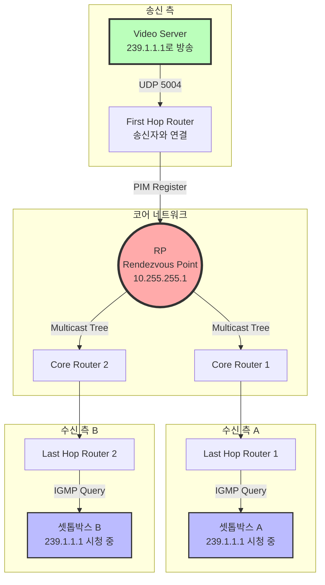
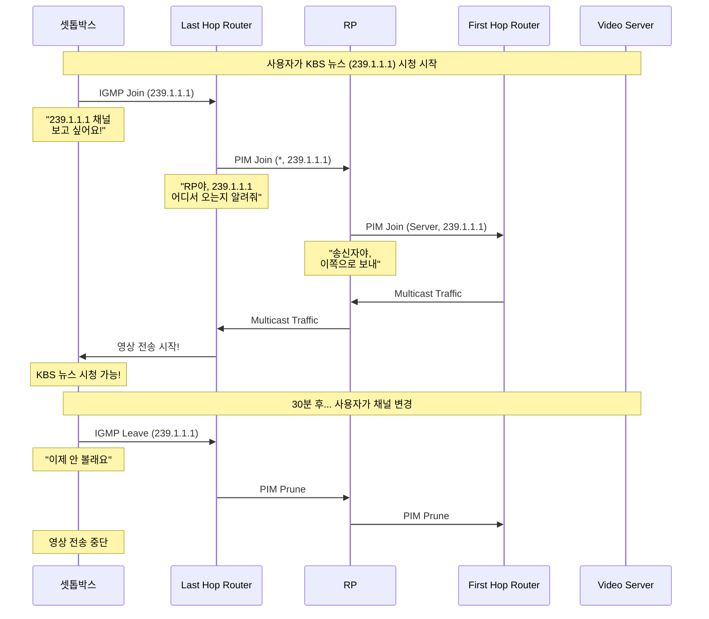
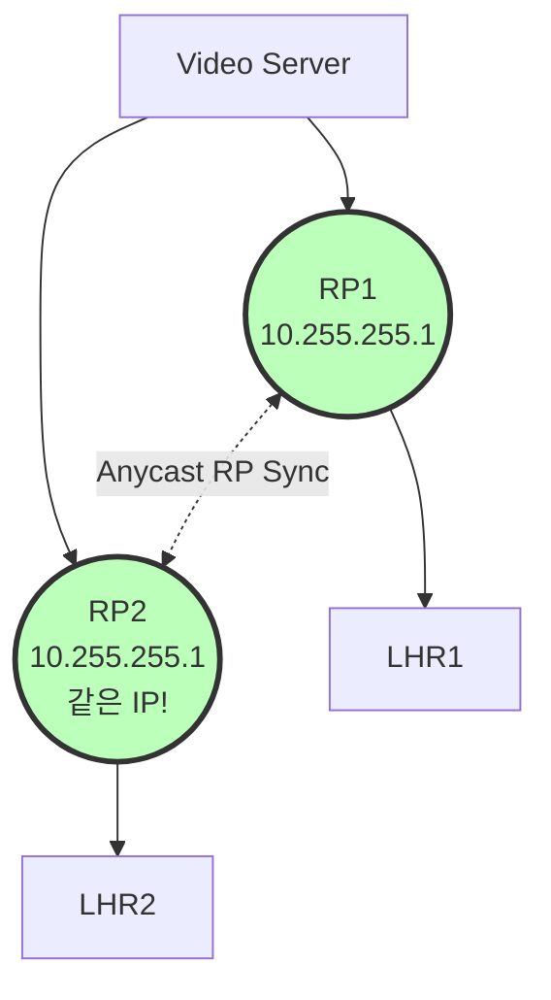

# 6.1 (계속) - BGP와 Multicast 완벽 가이드

> 이 문서는 "6.1 5대 네트워크 도메인 상세 설명 (교육용).md"의 연속입니다.

---

## 3. ISP/L3VPN (계속)

### 3.4 Route Target (RT): 우편물 필터 시스템

#### RT의 역할

Route Target은 "이 경로 정보를 누가 받을 수 있는가?"를 결정하는 **필터 태그**입니다.

**비유: 우편물 분류 시스템**



#### RT 동작 과정 상세

**설정 예시**:

```
PE1의 VRF Red 설정:
  route-target export 65000:100  ← 내보낼 때 이 태그 붙임
  route-target import 65000:100  ← 이 태그 있는 것만 받음

PE2의 VRF Red 설정:
  route-target export 65000:100
  route-target import 65000:100

→ PE1과 PE2의 VRF Red가 서로 경로 교환 가능!
```

**시퀀스 다이어그램**:



### 3.5 Route Reflector: 중앙 우체국

#### 왜 필요한가?

**문제**: 모든 PE가 서로 직접 연결(Full-Mesh)하면?

```
PE 4개인 경우:
PE1 ↔ PE2
PE1 ↔ PE3
PE1 ↔ PE4
PE2 ↔ PE3
PE2 ↔ PE4
PE3 ↔ PE4
→ 총 6개 연결 (n(n-1)/2)

PE 100개인 경우:
100 × 99 / 2 = 4,950개 연결!
→ 관리 불가능!
```

**해결**: Route Reflector (RR)

```
PE 100개 + RR 1개:
각 PE → RR (100개 연결만 필요!)
RR이 모든 경로 정보를 중계
```

**토폴로지 비교**:



---

## 4. Internet/BGP: 국가 간 외교

### 4.1 왜 필요한가?

**인터넷의 진실**: 인터넷은 "하나의 거대한 망"이 아닙니다!

```
인터넷 구조:
  KT 망 (AS 4766)
    ↕
  SK 망 (AS 9318)
    ↕
  Google 망 (AS 15169)
    ↕
  수만 개의 다른 AS...
```

**BGP의 역할**: 이 수만 개의 독립된 망(AS)을 연결하는 **"국제 외교 프로토콜"**

### 4.2 AS (Autonomous System): 인터넷의 국가

**AS란?**

- **정의**: 독립적으로 운영되는 네트워크 조직
- **AS 번호**: 16비트 (0-65535) 또는 32비트
- **비유**: 국가 (한국, 미국, 일본...)

**주요 AS 목록**:

```
AS 4766  = KT (대한민국)
AS 9318  = SK Broadband (대한민국)
AS 3786  = LG U+ (대한민국)
AS 15169 = Google (미국)
AS 32934 = Facebook (미국)
AS 16509 = Amazon AWS (미국)
```

### 4.3 토폴로지 설계도: 멀티호밍



**시나리오**:

```
정상 상태:
회사 → Router1 (KT 1Gbps) → 인터넷 ✅

KT 장애:
회사 → Router2 (SK 100Mbps) → 인터넷 ✅
(느리지만 연결은 유지!)
```

### 4.4 AS-Path: 여권 스탬프

**AS-Path란?**

패킷이 거쳐온 AS의 목록 (여권에 찍힌 국가 스탬프와 동일)

**예시**:

```
목적지: Google (AS 15169)

경로 1:
우리 회사 (AS 64512) → KT (AS 4766) → Google (AS 15169)
AS-Path: [64512, 4766, 15169]
길이: 3개 (짧음!) ✅

경로 2:
우리 회사 (AS 64512) → SK (AS 9318) → NTT (AS 2914) → Google (AS 15169)
AS-Path: [64512, 9318, 2914, 15169]
길이: 4개 (김!) ❌

→ BGP는 자동으로 경로 1 선택 (AS-Path가 짧으니까)
```

**시각화**:



### 4.5 Local Preference: 우선순위

**문제**: AS-Path가 같은 길이인 경로가 2개라면?

```
경로 A: 우리 → KT (1Gbps, 빠름) → Google
경로 B: 우리 → SK (100Mbps, 느림) → Google

AS-Path 길이 같음!
→ 어느 것을 선택?
```

**해결**: Local Preference (높을수록 우선)

```cisco
route-map KT_IN permit 10
  set local-preference 200  ← KT는 200점!

route-map SK_IN permit 10
  set local-preference 100  ← SK는 100점!

→ 200 > 100이므로 KT 경로 선택!
```

**BGP 경로 선택 우선순위**:

```
1. Local Preference (높을수록 좋음)
2. AS-Path Length (짧을수록 좋음)
3. MED (낮을수록 좋음)
4. eBGP over iBGP
5. IGP Metric
...
```

---

## 5. 멀티캐스트: TV 방송국

### 5.1 왜 필요한가?

**문제 상황: 유니캐스트의 비효율**

```
시나리오: 100명에게 10Mbps 영상 전송

유니캐스트 (1:1 개별 전송):
서버 → 학생1 (10Mbps)
서버 → 학생2 (10Mbps)
...
서버 → 학생100 (10Mbps)
→ 서버 대역폭: 1,000Mbps (1Gbps) 필요!
→ 서버 CPU: 100개 스트림 처리 (과부하!)

멀티캐스트 (1:다 방송):
서버 → 네트워크 (10Mbps 한 번만)
네트워크가 자동으로 복제 → 100명에게 전달
→ 서버 대역폭: 10Mbps만 필요! (효율 100배!)
→ 서버 CPU: 1개 스트림만 처리!
```

**실제 사용 사례**:

1. **IPTV**: KT 올레TV, SK Btv (수백만 명 동시 시청)
2. **주식 시세**: 실시간 시세를 수천 명 트레이더에게 전송
3. **온라인 강의**: Zoom 웨비나 1,000명 동시 접속

### 5.2 멀티캐스트 주소 체계

**IP 주소 분류**:

```
유니캐스트 (1:1):
  0.0.0.0 ~ 223.255.255.255
  예: 192.168.1.100

멀티캐스트 (1:다):
  224.0.0.0 ~ 239.255.255.255  ← Class D
  예: 239.1.1.1 (IPTV 채널)

브로드캐스트 (1:전체):
  255.255.255.255
```

**멀티캐스트 그룹 예시**:

```
239.1.1.1 = KBS 뉴스 채널
239.1.1.2 = MBC 드라마 채널
239.1.1.3 = SBS 예능 채널
239.2.1.1 = 주식 KOSPI 실시간 시세
239.2.1.2 = 주식 NASDAQ 실시간 시세
```

### 5.3 토폴로지 설계도: PIM-SM with RP



### 5.4 IGMP: 채널 선택 리모컨

**IGMP (Internet Group Management Protocol)**

- **역할**: "저 이 채널 보고 싶어요!" 신청
- **비유**: TV 리모컨으로 채널 선택

**IGMP 동작 시퀀스**:



### 5.5 RP (Rendezvous Point): 만남의 광장

**RP란?**

- **뜻**: "만남의 장소"
- **역할**: 송신자와 수신자를 연결해주는 중계점
- **비유**: 방송국 중계소

**RP가 필요한 이유**:

```
문제: 송신자와 수신자가 서로를 어떻게 찾나?

송신자: "239.1.1.1로 방송 시작!"
수신자: "239.1.1.1 보고 싶은데 어디서 오는지 몰라..."

해결: RP가 중간에서 연결!

송신자 → RP: "내가 239.1.1.1 방송 중"
수신자 → RP: "239.1.1.1 보고 싶어"
RP: "알았어, 연결해줄게!"
```

**Anycast RP (이중화)**:



**Anycast RP 동작**:

```
정상:
  RP1 살아있음 → LHR1은 RP1 사용
  RP2 살아있음 → LHR2는 RP2 사용

RP1 장애:
  RP1 죽음 → LHR1은 자동으로 RP2로 전환!
  방송 계속 시청 가능!
```

---

## 요약표: 5대 네트워크 비교

| 네트워크      | 계층 | 핵심 프로토콜       | 주요 기능                | 실사용       |
| ------------- | ---- | ------------------- | ------------------------ | ------------ |
| **Backbone**  | L3   | OSPF, IS-IS, FRR    | 최적 경로 + 빠른 우회    | VoIP, 금융망 |
| **L2VPN**     | L2   | VPWS, VPLS, QinQ    | L2 투명성 + VLAN 격리    | 기업 전용선  |
| **L3VPN**     | L3   | VRF, MP-BGP, RT     | IP 레벨 격리 + 경로 공유 | AWS, Azure   |
| **BGP**       | L3   | AS-Path, Local Pref | AS 간 경로 선택          | ISP 연동     |
| **Multicast** | L3   | PIM-SM, IGMP, RP    | 1:다 효율 전송           | IPTV, 웨비나 |

---

**다음 문서**: [`6.2 고장 시나리오 설계 (교육용)`](<./6.2%20고장%20시나리오%20설계%20(교육용).md>)에서 이 네트워크들을 어떻게 망가뜨리고 검증할지 배웁니다!
