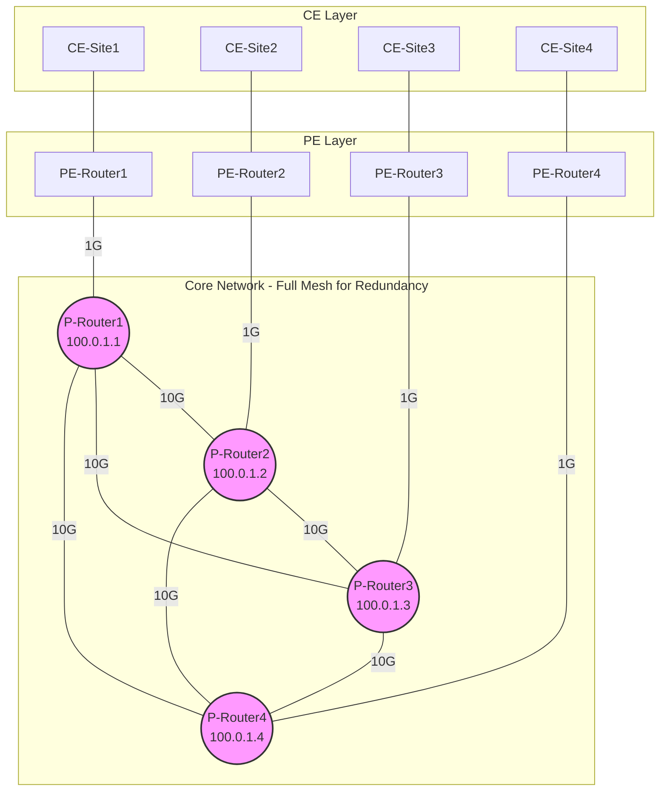
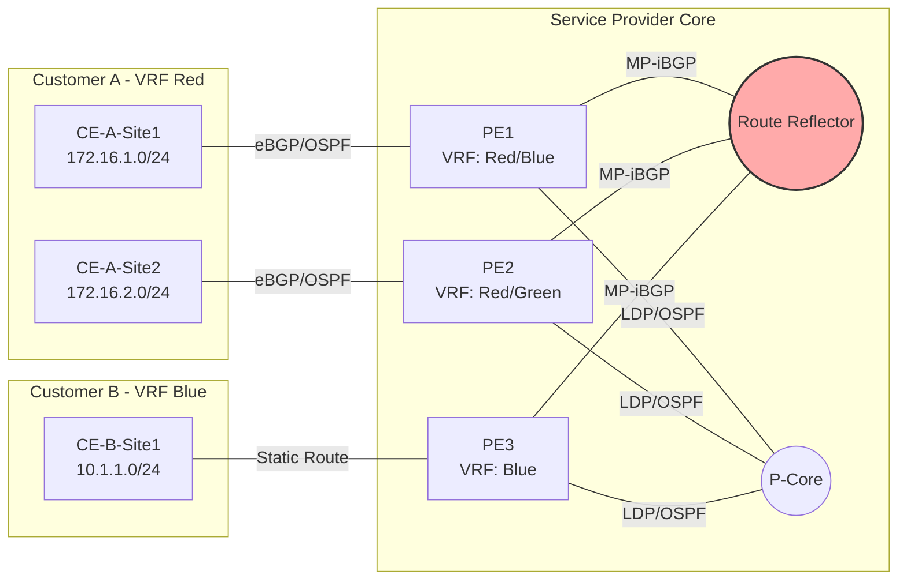
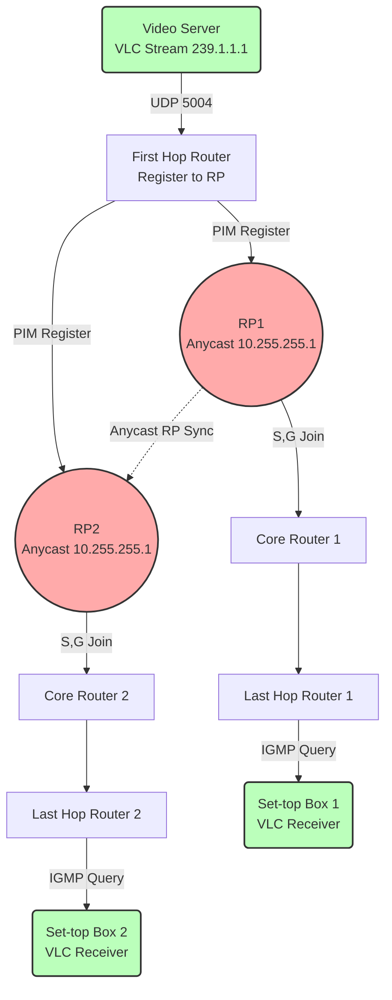

# 6.1 네트워크 데이터셋 구축 전략

> **📍 네비게이션**: [← INDEX](./6.0_Network_Dataset_Index.md) | 다음: [6.2 네트워크 도메인 가이드 →](./6.2_Network_Domains_Guide.md)

이 문서는 LLM 기반 네트워크 설정 검증 시스템을 위한 고품질 데이터셋 구축 전략을 설명합니다. 단순한 연결성 검증을 넘어, 실제 서비스가 동작하는 복잡한 네트워크 환경을 시뮬레이션하여 LLM의 네트워크 추론 능력을 체계적으로 평가할 수 있도록 설계되었습니다.

프로젝트의 핵심은 **"5대 도메인 기반 서비스 중심 실험실"**을 구축하고, NSO를 활용한 동적 시나리오 생성을 통해 대규모 데이터셋을 자동 생산하는 것입니다.

---

## 1. 배경 및 문제 인식

### 1.1 기존 접근 방식의 한계

**현재 상태**:

- 단일 실험실 (L2VPN) 기반 데이터셋 구축
- 장비 8대, 설정 파일당 약 1.5-2KB 수준 (단순 Underlay만 구성)
- 주로 정적 연결성 검증 (Ping, OSPF Neighbor) 중심

**문제점**:

1. **다양성 부족**: 단일 네트워크 도메인(L2VPN)만으로는 LLM의 일반화 능력 검증 불가
2. **깊이 부족**: 기본 프로토콜만 동작하는 "빈 캔버스" 상태로, 복잡한 서비스 시나리오 부재
3. **현실성 부족**: 실제 트래픽이 흐르지 않는 정적 연결성 검증만으로는 현업 적용 가능성 낮음
4. **확장성 한계**: 단일 실험실 기반으로는 데이터셋 규모 확장에 한계

### 1.2 학술적/산업적 요구사항

**지도교수 피드백**:

- 5개 이상의 다양한 네트워크 카테고리로 확장 필요
- 학술 논문 작성 시 "데이터셋의 다양성"이 검증 신뢰도의 핵심 지표

**산업 현장 요구**:

- 실제 서비스(IPTV, VoIP, Cloud)가 동작하는 네트워크 환경 시뮬레이션
- 단순 연결성이 아닌 "서비스 품질(QoS, Latency)" 검증 능력 필요

---

## 2. 전략 개요: 5대 서비스 중심 실험실 (Service-Oriented Multi-Lab)

### 2.1 핵심 아이디어

기존의 "단일 랩, 깊이 중심(Depth)" 접근에서 **"5대 도메인, 너비+깊이 혼합(Breadth + Depth)"** 전략으로 전환합니다.

**변경사항 요약**:

| 항목                 | 기존 (Before)              | 변경 후 (After)                                |
| -------------------- | -------------------------- | ---------------------------------------------- |
| **실험실 수**        | 1개 (L2VPN)                | 5개 (Backbone, Metro, ISP, Internet, Advanced) |
| **데이터 생성 방식** | 정적 Config 1회 추출       | NSO 동적 시나리오 Loop (수백 회 반복)          |
| **검증 대상**        | 연결성 (Ping, Neighbor Up) | 서비스 동작 (IPTV 스트리밍, VoIP QoS)          |
| **복잡도**           | Underlay만 (OSPF/LDP)      | Overlay 포함 (VRF, Multicast, TE)              |

### 2.2 5대 서비스 도메인 정의

각 실험실은 현업의 특정 네트워크 아키텍처를 대표하며, 고유한 서비스 검증 목표를 가집니다.

| 도메인            | 실험실 명칭      | 주요 프로토콜/기술                         | **검증 서비스**                                                           | 데이터셋 목표                                      | 상태        |
| ----------------- | ---------------- | ------------------------------------------ | ------------------------------------------------------------------------- | -------------------------------------------------- | ----------- |
| **백본망**        | `IGP_Backbone`   | OSPF Multi-Area, IS-IS, FRR                | **VoIP / Mission-Critical**<br>(저지연 보장, 링크 Fail 시 50ms 이내 복구) | Fast Reroute 동작 여부, 수렴 시간 측정             | _구축 필요_ |
| **메트로망**      | `L2VPN_Metro`    | VPWS, VPLS, QinQ, H-VPLS                   | **기업 전용선**<br>(지사-본사 간 L2 투명성)                               | VLAN 태깅 오류, PW 미스매치 탐지                   | _보유 중_   |
| **클라우드 백본** | `MPLS_L3VPN`     | MP-BGP, VRF, Route Reflector, RT Filtering | **Multi-Tenant Cloud**<br>(고객 간 완전 격리, VRF Leaking)                | VRF 라우팅 테이블 격리 검증, RT Import/Export 오류 | _구축 필요_ |
| **인터넷 Edge**   | `BGP_Edge`       | eBGP, AS-Path Prepend, Local Pref, MED     | **ISP 멀티호밍**<br>(최적 경로 선택, Load Balancing)                      | BGP Policy 적용 결과, 경로 선호도 분석             | _구축 필요_ |
| **차세대 망**     | `IPTV_Multicast` | PIM-SM, Anycast RP, IGMP Snooping          | **IPTV 라이브 방송**<br>(239.x.x.x 멀티캐스트 스트리밍)                   | RP 불일치 시 트래픽 드롭, Multicast Tree 검증      | _구축 필요_ |

**프로토콜 커버리지 (총 15+ 프로토콜)**:

- L2: STP, LACP, QinQ, VPLS
- L3 IGP: OSPF, IS-IS
- L3 EGP: BGP (iBGP, eBGP, MP-BGP)
- Overlay: MPLS, LDP, VRF
- Multicast: PIM-SM, IGMP
- QoS: DSCP Marking, Rate Limiting

---

## 3. 토폴로지 설계 (Topology Blueprints)

### 3.1 Backbone & ISP Core (Ring + Mesh 구조)

**목표 장비 수**: 12-15대
**핵심 구성**: P-Router 4대 (Full-Mesh), PE-Router 4대, CE-Router 4대



**프로토콜 스택**:

- **Underlay**: OSPF Area 0 (Loopback reachability)
- **Label Distribution**: LDP (Label bindings)
- **Traffic Engineering**: MPLS-TE (Optional, Explicit Path)

### 3.2 L3VPN Architecture (Multi-Tenant SP)

**목표 장비 수**: 10-12대
**핵심 시나리오**: 고객 A/B의 사이트 간 통신, VRF 기반 완전 격리



**시나리오 예시**:

1. **정상 동작**: CE-A1 → PE1 → (MP-BGP via RR) → PE2 → CE-A2 (VRF Red 내 통신)
2. **고장 주입**: RT Import 오타 (`65000:100` → `65000:101`) → CE-A1과 CE-A2 간 통신 단절

### 3.3 IPTV Multicast (PIM-SM with Anycast RP)

**목표 장비 수**: 8-10대
**핵심 시나리오**: Video Server → 멀티캐스트 그룹 239.1.1.1 → Set-top Box (VLC Player)



**검증 포인트**:

- RP Anycast 주소 설정 오류 → 멀티캐스트 트리 형성 실패
- IGMP Snooping 미설정 → L2 스위치에서 플러딩 발생
- MTU 불일치 (1500 vs 1492) → 큰 패킷 드롭

---

## 4. 데이터셋 생성 파이프라인 ("Scenario Factory")

### 4.1 NSO + Batfish 자동화 Loop

```text
┌──────────────────────────────────────────────────────────┐
│  Phase 1: Golden State (정답 Config 생성)                │
├──────────────────────────────────────────────────────────┤
│  1. NSO로 실험실 초기 구성 (L3VPN 정상 동작)             │
│  2. Config Export → Data/Golden/L3VPN_golden.cfg         │
└──────────────────────────────────────────────────────────┘
                     ↓
┌──────────────────────────────────────────────────────────┐
│  Phase 2: Fault Injection Loop (시나리오 반복)           │
├──────────────────────────────────────────────────────────┤
│  FOR scenario IN [RT_mismatch, VRF_leak, RP_down, ...]:  │
│    • NSO.apply(scenario)         # PE1의 RT 변경          │
│    • Config Export               # Broken Config 저장     │
│    • Batfish.analyze(config)     # "RT 불일치" 탐지       │
│    • Dataset.add(Q, A, Label)    # Q&A 생성               │
│    • NSO.rollback()              # 정상 복구              │
│  END FOR                                                  │
└──────────────────────────────────────────────────────────┘
                     ↓
┌──────────────────────────────────────────────────────────┐
│  Phase 3: Dataset Merge (5개 랩 통합)                    │
├──────────────────────────────────────────────────────────┤
│  Merge(Backbone_DS, L2VPN_DS, L3VPN_DS, BGP_DS, IPTV_DS) │
│  → Final_Complex_Dataset.json (추정: 5,000+ samples)     │
└──────────────────────────────────────────────────────────┘
```

### 4.2 시나리오 라이브러리 설계

**파일 구조**:

```
Make_Dataset/scenarios/
├── backbone/
│   ├── ospf_cost_mismatch.py
│   ├── link_failure_frr.py
│   └── ldp_session_down.py
├── l3vpn/
│   ├── rt_import_error.py
│   ├── vrf_leak_security.py
│   └── route_reflector_down.py
├── multicast/
│   ├── rp_unreachable.py
│   ├── igmp_version_mismatch.py
│   └── mtu_mismatch_fragment.py
└── ...
```

**시나리오 예제 (`rt_import_error.py`)**:

```python
"""
L3VPN Route Target Import 오류 시나리오
Customer A가 Customer B의 라우팅 정보를 받지 못하는 상황 생성
"""

def apply_fault(nso_client, lab_config):
    """
    PE1의 VRF Red에서 RT Import 값을 잘못된 값으로 변경
    정답: 65000:100 → 오답: 65000:999
    """
    device = "L3VPN_PE1"
    commands = [
        "vrf definition Red",
        "no route-target import 65000:100",  # 정답 삭제
        "route-target import 65000:999",     # 오답 주입
    ]
    nso_client.configure(device, commands)
    return {
        "fault_type": "RT_Import_Mismatch",
        "expected_symptom": "CE-A-Site1 cannot ping CE-A-Site2",
        "root_cause": "VRF Red RT import changed from 100 to 999"
    }

def rollback(nso_client):
    """정상 설정으로 복구"""
    nso_client.rollback_transaction()
```

---

## 5. 실험실 자원 확보 가이드

### 5.1 PnetLab/EVE-NG 포럼 검색 전략

**추천 키워드 (도메인별)**:

| 도메인        | 검색 키워드                                    | 예상 파일명               |
| ------------- | ---------------------------------------------- | ------------------------- |
| **Backbone**  | `Cisco MPLS Core`, `SP Backbone OSPF LDP`      | `MPLS_Core_Topology.unl`  |
| **L3VPN**     | `MPLS L3VPN MP-BGP`, `Inter-AS Option B`       | `L3VPN_MultiTenant.unl`   |
| **BGP**       | `BGP Multihoming Dual ISP`, `Full BGP Table`   | `BGP_Internet_Edge.unl`   |
| **Multicast** | `Cisco Multicast PIM-SM`, `IPTV Streaming Lab` | `Multicast_IPTV_Demo.unl` |

**다운로드 시 확인사항**:

1. **이미지 호환성**: `vIOS`, `IOL` 이미지 확인 (CSR1000v는 리소스 과다 사용)
2. **설정 상태**: "Blank Lab" 또는 "Basic Config Only" 선호 (처음부터 NSO로 구축)
3. **토폴로지 크기**: 최소 10대 이상 권장 (스케일 요구사항 충족)

### 5.2 직접 구축 시 참고 자료

**Cisco Learning Labs**:

- [MPLS Fundamentals](https://learningnetwork.cisco.com/)
- [NSO Service Design](https://developer.cisco.com/docs/nso/)

**오픈소스 토폴로지**:

- [GitHub: MPLS L3VPN Topology Templates](https://github.com/search?q=mpls+l3vpn+topology)
- [EVE-NG Official Labs](https://www.eve-ng.net/index.php/community/labs/)

---

## 6. 예상 데이터셋 규모 및 메트릭

### 6.1 데이터셋 크기 추정

| 실험실          | 시나리오 수 | 장비 수 | 예상 샘플 수 | 비고                        |
| --------------- | ----------- | ------- | ------------ | --------------------------- |
| Backbone        | 15          | 12      | 500          | FRR, TE, Link Fail 시나리오 |
| L2VPN           | 10          | 8       | 300          | 기존 보유                   |
| L3VPN           | 20          | 12      | 800          | RT/VRF 복합 시나리오        |
| BGP             | 18          | 10      | 600          | Policy, AS-Path 조작        |
| Multicast       | 12          | 10      | 400          | RP, Tree, IGMP 시나리오     |
| **합계**        | **75**      | **52**  | **2,600**    | Rule-based (L1-L3)          |
| Batfish (L4-L5) | -           | -       | +2,400       | 도달성, What-If 분석        |
| **총계**        | -           | -       | **5,000+**   | Train/Val/Test Split        |

### 6.2 품질 메트릭

- **프로토콜 커버리지**: 15개 주요 프로토콜
- **서비스 다양성**: 5대 도메인 (Backbone, Metro, ISP, Internet, Advanced)
- **고장 유형**: 링크/노드 장애, 설정 오류, Policy 미스매치 등 30+ 유형

---

## 7. 다음 단계 (Next Steps)

### 7.1 즉시 착수 (High Priority)

1. **[팀 전체] 실험실 파일 검색**

   - PnetLab 포럼에서 L3VPN, BGP, Multicast 랩 다운로드
   - 검색 키워드: 섹션 5.1 참고

2. **[개발] Backbone 랩 재구축**

   - 기존 XML만 있는 Basic 랩을 NSO 기반으로 복구
   - 목표: 15대 장비, Ring+Mesh 구조

3. **[연구] 시나리오 설계 문서 작성**
   - 각 도메인별 고장 시나리오 10개씩 정의
   - NSO Python Script Template 작성

### 7.2 중기 목표 (1-2주)

- NSO 자동화 Loop 구현 (`scenario_factory.py`)
- 첫 번째 도메인(L3VPN) 100개 샘플 생성 및 검증

### 7.3 장기 목표 (1개월)

- 5개 도메인 통합 데이터셋 5,000+ 샘플 완성
- 논문 실험 섹션 작성 (데이터셋 통계, 프로토콜 분포)

---

**문서 업데이트**: 본 문서는 프로젝트 진행에 따라 실험실 확보 상황 및 시나리오 라이브러리가 업데이트될 예정입니다.
