# 부록: 네트워크 용어 설명

## 개요

본 문서는 Batfish 및 네트워크 설정을 이해하는 데 필요한 기본 용어를 중학생도 이해할 수 있도록 쉽게 설명합니다.

---

## 1. 기본 네트워크 장비

### 1.1 라우터 (Router)

**한 줄 설명:** 서로 다른 네트워크를 연결하는 장비

**쉬운 설명:**

라우터는 "교통 경찰"과 같습니다. 여러 도로(네트워크)가 만나는 교차로에서 차(데이터 패킷)가 어디로 가야 할지 안내해줍니다.

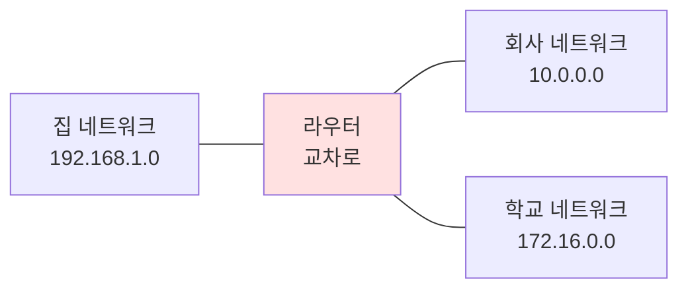

**실생활 비유:**
- 집 = 하나의 네트워크
- 동네 도로망 = 여러 네트워크
- 교차로 = 라우터
- 내비게이션 = 라우팅 테이블

**예시:**
```
집 공유기 = 가정용 라우터
- 우리 집 네트워크(192.168.1.x)와 인터넷 연결
- "이 주소는 우리 집, 저 주소는 인터넷으로!" 판단
```

### 1.2 스위치 (Switch)

**한 줄 설명:** 같은 네트워크 안에서 여러 장비를 연결하는 장비

**쉬운 설명:**

스위치는 "전기 멀티탭"과 같습니다. 여러 컴퓨터를 하나의 네트워크에 연결할 수 있게 해줍니다.

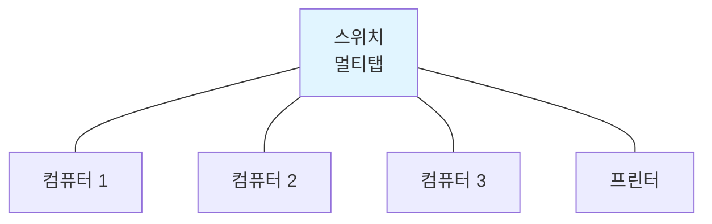

**라우터 vs 스위치:**

| 항목 | 라우터 | 스위치 |
|-----|-------|-------|
| 역할 | 서로 다른 네트워크 연결 | 같은 네트워크 내 장비 연결 |
| 비유 | 교차로 | 멀티탭 |
| 범위 | 넓음 (인터넷까지) | 좁음 (사무실 한 층) |
| 주소 | IP 주소 사용 | MAC 주소 사용 |

### 1.3 방화벽 (Firewall)

**한 줄 설명:** 네트워크 출입을 감시하고 위험한 트래픽을 차단하는 장비

**쉬운 설명:**

방화벽은 "아파트 경비실"과 같습니다. 들어오고 나가는 사람(데이터)을 확인하고, 수상한 사람은 막습니다.

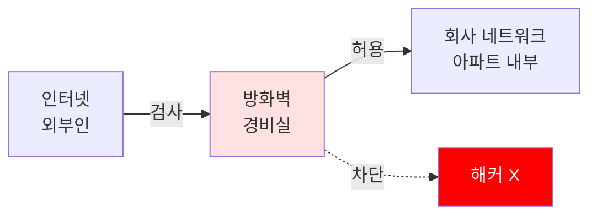

**하는 일:**
- 허용된 IP만 접속 가능 (화이트리스트)
- 특정 포트만 열기 (예: 80번=웹, 22번=SSH)
- 의심스러운 패킷 차단

---

## 2. 네트워크 주소 체계

### 2.1 IP 주소 (IP Address)

**한 줄 설명:** 네트워크에서 장비를 구분하는 고유 주소

**쉬운 설명:**

IP 주소는 "집 주소"와 같습니다. 우편물이 정확한 집에 도착하려면 주소가 필요하듯이, 데이터도 IP 주소가 있어야 정확한 컴퓨터에 도착합니다.

**형식:**
```
192.168.1.100
 │   │   │  │
 └───┴───┴──┴─ 4개 숫자 (각각 0~255)
```

**예시:**
```
구글: 8.8.8.8
네이버: 223.130.200.107
우리 집 컴퓨터: 192.168.1.10
```

**IP 주소 종류:**

| 종류 | 범위 | 용도 | 비유 |
|-----|------|-----|-----|
| **공인 IP** | 인터넷에서 유일 | 인터넷 연결 | 도로명 주소 |
| **사설 IP** | 내부에서만 사용 | 집/회사 내부 | 동호수 |

**사설 IP 대역:**
- `192.168.x.x`: 가정용 (집 공유기)
- `10.x.x.x`: 대기업용 (삼성, SK 등)
- `172.16.x.x ~ 172.31.x.x`: 중소기업용

### 2.2 서브넷 마스크 (Subnet Mask)

**한 줄 설명:** IP 주소에서 네트워크 부분과 호스트 부분을 구분하는 값

**쉬운 설명:**

서브넷 마스크는 "우편번호"와 같습니다. 주소에서 어디까지가 "지역"이고, 어디부터가 "집 번호"인지 알려줍니다.

**예시:**
```
IP: 192.168.1.100
서브넷 마스크: 255.255.255.0 (= /24)

네트워크 부분: 192.168.1.x (우리 동네)
호스트 부분: .100 (우리 집 호수)
```

**비유로 이해:**
```
서울시 강남구 테헤란로 123
│      │      │        │
│      │      │        └─ 호스트 (집 번호)
└──────┴──────┴────────── 네트워크 (지역)
```

**CIDR 표기법:**

| 표기 | 서브넷 마스크 | 사용 가능 IP 수 | 비유 |
|-----|-------------|--------------|-----|
| /24 | 255.255.255.0 | 254개 | 아파트 한 동 |
| /16 | 255.255.0.0 | 65,534개 | 아파트 단지 |
| /8 | 255.0.0.0 | 16,777,214개 | 전체 도시 |

### 2.3 게이트웨이 (Gateway)

**한 줄 설명:** 다른 네트워크로 나가는 출입구

**쉬운 설명:**

게이트웨이는 "아파트 정문"과 같습니다. 아파트 밖으로 나가려면 반드시 정문을 거쳐야 하듯이, 다른 네트워크로 가려면 게이트웨이를 거쳐야 합니다.

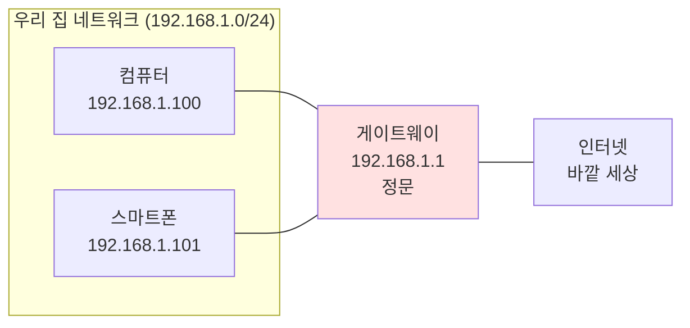

**예시:**
```
내 컴퓨터: 192.168.1.100
기본 게이트웨이: 192.168.1.1 (공유기)

구글(8.8.8.8)에 접속하려면?
1. 192.168.1.100 (내 PC)
2. 192.168.1.1 (게이트웨이)
3. 인터넷으로 나감
4. 8.8.8.8 (구글)
```

### 2.4 포트 (Port)

**한 줄 설명:** 하나의 IP 주소에서 여러 서비스를 구분하는 번호

**쉬운 설명:**

포트는 "아파트 동호수"와 같습니다. 같은 아파트 주소(IP)라도 몇 동 몇 호(포트)인지 알아야 정확한 집에 도착합니다.

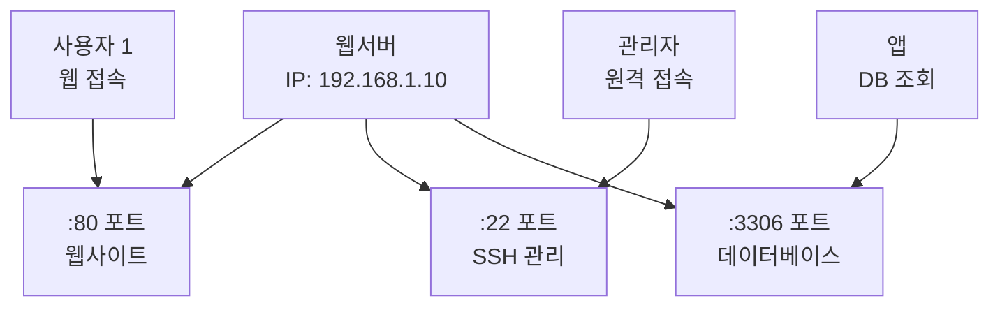

**주요 포트 번호:**

| 포트 | 서비스 | 용도 | 비유 |
|-----|-------|-----|-----|
| 80 | HTTP | 일반 웹사이트 | 정문 |
| 443 | HTTPS | 보안 웹사이트 | 보안 출입구 |
| 22 | SSH | 원격 관리 | 관리실 |
| 21 | FTP | 파일 전송 | 택배실 |
| 3389 | RDP | 윈도우 원격 | VIP 출입구 |

---

## 3. 네트워크 프로토콜

### 3.1 프로토콜 (Protocol)이란?

**한 줄 설명:** 네트워크에서 데이터를 주고받는 규칙

**쉬운 설명:**

프로토콜은 "언어"와 같습니다. 한국 사람끼리는 한국어로, 영어권 사람끼리는 영어로 대화하듯이, 네트워크 장비들도 정해진 프로토콜로 통신합니다.

**비유:**
```
사람 간 대화:
- 한국어 = 한국에서 통용
- 영어 = 국제적으로 통용
- 수화 = 청각장애인끼리 통용

네트워크 통신:
- HTTP = 웹 브라우저가 사용
- FTP = 파일 전송할 때 사용
- SMTP = 이메일 보낼 때 사용
```

### 3.2 TCP/IP

**한 줄 설명:** 인터넷의 기본 통신 규칙

**TCP (Transmission Control Protocol):**

신뢰성 있는 데이터 전송 프로토콜입니다.

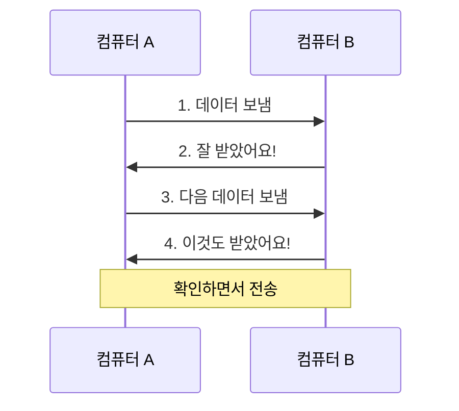

**특징:**
- ✅ 확인: 데이터 도착 여부 확인
- ✅ 순서: 순서대로 도착 보장
- ✅ 신뢰성: 잘못된 데이터 재전송
- ❌ 속도: UDP보다 느림

**사용 예시:**
- 웹사이트 (정확해야 함)
- 이메일 (빠짐없이 전송)
- 파일 다운로드 (완전한 파일)

**UDP (User Datagram Protocol):**

빠른 데이터 전송 프로토콜입니다.

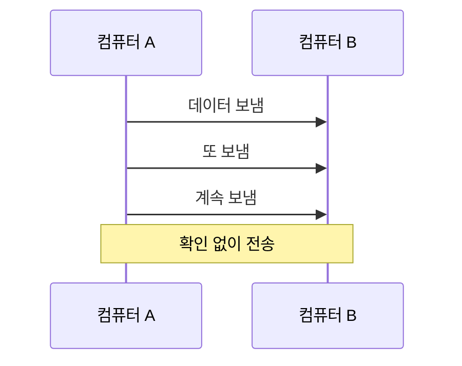

**특징:**
- ✅ 속도: TCP보다 빠름
- ❌ 확인: 도착 여부 미확인
- ❌ 순서: 순서 뒤바뀔 수 있음
- ❌ 신뢰성: 일부 손실 가능

**사용 예시:**
- 유튜브/넷플릭스 (조금 끊겨도 됨)
- 게임 (실시간성 중요)
- 화상회의 (속도 중요)

### 3.3 OSPF (Open Shortest Path First)

**한 줄 설명:** 같은 회사 내부에서 최단 경로를 자동으로 찾는 프로토콜

**쉬운 설명:**

OSPF는 "회사 내부 내비게이션"입니다. 사무실 안에서 가장 빠른 길을 알려줍니다.

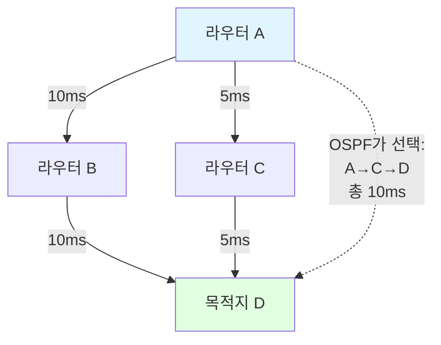

**특징:**
- 🚀 빠름: 변경 사항 즉시 반영
- 🧠 똑똑함: 최단 경로 자동 계산
- 🏢 내부용: 같은 회사/기관 내부에서만 사용
- 📏 거리 기반: 속도/대역폭으로 경로 선택

**예시:**
```
서울 본사 네트워크:
- 1층 라우터 ←→ 2층 라우터 ←→ 3층 라우터
- OSPF로 최적 경로 자동 설정
- 한 라우터 고장나면 자동으로 우회
```

### 3.4 BGP (Border Gateway Protocol)

**한 줄 설명:** 회사와 회사를 연결하는 프로토콜

**쉬운 설명:**

BGP는 "국제 물류"와 같습니다. 나라와 나라 사이에서 물건(데이터)을 어느 경로로 보낼지 협상합니다.

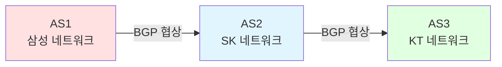

**특징:**
- 🌐 외부용: 회사 간 연결
- 🐌 느림: 안정성 중요 (속도보다)
- 🤝 협상: 서로 합의해서 경로 결정
- 🔒 정책: 특정 회사 경유 금지 가능

**OSPF vs BGP 비교:**

| 항목 | OSPF | BGP |
|-----|------|-----|
| 사용처 | 회사 내부 | 회사와 회사 사이 |
| 속도 | 빠름 | 느림 |
| 범위 | 좁음 | 넓음 (전 세계) |
| 비유 | 건물 내 엘리베이터 | 국제 항공편 |
| 목적 | 최단 경로 | 정책 기반 라우팅 |

### 3.5 HTTP/HTTPS

**HTTP (HyperText Transfer Protocol):**

웹 브라우저가 웹사이트를 가져오는 규칙입니다.

**HTTPS (HTTP Secure):**

HTTP에 보안(암호화)을 추가한 버전입니다.

```mermaid
graph LR
    subgraph HTTP["HTTP (평문 전송)"]
        A1[내 컴퓨터] -.->|비밀번호: 1234<br/>누구나 볼 수 있음| B1[웹사이트]
    end
    
    subgraph HTTPS["HTTPS (암호화)"]
        A2[내 컴퓨터] ==>|#@$!%^&*<br/>암호화됨| B2[웹사이트]
    end
    
    style HTTP fill:#ffe1e1
    style HTTPS fill:#e1ffe1
```

**차이점:**

| 항목 | HTTP | HTTPS |
|-----|------|-------|
| 보안 | ❌ 없음 | ✅ 암호화 |
| 포트 | 80 | 443 |
| 자물쇠 | 없음 | 🔒 표시 |
| 용도 | 공개 정보 | 로그인, 결제 |

---

## 4. 네트워크 토폴로지

### 4.1 토폴로지 (Topology)란?

**한 줄 설명:** 네트워크 장비들이 어떻게 연결되어 있는지 보여주는 구조

**쉬운 설명:**

토폴로지는 "지하철 노선도"와 같습니다. 어떤 역(장비)들이 어떻게 연결되어 있는지 한눈에 볼 수 있습니다.

### 4.2 Layer 1 (물리 계층)

**한 줄 설명:** 실제 케이블 연결 상태

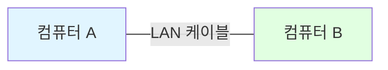

**요소:**
- 케이블 (랜선, 광케이블)
- 커넥터 (RJ45, 광 커넥터)
- 전기 신호

### 4.3 Layer 2 (데이터 링크 계층)

**한 줄 설명:** MAC 주소를 사용하는 계층 (스위치)

**MAC 주소:**
- 형식: `AA:BB:CC:DD:EE:FF`
- 비유: 주민등록번호 (전 세계에 하나)
- 변경 불가

### 4.4 Layer 3 (네트워크 계층)

**한 줄 설명:** IP 주소를 사용하는 계층 (라우터)

**IP 주소:**
- 형식: `192.168.1.100`
- 비유: 집 주소 (이사하면 바뀜)
- 변경 가능

---

## 5. 네트워크 개념

### 5.1 AS (Autonomous System)

**한 줄 설명:** 하나의 조직이 관리하는 네트워크 영역

**쉬운 설명:**

AS는 "하나의 나라" 또는 "하나의 회사"입니다. 각 회사는 자기 네트워크를 자유롭게 관리하고, 다른 회사와는 BGP로 연결합니다.

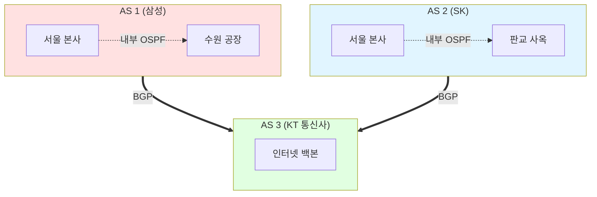

**AS 번호:**
- 형식: 숫자 (예: AS 9644 = KT)
- 전 세계적으로 고유
- IANA에서 할당

### 5.2 ACL (Access Control List)

**한 줄 설명:** 네트워크 트래픽을 허용/차단하는 규칙 목록

**쉬운 설명:**

ACL은 "나이트클럽 출입 명단"과 같습니다. 명단에 있는 사람만 들어갈 수 있고, 나머지는 차단됩니다.

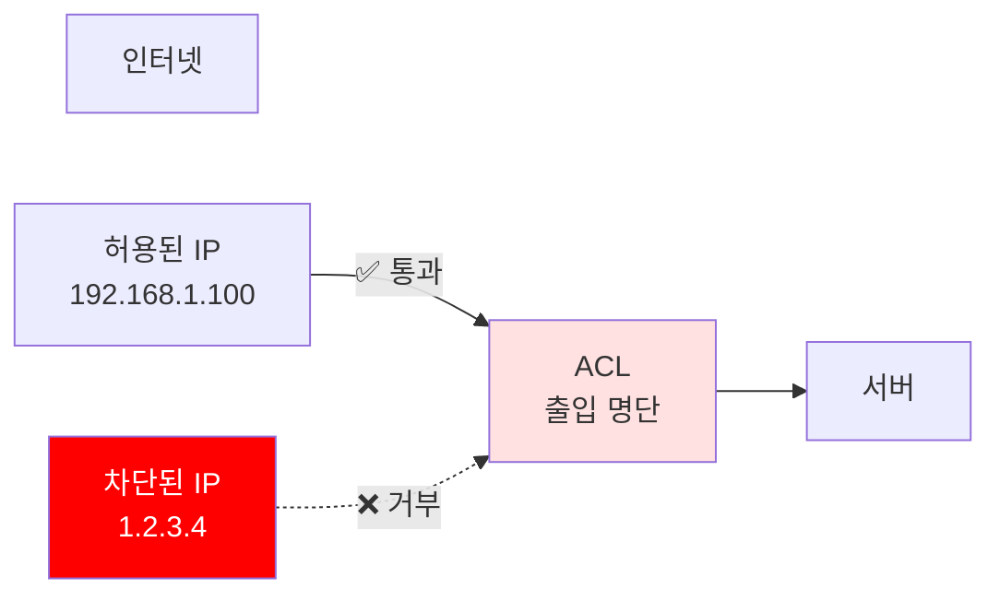

**예시:**
```
ACL 규칙:
1. 192.168.1.0/24 → 허용 (우리 회사)
2. 8.8.8.8 → 허용 (구글 DNS)
3. 나머지 모두 → 차단
```

### 5.3 VLAN (Virtual LAN)

**한 줄 설명:** 하나의 물리적 네트워크를 여러 개의 논리적 네트워크로 분리

**쉬운 설명:**

VLAN은 "아파트를 여러 구역으로 나누기"와 같습니다. 같은 건물이지만 A동 사람과 B동 사람은 서로 못 만나게 할 수 있습니다.

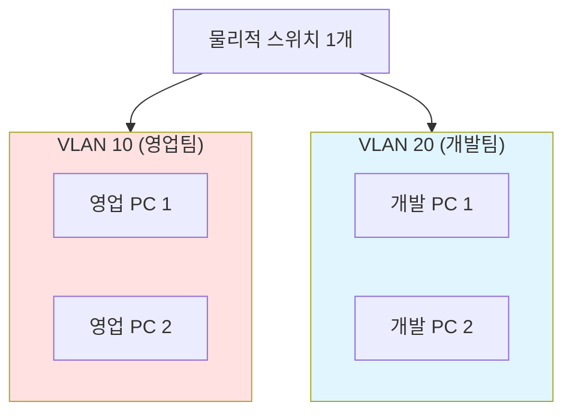

**장점:**
- 🔒 보안: 부서별 네트워크 분리
- 📡 효율: 브로드캐스트 트래픽 감소
- 💰 비용: 스위치 1대로 여러 네트워크

### 5.4 DNS (Domain Name System)

**한 줄 설명:** 도메인 이름을 IP 주소로 변환하는 시스템

**쉬운 설명:**

DNS는 "전화번호부"입니다. 사람 이름(도메인)을 알면 전화번호(IP 주소)를 찾아줍니다.

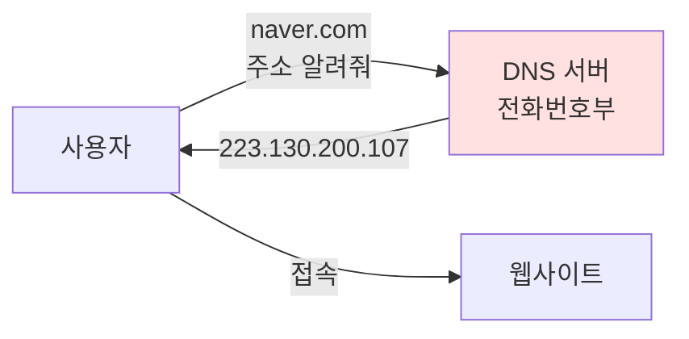

**예시:**
```
www.google.com → 172.217.161.78
www.naver.com → 223.130.200.107
www.youtube.com → 142.250.207.110
```

### 5.5 DHCP (Dynamic Host Configuration Protocol)

**한 줄 설명:** 자동으로 IP 주소를 할당해주는 프로토콜

**쉬운 설명:**

DHCP는 "호텔 체크인 데스크"입니다. 손님(컴퓨터)이 오면 자동으로 방 번호(IP 주소)를 배정해줍니다.

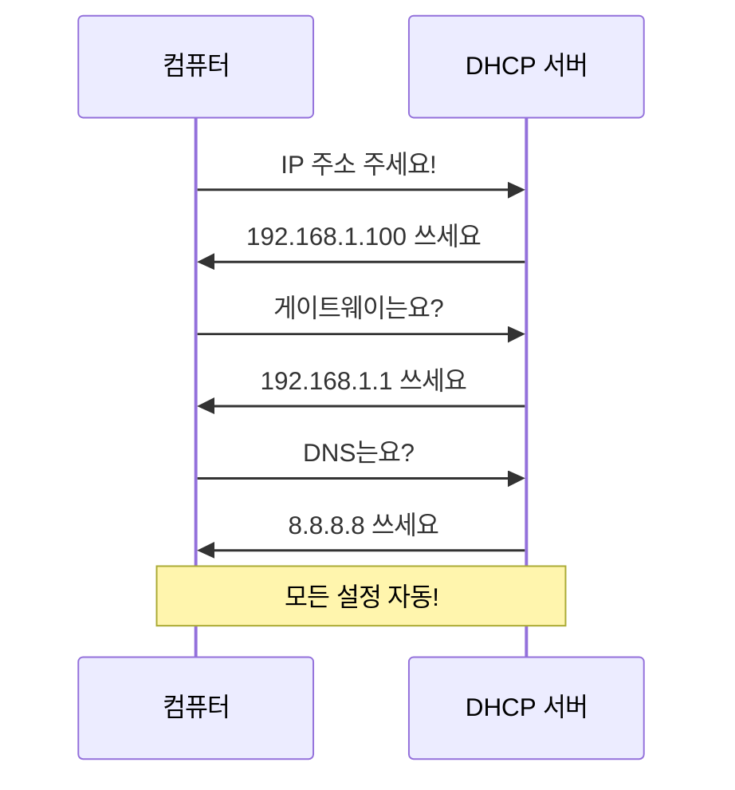

**수동 vs 자동:**

| 방식 | 수동 (Static) | 자동 (DHCP) |
|-----|--------------|------------|
| 설정 | 사람이 직접 입력 | 자동 할당 |
| 장점 | 주소 고정 | 편리함 |
| 단점 | 번거로움 | 주소 변경 가능 |
| 용도 | 서버 | 일반 PC |

---

## 6. 네트워크 명령어

### 6.1 ping

**한 줄 설명:** 상대방이 살아있는지 확인하는 명령어

```bash
ping 8.8.8.8
```

**비유:** "여보세요?" 하고 부르는 것

**결과:**
```
Reply from 8.8.8.8: time=10ms   → 응답 있음 (정상)
Request timed out               → 응답 없음 (문제)
```

### 6.2 traceroute (Windows: tracert)

**한 줄 설명:** 목적지까지 경로를 추적하는 명령어

```bash
traceroute google.com
```

**비유:** 택배 추적 (어디를 거쳐서 왔는지)

**결과:**
```
1. 192.168.1.1 (내 공유기)
2. 10.1.1.1 (통신사 라우터)
3. 172.217.161.78 (구글)
```

### 6.3 nslookup

**한 줄 설명:** 도메인의 IP 주소를 조회하는 명령어

```bash
nslookup naver.com
```

**결과:**
```
Name: naver.com
Address: 223.130.200.107
```

### 6.4 ipconfig (Linux: ifconfig)

**한 줄 설명:** 내 컴퓨터의 IP 설정을 확인하는 명령어

```bash
ipconfig
```

**결과:**
```
IP 주소: 192.168.1.100
서브넷 마스크: 255.255.255.0
기본 게이트웨이: 192.168.1.1
```

---

## 7. 학습 자료

### 7.1 초보자용 무료 강의

**1. 생활코딩 - 네트워크 (WEB2 - Home Server)**
- URL: https://opentutorials.org/course/3265
- 특징: 완전 초보자 대상, 한글, 무료
- 추천 이유: 쉬운 설명, 실생활 예시

**2. 얄팍한 코딩사전 - 네트워크**
- YouTube: https://www.youtube.com/watch?v=Av9UFzl_wis
- 특징: 15분 요약, 그림으로 설명
- 추천 이유: 빠른 이해, 핵심만

**3. 널널한 개발자 - 네트워크 기초**
- YouTube: https://www.youtube.com/@nullnull_not_eq_null
- 특징: 실무 중심, 상세한 설명
- 추천 이유: 깊이 있는 이해

**4. Cisco Networking Basics**
- URL: https://www.netacad.com/courses/networking
- 특징: 영문, 무료 과정
- 추천 이유: 글로벌 표준 교육

### 7.2 책 추천

**입문자용:**

1. **"그림으로 배우는 네트워크 원리"**
   - 저자: Gene (진우성)
   - 특징: 만화로 설명, 쉬운 용어
   - 대상: 중학생~고등학생

2. **"모두의 네트워크"**
   - 저자: 미즈구치 카츠야
   - 특징: 그림 많음, 기초부터
   - 대상: 비전공자, 초보자

**중급자용:**

3. **"네트워크 기초 이론"**
   - 저자: 이승재
   - 특징: 국내 실정 반영, 실습 포함
   - 대상: IT 전공생, 네트워크 관리자

4. **"TCP/IP 완벽 가이드"**
   - 저자: 찰스 M. 코지엘
   - 특징: 프로토콜 상세 설명
   - 대상: 네트워크 엔지니어

### 7.3 온라인 실습 사이트

**1. Cisco Packet Tracer**
- URL: https://www.netacad.com/courses/packet-tracer
- 특징: 가상 네트워크 구성 실습
- 무료: ✅

**2. GNS3**
- URL: https://www.gns3.com/
- 특징: 실제 라우터 OS로 실습
- 무료: ✅

**3. Subnetting Practice**
- URL: https://subnettingpractice.com/
- 특징: 서브넷 계산 연습
- 무료: ✅

### 7.4 YouTube 채널

**한글:**

1. **널널한 개발자**
   - URL: https://www.youtube.com/@nullnull_not_eq_null
   - 특징: 네트워크 기초부터 실무까지

2. **쉬운코드**
   - URL: https://www.youtube.com/@ez.
   - 특징: 네트워크 개념을 쉽게 설명

**영문:**

3. **NetworkChuck**
   - URL: https://www.youtube.com/@NetworkChuck
   - 특징: 재미있는 설명, 초보자 친화적

4. **PowerCert Animated Videos**
   - URL: https://www.youtube.com/@PowerCertAnimatedVideos
   - 특징: 애니메이션으로 설명

### 7.5 자격증 준비

**초급:**

- **CompTIA Network+**
  - 난이도: ⭐⭐
  - 기간: 1~2개월
  - 추천 대상: 네트워크 입문자

**중급:**

- **CCNA (Cisco Certified Network Associate)**
  - 난이도: ⭐⭐⭐
  - 기간: 3~6개월
  - 추천 대상: 네트워크 관리자 지망생

### 7.6 커뮤니티

**한국:**

1. **OKKY 네트워크 게시판**
   - URL: https://okky.kr/
   - 질문/답변 활발

2. **KISA 보안 공지**
   - URL: https://www.kisa.or.kr/
   - 최신 보안 이슈

**해외:**

3. **Reddit r/networking**
   - URL: https://www.reddit.com/r/networking/
   - 글로벌 네트워크 엔지니어 커뮤니티

4. **Stack Overflow - Network**
   - URL: https://stackoverflow.com/questions/tagged/networking
   - 기술 질문 답변

---

## 8. 학습 로드맵

### 8.1 1단계: 기초 (1~2개월)

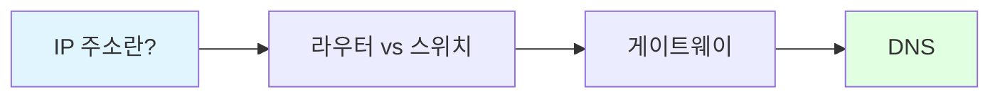

**학습 내용:**
- IP 주소와 서브넷 마스크
- 라우터, 스위치, 방화벽
- 기본 명령어 (ping, traceroute)

**자료:**
- 생활코딩 네트워크 강의
- "그림으로 배우는 네트워크 원리"

### 8.2 2단계: 중급 (3~4개월)

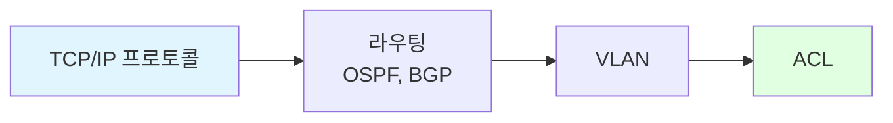

**학습 내용:**
- TCP/UDP 차이
- OSPF, BGP 라우팅 프로토콜
- VLAN 설정
- ACL 규칙 작성

**자료:**
- 널널한 개발자 유튜브
- "모두의 네트워크"
- Cisco Packet Tracer 실습

### 8.3 3단계: 실무 (6개월~)

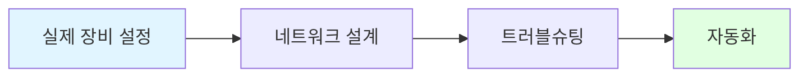

**학습 내용:**
- 실제 라우터/스위치 CLI
- 네트워크 아키텍처 설계
- 장애 대응
- Ansible, Python으로 자동화

**자료:**
- CCNA 자격증 준비
- GNS3 실습
- Batfish로 검증 자동화

---

## 9. 자주 묻는 질문 (FAQ)

### Q1. IP 주소는 왜 4개 숫자인가요?

**A:** IPv4는 32비트로 설계되었습니다. 8비트씩 4개로 나누면 각각 0~255 범위가 되어 사람이 읽기 쉽습니다.

```
11000000.10101000.00000001.01100100  (2진수)
   192  .  168  .   1   . 100        (10진수)
```

### Q2. 공유기와 라우터는 다른가요?

**A:** 가정용 공유기는 작은 라우터입니다. 라우터 + 스위치 + 방화벽 기능이 모두 들어있습니다.

### Q3. 인터넷이 느린 이유는?

**A:** 여러 원인이 있습니다:
- 대역폭 부족 (도로가 좁음)
- 라우터 성능 부족 (교차로 신호등 고장)
- 많은 사용자 (차가 너무 많음)
- 먼 거리 (목적지가 멀리 있음)

### Q4. 왜 192.168로 시작하는 IP를 많이 쓰나요?

**A:** 192.168.x.x는 사설 IP 대역입니다. 인터넷에서 사용하지 않아 집이나 회사에서 자유롭게 쓸 수 있습니다.

### Q5. VPN은 뭔가요?

**A:** Virtual Private Network의 약자로, 공용 인터넷에 사설 터널을 만드는 기술입니다.

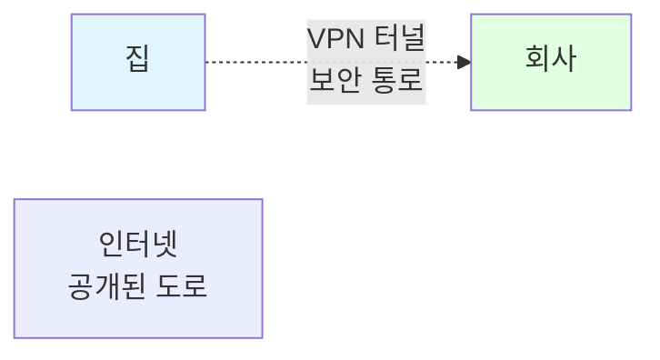

### Q6. 클라우드와 네트워크는 어떤 관계인가요?

**A:** 클라우드(AWS, Azure 등)는 거대한 네트워크입니다. 네트워크 기초를 알아야 클라우드를 제대로 사용할 수 있습니다.

---

## 10. 마무리

### 10.1 핵심 요약

**꼭 기억할 5가지:**

1. **IP 주소** = 컴퓨터의 집 주소
2. **라우터** = 네트워크를 연결하는 교차로
3. **프로토콜** = 통신 규칙 (언어)
4. **OSPF** = 회사 내부 길 찾기
5. **BGP** = 회사 간 길 찾기

### 10.2 다음 단계

```mermaid
graph TD
    Start[용어 이해]
    Practice[Packet Tracer 실습]
    Cert[CCNA 자격증]
    Real[실무 적용]
    
    Start --> Practice
    Practice --> Cert
    Cert --> Real
    
    style Start fill:#e1f5ff
    style Real fill:#e1ffe1
```

1. **이론 학습**: 이 문서로 용어 익히기
2. **실습**: Packet Tracer로 직접 구성
3. **자격증**: CCNA 준비
4. **실무**: 회사에서 적용

### 10.3 추가 리소스

**Batfish 학습:**
- Batfish 공식 문서: https://pybatfish.readthedocs.io/
- 본 프로젝트의 다른 문서들

**네트워킹 블로그:**
- Cisco 블로그: https://blogs.cisco.com/
- 네트워크 전문가 블로그 구독

**실시간 네트워크 시각화:**
- BGP 경로 탐색: https://bgp.he.net/
- RIPE Atlas: https://atlas.ripe.net/
- Submarine Cable Map: https://www.submarinecablemap.com/

---

**문서 버전:** 1.0  
**최종 수정일:** 2025-01-22  
**작성자:** NetconfigQA 프로젝트팀
